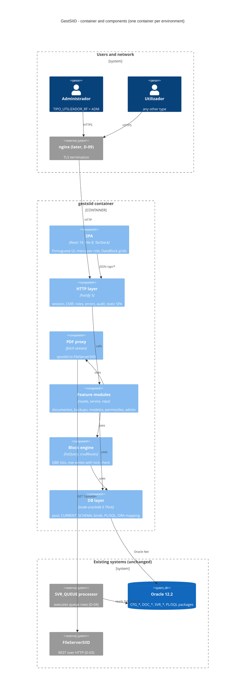

# GestSIID — Architecture of the Node.js rewrite

## 0. Purpose and status

- Binding for every step of `analysis/MASTER_PLAN.md` from Phase 2 on. Authority order: `analysis/DECISIONS.md` (D-01..D-31 plus amendments A-01..A-08 added by this step) > this document > MASTER_PLAN step prompts. §12 lists the prompt text this document overrides.
- Written 2026-09-15 (Step 1.1). Draft by `feature-dev:code-architect`; attacked by `code-modernization:architecture-critic` (22 findings). Every finding that changed a rule was checked against `analysis/forms-xml/T/` and `analysis/db/` before it was folded in. Package versions were checked on npm and context7 the same day.
- No open points (§13). The owner confirmed D-08 as written on 2026-09-15.

## 1. Stack and versions

| Package | Pin | Why |
|---|---|---|
| Node.js | `>=22.18 <23` (LTS), image `node:22-bookworm-slim` | Runs `.ts` natively in dev (type stripping). EOL 2027-04-30: move to Node 24 LTS before go-live if go-live is after 2027-01. |
| TypeScript | `~6.0` strict | `typescript-eslint` 8.70 accepts `<6.1`; TypeScript 7 waits for it. |
| pnpm workspace | `pnpm@12.4.2` (`packageManager`) | `app/apps/api`, `app/apps/web`, `app/packages/shared` share types and zod schemas. |
| fastify | `^5.12` | HTTP server, hooks, encapsulated plugins. |
| @fastify/cookie | `^11.1` | Cookie parsing for the session. |
| @fastify/session | `^11.1` | Server-side session: idle + absolute expiry and revocation (D-07c). |
| @fastify/multipart | `^10.1` | Image uploads to BLOB columns (§6). |
| @fastify/static | `^10.1` | Serves the built SPA from the same container (D-02). |
| fastify-type-provider-zod | `^7.0` | zod schemas validate requests and type handlers (peers fastify ^5.5, zod >=4.1.5). |
| zod | `^4.6` | Request schemas, env parsing, resource column types; shared with the SPA. |
| pino | bundled with fastify | JSON logs to stdout; nothing to install. |
| oracledb | `~6.10` | Thick mode (D-31). 7.x needs Oracle Client ≥19; the Windows dev client (`I:\Middleware\Oracle_Home\bin`) is 12.2. Moving to 7.x is a one-line change once every dev machine has Instant Client ≥19. |
| Oracle Instant Client | 19 **Basic** (image) | Thick mode libraries. Basic, not Basic Light: Light supports only a short list of database character sets and this DB is `WE8ISO8859P15` (A-03; proven in Step 2.3). |
| react / react-dom | `^19.3` | SPA. |
| vite + @vitejs/plugin-react | `^8.3` / `^6.1` | Dev server and build (Node ≥22.12). |
| @tanstack/react-router + @tanstack/router-plugin | `^1.170` / `^1.168` | File-based routes, `beforeLoad` redirect, typed search params (list filters live in the URL). |
| @tanstack/react-query | `^5.102` | Server state, invalidation after writes. |
| @tanstack/react-table | `^9.2` | DataBlock grid: `useTable` + `tableFeatures`, `manualPagination` + `rowCount`, row selection. |
| tailwindcss + @tailwindcss/vite | `^4.3` | Styling. |
| shadcn/ui (CLI `4.21`, copied source) | not a runtime dependency | Dialog, menu, form primitives copied into `components/ui`. |
| react-hook-form + @hookform/resolvers | `^7.88` / `^5.9` | Dialog and side-panel forms with the shared zod schemas. |
| vitest | `^5.0` | `test.projects`: `shared` + `api` (node), `web` (jsdom). |
| jsdom, @testing-library/react | `^30`, `^16.3` | Component tests. |
| @playwright/test | `^1.63` | End-to-end tests. |
| eslint + typescript-eslint + eslint-plugin-react-hooks, prettier | `^10.10` / `^8.70` / `^7.1`, `^3.9` | Dev only. |

**Rejected**

| Package | Why not |
|---|---|
| @fastify/swagger, @fastify/swagger-ui | Nothing consumes an OpenAPI file; the shared zod schemas are the contract between SPA and API. |
| @fastify/secure-session | Stateless cookie: no server-side idle expiry or revocation (D-07c). |
| @fastify/helmet | One `onSend` hook sets the fixed header set (§5). |
| @fastify/rate-limit | Login needs a per-username lock too; one small in-memory module covers IP and username (§5). |
| @fastify/csrf-protection | A per-session token compared with a header is smaller (§5). |
| @fastify/cors | Same origin only. |
| dotenv | `node --env-file` in dev, compose `env_file` in the container. |
| tsx, ts-node, nodemon | `node --watch` with native type stripping. |
| axios, got | Global `fetch`; the PDF proxy is the only outbound call. |
| ORM or query builder | Bind-only SQL plus `listQuery`/`crudRoutes`; the PL/SQL packages own the domain. |
| sharp | Images stay byte-exact for the report engine (accepted risk, §6). |
| Redis, DB session table | One process per environment (D-02); no new DB objects (D-07, D-10). |
| SSE, WebSocket, polling | Forms had no live refresh (§7). |
| i18n library | One language; one string module (§8). |
| zustand, redux | Query cache + URL search params + component state. |
| date library | Dates travel as strings with explicit Oracle masks (§3). |
| qs | `listQuery.ts` parses the bracket keys. |
| uuid | `crypto.randomUUID()`. |
| MSW, testcontainers | `fastify.inject`; there is no Oracle 12.2 test image, contract tests use the shared test schema (D-10). |
| Storybook | Step 2.4 uses a plain `/dev/datablock` route. |
| Single-package layout | Tempting (fewer config files), but the Step 1.1 brief fixes the workspace layout. |

## 2. Runtime topology

One container per environment (D-02). It serves `${BASE_PATH}/api/*` (Fastify) and the built SPA (`apps/web/dist` through `@fastify/static`). SPA fallback: `GET`, path not under `/api`, `Accept` contains `text/html` → `index.html` with `Cache-Control: no-cache`; hashed assets get `max-age=31536000, immutable`.

Request path: browser → container (plain HTTP now; nginx with TLS later, D-09) → Oracle (Thick mode, one pool) and → FileServerSIID (HTTP, server side only, D-03). The `SVR_QUEUE` processor is external and unchanged (D-04); the API never waits for it.

**Environment variables.** One template: repo-root `.env.example`. One real file per install: repo-root `.env` (gitignored), read by the app and by `tools/db-discovery`. Compose: `env_file: ../.env`. Dev: `node --env-file=../../../.env` from `app/apps/api`.

| Name | Required | Default | Purpose (decision) |
|---|---|---|---|
| `NODE_ENV` | no | `production` | |
| `PORT` | no | `3000` | |
| `LOG_LEVEL` | no | `info` | pino level. |
| `BASE_PATH` | no | `''` | `''` or `/segment` (D-09). |
| `DB_USER` | yes | | Forms account (D-30). |
| `DB_PASSWORD` | yes | | |
| `DB_CONNECT_STRING` | yes | | `host:port/service`. |
| `DB_SCHEMA` | yes | | `CURRENT_SCHEMA`; must match `^[A-Z][A-Z0-9_$#]{0,29}$` (D-02). |
| `AMBIENTE_ID` | yes | | Must equal `GET_AMBIENTE_ID()` (D-27). |
| `DB_POOL_SIZE` | no | `4` | `poolMin = poolMax` (Oracle guidance: fixed-size pool). |
| `DB_CALL_TIMEOUT_MS` | no | `60000` | `connection.callTimeout`. |
| `UV_THREADPOOL_SIZE` | no | `8` | Thick-mode worker threads; must be ≥ `DB_POOL_SIZE` (boot refuses otherwise). Also `ENV` in the Dockerfile. |
| `ORACLE_CLIENT_LIB_DIR` | no | empty | Empty in the image (`ldconfig`); Windows dev: `I:\Middleware\Oracle_Home\bin`. |
| `SESSION_SECRET` | yes | | ≥32 characters; signs the session cookie. |
| `COOKIE_SECURE` | no | `false` | `true` behind TLS (D-09). |
| `TRUST_PROXY` | no | `false` | The nginx IP / CIDR list behind nginx (D-09). `true` is refused: it trusts a client-written `X-Forwarded-For` and defeats the login throttle. |
| `FILESERVER_BASE_URL` | yes | | Full URL ending in `/pdf/T` or `/pdf/P` (D-03). |
| `FILESERVER_TIMEOUT_MS` | no | `15000` | |
| `UPLOAD_MAX_MB` | no | `10` | Image upload limit (§6). |

Not variables (constants in code, D-07c fixed them): session absolute lifetime 8 h, idle 30 min; login throttle limits (§5); list page size 50, max 500; count cap 10 000. `PUBLIC_BASE_URL` (named in D-09) is not added: the app builds no absolute URL. Removed from the earlier template: `FILESERVER_URL`, `FILESERVER_ENV`, `FILESERVER_TOKEN` (D-03), `DB_POOL_MIN/MAX`, `SESSION_TTL_MINUTES`.

**`BASE_PATH`.** Vite builds with `base: './'`. At startup the API reads `index.html` once and injects `<base href="${BASE_PATH}/">`. The router `basepath`, the API prefix `${BASE_PATH}/api` and the cookie `path` (`BASE_PATH || '/'`) use the same value.

**Boot sequence.** `config.ts` parses the environment with zod (prints every invalid variable, exit 1) → `oracledb.initOracleClient({ libDir })` → `createPool({ user, password, connectString, poolMin: DB_POOL_SIZE, poolMax: DB_POOL_SIZE, poolIncrement: 0, queueTimeout: 10000, sessionCallback })` → `SELECT GET_AMBIENTE_ID() FROM DUAL` must equal `AMBIENTE_ID`, else exit 1 (D-27) → `buildApp(deps)` → `listen`.

**Health.** `GET /api/health`, public, route `logLevel: 'warn'`. Runs `SELECT 1 FROM DUAL`. `200 { ok: true, ambiente, db: { ok: true, latencyMs } }` or `503 { ok: false, ambiente, db: { ok: false } }`. No schema, no versions. The login page reads `ambiente` from it (D-02 label).

**Shutdown.** `SIGTERM`/`SIGINT` → `app.close()` (stops accepting, drains) → `onClose` hook `await pool.close(10)` → exit. A 25 s timer forces exit. Compose: `init: true`, `stop_grace_period: 30s`.

**Image and compose.**
- Build stage `node:22-bookworm-slim`, corepack `pnpm@12.4.2`: `pnpm install --frozen-lockfile` → `pnpm -r build` → `pnpm --filter api deploy --prod /out` (plus `apps/web/dist`).
- Runtime stage `node:22-bookworm-slim` + `libaio1` + Instant Client 19 Basic (zip pinned by URL and sha256, registered with `ldconfig`), `ENV UV_THREADPOOL_SIZE=8`, user `node`, `CMD ["node","apps/api/dist/server.js"]`.
- `HEALTHCHECK CMD node -e "fetch('http://127.0.0.1:'+(process.env.PORT||3000)+(process.env.BASE_PATH||'')+'/api/health').then(r=>process.exit(r.ok?0:1),()=>process.exit(1))"`.
- Compose: one service, `env_file: ../.env`, one published port, `read_only: true` + `tmpfs: /tmp`, `logging: json-file` with `max-size: 10m`, `max-file: 20` (the audit trail lives there, §5), no volumes (no shares, D-29), no proxy (D-09).

## 3. Database access layer

Files in `apps/api/src/db/`: `oracle.ts` (pool and helpers), `errors.ts` (ORA → `AppError`), `listQuery.ts` (SELECT builder, §4), `crud.ts` (`crudRoutes`, §4).

**Globals.** `oracledb.outFormat = OUT_FORMAT_OBJECT`; `fetchAsString = [CLOB]`; `fetchAsBuffer = [BLOB]`; `autoCommit` stays `false`.

**`sessionCallback`** (runs for new pooled connections only):
```sql
ALTER SESSION SET CURRENT_SCHEMA = <DB_SCHEMA> NLS_DATE_FORMAT = 'DD-MM-YYYY' NLS_NUMERIC_CHARACTERS = '.,'
```
`DB_SCHEMA` is validated by the regex at boot (identifiers cannot be bound). The app itself never relies on implicit conversion (below); the NLS values only steer PL/SQL the app does not own. `'DD-MM-YYYY'` is the mask `PKG_DOCUMENTOS_SVR` writes itself (`PKG_DOCUMENTOS_SVR.sql` lines 834, 5876); `'.,'` keeps `TO_CHAR(number)` readable by JavaScript. Proven by the D-10 parity run (§11).

**Helpers** (each takes the session user for tracing):

| Helper | Contract |
|---|---|
| `withConnection(user, action, fn)` | Gets a pooled connection; sets `clientId = username` (`gestsiid-system` for boot and health), `module = 'gestsiid'`, `action = <route id>`, `callTimeout = DB_CALL_TIMEOUT_MS`; always releases it. |
| `query<T>` / `queryOne<T>` / `execute` / `executeMany` | One statement, binds only. |
| `withTransaction(user, action, fn(conn))` | App DML only. Commit on success, rollback on throw, always release. |
| `callPlsql(conn, block, binds)` | Anonymous block with IN/OUT binds (`{ dir: BIND_OUT, type: NUMBER \| STRING, maxSize }`); returns typed `outBinds`. |
| `lockRow(conn, table, where, binds, orig)` | `SELECT 1 FROM <table> WHERE <where> AND <each orig column null-safe equal> FOR UPDATE NOWAIT`. 0 rows → `409 REGISTO_ALTERADO`; ORA-00054 → `409 REGISTO_BLOQUEADO`. Runs before every UPDATE or DELETE the app issues (generated routes and actions). |

**Rules.**
- Bind variables only. Column names, `ORDER BY` terms and table names come only from server code (resource definitions, fixed SQL).
- No DDL, no `EXECUTE IMMEDIATE`, no `GRANT`, no synonyms (D-11; the account is the schema owner, D-30, so code review enforces it).
- `SVR_GESTAO_SIID_TMP` is never read or written. No DB package reads it; its only DB reader is the view `SVR_SELEC_DOCUMENTOS_VW`, which nothing uses. Selection travels in the request (§4).
- **Every `PKG_DOCUMENTOS_SVR` entry point commits.** Its `record_error` does `INSERT INTO ERR_ERROS_SIID … COMMIT` without an autonomous transaction, and `ANULAR` (through `ALTERA_DISPONIBILIDADE`) and `EXECUTA_DOCUMENTO` call it (A-01). So a package call never shares a transaction with app DML that must be able to roll back; package calls run on their own, one document at a time, and results are reported per document. Parity runs see the extra `ERR_ERROS_SIID` rows these calls write; that is expected.
- Clone keeps package-global state (D-17). The whole sequence is one anonymous block on one connection; on any error the connection is released with `conn.close({ drop: true })`, so a half-built parameter list never returns to the pool (this also covers a call timeout, where no extra round trip is possible).

**Dates.** Never a JS `Date`. Every `DATE` column is selected as `TO_CHAR(col,'YYYY-MM-DD"T"HH24:MI:SS')` (generated by `listQuery` from the column type) and written as `TO_DATE(:v,'YYYY-MM-DD"T"HH24:MI:SS')`. Date-only fields send `T00:00:00`. Numbers map to JS `number` (sequence values stay far below 2^53).

**LOBs.** Images up to `UPLOAD_MAX_MB` are fetched as `Buffer` and bound as `Buffer` (`DB_TYPE_BLOB`). There is no LOB streaming helper: the only large payload is the PDF, which streams from FileServerSIID (§6). BLOB columns never appear in a resource's column list.

**Packages the app calls** (all other package procedures are not called):

| Call | Used by | Rule |
|---|---|---|
| `GET_AMBIENTE_ID()` | boot | Must equal `AMBIENTE_ID`. |
| `RAWTOHEX(USER_SECURITY.ENCRYPT(:pwd))` | login, Utilizadores password | Stored values are hex strings (`CFG_UTILIZADORES.PASSWORD` is `VARCHAR2(100)`); `DECRYPT` is never called (D-14). |
| `RAWTOHEX(CRYPT_PKG.ENCRYPTSTRINGRAW(:pwd))` | Regerar, password change | Same, against `SVR_VARIAVEIS_SIID.VALOR` (`TIPO_VARIAVEL_RF='PASSWORD'`). |
| `PKG_DOCUMENTOS_SVR.ANULAR(:docid, :user)` | Anular | Per document: call → commit → re-read `DISPONIVEL_RF`; not `'ANU'` → skipped with a reason (the package hides errors, D-17). |
| `PKG_DOCUMENTOS_SVR.SET_PARAMETRO_STRING`, `EXECUTA`, `GET_ID_EXECUCAO` | Clonar | One block: `BEGIN SET_PARAMETRO_STRING(:n0,:v0); … SET_PARAMETRO_STRING('P_USUARIO',:user); SET_PARAMETRO_STRING('_USER',:ambiente); EXECUTA(:modelo); :id := GET_ID_EXECUCAO; END;`. The block text is generated from the parameter count only; names and values are binds. Then `UPDATE SVR_DOCUMENTOS SET LOTE_ID = :lote WHERE ID = :id` (source document's `LOTE_ID`, D-20) in its own transaction. |
| `PKG_SIID_UTIL.CAN_BE_UPLOADED_EDOC(:id)` | Reenviar EDoc | Per document, before any DML (D-18). |
| Not called | | `GERA_BACKUP`, `INSERE_DOCS_BACKUP`, `SET_BACKUP_ONLINE` (they differ from the forms and swallow errors, A-02), every `DECRYPT*`. |

**Application user to the database.** Only from `request.session.user.username`, always as an explicit bind: package parameters above, `SVR_QUEUE.CRIADO_POR`, the `ERR_ERROS_SIID` audit texts, and every `CRIADO_POR` / `ACTUALIZADO_POR` / `REGISTADO_POR` / `USER_ID` column, including tables whose column default is `USER` (D-08; listed as an intended difference in §11). Request schemas never contain these fields. `clientId` exists for DBA tracing only; no package reads `SYS_CONTEXT('USERENV', …)`.

**ORA errors** are mapped in `errors.ts` (table in §8). The raw text is logged with `oraCode`, never returned, except the first line of ORA-20000..20999, which the package wrote for the user.

## 4. Lists, selection, writes, master-detail

### 4.1 List contract (query by example)

```
GET /api/<resource>?f[COL]=v&f[COL][like]=v&f[COL][from]=YYYY-MM-DD&f[COL][to]=YYYY-MM-DD
                   &f[COL][null]=1&f[COL][notnull]=1&preset=<name>&sort=COL:asc,COL2:desc&page=1&size=50
```

- `packages/shared/src/listQuery.ts` parses the query string into a typed object; `apps/api/src/db/listQuery.ts` builds the SQL.
- Operators by column type: text → `eq` (exact) or `like` (`UPPER(col) LIKE UPPER(:v)`; the user types `%` and `_`, as in Forms query mode); number and code → `eq`; date → `eq` (`col >= TO_DATE(:d,'YYYY-MM-DD') AND col < TO_DATE(:d,'YYYY-MM-DD') + 1`) or `from`/`to` (whole days, either side optional); any column → `null` / `notnull` (the Forms "IS NULL" convention, BR-DOC-06). No `IN`, no `OR`.
- Every resource is defined once in `packages/shared/src/resources/<name>.ts`: `{ name, source, parentKeys?, columns: { COL: { type: 'text'|'number'|'date', label, filter?: ops[], sort?: true, edit?: true, insertOnly?: true } }, defaultSort, tiebreak, roles: { read, write } }`. Columns, labels and `edit` flags are copied from `analysis/forms-xml/summary/<FORM>_fmb.md` by the step that builds the screen. Server-only parts live in `apps/api/src/resources-server/<name>.ts`: `presets` (fixed SQL), `staticWhere`, hooks, SQL expressions.
- An unknown filter or sort column → `400 VALIDACAO` (never ignored).
- Sort: up to 3 keys, column aliases where the form sorted on two columns (Documentos `LOTE` → `LOTE_ID, LOTE_ORDEM`), `tiebreak` (primary key or `ROWID`) always appended. Paging: `OFFSET … FETCH NEXT … ROWS ONLY`, `size` default 50, max 500.
- Count: `SELECT COUNT(*) FROM (SELECT 1 FROM <source> WHERE … FETCH FIRST 10001 ROWS ONLY)` → `total = min(n, 10000)`, `totalCapped = n > 10000` (`SVR_DOCUMENTOS_VW` is large; Forms never counted).
- Response: `{ rows, total, totalCapped, page, size }`. Rows of writable resources carry `_rid`: the `ROWID` with `+` → `-` and `/` → `_`, so it is safe in a URL segment; the server reverses it.

Documentos specifics:
- Presets = the six Forms filters (`todos`, `em-branco`, `nao-executados`, `em-erro`, `a-executar`, `execucao`), SQL copied from `FD_GESTAO_SIID_fmb.xml` into `resources-server/documentos.ts`. "Em erro" becomes a subquery instead of temp-table rows. The model codes of Em branco and Mostrar grupo (BR-DOC-04, BR-DOC-28) stay constants there; Forms had no configuration table for them either.
- `param[NOME]=VALOR` (repeatable) + `paramModelo=` = Procurar por parâmetros: one `ID IN (SELECT DOCUMENTO_ID FROM SVR_PARAMETROS_DOC_NOME_VW WHERE NOME = :n AND VALOR LIKE :v [AND MODELO_ID LIKE :m])` per pair, ANDed (the Forms intersection). No result → the SPA shows `A consulta não obteve documentos.`
- `grupo=<id>` = Mostrar grupo (BR-DOC-28 rule, fixed SQL).
- Sortable columns include `FATURACAO_ELECTRONICA` (label "Fatura electrónica", D-19; A-05).

### 4.2 Selection

Forms "Seleccionar todos" walks the whole query result (`first_record; while :system.last_record = 'FALSE' … next_record` fetches every row), not just the rows on screen. So every batch action takes exactly one of:
- `ids: number[]` (1..1000): rows the user ticked;
- `consulta: { f, preset, param, paramModelo, grupo }`: the same parameters as the list. The service resolves ids with `SELECT ID FROM <source> WHERE <same listQuery WHERE>` (no sort, no paging), then runs the normal per-document path.

The "Seleccionar todos" checkbox sends `consulta` for the current list and does not tick rows one by one. Selection state lives only in the SPA; nothing is stored between requests.

### 4.3 Writes: `crudRoutes`

`crudRoutes(resource)` (in `db/crud.ts`) registers, for a resource with `roles.write`:

| Route | Body | SQL |
|---|---|---|
| `POST /api/<r>` (detail: `POST /api/<master>/<keys>/<r>`) | `{ values }` = `edit` + `insertOnly` columns | `INSERT … RETURNING ROWID INTO :rid`; parent keys from the path. |
| `PUT /api/<r>/:rid` | `{ orig, values }` (any subset of `edit` columns) | `lockRow`, then `UPDATE … WHERE ROWID = :rid`. |
| `DELETE /api/<r>/:rid` | `{ orig }` | `lockRow`, then `DELETE … WHERE ROWID = :rid`. |

- One transaction per request. Route `config.roles` is the only role check.
- Hooks in `resources-server/<name>.ts`: `validate(values, ctx)` (Portuguese messages → `422` with `fields`), `beforeInsert` / `beforeUpdate` (audit columns from the session, fixed values such as `AMBIENTE_ID`), and `sql` expressions for columns whose value is computed in SQL: sequences (`ID_IMPRESSORA_SEQ.NEXTVAL`), `RAWTOHEX(USER_SECURITY.ENCRYPT(:password))`, `SYSDATE`. Expressions are fixed strings in server code; values stay binds.
- Master delete with details → ORA-02292 → `409` with catalogue #42 (the foreign keys exist: `FK_DOMINIO_CVD`, `FK_REPORT_SPR`, `FK_SECCAODOC_DCA`).
- DataBlock "Gravar" sends one request per dirty row, in the order deletes → updates → inserts. It stops at the first error, marks that row with the message, and keeps the other unsaved rows dirty.
- No GET-one route unless a screen needs it.
- **One atomic exception:** Reports. `POST /api/reports/guardar { master: { rid?, orig?, values }, parametros: { insert: [], update: [{ rid, orig, values }], delete: [{ rid, orig }] } }` saves master and details in one transaction, because the `N_PARAMETROS` rule spans both (BR-ADM-05, rule in §10.1).

Business operations that are not a single row edit are named routes: `POST /api/<feature>/acoes/<acao>` or `POST /api/<feature>/:id/<acao>`. Inventory in §10.1. Each one validates with a zod schema, runs `lockRow` before its UPDATE/DELETE, and returns per-document results `{ ok: number[], skipped: [{ id, motivo }] }` where the forms listed skipped documents.

### 4.4 Master-detail

A detail resource declares `parentKeys`. Its list route is nested: `GET /api/<master>/<key>[/<key2>]/<detail>`. Parent keys come from the path, are bound, and are always ANDed. The SPA query key contains the master key, so changing the master row refetches the detail.

## 5. Authentication, session, roles, CSRF, audit

**Login** `POST /api/auth/login { utilizador, password }` (public).
- Empty field → `400` with `O 'Utilizador' é de preenchimento obrigatório.` / `A 'Password' é de preenchimento obrigatório.`
- One query (the hash never leaves the database):
  ```sql
  SELECT USERNAME, NOME, TIPO_UTILIZADOR_RF,
         CASE WHEN PASSWORD = RAWTOHEX(USER_SECURITY.ENCRYPT(:pwd)) THEN 1 ELSE 0 END AS OK,
         CASE WHEN DATA_INICIO <= SYSDATE AND NVL(DATA_FIM, SYSDATE) >= SYSDATE THEN 1 ELSE 0 END AS ATIVO
  FROM CFG_UTILIZADORES WHERE USERNAME = UPPER(:u) AND AMBIENTE_ID = :ambiente
  ```
  `UPPER`: the Forms item `LOGIN.UTILIZADOR` has `CaseRestriction="Upper"`. The password is compared as typed. Date rule per D-07b.
- Unknown user, wrong password, inactive, or locked → the same `401 LOGIN_INVALIDO` `Utilizador e/ou password inválidos.`
- Success → `session.regenerate()` (new id), store `{ user: { username, nome, role, ambiente }, createdAt, csrf }`.

**Throttle** (`http/login-throttle.ts`, in memory, SECURITY_FINDINGS §3 item 3): key = uppercased username and client IP. 5 attempts per minute per IP; 10 failures per hour per username → username locked 15 min. Locked attempts return the generic 401. The same module counts wrong regeneration passwords per username: 5 in 15 min → 15 min lock (`403 PASSWORD_ERRADA`, same text). A restart clears the counters (accepted, one process).

**Session** (`@fastify/session` + `@fastify/cookie`, store in `http/session-store.ts`).
- Store: `Map<sid, { data, expiresAt }>`. `get` returns nothing and deletes the entry when `now > expiresAt` or `now > createdAt + 8 h`. A 60 s timer removes expired sessions and old throttle entries.
- Options: `saveUninitialized: false` (health checks and anonymous page loads create no entries), `rolling: true`, cookie `gestsiid.sid`, `httpOnly`, `SameSite=Lax`, `Secure = COOKIE_SECURE`, `path = BASE_PATH || '/'`, `maxAge` 30 min (idle).
- `destroyUserSessions(username)` runs after a Utilizadores update that changes `PASSWORD`, `TIPO_UTILIZADOR_RF`, `DATA_INICIO` or `DATA_FIM`, and after a delete (SECURITY_FINDINGS §3 item 2).
- A restart logs everyone out (accepted).
- `GET /api/auth/me` → `{ user, csrf }`. `POST /api/auth/logout` → `session.destroy()`.

**CSRF.** Token = `randomBytes(32)` per session. The SPA sends it as `x-csrf-token` on every non-GET request; the server compares with `crypto.timingSafeEqual`. Login is exempt (no session yet; `SameSite=Lax` plus a JSON body). Required by D-07c.

**Roles** (D-08). `role = TIPO_UTILIZADOR_RF === 'ADM' ? 'ADM' : 'USER'`.
- Default deny: a global `onRequest` hook requires a live session for every `/api/*` route unless the route has `config.public` (health, login). Absolute lifetime is checked there too.
- Every route has `config.roles`; the default is `['ADM']`. Routes open to USER say `['ADM','USER']`:
  - `auth/me`, `auth/logout`;
  - Documentos: list (sort allow-list for USER = `ID` only, per D-08, confirmed by the owner, §13), detail (reduced columns), tabs `parametros`, `comentarios` (GET), `anexos`, `fila`, `erros`, `pdf`, `conversoes/recibo`, `conversoes/pessoa`, `POST /:docId/fila/:queueId/cancelar` (Clonar became ADM only on 2026-09-30: the USER form hides the popup item, see DOCUMENT_STATES.md §4);
  - lookups `modelos`, `modelos-validos`, `impressoras-validas`, `usuarios`, and `GET /api/dominios/:dominioId/valores`.
- USER document detail SQL selects the reduced column list: no `ATRIBUTO5..8`, `ATRIBUTO10..25`, `ATRIB_ARQ_1..20`, `ARQ_ID`, `EDOC_ID`, `REGISTO_ARQUIVO`, `REGISTO_EDOC`, `DATA_ARQUIVO`.
- A role failure → `403 SEM_PERMISSAO`. The SPA's `beforeLoad` guards and the `roles` field in `menu.ts` only hide things; the server decides.
- Single queue cancel is reachable in the USER form (the `ESTADO_PEDIDO` popup is attached to its items in `FD_GESTAO_SIID_USER_fmb.xml`), which satisfies D-08's condition for giving it to USER. The `GENERICO` popup's `CLONAR` item is `Enabled="false" Visible="false"` there, so Clonar is ADM only (owner, 2026-09-30, Step 7.2).

**Regeneration password** (D-07d, BR-DOC-13/14; A-04).
- Only Regerar asks for it. Reimprimir, 2ª via and Cópia never do (BR-DOC-14).
- `POST /api/documentos/acoes/regerar { ids | consulta, password? }`: the service checks every selected document, annulled ones included. If any has a `SVR_QUEUE` row with `TIPO_QUEUE_RF='IMPRESSAO' AND ESTADO='TERMINADO'`, or its model has `MODO_EXPEDICAO_RF='G'`, and `password` is missing → `428 PASSWORD_REGERACAO_NECESSARIA` with catalogue #14; the SPA opens the dialog and repeats the request with `password`.
- Compare `RAWTOHEX(CRYPT_PKG.ENCRYPTSTRINGRAW(:pwd)) = VALOR` in SQL. Wrong → `403 PASSWORD_ERRADA` `A password inserida está errada.` One correct password covers the whole batch; annulled documents are then skipped and listed (#13).
- Change (built in Step 3.1): `POST /api/auth/regeneracao-password { actual, nova, confirmacao }`, ADM only. `nova !== confirmacao` → `422 PASSWORDS_DIFERENTES` `As passwords não coincidem. Alteração não efectuada.`; then one bound `UPDATE SVR_VARIAVEIS_SIID SET VALOR = RAWTOHEX(CRYPT_PKG.ENCRYPTSTRINGRAW(:nova)) WHERE TIPO_VARIAVEL_RF = 'PASSWORD' AND AMBIENTE_ID = :ambiente AND VALOR = RAWTOHEX(CRYPT_PKG.ENCRYPTSTRINGRAW(:actual))` (check and write in one statement, no `lockRow`); 0 rows → `403 PASSWORD_ERRADA`; audit `regeneracao.alterada`.
- Reauth (built in Step 3.1): `POST /api/auth/reauth-regeneracao { password }`, ADM only: a correct value sets `regeneracaoAte` in the session for 5 min (`hasRegeneracaoReauth(request)` in `features/auth/routes.ts`). Step 7.2 uses this flag only: `regerar` has no `password` field; on a `428` the SPA calls the reauth route (throttled there) and repeats the request.

**Audit** (SECURITY_FINDINGS §3 item 16, within "no DB change", D-07/D-10).
- One global `onResponse` hook writes a pino line `{ audit: true, event, user, role, ip, method, route, status, reqId, details }` for every non-GET `/api/*` request. Handlers put ids ok/skipped, the Cancelar `force` flag (D-12) and similar facts into `request.auditDetails`.
- Explicit events: `login.ok`, `login.fail { utilizador, motivo }`, `logout`.
- "Audit row" in D-07 and D-12 means this line. Retention: Docker `json-file` rotation (`10m × 20`) until a log collector exists (Step 10.1 risk list).
- The `ERR_ERROS_SIID` rows the forms wrote (BR-DOC-36, with the D-28 `REENVIADO` fix) are written in the same places.

**Headers** (one `onSend` hook): `Content-Security-Policy: default-src 'self'; img-src 'self' data: blob:; style-src 'self' 'unsafe-inline'; object-src 'none'; frame-ancestors 'self'; base-uri 'self'; form-action 'self'`, `X-Content-Type-Options: nosniff`, `Referrer-Policy: same-origin`, `Strict-Transport-Security: max-age=31536000` only when `COOKIE_SECURE=true`. `trustProxy = TRUST_PROXY`. JSON body limit 1 MiB.

## 6. Files

The app has no file system access: no `DOCS_ROOT`, no share mounts, no path built from input (D-04, D-29). Path traversal cannot happen because no path exists. The allow-list is: numeric ids, one fixed upstream URL, two fixed BLOB columns.

**PDF** `GET /api/documentos/:id/pdf` (ADM, USER; D-03 named it `/api/documents/:id/pdf`, A-07).
1. `id`: `z.coerce.number().int().positive()`; the row must exist in `SVR_DOCUMENTOS_VW` (no row-level filter exists in the forms, BR-AUTH-10).
2. `const url = new URL(FILESERVER_BASE_URL); url.searchParams.set('spoolid', String(id))`; `fetch(url, { signal: AbortSignal.timeout(FILESERVER_TIMEOUT_MS) })`.
3. Upstream not ok, or not `application/pdf` → `404 DOCUMENTO_NAO_DISPONIVEL` `Documento não disponível` + reason from `DISPONIBILIDADE` (`OFF` → backup offline, `ANU` → anulado, D-29). Timeout or network error → `502`, same code.
4. Success: `Content-Type: application/pdf`, `Content-Disposition: inline; filename="<id>.pdf"`, `Cache-Control: private, no-store`, body `Readable.fromWeb(res.body)`. The SPA opens it in a new tab.

**Images**
- `PUT | GET | DELETE /api/modelos/:modeloId/seccoes/:tiposecId/:alinea/imagem` → `DOC_SECCOES_DOCUMENTO.IMAGEM`.
- `PUT | GET | DELETE /api/perfis-departamento/:id/assinatura` → `DOC_PERFIS_DEPARTAMENTO.ASSINATURA` (replaces the T-only image-picker bean, whose target item belonged to another form, D-01).
- `PUT`: multipart field `ficheiro`, limits `{ fileSize: UPLOAD_MAX_MB × 1024 × 1024, files: 1, fields: 0 }`, `toBuffer()`. First bytes must be JPEG `FFD8FF`, PNG `89504E47`, GIF `47494638` or BMP `424D` (BR-MOD-06), else `415`. Too large → `413`. `lockRow` + bound UPDATE, audit.
- `GET`: `404` when null. `Content-Type` from the first bytes; bytes that match no signature (Forms accepted any file) → `application/octet-stream` + `Content-Disposition: attachment`.
- `DELETE`: `SET <column> = NULL` (BR-MOD-06 "remove image").
- Section lists show `TIPO_IMAGEM` from `DBMS_LOB.SUBSTR(IMAGEM, 4, 1)`, decoded in SQL like the form did.
- Accepted risk (Step 10.1 list): images are stored byte-exact, not re-encoded (SECURITY_FINDINGS §3 item 14), because the report engine reads the bytes. Mitigations: signature allow-list, `nosniff`, attachment for unknown bytes.

## 7. Timers, refresh, long-running work

| Forms timer | Did | Target |
|---|---|---|
| `FD_GESTAO_SIID` `REFRESH_TS` (hourly) | Tablespace gauge (BR-DOC-32) | Dropped (D-13). No widget, no endpoint. |
| `FD_CONFIGURACAO_MODELOS` `webutil` | WebUtil start-up | Gone with WebUtil. |
| `ASK_COMMIT`, `ROLLBACK`, `PARAMETROS_REPORT` one-tick timers | Event ordering around "Deseja gravar as alterações efectuadas?" (BR-MOD-13) | SPA dirty-state guard with Sim / Não / Cancelar before leaving a DataBlock with unsaved rows. No server work. |

**Refresh.** No polling, no SSE, no WebSocket. TanStack Query defaults: `staleTime: 30_000`, `refetchOnWindowFocus: true`. Documentos has an "Actualizar" button (Forms users re-queried by hand). Every write invalidates the list and the open detail tabs. Add `refetchInterval` to one screen only if UAT asks.

**No background work.** No scheduler, no `child_process`, no replacement for `HOST`, `CLIENT_HOST`, `TEXT_IO` or `WIN_API` (D-04). Every physical action is an `SVR_QUEUE` row or a package call; the queue processor does the work. Batch actions (up to the size of the resolved selection) and backups run inside the request, each database call bounded by `DB_CALL_TIMEOUT_MS`.

## 8. Project conventions

**API feature folder** `apps/api/src/features/<feature>/`: `routes.ts` (routes, zod schemas, `config.roles`), `service.ts` (rules as plain functions where possible), `repo.ts` (SQL), `*.test.ts` next to the code.
- Unit tests use a fake connection.
- Contract tests use `fastify.inject` against the test schema; they skip unless `DB_CONNECT_STRING` is set. **HARD RULE: they are read-only** — Oracle only through `apps/api/src/test/read-only-db.ts`; no test, script or Claude session changes the Oracle database (no ZZTEST_ rows, no rollback tricks). Write paths are tested with a fake connection. See `TEST_STRATEGY.md` (top).
- Plain maintenance screens need only `packages/shared/src/resources/<name>.ts` + `apps/api/src/resources-server/<name>.ts`; `app.ts` calls `crudRoutes` for them. Add `service.ts` / `repo.ts` only when a rule needs one.

**SPA.** `apps/web/src/routes/<menu>/<screen>.tsx` (file-based). Shared UI in `components/` (`ui/` = shadcn copies, `datablock/`, `dialogs/`). `api/client.ts`: `fetch` with `credentials: 'same-origin'`, `x-csrf-token`, error body → toast or field errors, `401` → `/login`. `menu.ts`: one typed array with `roles`.

**Error body** for every non-2xx response: `{ code: string, message: string, requestId: string, fields?: Record<string, string> }`. `message` is Portuguese and ready to show.

| HTTP | `code` | When | `message` |
|---|---|---|---|
| 400 | `VALIDACAO` | zod failure (`fields` set) | `Dados inválidos.` |
| 400 | `ORA_01400` | ORA-01400, ORA-01407 | `Campo obrigatório não preenchido.` |
| 400 | `ORA_12899` | ORA-12899, ORA-01438 | `Valor demasiado grande para o campo.` |
| 401 | `SESSAO_EXPIRADA` | no or expired session | `A sessão expirou. Entre novamente.` |
| 401 | `LOGIN_INVALIDO` | any login failure, including lock | `Utilizador e/ou password inválidos.` |
| 403 | `SEM_PERMISSAO` | role check | `Não tem permissão para esta operação.` |
| 403 | `CSRF` | missing or wrong token | `Pedido inválido. Recarregue a página.` |
| 403 | `PASSWORD_ERRADA` | wrong or locked regeneration password | `A password inserida está errada.` |
| 404 | `NAO_ENCONTRADO` | row missing | `Registo não encontrado.` |
| 404 / 502 | `DOCUMENTO_NAO_DISPONIVEL` | PDF missing / FileServerSIID down | `Documento não disponível` + reason |
| 409 | `REGISTO_ALTERADO` | `lockRow` found 0 rows | `O registo foi alterado por outro utilizador. Volte a consultar.` |
| 409 | `REGISTO_BLOQUEADO` | ORA-00054 (row locked, e.g. by Forms), ORA-30006 | `O registo está bloqueado por outro utilizador. Tente novamente.` |
| 409 | `ORA_00001` | unique key | `Já existe um registo com estes valores.` |
| 409 | `ORA_02292` | child rows exist | `Impossível apagar registo mestre se existirem registos de detalhe correspondentes.` (#42) |
| 413 | `FICHEIRO_GRANDE` | upload too large | `O ficheiro excede o tamanho máximo permitido.` |
| 415 | `FORMATO_INVALIDO` | image signature | `Formato de imagem não suportado (JPEG, PNG, GIF ou BMP).` |
| 422 | `ORA_02291` | parent key missing | `Valor não existe na tabela de referência.` |
| 422 | `ORA_02290` | check constraint | `Valor não permitido.` |
| 422 | rule code, e.g. `N_PARAM_ERRADO`, `ALERTA_1PARAM`, `DATAS_INCOMPAT`, `OBRIGATORIO`, `TAMANHO_MIDIA` | business rule | catalogue text (`BUSINESS_RULES.md` §3) |
| 422 | `ORA_20XXX` | package raised a user error | first line of the package text |
| 428 | `PASSWORD_REGERACAO_NECESSARIA` | Regerar needs the password | `Insira a password para regerar o(s) documento(s) seleccionado(s):` (#14) |
| 503 | `BD_INDISPONIVEL` | NJS-040 (pool queue timeout), NJS-500, NJS-503, ORA-03113/03114/03135/12154/12170/12514/12541/12545 | `Base de dados indisponível. Tente mais tarde.` |
| 504 | `TEMPO_ESGOTADO` | DPI-1067, ORA-01013 | `A operação excedeu o tempo limite.` |
| 500 | `ERRO` | anything else | `Erro` (#4) |

Batch actions return `200 { ok, skipped }`; the SPA shows the dynamic catalogue texts (#9, #13, #19, #20, #22) with the skipped `spool_id`s. No `429`: a locked login looks like any failed login.

**Strings.** One module, `packages/shared/src/pt.ts`: the `BUSINESS_RULES.md` §3 catalogue verbatim, the D-26 text `Não existem documentos seleccionados.`, the error texts above, menu labels, and `Sim` / `Não` / `OK` / `Cancelar`. Texts with values are functions, e.g. `naoImpressosAnulados(ids: number[]): string`. No i18n library.

**Logging.** Fastify pino JSON to stdout. `genReqId: () => crypto.randomUUID()`. Request line fields: `time`, `level`, `reqId`, `method`, `url`, `route`, `statusCode`, `responseTime`, `user`, `role` (child logger bound in the auth hook), plus `oraCode` and `errorNum` on database errors. Redact `req.headers.cookie`, `req.headers["x-csrf-token"]`, `res.headers["set-cookie"]`, `*.password`, `*.pwd`, `*.actual`, `*.nova`, `*.confirmacao`. No request or response bodies. Audit lines as in §5.

**TypeScript.** `strict`, `noUncheckedIndexedAccess`, `verbatimModuleSyntax`, `erasableSyntaxOnly`, `rewriteRelativeImportExtensions` (relative imports end in `.ts`); `module: nodenext` for `api` and `shared`, `module: bundler` for `web`. Dev: `node --watch --env-file=../../../.env --conditions=development src/server.ts`. `packages/shared` `exports`: `{ "development": "./src/index.ts", "default": "./dist/index.js" }`. Build: `tsc -b` (shared, api) + `vite build` (web).

**CI gates** (in order): `gitleaks detect`, `pnpm audit --prod` (high and critical fail), `pnpm -r lint`, `pnpm -r typecheck`, `pnpm -r test`, image build, Playwright smoke; contract tests only when the `DB_CONNECT_STRING` secret exists (SECURITY_FINDINGS §3 items 10, 17).

**Commits.** Conventional Commits: `type(scope): subject`. Types `feat`, `fix`, `refactor`, `test`, `docs`, `chore`, `build`, `ci`. Scope = feature or area (`documentos`, `auth`, `db`, `web`, `docker`). At most one MASTER_PLAN step per commit. The body names the `BR-`, `D-`, `A-`, `SEC-` ids the change implements.

## 9. Folder skeleton and diagram

```
app/
├─ package.json              # packageManager pnpm@12.4.2, engines node >=22.18
├─ pnpm-workspace.yaml
├─ tsconfig.base.json
├─ eslint.config.js
├─ .prettierrc
├─ vitest.config.ts          # test.projects: shared + api (node), web (jsdom)
├─ playwright.config.ts
├─ Dockerfile
├─ docker-compose.yml        # env_file: ../.env (template: /.env.example)
├─ .dockerignore
├─ README.md
├─ e2e/                      # Playwright specs
├─ apps/
│  ├─ api/src/
│  │  ├─ server.ts           # config → initOracleClient → pool → boot check → buildApp → listen
│  │  ├─ app.ts              # buildApp(deps); tests call it directly
│  │  ├─ config.ts           # zod env schema
│  │  ├─ db/
│  │  │  ├─ oracle.ts        # pool, withConnection, query*, execute*, withTransaction, callPlsql, lockRow
│  │  │  ├─ errors.ts        # ORA/NJS/DPI → AppError
│  │  │  ├─ listQuery.ts     # list SQL + count + consulta → ids
│  │  │  └─ crud.ts          # crudRoutes(resource)
│  │  ├─ http/
│  │  │  ├─ auth.ts          # session check, roles, child logger
│  │  │  ├─ session-store.ts
│  │  │  ├─ login-throttle.ts
│  │  │  ├─ csrf.ts
│  │  │  ├─ errors.ts        # error handler → error body
│  │  │  ├─ security-headers.ts
│  │  │  ├─ audit.ts
│  │  │  └─ spa.ts           # static files, <base href>, SPA fallback
│  │  ├─ features/
│  │  │  ├─ health/
│  │  │  ├─ auth/
│  │  │  ├─ lookups/         # /api/lov/:name, /api/dominios/:dominioId/valores
│  │  │  ├─ documentos/      # list, tabs, pdf, conversions, acoes/*, clonar, fila
│  │  │  ├─ backups/
│  │  │  ├─ modelos/         # clone model/alínea, default parameters, imagem
│  │  │  ├─ reports/         # guardar (atomic master + details)
│  │  │  ├─ permissoes/
│  │  │  ├─ impressoras-associadas/
│  │  │  ├─ perfis-departamento/   # sugestao, assinatura
│  │  │  └─ admin/
│  │  └─ resources-server/   # one file per resource: presets, staticWhere, hooks, SQL expressions
│  └─ web/src/
│     ├─ main.tsx
│     ├─ menu.ts
│     ├─ api/client.ts
│     ├─ components/{ui,datablock,dialogs}/
│     └─ routes/
│        ├─ __root.tsx
│        ├─ login.tsx
│        ├─ _app.tsx         # shell: top bar, menu, outlet
│        └─ _app/{gestao,gador,configuracao,administracao}/…
└─ packages/shared/src/
   ├─ index.ts
   ├─ pt.ts
   ├─ listQuery.ts
   ├─ errors.ts              # error codes
   └─ resources/             # one file per resource
```

Diagram: source `analysis/architecture.mmd`, render `analysis/architecture.svg` (gstack `diagram` skill).



## 10. Legacy → target mapping

| Form | Menu path | Decisions | API | SPA route | Notes |
|---|---|---|---|---|---|
| `FD_LOGIN_SIID` | entry | D-02, D-07, D-14, D-27 | `POST /api/auth/login`, `GET /api/auth/me`, `POST /api/auth/logout` | `/login` | Environment shown as a label from `/api/health`; no selector. |
| `FD_GESTAO` | shell (ADM) | D-02, D-08 | `GET /api/auth/me` | `_app` layout at `/` | `CREATE_SYNONYMS` / `DROP_SYNONYMS` and the `USER_TAB_PRIVS` discovery are not ported. |
| `FD_GESTAO_USER` | shell (USER) | D-02, D-08 | same | same layout, menu filtered by role | |
| `MD_SIID`, `MD_SIID_USER` | menus | D-06, D-08, D-11 | `config.roles` on every route | `apps/web/src/menu.ts` | `Enabled="false"` → hidden in the SPA and `403` in the API. Gestores and Médias Execução are gone. |
| `FD_GESTAO_SIID` | Gestão › Documentos | D-03..D-05, D-08, D-12, D-13, D-16..D-20, D-28, D-29 | §10.1 documentos | `/gestao/documentos` | Row colours OFFLINE / ANULADO and the `***` comment marker come from list columns. |
| `FD_GESTAO_SIID_USER` | Gestão › Documentos (USER) | D-08, §13 | §10.1 documentos, USER subset (§5) | `/gestao/documentos` | Same screen; the toolbar shows only what the role may call. |
| `FD_NOVO_BACKUP` | Gestão › Backups › Novo | D-25, A-02 | `GET /api/backups/meses`, `GET /api/backups/candidatos?mes=`, `POST /api/backups` | `/gestao/backups/novo` | Form SQL in one transaction; no printer picker (STRUCTURE §7). |
| `FD_BACKUPS_ONLINE` | Gestão › Backups › Backups Online | D-25, A-02 | `GET /api/backups?f[MEDIA_ONLINE]=S\|N`, `POST /api/backups/online` | `/gestao/backups/online` | Two lists over one resource; `DRIVE_ONLINE` set as the form did. |
| `FD_GESTAO_IMPRESSORAS_DOC` | Configuração › Impressoras Associadas › Documento | D-08, A-09, D-22 | §10.1 impressoras-associadas | `/configuracao/impressoras-associadas/documento` | ADM only (A-09). Help text shows the D-22 printer order. |
| `FD_GESTAO_IMPRESSORAS_USR` | Configuração › Impressoras Associadas › Utilizador | D-08, A-09, D-22 | §10.1 impressoras-associadas | `/configuracao/impressoras-associadas/utilizador` | ADM only (A-09). |
| `FD_ALTERAR_PASSWORD` | Configuração › Alterar password | D-07d, D-08, A-09 | `POST /api/auth/regeneracao-password` | `/configuracao/alterar-password` | ADM only; shared document-regeneration password, not a login password. |
| `FD_GESTORES_SIID` | Gador › Gestores | D-11 | none | none | Dropped; DBA hand-over script from the XML. |
| `FD_PERFIS_DEPARTAMENTO` | Gador › Equipa de Gestão (OD68) | D-01 | `GET /api/perfis-departamento`, `POST`, `PUT /:rid` (no DELETE: Forms deletes only unsaved rows), `GET /api/perfis-departamento/sugestao?cdemplea=`, `…/:id/assinatura` | `/gador/equipa-gestao` | One block. `ID = MAX+1` in `beforeInsert` (a collision gives `409 ORA_00001`; retry). `sugestao` returns `CODIGO`, `FUNCAODEP_ID`, `NOME` per BR-ADM-04. |
| `FD_CONFIGURACAO_REPORTS` | Configuração › Reports | BR-ADM-05 | `GET /api/reports`, `GET /api/reports/:id/parametros`, `POST /api/reports/guardar` | `/configuracao/reports` | Rules in §10.1. |
| `FD_CONFIGURACAO_MODELOS` | Configuração › Modelos | D-01, D-23, D-28 | §10.1 modelos | `/configuracao/modelos` | WebUtil, `PKG_FICHIERS`, `PKG_TRANSFERTS` replaced by the image routes (§6). |
| `FD_PERMISSOES_SIID` | Configuração › Permissões | D-21 | §10.1 permissoes | `/configuracao/permissoes` | Reads `CFG_PERMISSOES_SIID_VW`; the `ADMINISTRADOR` / `COSEC%` bypass stays in the DB. |
| `FD_IMPRESSORAS_SIID` | Configuração › Impressoras | BR-PRN-01 | `crudRoutes('impressoras')` | `/configuracao/impressoras` | `ID_IMPRESSORA_SEQ`, `CRIADO_POR`, `DATA_CRIACAO` in hooks; no DELETE if the XML disallows it. |
| `FD_DOMINIOS_SIID` | Administração › Domínios | BR-ADM-01 | `crudRoutes('dominios')`, `crudRoutes('valores-dominio')` nested under `/api/dominios/:dominioId/valores` | `/administracao/dominios` | Conditional fields in the SPA and in `validate`; defaults `DATA_INICIO`, `PRIORIDADE=0`, `VERSAO=0.0`, `REGISTADO_POR` in hooks. |
| `FD_UNIDADES_MEDIDA` | Administração › Unidades Medida | BR-BKP-08 | `crudRoutes('unidades-medida')` | `/administracao/unidades-medida` | |
| `FD_TIPOS_MiDIA` | Administração › Tipos Mídia | D-24, BR-BKP-07 | `crudRoutes('tipos-midia')` | `/administracao/tipos-midia` | `FACTOR` from the unit and `TAMANHO_BYTES = TRUNC(NVL(TAMANHO_MIDIA,1) * FACTOR)` in hooks; read-only in the UI. |
| `FD_UTILIZADORES_SIID` | Administração › Utilizadores | D-07a, D-07b | `crudRoutes('utilizadores')` | `/administracao/utilizadores` | `password` write-only (SQL expression, never selected); `AMBIENTE_ID` fixed by hook; `DATA_INICIO > DATA_FIM` → #43; `destroyUserSessions` after relevant changes (§5). |
| `FD_VARIAVEIS_SIID` | Administração › Variáveis SIID | D-07, BR-ADM-06 | `crudRoutes('variaveis')` | `/administracao/variaveis` | `staticWhere`: `AMBIENTE_ID = :ambiente AND TIPO_VARIAVEL_RF NOT IN ('PASSWORD','PASSWORD_OLD')`; duplicate type → #58; `AMBIENTE_ID` fixed by hook. |

Also dropped: Auditoria › Médias Execução (D-06; a commented report call, not a form).

### 10.1 Route inventory for the larger features

**documentos**
- `GET /api/documentos` (§4.1). `GET /api/documentos/:id` (detail; reduced for USER).
- Tabs: `GET /api/documentos/:id/parametros` (from `SVR_PARAMETROS_DOC_NOME_VW`, names `_USER` and `P_ID` hidden; `SVR_PARAMETROS_DOCUMENTO` is not readable by the account, DB_FACTS), `GET|POST /api/documentos/:id/comentarios` (POST: `COMENTARIO_ID` from `ID_COMENTARIO_DOCUMENTO_SEQ`, `DATA = SYSDATE`, `USER_ID` = session user), `GET /api/documentos/:id/anexos`, `GET /api/documentos/:id/fila` (printer text per BR-DOC-24), `GET /api/documentos/:id/erros`, `GET /api/documentos/:id/pdf`.
- Conversions (CONVERTE_PARAM, BR-DOC-26): `GET /api/documentos/conversoes/recibo?nmrecinue=`, `GET /api/documentos/conversoes/pessoa?cdideper=`.
- `POST /api/documentos/:id/clonar { parametros: [{ nome, valor }] }` (§3 package table).
- `POST /api/documentos/:docId/fila/:queueId/cancelar`: `lockRow`, `UPDATE SVR_QUEUE SET ESTADO='CANCELLED' WHERE ID=:q AND ESTADO IN ('ESPERA','TERMINADO')` (BR-DOC-23).
- `GET /api/documentos/fila/contagem?estado=ESPERA|SUSPENSO` → `{ n }` for the Suspender todos / Retomar todos confirmation (D-28).
- `POST /api/documentos/acoes/<acao>`, body `{ ids | consulta, …dialog fields }`, ADM only:

| `acao` | Body extras | Per document | Skip rule |
|---|---|---|---|
| `regerar` | none (reauth flag, §5) | `INSERT SVR_QUEUE ('EXECUCAO','ESPERA')` + `ERR_ERROS_SIID 'DOCUMENTO REGERADO POR <user>'`, one transaction for the batch (no package call) | annulled: `ATRIBUTO9 = 'A' OR DISPONIVEL_RF = 'ANU'` (A-06) |
| `reimprimir`, `segunda-via`, `copia` | `impressoraId?` (valid printer) | `INSERT SVR_QUEUE ('IMPRESSAO' \| '2.VIA' \| 'COPIA', 'ESPERA', IMPRESSORA_ID)` | annulled (A-06, D-28); `segunda-via` also `N_IMPRESSOES = 0` → message #10 |
| `anular` | | `ANULAR` → commit → re-read (§3) | `DISPONIVEL_RF <> 'ANU'` after the call |
| `cancelar` | `force: boolean` | `UPDATE SVR_QUEUE SET ESTADO='CANCELLED' WHERE TIPO_QUEUE_RF='EXECUCAO' AND DOCUMENTO_ID=:id [AND ESTADO IN ('TERMINADO','ESPERA','ENQUEUED','EM EXECUCAO','ERRO')]` | none (D-12) |
| `suspender` | or `todaFila: true` instead of `ids`/`consulta` | `ESPERA → SUSPENSO` for the documents, or every `ESPERA` row (BR-DOC-21) | none |
| `retomar` | or `todaFila: true` | `SUSPENSO → ESPERA`, scope from its own choice (intended difference, §11) | none |
| `reenviar-edoc` | | model `MODO_EXPEDICAO_RF='W'` and `CAN_BE_UPLOADED_EDOC(id) <> 0` → `INSERT SVR_QUEUE ('REENVIAR')` + `ERR_ERROS_SIID 'DOCUMENTO REENVIADO POR <user>'` (D-28) | otherwise #19 |
| `reenviar-email` | | address = `MAX(ATRIBUTO01)` of earlier `EMAIL` rows; must match `^[^@\s]+@[^@\s]+\.[^@\s]+$` (D-05) → `INSERT SVR_QUEUE ('EMAIL', ATRIBUTO01)` + audit text of BR-DOC-18 | no or invalid address → #20 |
| `rearquivar` | | `ARQ_ID` not null → `INSERT SVR_QUEUE ('ARQUIVO')` + `'DOCUMENTO ARQUIVADO POR <user>'` | otherwise #22 |

Queue ids from `ID_QUEUE_SEQ`, audit ids from `ID_ERROS_SEQ`, `DATA_PEDIDO`/`DATA_ERRO = SYSDATE`, `CRIADO_POR` = session user. Row shapes are pinned by Step 1.3 characterization tests.

**backups**
- `GET /api/backups/meses` (BR-BKP-02 month list).
- `GET /api/backups/candidatos?mes=YYYY-MM` (list contract; `BACKUP_ID IS NULL AND DATA_IMPRESSAO IS NOT NULL AND TRUNC(DATA_IMPRESSAO,'MONTH') = TO_DATE(:mes,'YYYY-MM')`; the envelope adds `totalBytes` for the whole candidate set).
- `POST /api/backups { mes, tipoMidiaId, observacoes?, ids | todos: true }` (ADM; A-02):
  1. Validate: `tipoMidiaId` present (#49); at least one document (#30 D-26 text); `CFG_TIPOS_MIDIA.TAMANHO_BYTES >= SUM(TAMANHO_BYTES)` of the chosen documents, computed in SQL (#50).
  2. One `withTransaction`: `INSERT INTO SVR_BACKUPS (ID, NOME, MES_BACKUP, TIPO_MIDIA_ID, DESTINO, OBSERVACOES, CRIADO_POR, DATA_CRIACAO) VALUES (SEQ_BACKUP_ID.NEXTVAL, …, :user, SYSDATE) RETURNING ID INTO :id`. `NOME` (`COSEC_YYYYMM_nn`) and `DESTINO` (`SVR_VARIAVEIS_SIID` `BACKUP` value || `NOME`) use the expressions copied from `FD_NOVO_BACKUP_fmb.xml` (not retyped: `TO_CHAR(n,'00')` pads a leading blank).
  3. `executeMany`: `UPDATE SVR_DOCUMENTOS SET BACKUP_ID = :id WHERE ID = :doc AND BACKUP_ID IS NULL` and `INSERT INTO SVR_QUEUE (ID, TIPO_QUEUE_RF, DOCUMENTO_ID, DATA_PEDIDO, ESTADO, CRIADO_POR) VALUES (ID_QUEUE_SEQ.NEXTVAL, 'BACKUP', :doc, SYSDATE, 'ESPERA', :user)`; commit. An update count lower than the document count → rollback + `409 REGISTO_ALTERADO`.
- `GET /api/backups` (list; `TAMANHO_BACKUP = (SELECT SUM(TAMANHO_BYTES)/1024/1024 FROM SVR_DOCUMENTOS WHERE BACKUP_ID = b.ID)`, the value Forms shows).
- `POST /api/backups/online { ids, online: boolean }` (ADM): `executeMany` `UPDATE SVR_BACKUPS SET MEDIA_ONLINE = :s, DRIVE_ONLINE = CASE WHEN :s = 'S' THEN (SELECT NVL(MAX(VALOR),'E:\') FROM SVR_VARIAVEIS_SIID WHERE AMBIENTE_ID = :amb AND TIPO_VARIAVEL_RF = 'ONLINE') END WHERE ID = :id`, one transaction (BR-BKP-09).

**permissoes** (ADM)
- `GET /api/permissoes` (over `CFG_PERMISSOES_SIID_VW`; preset `validas` = `SYSDATE BETWEEN DATA_INICIO AND NVL(DATA_FIM, SYSDATE+1)` default, `todas`; the 10 sort columns).
- `GET /api/permissoes/por-utilizador?username=&un=&tipo=` → `{ com, sem }`; `GET /api/permissoes/por-modelo?modeloId=&un=&tipo=` → `{ com, sem }`.
- `POST /api/permissoes/acoes/<acao>`: `nova` (BR-PERM-04), `alterar` (BR-PERM-05), `anular` (BR-PERM-06, `DATA_FIM = 01/01/1980`), `adicionar` / `remover` with `modelos[]` or `utilizadores[]` or `todos: true` (BR-PERM-07..09; remove = `DATA_FIM = SYSDATE - 1`), `copiar-modelo` (BR-PERM-10), `copiar-utilizador` (BR-PERM-11). Rows are identified by the logical key `(USERNAME, MODELO_ID, UNIDADE_NEGOCIO_RF, TIPO_PERMISSAO_RF, DATA_INICIO)`; `lockRow` uses it. Sentinels stay as in Forms (`01/01/1980`, `31-12-2200`, `9999-12-31` in overlap checks).

**impressoras-associadas** (ADM, A-09)
- `GET /api/impressoras-associadas/documento`, `POST /api/impressoras-associadas/documento/acoes/{nova,alterar-validade,anular}` (BR-PRN-02: overlap check per model → `DATAS_INCOMPAT`; annul = both dates `01/01/1980`; `AMBIENTE_ID` = configured value).
- `GET /api/impressoras-associadas/utilizador`, `POST /api/impressoras-associadas/utilizador/acoes/{nova,alterar-validade,anular,copiar-modelo,copiar-utilizador}` (BR-PRN-03: overlap per model + user).

**modelos** (ADM)
- `crudRoutes('modelos')`: the grid, "Alterar Modelo" and "Código Barras" all use `PUT /api/modelos/:rid` with their own column subset (BR-MOD-02, BR-MOD-12); `ACTUALIZADO_POR` / `DATA_ACTUALIZACAO` in `beforeUpdate`.
- `POST /api/modelos/:id/acoes/clonar { novoId, descricao, nCopias, formaControloRf, dataInicio, dataFim }` (BR-MOD-03: `MODELO_EXISTENTE` if the id exists; one transaction copies the model, sections and conditions).
- `crudRoutes('seccoes')` under `/api/modelos/:modeloId/seccoes` (`TIPOCNTD_ID` required from lookup `tipos-conteudo`, D-28); `POST /api/modelos/:modeloId/seccoes/:tiposecId/:alinea/acoes/clonar` (BR-MOD-05, `ALINEA = MAX+1`); image routes (§6).
- `crudRoutes('condicoes')` under `/api/modelos/:modeloId/seccoes/:tiposecId/:alinea/condicoes` (`CONTEXTO_ID` required from lookup `contextos-apr`, D-28).
- `GET /api/modelos/:modeloId/parametros-report`: parameters of the model's `REPORT_ID` with the current default `… WHERE MODELO_ID = :m AND N_PARAMETRO = :n AND SYSDATE BETWEEN DATA_INICIO AND NVL(DATA_FIM, SYSDATE) ORDER BY DATA_INICIO DESC FETCH FIRST 1 ROW ONLY` (D-28) and the history marker.
- `PUT /api/modelos/:modeloId/parametros-report/:nParametro/omissao { valor, dataInicio?, dataFim?, nomeConsulta?, consultaOnline }`: the BR-MOD-09 versioning in one transaction, date checks BR-MOD-10.
- `crudRoutes('parametros-omissao')` under `/api/modelos/:modeloId/parametros-report/:nParametro/historico` (BR-MOD-10 overlap messages #44, #45).
- `crudRoutes('atributos-edoc')`, `crudRoutes('atributos-arquivo')` under `/api/modelos/:modeloId/…`; only `CDRAMO` editable (BR-MOD-11).

**reports** (ADM)
- `GET /api/reports`, `GET /api/reports/:id/parametros`.
- `POST /api/reports/guardar` (§4.3). Rules, in one transaction:
  - new report: `ID` from `ID_TEMPLATE_REPORT_SEQ`; the SPA pre-fills rows 1–3;
  - rows 1–3 must be `_USER` (type `'2'`, mandatory), `P_USUARIO` (`'1'`, mandatory), `P_DATAACTUAL` (`'1'`) → else `422 ALERTA_1PARAM..3PARAM` (#54–#56); their `NOME` cannot change;
  - new row `N_PARAMETRO = NVL(MAX(N_PARAMETRO), 0) + 1`;
  - when the report has 2 or more parameter rows after the change, `N_PARAMETROS` must be non-null and equal to the row count → else `422 N_PARAM_ERRADO` (#57, field `N_PARAMETROS`). With 0 or 1 rows the check is skipped, as in the Forms `KEY-COMMIT` (its loop counts rows − 1, then adds 1).

**lookups** `GET /api/lov/:name`, fixed SQL per name, no cache:

| Name | SQL source | Roles |
|---|---|---|
| `impressoras-validas` | `LOV_IMPRESSORAS` (`VALIDO='S' ORDER BY TO_NUMBER(ID)`) | ADM, USER |
| `modelos` | `SELECT ID FROM DOC_MODELOS_DOCUMENTO` | ADM, USER |
| `modelos-validos` | valid today (BR-PERM-03) | ADM, USER |
| `modelos-genericos` | `REC_GENERICOS` (BR-MOD-01) | ADM |
| `reports` | `SVR_REPORT_SIID` ids and names | ADM |
| `usuarios` | `SELECT CDIDUSR FROM M_USUARIOS` | ADM, USER |
| `utilizadores-vw` | `CFG_UTILIZADORES_VW` by `?un=` (BR-PERM-03) | ADM |
| `empregados` | `CO_EMPLEADOS WHERE SWACTIVO='S'` | ADM |
| `ttapvaat-codigos` | BR-ADM-04 `CODIGO` LOV | ADM |
| `funcoes-departamento` | `DOC_FUNCOES_DEPARTAMENTO WHERE REGISTO_VALIDO='S'` | ADM |
| `tipos-midia` | `LOV_TIPOS_MIDIA` | ADM |
| `unidades-medida` | by `?gen=`, ordered by `FACTOR` | ADM |
| `unidades-base` | `UNIDADE_BASE_ID IS NULL` | ADM |
| `tipos-conteudo` | `DOC_TIPOS_CONTEUDO` + `preSelected = MAX(TIPOCNTD_ID)` for `?modeloId&tiposecId` | ADM |
| `contextos-apr` | `DOC_CONTEXTOS_APR` + `preSelected = MAX(CONTEXTO_ID)` for `?modeloId&tiposecId` | ADM |

Plus `GET /api/dominios/:dominioId/valores` (`ORDER BY PRIORIDADE, CHAVE`; ADM, USER).

## 11. Verification items and intended differences

**Decided; proven by the named step**

| Item | Proven by |
|---|---|
| Instant Client 19 Basic authenticates the legacy-verifier account and returns `WE8ISO8859P15` text (`ã`, `ç`, `€`) correctly. If `ORA-28040`: `sqlnet.ora` `SQLNET.ALLOWED_LOGON_VERSION_CLIENT=8` in the image. | Step 2.3 smoke test |
| `sessionCallback` NLS values give the same `SVR_QUEUE`, `ERR_ERROS_SIID`, `SVR_DOCUMENTOS` (incl. `PARAMETRO01..20`), `SVR_BACKUPS` rows as Forms for clone, anular, regerar and novo backup (ignoring ids, timestamps and the `record_error` rows). | D-10 parity run, Step 10.6 |
| Pre-go-live list of active users with `DATA_FIM` in the past or `DATA_INICIO` null (D-07b would lock them out). | Step 10.6 |
| nginx with TLS in front, `COOKIE_SECURE=true`, `TRUST_PROXY=<nginx IP/CIDR>`, domain chosen (D-09). | Step 10.6 |

**Intended differences beyond the five in D-28** (Step 1.3 lists them next to D-28's)

| Difference | Why |
|---|---|
| Audit columns get the session user where Forms wrote the DB account (`SVR_BACKUPS.CRIADO_POR`, `SVR_REPORT_SIID` / `SVR_PARAMETROS_REPORT.CRIADO_POR`, `CFG_TIPOS_MIDIA.CRIADO_POR`, `CFG_VALORES_DOMINIO.REGISTADO_POR`, `CFG_UTILIZADORES.CRIADO_POR`). | D-08: identity only from the session (BR-XC-06). |
| Annulled test for Regerar, Reimprimir, 2ª via, Cópia = `ATRIBUTO9 = 'A' OR DISPONIVEL_RF = 'ANU'` (Forms read only `ATRIBUTO9`, which `ANULAR` never sets). | A-06; D-28 intent. |
| Retomar uses its own "selected / all" choice (Forms read the Suspender dialog's radio). | STRUCTURE §3.3 bug. |
| Sort by `FATURACAO_ELECTRONICA` works (the Forms button names a column that does not exist). | A-05. |
| Reenviar e-mail skips an address that fails the format check. | D-05. |
| USER cannot sort by non-Spool columns, suspend or resume, or add comments, although the USER form allows it. | D-08, confirmed by the owner 2026-09-15 (§13). |
| "Seleccionar todos" + batch action works on the whole query (same as Forms) but is one request; nothing is stored in `SVR_GESTAO_SIID_TMP`. | §4.2. |
| Writes wait for no lock: a row locked by Forms returns `409 REGISTO_BLOQUEADO` at once. | §3 `lockRow`. |

## 12. Corrections to MASTER_PLAN prompts

| Step | Prompt says | Binding rule |
|---|---|---|
| §2 (diagram and table) | "node-oracledb 6 thin"; `FILESERVER_URL/pdf/{T\|P}`; "same inserts … in one transaction" | Thick (D-31); `FILESERVER_BASE_URL`; package calls commit on their own (§3, A-01). |
| 1.1 brief, item 6 | "streaming endpoint over `DOCS_ROOT` with path allow-listing" | No `DOCS_ROOT` (D-04, D-29): PDF from FileServerSIID, images in BLOB columns (§6). |
| 2.1 | "thin unless"; `tsx watch`; "swagger at /api/docs"; pool helpers `callProc`, `streamLob` | Thick; `node --watch`; no OpenAPI; helpers as in §3 (`callPlsql`, `lockRow`, no LOB stream helper). |
| 2.2 | Menu tree with Gestores, Médias Execução, Alterar password for everyone | Both dropped (D-06, D-11); Alterar password ADM only (D-07d). |
| 2.3 | `node:22-alpine`; volume for `DOCS_ROOT`; `env_file: .env` in `app/` | `node:22-bookworm-slim` + Instant Client 19 Basic; no volume; `env_file: ../.env`; `HEALTHCHECK` with `PORT` and `BASE_PATH`. |
| 2.4 | `crudRoutes` with GET one, POST, PUT, DELETE; "IN for multi"; list envelope without cap | `crudRoutes` = POST, `PUT /:rid`, `DELETE /:rid` with `orig` + `lockRow`; no GET one unless needed; no `IN`, no `OR`; envelope `{ rows, total, totalCapped, page, size }`. |
| 3.1 | `/api/auth/reauth-regeneracao` session flag; `regeneracao-password` without current value; exact username | Built as the prompt said, with the owner's routes: `POST /api/auth/regeneracao-password` ADM only **with** `actual` (D-07d), plus `/api/auth/reauth-regeneracao`; `UPPER(:u)`; `RAWTOHEX` compares. Contract tests are read-only (HARD RULE, `TEST_STRATEGY.md`). |
| 3.2 | "Alterar password" for the roles D-07 allows | ADM only. |
| 4.1 | `/api/dominios/:dominioId/valores` cached 60 s | No cache. |
| 4.3 | Detail block for `SVR_AMBIENTES_IMPRESSAO` | None; `AMBIENTE_ID` fixed; `destroyUserSessions` (§5). |
| 4.4 | `getVariavel()` with a 60 s cache | No cache; the few reads (`BACKUP`, `ONLINE`, `PASSWORD`) are plain queries in their features. |
| 5.5 | "master (perfis) / detail (funções)"; "BLOB or DOCS_ROOT" | One block; `DOC_FUNCOES_DEPARTAMENTO` is a lookup; `ASSINATURA` BLOB. |
| 6.1 | "save model endpoint … in one transaction" | Per-row `crudRoutes` + named actions; only Reports has an atomic save. |
| 6.2 | `DOCS_ROOT`; port `PKG_FICHIERS` / `PKG_TRANSFERTS` | BLOB routes only; those packages only wrapped WebUtil. |
| 7.1 | Selection in `SVR_GESTAO_SIID_TMP` "because the queue processor and the backup form read that table"; gauge endpoint; `FILESERVER_URL` / `FILESERVER_ENV` | The claim is false (no DB reader); selection = `ids` or `consulta` (§4.2); no gauge (D-13); `FILESERVER_BASE_URL`. |
| 7.2 | Reauth flag; "inside one transaction per batch" for package calls; `FATURA_ELECTRONICA`; annulled = `ATRIBUTO9` | `428` flow; package calls per document, each committed (A-01); `FATURACAO_ELECTRONICA` (A-05); annulled predicate A-06. |
| 7.3 | Optional gauge | None (D-13). |
| 8.1 | "reuse selection store"; picker via `FD_IMPRESSORAS_SIID`; package procedures | Form SQL in one transaction (A-02); no picker (STRUCTURE §7). |
| 8.2 | `<ImpressoraPicker>`; documents detail on Backups Online | No picker; no documents detail (the form has none). |

## 13. Open points

None.

Closed:
- **O-1 — USER permissions on Documentos.** `FD_GESTAO_SIID_USER_fmb.xml` shows the USER form has non-Spool sort buttons, Suspender / Retomar and comment insert, which D-08 removes. Options were (a) Forms parity or (b) D-08 as written. **Owner chose (b) on 2026-09-15:** USER keeps Spool-only sorting, no Suspender / Retomar, no comment insert (§5). Recorded as an intended difference (§11) and in DECISIONS A-08.
