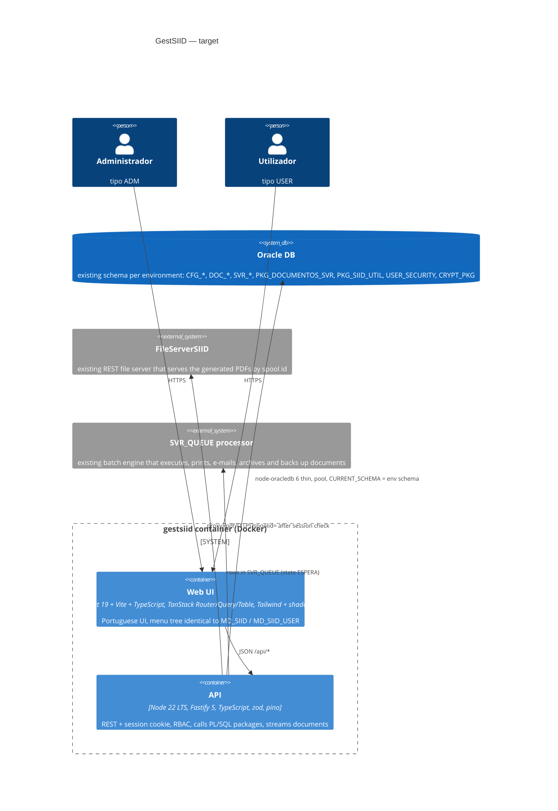
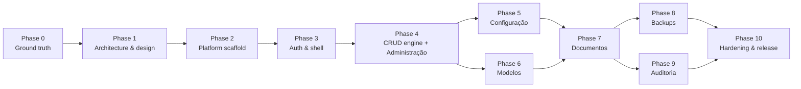

# GestSIID → Node.js: Master Plan

Built 2026-09-14 from the string dumps of the Oracle Forms 12c sources in `dev/T` (latest) and `dev/P` (production).
Inputs: `analysis/STRUCTURE.md`, `analysis/BUSINESS_RULES.md`, `analysis/SECURITY_FINDINGS.md`, `analysis/ASSESSMENT.md`,
`analysis/forms-summary/**` (per-form inventories and PL/SQL text), `analysis/forms-xml/**` (Forms2XML dump of every module: the
authoritative source for item properties, LOVs, alerts, menus, canvases), `dev/P/*.err` (trigger inventories), `CLAUDE.md`.

## ⛔ HARD RULE — NO CHANGES TO THE ORACLE DATABASE

Claude, tests and scripts are **NOT permitted to change the Oracle database** (owner's order, 2026-09-22).
- No INSERT, UPDATE, DELETE, MERGE, DDL, PL/SQL block, write-package call, `SELECT ... FOR UPDATE`, or COMMIT — not even on `ZZTEST_` rows, not in a rolled-back transaction, not "restored afterwards", not to repair an earlier mistake.
- Contract tests reach Oracle only through `app/apps/api/src/test/read-only-db.ts` (`readOnlyPool`). Write paths are tested with fakes only.
- Reading (plain SELECT) is allowed. If a task seems to need a DB change: stop and ask the owner. Give them the SQL; do not run it.
- Full rule: `analysis/TEST_STRATEGY.md` (top).

## 0. How to use this plan

- Run the steps in order. Each step is one Claude Code session started in `I:\GestSIID12c`. Use `/clear` between steps.
- Set the model and effort shown in the step header (`/model`), then paste the **Prompt** block as-is.
- Every prompt names the skills to invoke (`/skill`) and the agents to spawn. Skills are invoked with the `Skill` tool, agents with the `Agent` tool.
- A step is finished only when its **Done when** line is true. Commit after each step (Step 0.1 creates the git repo).
- Models: `sonnet` for well-bounded work, `opus` for design and complex logic, `fable` for the one very large logic step. If a `sonnet` step stalls, re-run it on `opus` with the same prompt.
- Effort values are Claude Code effort levels: `low`, `medium`, `high`, `xhigh`.
- Prompts are written in English; the application UI stays in Portuguese (same labels as the forms).

## 1. Objective

Replace the Oracle Forms 12c application GestSIID (21 forms, 2 menus, WebUtil, Java beans, browser applet) with a
Node.js web application that runs in a Docker container, keeps the Oracle database and its PL/SQL packages as the
system of record, and preserves every concept and function of the forms: document management and its operations,
backups, printers, templates (modelos), permissions, administration tables, two roles (admin / user).

Why now: Forms needs a Java applet/WebStart client, WebUtil 1.0.6 and hardcoded credentials inside the forms; none of
that can be containerized or secured.

## 2. Target architecture (summary; the full ADR is written in Step 1.1)



| Legacy component | Target component |
|---|---|
| Forms runtime + Java applet + WebUtil | Browser SPA served by the same container |
| `FD_LOGIN_SIID`, `:GLOBAL.*`, `P_USERNAME` | `POST /api/auth/login`, server session cookie carrying username, role, ambiente |
| `FD_GESTAO` / `FD_GESTAO_USER` + `MD_SIID*` menus | App shell + route tree filtered by role |
| Data blocks, KEY-ENTQRY / KEY-EXEQRY (query by example), ORDENAR_POR | Reusable `DataBlock` grid (filter row, server-side sort/paging, multi-select, master-detail, inline edit) over `GET /api/<resource>?filter&sort&page` |
| Triggers / program units inside forms | Fastify services (TypeScript) with unit tests |
| DB packages (`PKG_DOCUMENTOS_SVR`, `PCK_SG`, ...) | Unchanged; called through `connection.execute("BEGIN pkg.proc(:a); END;")` |
| `CREATE_SYNONYMS(P_AMBIENTE)` | `ALTER SESSION SET CURRENT_SCHEMA` in the pool session callback, schema from `.env` |
| `WEB.SHOW_DOCUMENT` → FileServerSIID URL | `GET /api/documentos/:id/pdf` proxies `FILESERVER_URL/pdf/{T|P}?spoolid=` after the session/permission check |
| Document actions = `INSERT INTO SVR_QUEUE` + `ERR_ERROS_SIID` audit row (regerar, reimprimir, 2ª via, cópia, reenviar, e-mail, rearquivar, TOXML, backup) | Same inserts done by API services in one transaction; the external queue processor keeps doing the work |
| `HOST`, `TEXT_IO`, `WIN_API`, `ShowDoc.jar` (all dead code) | Not ported |
| WebUtil `CLIENT_TO_DB` (section signature image) | Multipart upload to `DOC_SECCOES_DOCUMENTO.IMAGEM` BLOB |
| `FD_GESTORES_SIID` `GRANT/REVOKE` DDL to DB accounts | Decision D-11: keep as an audited admin action with validated identifiers, or drop |
| `SHOW_ALERT`, `MESSAGE` | Dialog / toast components with the same Portuguese texts |
| Oracle Reports `MEDIAS_DOCUMENTOS` (disabled in menu) | Optional dashboard page (Phase 9) |

Repository layout produced by the plan:

```
I:\GestSIID12c\
  app\                      # the new application (pnpm workspace)
    apps\api\               # Fastify API
    apps\web\               # React SPA
    packages\shared\        # zod schemas + TS types shared by both
    Dockerfile  docker-compose.yml  .env.example
  analysis\                 # everything this plan was built from (keep)
  dev\ prod\ testes\        # legacy Forms sources/binaries (frozen, reference only)
```

## 3. Phase sequence



| Phase | Scope | Size | Risk |
|---|---|---|---|
| 0 Ground truth | git, secrets, live DB discovery, decisions | S | Low |
| 1 Architecture & design | ADR, UI design system, DataBlock spec, test strategy | M | Medium |
| 2 Platform scaffold | monorepo, API, web, DataBlock component, Docker, CI | M | Medium |
| 3 Auth & shell | login, session, RBAC, password change, menu shell | M | High (auth compatibility) |
| 4 CRUD engine + Administração | Domínios, Unidades Medida, Tipos Mídia, Utilizadores, Variáveis SIID, Gestores, Impressoras | M | Low |
| 5 Configuração | Reports params, Permissões, Impressoras associadas (documento / utilizador), Perfis departamento | L | Medium |
| 6 Modelos | template master-detail, sections, conditions, parameters, attributes, uploads | L | High (WebUtil replacement) |
| 7 Documentos | main document management, queue, comments, attachments, all operations, admin vs user | XL | High |
| 8 Backups | Novo backup, Backups online | M | Medium |
| 9 Auditoria | Médias execução dashboard (optional) | S | Low |
| 10 Hardening & release | security, QA, design review, docs, deployment, parallel run, cutover | M | Medium |

Phase 4 is the pilot: it takes one simple form (Impressoras) all the way through API, UI, tests and Docker. What the pilot
reveals is expected to change the later phases; regenerating this plan after the pilot is normal.

---

## Phase 0 — Ground truth

### Step 0.1 — Git repository and secrets hygiene

| Model | Effort | Skills | Agents |
|---|---|---|---|
| sonnet | low | `careful` | none |

**Inputs:** `.gitignore`, `.env.example`, `analysis/SECURITY_FINDINGS.md`.
**Done when:** `git status` shows no `.bat`, no `analysis/forms-extracted`, no `analysis/forms-summary`, no `.env`; first commit exists.

```text
Invoke the `careful` skill first (destructive-command guard).
Context: I:\GestSIID12c holds an Oracle Forms 12c app (read CLAUDE.md) that will be rewritten in Node.js. There is no VCS yet. A .gitignore and .env.example already exist at the repo root.
Do:
1. Run `git init` on I:\GestSIID12c (default branch main). Do NOT delete or move any existing file.
2. Verify with `git check-ignore -v` that these are ignored: dev/T/compile_testes.bat, dev/P/compile_producao.bat, analysis/forms-extracted/T/FD_LOGIN_SIID.fmb.txt, analysis/forms-summary/T/FD_LOGIN_SIID.fmb.plsql.txt, .env. If any is not ignored, fix .gitignore.
3. Grep the files that WILL be committed for the strings "userid=" and "v_password" and any IP address; none may appear in tracked files except masked ("***"). Report any hit and stop if found.
4. Check analysis/README.md is accurate (it lists every artifact and how to regenerate the local-only dumps); fix it if something moved.
5. Commit everything that is not ignored with message "chore: baseline of legacy Forms sources and analysis".
6. Print a reminder for the human: the Oracle accounts whose passwords appear in dev/*/compile_*.bat and inside FD_LOGIN_SIID must be rotated by the DBA before the new app goes live (see analysis/SECURITY_FINDINGS.md).
Do not echo any credential value in your output.
```

### Step 0.2 — Live database discovery

| Model | Effort | Skills | Agents |
|---|---|---|---|
| sonnet | medium | `context7-mcp` (node-oracledb) | none |

**Inputs:** `analysis/STRUCTURE.md` §4 (table + package inventory), `.env.example`.
**Done when:** `analysis/db/` contains the schema dump and `analysis/db/DB_FACTS.md` states DB version, character set, whether every package/table exists, and which node-oracledb mode is required.
**Note:** the Oracle listeners were not reachable from the analysis machine on 2026-09-14. Run this step on a host that can reach the test database (TNS alias `cosec`), with `.env` filled in.

```text
Use the `context7-mcp` skill to fetch current node-oracledb docs (thin mode, createPool, fetching CLOB/BLOB, querying ALL_SOURCE) before writing code.
Context: read CLAUDE.md, .env.example and analysis/STRUCTURE.md section "Database inventory". The Forms app's business logic lives in Oracle packages that are NOT in this repo; the new Node.js app must call them, so we need their exact signatures and the exact table shapes.
Build tools/db-discovery/ (plain Node 22 + node-oracledb 6, TypeScript optional, no other deps) with one script `npm run discover` that reads .env (DB_USER, DB_PASSWORD, DB_CONNECT_STRING, DB_SCHEMA) and writes, under analysis/db/:
1. DB_FACTS.md — banner version, NLS_CHARACTERSET, NLS_NCHAR_CHARACTERSET, DB time zone, the connect mode used (thin works for Oracle 12.1+; if the DB is older, say thick mode + Instant Client is required and stop the other steps from assuming thin).
2. tables/<TABLE>.md — for every table and view named in STRUCTURE.md §4 plus every object that DB_SCHEMA owns whose name starts with CFG_, DOC_, SVR_, ERR_, GD_: columns (name, type, length/precision, nullable, default, comment), primary/unique/foreign keys, indexes, row count, and for lookup-type tables (CFG_VALORES_DOMINIO, CFG_TIPOS_MIDIA, CFG_UNIDADES_MEDIDA, SVR_VARIAVEIS_SIID, SVR_AMBIENTES_IMPRESSAO) the first 200 rows as a markdown table. Views: include the view SQL text.
3. packages/<PACKAGE>.sql — full spec source from ALL_SOURCE for PKG_DOCUMENTOS_SVR, PCK_SG, PKG_SIID_UTIL, PKG_FICHIERS, PKG_TRANSFERTS, PCK_ERRGE, USER_SECURITY and any other package/procedure/function DB_SCHEMA owns; body source too if the account can read it. Also list which of these objects are missing.
4. sequences.md, synonyms.md (public + private synonyms visible to DB_USER, so we learn which schema really owns each object), grants.md (what DB_USER can do on each object).
5. Do not print or store the password anywhere except .env. Use bind variables only. Output must be deterministic (sorted) so it can be diffed later.
Run it, check the outputs, and summarize in DB_FACTS.md any surprise (object missing, column type different from what the forms assume, USER_SECURITY.ENCRYPT signature).
```

### Step 0.3 — Decisions the code cannot make

| Model | Effort | Skills | Agents |
|---|---|---|---|
| opus | medium | `superpowers:brainstorming` | none |

**Inputs:** `analysis/STRUCTURE.md` §2 and §7, `analysis/BUSINESS_RULES.md` "Open questions", `analysis/SECURITY_FINDINGS.md`, `analysis/db/DB_FACTS.md`.
**Done when:** `analysis/DECISIONS.md` exists with one dated, answered entry per open question below; every later prompt treats it as binding.

```text
Invoke `superpowers:brainstorming`. Read analysis/STRUCTURE.md (sections 2, 6, 7), analysis/BUSINESS_RULES.md (section "Open questions"), analysis/SECURITY_FINDINGS.md (section "Requirements for the Node.js rewrite") and analysis/db/DB_FACTS.md.
Ask me, one at a time with AskUserQuestion, and record the answers in analysis/DECISIONS.md (format: D-nn, question, options considered, decision, date, consequences):
D-01 Which source set is the truth for the rewrite: dev/T (newer, larger) or dev/P (deployed)? And are FD_GESTAO_SIID_v2 and FD_CONFIGURACAO_MODELOS_old drafts to be ignored?
D-02 Environment model: the login screen has an environment list, but the Forms2XML dump shows it is static with ONE real entry per build (T build: GADOR_TESTES; P build: COSEC), and the form then created synonyms to <AMBIENTE>.<object>. Recommend: one container per environment, DB_SCHEMA and AMBIENTE_ID fixed in .env, the login page shows the environment as a label (this mirrors what the forms actually did). Alternative: environment selector at login with one pool per environment.
D-03 Document viewer: PDFs come from the FileServerSIID REST service (STRUCTURE.md §3.3, SECURITY_FINDINGS SEC-010). Confirm its URL per environment, whether it needs a credential, whether it can be put behind TLS, and that the API may proxy it (recommended) instead of sending the browser there.
D-04 HOST / CLIENT_HOST / TEXT_IO / WIN_API usages are all inside comments (dead code) per STRUCTURE.md §7 and SEC-011. Confirm they are NOT to be ported. The physical work (print, e-mail, archive, backup copy) is done by the external SVR_QUEUE processor; confirm that processor keeps running unchanged.
D-05 E-mail (REENVIAR_EMAIL) is a queue row of type EMAIL with ATRIBUTO01 = address, executed by the queue processor — confirm; then the app needs no SMTP settings.
D-06 Reports: MEDIAS_DOCUMENTOS (Oracle Reports) is a no-op in the menu — rebuild as a page, or drop?
D-07 Auth: keep CFG_UTILIZADORES + USER_SECURITY.ENCRYPT as the credential store (zero-migration cutover; SEC-005 says the hash is weak, so schedule a re-hash later) or force a reset onto Argon2id at cutover? Enforce DATA_INICIO/DATA_FIM at login (SEC-006)? Session lifetime? Note: "Alterar password" in the menu changes the shared DOCUMENT-REGENERATION password (SVR_VARIAVEIS_SIID, CRYPT_PKG.ENCRYPTSTRINGRAW), not the user's own password — keep it as-is (ADM only, recommended) or replace it with a per-user "may regenerate" permission (SEC-008)?
D-08 USER role: STRUCTURE.md §1 lists exactly what FD_GESTAO_SIID_USER lacks (all action buttons, extended details, comment insert), and the Forms2XML dump shows MD_SIID_USER disables Gador, Configuração, Administração, Auditoria and Backups (so USER sees only Documentos, Impressoras Associadas and Alterar password). Confirm these are the intended restrictions; the new app enforces them server-side.
D-09 Deployment target: Docker host / Compose only, or Kubernetes later? Reverse proxy and TLS termination available? Domain name?
D-10 Parallel run: will Forms stay available during UAT so results can be compared side by side?
D-11 Gestores (FD_GESTORES_SIID) grants DB privileges to Oracle accounts (SEC-007). With the Node app using one service account, is this screen still needed? Options: keep as an audited ADM action with DBMS_ASSERT-validated identifiers, or drop it and let the DBA manage grants.
D-12 Hardcoded super-user 'AFREITAS' in CANCELAR (STRUCTURE.md §3.3): replace by a role/permission or drop?
D-13 Tablespace gauge (hourly timer, GD_ESPACO_BD): keep as a small widget on the Documentos page, or drop?
Then walk the 16 open questions OQ-1..OQ-16 in analysis/BUSINESS_RULES.md section 4: answer the ones the schema dump (analysis/db/) settles, ask me the ones that need a business answer (OQ-2, OQ-9, OQ-14, OQ-15, OQ-16), and record each as D-14 onwards.
Also record the recommended defaults for anything I answer "you decide". Finish by listing which later steps of analysis/MASTER_PLAN.md are affected by each decision.
```

### Step 0.4 — Refresh the analysis from the Forms2XML dump

| Model | Effort | Skills | Agents |
|---|---|---|---|
| sonnet | medium | none | `code-modernization:legacy-analyst` (optional, for the diff pass) |

**Inputs:** `analysis/forms-xml/T/*_fmb.xml`, `*_mmb.xml` (produced by `pwsh -NoProfile -File analysis\tools\forms2xml.ps1`; see CLAUDE.md "Oracle Forms tools"), `analysis/STRUCTURE.md`, `analysis/BUSINESS_RULES.md`.
**Done when:** `analysis/forms-xml/summary/<module>.md` exists for every module; STRUCTURE.md §3 sheets carry item data types, lengths, formats, required flags, LOV bindings, list values, prompts, canvas/tab order and hidden items taken from the XML; BUSINESS_RULES.md open questions OQ-2 (menu item roles/visibility) and OQ-13 (missing alert texts) are answered or marked "not in XML".

```text
If analysis/forms-xml/T/ is empty, run: pwsh -NoProfile -File analysis\tools\forms2xml.ps1 (Oracle home at I:\Middleware\Oracle_Home, see CLAUDE.md). The XML is the authoritative view of each Forms module; the string dumps in analysis/forms-summary were a fallback.
Write analysis/tools/xml-inventory.js (plain Node 22, no dependencies; a small regex/state-machine XML reader is fine, or use the built-in DOMParser via `node:` if available) that reads every *_fmb.xml and *_mmb.xml in analysis/forms-xml/T and writes analysis/forms-xml/summary/<module>.md with:
1. Blocks in order: name, base table / query data source, WHERE / ORDER BY, records displayed, insert/update/delete allowed; for each item: name, item type, data type, max length, format mask, required, enabled, visible, canvas + tab page, x/y (for field order), prompt/label, LOV name, list elements (label/value), radio values, default value, hint.
2. Alerts: name, title, message text, button labels, style.
3. LOVs and record groups: name, query text, column mapping to items.
4. Triggers: owner (form / block / item), name, and the first 2 lines of text (full text stays in the XML).
5. Program units: name and type. Parameters, globals used, attached libraries, visual attributes used for row colouring.
6. For menus: the tree with item label, command text (OPEN_FORM target), visible, enabled, and any menu item roles.
Never print credential values (mask anything matching v_password := '...' or LOGON('...', '...@').
Then, module by module, update analysis/STRUCTURE.md §3 (item tables, canvases, LOV bindings, alert texts) and analysis/BUSINESS_RULES.md (fill the message texts marked "not in dump", answer OQ-2 and OQ-13, correct any rule the XML contradicts) with a "source: forms-xml" marker on every changed line. Optionally spawn `code-modernization:legacy-analyst` to diff the XML-derived facts against the current STRUCTURE.md and list contradictions before you edit. Finish with a short "What the XML changed" section at the end of STRUCTURE.md.
```

---

## Phase 1 — Architecture & design

### Step 1.1 — Architecture decision record

| Model | Effort | Skills | Agents |
|---|---|---|---|
| opus | high | `superpowers:brainstorming`, `superpowers:writing-plans`, `diagram`, `context7-mcp` | `feature-dev:code-architect`, `code-modernization:architecture-critic` |

**Inputs:** `analysis/STRUCTURE.md`, `analysis/BUSINESS_RULES.md`, `analysis/SECURITY_FINDINGS.md`, `analysis/DECISIONS.md`, `analysis/db/`.
**Done when:** `analysis/ARCHITECTURE.md` is written, reviewed by the architecture-critic agent, and its "Open points" list is empty or accepted.

```text
Invoke `superpowers:brainstorming` then `superpowers:writing-plans`. Read analysis/STRUCTURE.md, analysis/BUSINESS_RULES.md, analysis/SECURITY_FINDINGS.md, analysis/DECISIONS.md, analysis/db/DB_FACTS.md and analysis/MASTER_PLAN.md section 2.
Goal: write analysis/ARCHITECTURE.md, the binding architecture for the Node.js rewrite of GestSIID. Use the `context7-mcp` skill to verify current APIs for Fastify 5, node-oracledb 6, TanStack Router/Query/Table, Vite and Vitest before fixing versions.
Spawn `feature-dev:code-architect` to draft, then `code-modernization:architecture-critic` to attack the draft for over-engineering and missed requirements; fold the critique in.
The document must fix:
1. Stack and versions: Node 22 LTS, TypeScript strict, pnpm workspace (apps/api, apps/web, packages/shared), Fastify 5 + @fastify/cookie + @fastify/session (or @fastify/secure-session) + @fastify/multipart + @fastify/static + @fastify/swagger, zod, pino, node-oracledb 6 (thin unless DB_FACTS.md says thick), React 19 + Vite + TanStack Router/Query/Table + Tailwind + shadcn/ui + react-hook-form, Vitest, Playwright. Justify each in one line; reject anything not needed.
2. Runtime topology: ONE container serving the API and the built SPA; env config via .env (list every variable, matching .env.example, add what is missing); health endpoint; graceful shutdown closes the pool.
3. Database access layer: pool with sessionCallback running ALTER SESSION SET CURRENT_SCHEMA = DB_SCHEMA and NLS settings; bind variables only; helper to call PL/SQL procedures with IN/OUT binds; LOB streaming; transaction helper; how ORA errors are mapped to HTTP errors and to the Portuguese messages in BUSINESS_RULES.md; how the app-level user (CFG_UTILIZADORES.USERNAME) is passed to packages that expect it.
4. Query-by-example contract: `GET /api/<block>?f[col]=value&sort=col:asc&page=1&size=50` with a server-side allow-list of filterable/sortable columns per resource, operators (=, like, between for dates), and total count; how master-detail is expressed (detail resource filtered by master key).
5. Auth & RBAC: login validated against CFG_UTILIZADORES with USER_SECURITY.ENCRYPT (per DECISIONS D-07); session cookie (httpOnly, SameSite=Lax, Secure behind TLS); roles ADM/USER; server-side route guards; audit log table or pino audit stream (per SECURITY_FINDINGS).
6. Files: streaming endpoint over DOCS_ROOT with path allow-listing and no traversal; uploads to BLOB via multipart; size limits.
7. Long-running or repeating work: what the Forms timer (WHEN-TIMER-EXPIRED) refreshed and how the SPA does it (polling interval or SSE); any HOST command replacement from DECISIONS D-04.
8. Project conventions: folder layout per feature (route, schema, service, repository, tests), error format, i18n (Portuguese strings in one module), logging fields, commit style.
9. Folder-by-folder skeleton listing and a C4 container + component Mermaid diagram (use the `diagram` skill to render analysis/architecture.mmd to SVG).
10. A "Legacy → target mapping" table listing each of the 21 forms and the API resources + SPA routes that replace it.
End with "Open points" (things still undecided) — aim for zero.
```

### Step 1.2 — UI design system and app shell specification

| Model | Effort | Skills | Agents |
|---|---|---|---|
| opus | medium | `ui-ux-pro-max:design-system`, `frontend-design:frontend-design`, `gsd-ui-phase` | `gsd-ui-researcher` |

**Inputs:** `analysis/STRUCTURE.md` §3 (per-form sheets: blocks, items, labels), menu tree in `analysis/STRUCTURE.md` §2, `analysis/ARCHITECTURE.md`.
**Done when:** `analysis/UI_SPEC.md` and `app/design-tokens.json` exist and the DataBlock component behaviour is fully specified.

```text
Invoke `ui-ux-pro-max:design-system` and `frontend-design:frontend-design`, then `gsd-ui-phase` (spawn `gsd-ui-researcher`) to produce analysis/UI_SPEC.md — the design contract for the GestSIID web UI. Read analysis/STRUCTURE.md sections 2 and 3 first: every screen, block, item, label and message of the Forms app is listed there and the new UI must keep the same Portuguese labels and the same menu tree (Gestão / Gador / Configuração / Administração / Auditoria).
Audience: back-office operators who work all day in dense data grids and keyboard navigation; the Forms app was an MDI desktop-style UI. Design a professional, calm, data-dense enterprise look (not a marketing site): light theme default, dark theme supported, 13–14px base font in grids, clear focus rings, high-contrast status colours for document states.
Specify:
1. Design tokens (colour, type scale, spacing, radius, elevation, density) as app/design-tokens.json plus the Tailwind/shadcn mapping.
2. App shell: top bar (environment label, user, role, logout), left navigation with the exact menu tree per role, breadcrumb, content area, global toast + modal dialog conventions replacing SHOW_ALERT/MESSAGE (list the alert texts from BUSINESS_RULES.md that must be reproduced).
3. The DataBlock pattern (replacement for a Forms multi-record block): filter row (query-by-example), column-header sort (ORDENAR_POR), server-side paging, row multi-select with "seleccionar todos", master/detail layouts (stacked and side-by-side), inline edit vs. side panel edit, dirty-state bar with Guardar/Cancelar (COMMIT_FORM / rollback), record counter, empty/loading/error states, keyboard map (Enter to query, Esc to cancel, arrows, Ctrl+S).
4. Per-screen wireframes in text/ASCII for: Login, Documentos (list + detail tabs: parâmetros, comentários, anexos, fila/queue, erros), Modelos (master with sections/conditions/parameters/attributes tabs), Permissões (the two-sided add/remove lists), Novo backup wizard, Backups online, one generic single-table CRUD screen (Impressoras) that all maintenance screens reuse, and one master-detail screen (Domínios).
5. Accessibility: WCAG AA contrast, full keyboard operation, aria for grids and dialogs.
6. Component inventory mapped to shadcn/ui primitives and what must be custom (DataBlock, LOV picker = searchable select dialog, date range filter).
Write it so a developer can build without asking questions.
```

### Step 1.3 — Test and parity strategy

| Model | Effort | Skills | Agents |
|---|---|---|---|
| sonnet | medium | `superpowers:test-driven-development` | `code-modernization:test-engineer` |

**Inputs:** `analysis/BUSINESS_RULES.md`, `analysis/ARCHITECTURE.md`, `analysis/DECISIONS.md` (D-10).
**Done when:** `analysis/TEST_STRATEGY.md` exists with a parity checklist per form and the fixture plan for the test schema.

```text
Invoke `superpowers:test-driven-development` and spawn `code-modernization:test-engineer`. Read analysis/BUSINESS_RULES.md, analysis/ARCHITECTURE.md and analysis/DECISIONS.md.
Write analysis/TEST_STRATEGY.md:
1. Layers: unit (Vitest, services with a mocked db helper), API contract tests (Vitest + fastify.inject against the TEST Oracle schema, read-only by default, write tests wrapped in a transaction that is rolled back), UI component tests (Vitest + Testing Library for DataBlock), end-to-end (Playwright against the Docker image and the test schema), manual parity UAT next to the Forms app (per D-10).
2. Characterization approach: the legacy Forms cannot be executed here, so equivalence is trace-based — for each form, a table of "query the form runs" (copy the SQL from analysis/forms-summary/T/<form>.plsql.txt) → "API endpoint that must return the same rows for the same filters", to be asserted against the test schema.
3. Parity checklist per form: one checkbox per business rule ID in BUSINESS_RULES.md, grouped by the phase of analysis/MASTER_PLAN.md that delivers it; mark the P0 rules (money/data-integrity/state transitions of documents, permissions, authentication) that block a phase from shipping.
4. Test data: which existing rows in the test schema are safe to use, which must be created by the tests, naming convention (prefix ZZTEST_) and cleanup.
5. CI gates: lint, typecheck, unit, contract (only when DB_CONNECT_STRING is set), build image, Playwright smoke.
Keep it practical; no test pyramid essays.
```

---

## Phase 2 — Platform scaffold

### Step 2.1 — Monorepo and API skeleton

| Model | Effort | Skills | Agents |
|---|---|---|---|
| sonnet | medium | `context7-mcp`, `superpowers:test-driven-development`, `ponytail:ponytail` | `code-modernization:scaffolder` |

**Inputs:** `analysis/ARCHITECTURE.md`, `.env.example`, `analysis/db/DB_FACTS.md`.
**Done when:** `pnpm -r test` and `pnpm -r typecheck` pass; `GET /api/health` returns DB round-trip status; the pool sets CURRENT_SCHEMA.

```text
Invoke `ponytail:ponytail` (keep it minimal) and `superpowers:test-driven-development`; use `context7-mcp` for Fastify 5 and node-oracledb 6 APIs. Read analysis/ARCHITECTURE.md and follow it exactly (versions, folders, conventions).
Spawn `code-modernization:scaffolder` for the skeleton, then finish it yourself.
Create app/ as a pnpm workspace with apps/api, apps/web (empty placeholder for Step 2.2), packages/shared. In apps/api build:
1. src/config.ts — zod-validated env loader (every variable in .env.example; fail fast with a readable message).
2. src/db/ — pool factory (node-oracledb thin unless DB_FACTS.md says thick), sessionCallback with ALTER SESSION SET CURRENT_SCHEMA and NLS_DATE_FORMAT, helpers: query<T>(sql, binds), execute(sql, binds), callProc(name, binds with OUT), withTransaction(fn), streamLob. Unit-test the helpers with a fake connection.
3. src/plugins/ — cookie+session, error handler (maps zod errors → 400, ORA-xxxx → 409/500 with a message key, everything logged with pino incl. request id), swagger at /api/docs, static serving of apps/web/dist at / with SPA fallback.
4. src/routes/health.ts — GET /api/health { ok, db: { ok, latencyMs, schema } }.
5. src/i18n/pt.ts — message catalogue module (empty for now, one example).
6. Scripts: dev (tsx watch), build, start, test, typecheck, lint (eslint + prettier). Root scripts run all packages.
7. packages/shared: zod schema for the QBE list query (filter/sort/page/size) and the paged response envelope { rows, total, page, size }.
Everything must run with `pnpm i && pnpm -r test` without a database; the DB integration test is skipped unless DB_CONNECT_STRING is set. Add app/README.md with the run instructions.
```

### Step 2.2 — Web skeleton and app shell

| Model | Effort | Skills | Agents |
|---|---|---|---|
| sonnet | medium | `frontend-design:frontend-design`, `context7-mcp` | none |

**Inputs:** `analysis/UI_SPEC.md`, `app/design-tokens.json`, `analysis/ARCHITECTURE.md`.
**Done when:** `pnpm --filter web build` succeeds, the shell renders the full menu tree per role from a static config, and the API client is typed from `packages/shared`.

```text
Invoke `frontend-design:frontend-design`; use `context7-mcp` for Vite, TanStack Router and TanStack Query current APIs. Read analysis/UI_SPEC.md, app/design-tokens.json and analysis/ARCHITECTURE.md.
In app/apps/web create the React 19 + Vite + TypeScript SPA:
1. Tailwind + shadcn/ui initialised from the design tokens (light/dark).
2. TanStack Router file-based routes: /login, / (shell), and a placeholder route per menu leaf using the exact Portuguese labels and tree from UI_SPEC (Gestão → Documentos, Backups → Novo / Backups Online; Gador → Gestores, Equipa de Gestão (OD68); Configuração → Reports, Modelos, Permissões, Impressoras, Impressoras Associadas → Documento / Utilizador, Alterar password; Administração → Domínios, Unidades Medida, Tipos Mídia, Utilizadores, Variáveis SIID; Auditoria → Médias Execução). Menu config is one typed array with a `roles` field.
3. App shell per UI_SPEC: top bar (environment, user, role, logout), collapsible left nav, breadcrumb, content outlet, toast provider, confirm dialog provider (Portuguese buttons: Sim / Não / OK / Cancelar).
4. src/api/client.ts — fetch wrapper with credentials, JSON errors mapped to toasts, typed with packages/shared; TanStack Query provider.
5. Vitest + Testing Library smoke test for the shell and menu filtering by role.
Do not build real screens yet. Keep components small and boring.
```

### Step 2.3 — Docker image, compose and CI

| Model | Effort | Skills | Agents |
|---|---|---|---|
| sonnet | medium | `context7-mcp` | none |

**Inputs:** `analysis/ARCHITECTURE.md`, `analysis/db/DB_FACTS.md`, `.env.example`.
**Done when:** `docker compose up` serves the shell at http://localhost:3000 and `/api/health` reports the DB (when reachable); CI workflow runs lint, typecheck, unit tests and image build.

```text
Use `context7-mcp` for node-oracledb container notes (thin mode needs no Instant Client; if analysis/db/DB_FACTS.md says thick mode, add Instant Client to the image) and for pnpm deploy in Docker.
Create in app/: 
1. Dockerfile — multi-stage: deps (pnpm fetch), build (web + api), runtime on node:22-alpine (or node:22-bookworm-slim when thick mode), non-root user, only production deps, HEALTHCHECK hitting /api/health, EXPOSE 3000, `node apps/api/dist/server.js`.
2. docker-compose.yml — service gestsiid with env_file: .env, port mapping, volume for DOCS_ROOT, restart policy, logging options; a commented example of a second service for another environment (different DB_SCHEMA / AMBIENTE_ID).
3. .dockerignore.
4. CI (.github/workflows/ci.yml, and mention the GitLab equivalent in a comment): install, lint, typecheck, unit tests, build image; contract tests only when the secret DB_CONNECT_STRING is present.
5. app/DEPLOY.md — how to build, configure .env, run, upgrade, roll back, read logs.
Do not bake any credential into the image; verify with `docker history`.
```

### Step 2.4 — DataBlock: the reusable Forms-block replacement

| Model | Effort | Skills | Agents |
|---|---|---|---|
| opus | high | `frontend-design:frontend-design`, `ui-ux-pro-max:ui-styling`, `superpowers:test-driven-development` | `feature-dev:code-architect` |

**Inputs:** `analysis/UI_SPEC.md` §3 (DataBlock), `analysis/ARCHITECTURE.md` §4 (QBE contract), `packages/shared` list-query schema.
**Done when:** a Storybook-free demo route `/dev/datablock` shows a DataBlock over a mock resource with filtering, sorting, paging, multi-select, inline edit and dirty-state save/cancel; component tests pass; the server-side `listQuery` helper builds safe SQL from the QBE contract with an allow-list and is unit-tested.

```text
Invoke `superpowers:test-driven-development`, `frontend-design:frontend-design` and `ui-ux-pro-max:ui-styling`. Spawn `feature-dev:code-architect` to design the component API first, then implement. Read analysis/UI_SPEC.md (DataBlock section) and analysis/ARCHITECTURE.md (QBE contract).
Build the two halves of the generic block engine that every screen of the app reuses:
A) apps/api/src/lib/listQuery.ts — given a resource definition { table/view, columns: { name, type, filterable, sortable, editable }, defaultSort }, and a parsed list query from packages/shared, produce parameterized SQL (Oracle 12c+ OFFSET/FETCH) with WHERE built only from allow-listed columns, LIKE for text (case-insensitive, escape %), = for numbers/codes, BETWEEN for dates, IN for multi; plus a count query. Unit tests must prove no injection is possible (column names never come from input; values are binds). Provide crudRoutes(resource) that registers GET list, GET one, POST, PUT, DELETE with zod schemas generated from the resource definition, optional hooks (beforeInsert/beforeUpdate for audit columns like CRIADO_POR/DATA_CRIACAO, ACTUALIZADO_POR/DATA_ACTUALIZACAO), and role guards.
B) apps/web/src/components/datablock/ — DataBlock<T> over TanStack Table + TanStack Query: filter row (QBE) with per-column input types (text, number, date range, select from a domain), header sort, server paging, row selection with select-all, master/detail helper (useDetailBlock(masterKey)), edit modes (inline row edit and side-panel form via react-hook-form + zod), dirty-state bar (Guardar / Cancelar, confirm on navigation away = the Forms "Deseja gravar as alterações?" behaviour), status line with record count, loading/empty/error states, keyboard map from UI_SPEC. Column definitions are typed and shared with the API resource definition through packages/shared.
Ship a /dev/datablock demo route wired to a mock resource served by the API (in-memory) so the whole loop can be tested without Oracle. Playwright smoke test for the demo.
```

---

## Phase 3 — Authentication and shell

### Step 3.1 — Login, session, roles, password change (API)

| Model | Effort | Skills | Agents |
|---|---|---|---|
| opus | high | `superpowers:test-driven-development`, `security-review`, `context7-mcp` | `code-modernization:security-auditor` |

**Inputs:** `analysis/BUSINESS_RULES.md` (Authentication, password change), `analysis/SECURITY_FINDINGS.md`, `analysis/DECISIONS.md` D-02/D-07, `analysis/db/packages/USER_SECURITY.sql`, `analysis/forms-summary/T/FD_LOGIN_SIID.fmb.plsql.txt`, `analysis/forms-summary/T/FD_ALTERAR_PASSWORD.fmb.plsql.txt`.
**Done when:** contract tests prove: valid user → session with role; wrong password → 401 with the exact Portuguese alert text; ADM/USER role derived from CFG_UTILIZADORES.TIPO_UTILIZADOR_RF; password change follows the FD_ALTERAR_PASSWORD rules; `/security-review` reports no high finding.

```text
Invoke `superpowers:test-driven-development`. Read analysis/BUSINESS_RULES.md (sections Authentication & environment, password change), analysis/SECURITY_FINDINGS.md, analysis/DECISIONS.md (D-02, D-07), analysis/db/packages/USER_SECURITY.sql and the two PL/SQL dumps analysis/forms-summary/T/FD_LOGIN_SIID.fmb.plsql.txt and FD_ALTERAR_PASSWORD.fmb.plsql.txt.
Implement in apps/api:
1. POST /api/auth/login { utilizador, password } → looks up CFG_UTILIZADORES by USERNAME and AMBIENTE_ID (from config), compares USER_SECURITY.ENCRYPT(:password) computed in the DB with the stored PASSWORD, exactly like the form; on success creates the session { username, role: TIPO_UTILIZADOR_RF === 'ADM' ? 'ADM' : 'USER', ambiente }, on failure returns 401 with the same message the form showed (alert LOGIN_INVALIDO text from BUSINESS_RULES). Missing fields → 400 with the SEM_UTILIZADOR / SEM_PASSWORD texts. Rate-limit by IP and username.
2. GET /api/auth/me, POST /api/auth/logout.
3. POST /api/auth/regeneracao-password — FD_ALTERAR_PASSWORD does NOT change the user's password: it sets the shared document-regeneration password, i.e. UPDATE SVR_VARIAVEIS_SIID SET VALOR = CRYPT_PKG.ENCRYPTSTRINGRAW(:password) WHERE TIPO_VARIAVEL_RF='PASSWORD' AND AMBIENTE_ID=:ambiente, after checking password = confirmation (alert PASSWORD_ERRADA). Implement it with bind variables, restricted per DECISIONS D-07 (ADM only recommended), audited. Also POST /api/auth/reauth-regeneracao { password } that compares CRYPT_PKG.ENCRYPTSTRINGRAW(:password) with that row and sets a short-lived flag in the session (used by Step 7.2 for the CONFIRMAR_PASSWORD flow).
4. Login must also enforce CFG_UTILIZADORES.DATA_INICIO / DATA_FIM when D-07 says so (SEC-006). requireRole('ADM'|'USER') preHandler + a `currentUser` decorator that services use to fill CRIADO_POR / ACTUALIZADO_POR columns.
5. Audit log: login success/failure, logout, password change → table or pino audit stream per ARCHITECTURE.md.
6. Contract tests (fastify.inject) against the test schema, READ-ONLY through readOnlyPool (HARD RULE: no Oracle changes — no ZZTEST_ rows); a successful login uses an owner-given account (GESTSIID_TEST_USER / GESTSIID_TEST_PASSWORD); unit tests with a fake db for the branches and every write path.
Then run the `security-review` skill on the diff and spawn `code-modernization:security-auditor` to review the auth code; fix findings before finishing.
```

### Step 3.2 — Login page, role-aware shell, password dialog (UI)

| Model | Effort | Skills | Agents |
|---|---|---|---|
| sonnet | medium | `frontend-design:frontend-design` | none |

**Inputs:** `analysis/UI_SPEC.md` (Login wireframe, shell), Step 3.1 endpoints, `analysis/forms-extracted/T/FD_LOGIN_SIID.fmb.txt` (labels).
**Done when:** Playwright: login as ADM shows the full menu, login as USER hides admin-only entries, wrong password shows the Portuguese alert, "Alterar password" works, logout returns to /login, deep links redirect to /login when unauthenticated.

```text
Invoke `frontend-design:frontend-design`. Read analysis/UI_SPEC.md (Login and shell), the auth endpoints from apps/api/src/routes/auth*, and grep analysis/forms-extracted/T/FD_LOGIN_SIID.fmb.txt for the item prompts (Utilizador, Password, Ambiente) and alert texts.
Build in apps/web:
1. /login page: utilizador, password, environment shown as a read-only badge (AMBIENTE_ID from GET /api/health or /api/auth/config), submit on Enter, inline error with the exact alert text, loading state.
2. Auth store (TanStack Query "me" + router beforeLoad guard); menu filtered by role using the menu config's `roles`; admin-only leaves hidden for USER (per DECISIONS D-08).
3. "Alterar password" (Configuração menu leaf, ADM only per DECISIONS A-09; window title "Alteração da Password de Regeração") as a modal with the two fields PASSWORD / CONFIRMACAO and the same messages — it changes the document-regeneration password (Step 3.1 endpoint), visible only to the roles allowed by DECISIONS D-07.
4. Logout in the top bar; session-expired handling (401 anywhere → toast + redirect to /login).
5. Playwright tests for the scenarios in "Done when" against the Oracle-less dev server with an in-memory AuthRepo (HARD RULE: no Oracle changes; no ZZTEST_ users are created).
```

---

## Phase 4 — CRUD engine pilot and Administração screens

Every screen here is a Forms "maintenance block" over one table with query-by-example, sort buttons (ORDENAR_POR),
insert/update/delete and COMMIT_FORM. The pilot (Impressoras) proves the whole path; the others reuse it; Domínios adds the master-detail pattern.
Standard prompt inputs for each form `<FORM>`: `analysis/STRUCTURE.md` §3 (sheet for `<FORM>`), `analysis/BUSINESS_RULES.md`
(matching area), `analysis/forms-xml/T/<FORM>_fmb.xml` and its digest `analysis/forms-xml/summary/<FORM>_fmb.md` (authoritative item
properties, labels, LOVs, alerts, canvas order, full trigger text), `analysis/forms-summary/T/<FORM>.fmb.plsql.txt` (trigger code as plain
text), `analysis/db/tables/<TABLE>.md` (real columns). Where a prompt below names `analysis/forms-extracted/T/<FORM>.fmb.txt` for
labels, prefer the XML digest.

### Step 4.1 — Pilot: Impressoras (FD_IMPRESSORAS_SIID) end to end, plus the domain-values lookup

| Model | Effort | Skills | Agents |
|---|---|---|---|
| sonnet | medium | `feature-dev:feature-dev`, `superpowers:test-driven-development` | `feature-dev:code-explorer`, `feature-dev:code-reviewer` |

**Done when:** Configuração → Impressoras lists, filters, sorts, creates, edits and deletes rows of `SVR_IMPRESSORAS` (ID from `ID_IMPRESSORA_SEQ`, `GSDEVICE_RF` from domain `GSDEVICES`, `CRIADO_POR` = session user) with the form's messages; `GET /api/dominios/:dominioId/valores` serves lookup values for every later screen; `<ImpressoraPicker>` dialog exists (used by Reimprimir and Novo backup); contract + Playwright tests pass; the Docker image runs it.

```text
Invoke `feature-dev:feature-dev` (it will spawn code-explorer / code-reviewer) and `superpowers:test-driven-development`.
Legacy source of truth: analysis/STRUCTURE.md §3.15 "FD_IMPRESSORAS_SIID" (single block IMPRESSORAS over SVR_IMPRESSORAS: ID, DESCRICAO, ENDERECO "Servidor", VALIDO "Válida", GSDEVICE_RF list from domain GSDEVICES, CRIADO_POR, DATA_CRIACAO; alert "Falha no Carregamento !!"), analysis/BUSINESS_RULES.md area "Printers", analysis/forms-summary/T/FD_IMPRESSORAS_SIID.fmb.plsql.txt, labels in analysis/forms-extracted/T/FD_IMPRESSORAS_SIID.fmb.txt, real columns in analysis/db/tables/SVR_IMPRESSORAS.md and CFG_VALORES_DOMINIO.md.
Deliver, using the crudRoutes/listQuery helpers and the DataBlock component from Phase 2:
1. packages/shared/resources/impressoras.ts — resource definition (columns, types, filterable/sortable/editable, Portuguese labels, validation from the triggers, audit columns, ID from the sequence).
2. apps/api/src/features/dominios/valores.ts — GET /api/dominios/:dominioId/valores → { chave, designacao, prioridade } from CFG_VALORES_DOMINIO ordered by PRIORIDADE, CHAVE (the record-group query every form uses), cached 60 s. This is the lookup source for all select lists in the app.
3. apps/api/src/features/impressoras/ — routes via crudRoutes; writes ADM only; contract tests against the test schema in a rolled-back transaction.
4. apps/web/src/routes/configuracao/impressoras.tsx — DataBlock with the form's columns in the form's order, inline edit, domain-backed select for GSDEVICE_RF, the Portuguese alert texts; plus components/ImpressoraPicker.tsx (searchable dialog over the LOV_IMPRESSORAS query: valid printers ordered by numeric ID, columns ID, DESCRICAO, ENDERECO).
5. Playwright e2e: filter, sort, create, edit, delete, validation error, picker.
6. Write analysis/PILOT_NOTES.md: what the helpers were missing, what took longest, what the next screens should copy. This file feeds Step 4.7.
```

### Step 4.2 — Unidades de Medida and Tipos de Mídia

| Model | Effort | Skills | Agents |
|---|---|---|---|
| sonnet | low | `superpowers:test-driven-development` | none |

**Done when:** `/administracao/unidades-medida` (`CFG_UNIDADES_MEDIDA`) and `/administracao/tipos-midia` (`CFG_TIPOS_MIDIA`, unit chosen from Unidades de Medida) behave like `FD_UNIDADES_MEDIDA` and `FD_TIPOS_MiDIA`; tests pass.

```text
Invoke `superpowers:test-driven-development`. Copy the pattern of apps/api/src/features/impressoras and the Impressoras route exactly (read analysis/PILOT_NOTES.md first).
Legacy sources: analysis/STRUCTURE.md §3 sheets FD_UNIDADES_MEDIDA and FD_TIPOS_MiDIA; analysis/forms-summary/T/FD_UNIDADES_MEDIDA.fmb.plsql.txt and FD_TIPOS_MiDIA.fmb.plsql.txt; analysis/db/tables/CFG_UNIDADES_MEDIDA.md and CFG_TIPOS_MIDIA.md.
Build both resources, API routes, DataBlock screens (menu Administração → Unidades Medida / Tipos Mídia). Tipos de Mídia references a unit: render it as a select fed by the Unidades de Medida list; keep the same validations and Portuguese messages as the triggers (check the WHEN-VALIDATE-ITEM / PRE-INSERT / PRE-UPDATE code and the ORDENAR_POR sort options). Contract + Playwright tests as in the pilot. No new abstractions.
```

### Step 4.3 — Utilizadores (FD_UTILIZADORES_SIID)

| Model | Effort | Skills | Agents |
|---|---|---|---|
| sonnet | medium | `superpowers:test-driven-development`, `security-review` | none |

**Done when:** admins can list/create/edit users of the current environment (`CFG_UTILIZADORES` filtered by `AMBIENTE_ID`), set the user type (ADM/USER from the domain list), assign print environments (`SVR_AMBIENTES_IMPRESSAO`) and set/reset a password hashed with `USER_SECURITY.ENCRYPT`; passwords are never returned by the API.

```text
Invoke `superpowers:test-driven-development`; run the `security-review` skill at the end.
Legacy sources: analysis/STRUCTURE.md §3 "FD_UTILIZADORES_SIID", analysis/BUSINESS_RULES.md "Administration → users", analysis/forms-summary/T/FD_UTILIZADORES_SIID.fmb.plsql.txt, analysis/db/tables/CFG_UTILIZADORES.md, SVR_AMBIENTES_IMPRESSAO.md, CFG_VALORES_DOMINIO.md (domain for TIPO_UTILIZADOR_RF).
Build the resource, API and screen (Administração → Utilizadores) on the pilot pattern, plus:
- the PASSWORD column is write-only: POST/PUT accept `password` and store USER_SECURITY.ENCRYPT(:password) inside the same statement; GET never returns it;
- AMBIENTE_ID is always the configured environment (not editable);
- any detail block the form has for print environments (SVR_AMBIENTES_IMPRESSAO) becomes a detail DataBlock;
- reproduce the validations and alert texts from the triggers (unique username per environment, mandatory type, etc.).
Contract tests + Playwright. ADM only.
```

### Step 4.4 — Variáveis SIID (FD_VARIAVEIS_SIID)

| Model | Effort | Skills | Agents |
|---|---|---|---|
| sonnet | low | `superpowers:test-driven-development` | none |

**Done when:** `/administracao/variaveis` maintains `SVR_VARIAVEIS_SIID` for the current environment with the form's validations; other features read variables through one typed helper `getVariavel(nome)`.

```text
Invoke `superpowers:test-driven-development`. Legacy sources: analysis/STRUCTURE.md §3 "FD_VARIAVEIS_SIID", analysis/forms-summary/T/FD_VARIAVEIS_SIID.fmb.plsql.txt, analysis/db/tables/SVR_VARIAVEIS_SIID.md, and grep analysis/forms-summary/T/*.plsql.txt for "SVR_VARIAVEIS_SIID" to list which variable names other forms read (they become the typed keys of the helper).
Build resource + API + screen on the pilot pattern (filter by AMBIENTE_ID = configured environment), plus apps/api/src/lib/variaveis.ts exposing getVariavel(name) with a 60 s cache and a unit test. Same validations and messages as the form.
```

### Step 4.5 — Gestores (FD_GESTORES_SIID)

| Model | Effort | Skills | Agents |
|---|---|---|---|
| sonnet | medium | `superpowers:test-driven-development`, `security-review` | none |

**Done when:** per `analysis/DECISIONS.md` D-11 the Gador → Gestores screen either (a) lists DB accounts (`ALL_USERS` minus accounts already granted INSERT on `SVR_DOCUMENTO_COMENTARIOS` minus `M_USUARIOS.CDIDUSR`) and runs the 25 GRANT / REVOKE statements of the form as an audited ADM action with identifiers validated by `DBMS_ASSERT.SIMPLE_SQL_NAME` and checked against `ALL_USERS`, or (b) is dropped from the menu with a note; `security-review` reports no finding.

```text
Read analysis/DECISIONS.md D-11 first and stop if the decision is "drop" (remove the menu leaf, record it). Otherwise invoke `superpowers:test-driven-development` and read analysis/STRUCTURE.md §3.10 "FD_GESTORES_SIID", analysis/SECURITY_FINDINGS.md SEC-007, analysis/forms-summary/T/FD_GESTORES_SIID.fmb.plsql.txt (the record-group query and the grant/revoke lists).
Implement GET /api/gestores (candidates + current managers), POST /api/gestores/:username (grant set) and DELETE /api/gestores/:username (revoke set): the object list is a constant in code, the username must match ^[A-Z][A-Z0-9_$#]{0,29}$, exist in ALL_USERS and not be PUBLIC/SYS/SYSTEM; execute through a definer-rights PL/SQL procedure if the DBA provides one (preferred) else via EXECUTE IMMEDIATE with DBMS_ASSERT.ENQUOTE_NAME; every call audited. Screen: Gador → Gestores with a candidate select and the two actions. Run the `security-review` skill. Contract + Playwright tests.
```

### Step 4.6 — Domínios (FD_DOMINIOS_SIID): master-detail

| Model | Effort | Skills | Agents |
|---|---|---|---|
| sonnet | medium | `superpowers:test-driven-development` | none |

**Done when:** Administração → Domínios shows the master `CFG_DOMINIOS` (tabs "Dados" / "Lista") with the detail `CFG_VALORES_DOMINIO`, the conditional fields (interval min/max when `TIPO_DOMINIO_RF='I'`, string type/format when `TIPO_INFORMACAO_RF='STRING'`), the defaults (DATA_INICIO = today, PRIORIDADE = 0, VERSAO = 0.0, REGISTADO_POR = session user) and the NOT NULL validations of the form; the lookup endpoint from Step 4.1 reflects edits immediately (cache invalidation).

```text
Invoke `superpowers:test-driven-development`. Legacy sources: analysis/STRUCTURE.md §3.16 "FD_DOMINIOS_SIID", analysis/BUSINESS_RULES.md "Administration → domains", analysis/forms-summary/T/FD_DOMINIOS_SIID.fmb.plsql.txt (ENABLE_STRINGS / ENABLE_VALORES units, the generated WHEN-VALIDATE-ITEM NOT NULL triggers, master-detail units), tables CFG_DOMINIOS and CFG_VALORES_DOMINIO in analysis/db/tables/.
Build master + detail resources (detail filtered by DOMINIO_ID), the screen with a master DataBlock and a detail DataBlock (useDetailBlock), the conditional field visibility, the list items fed by the domains TIPO_INFORMACAO, TIPO_DOMINIO, TIPO_STRING, FORMATACAO_STRING through the lookup endpoint, and invalidate the lookup cache on any write. Tests as in the pilot; write a master-detail note into analysis/PILOT_NOTES.md (first master-detail screen).
```

### Step 4.7 — Pilot retrospective and plan refresh

| Model | Effort | Skills | Agents |
|---|---|---|---|
| opus | medium | `retro`, `superpowers:writing-plans`, `gsd-extract-learnings` | none |

**Done when:** `analysis/MASTER_PLAN.md` Phases 5–10 are revised with what Phase 4 taught (helper gaps, effort/model changes, prompt fixes) and `analysis/PILOT_NOTES.md` is folded into `app/CLAUDE.md`.

```text
Invoke `retro` (gstack) over the git history of Phase 4, then `gsd-extract-learnings`, then `superpowers:writing-plans`. Read analysis/PILOT_NOTES.md and the diffs of Steps 4.1–4.6.
1. Write app/CLAUDE.md: how to add a screen (resource definition → crudRoutes → DataBlock route → tests), conventions that emerged, commands, gotchas with node-oracledb and the test schema.
2. Revise analysis/MASTER_PLAN.md Phases 5–10 in place: fix prompts that referenced helpers that do not exist, adjust model/effort where Phase 4 showed a step is bigger or smaller, add missing steps. Keep the same step format. Record the changes in a "Revision log" section at the end of the plan.
```

---

## Phase 5 — Configuração

### Step 5.1 — Parâmetros de reports (FD_CONFIGURACAO_REPORTS)

| Model | Effort | Skills | Agents |
|---|---|---|---|
| sonnet | medium | `superpowers:test-driven-development` | none |

**Done when:** Configuração → Reports ("Gestão de Relatórios") maintains the master `SVR_REPORT_SIID` (ID from `ID_TEMPLATE_REPORT_SEQ`, N_PARAMETROS, directories, file name, observations, valid flag) and its detail `SVR_PARAMETROS_REPORT` (N_PARAMETRO auto MAX+1, NOME, TIPO_PARAMETRO_RF from domain TIPO_PARAMETRO, OBRIGATORIO, CHECK_UNIQUE "Único", VALIDO) with the form's rules: the first three parameters are fixed to `_USER` (type 2), `P_USUARIO` (type 1), `P_DATAACTUAL` (type 1) and their names are read-only (alerts ALERTA_1PARAM..3PARAM); saving checks N_PARAMETROS = number of details + 1 (alert N_PARAM_ERRADO).

```text
Invoke `superpowers:test-driven-development`. Legacy sources: analysis/STRUCTURE.md §3.12 "FD_CONFIGURACAO_REPORTS", analysis/BUSINESS_RULES.md "Administration → report parameters", analysis/forms-summary/T/FD_CONFIGURACAO_REPORTS.fmb.plsql.txt (13 triggers), tables SVR_REPORT_SIID and SVR_PARAMETROS_REPORT in analysis/db/tables/.
Build master + detail resources and the screen on the Domínios master-detail pattern (Step 4.6); the "save report" endpoint applies master + details in one transaction and enforces the three fixed parameters and the N_PARAMETROS rule with the same Portuguese alert texts. Tests as in the pilot.
```

### Step 5.2 — Impressoras associadas: por Documento and por Utilizador

| Model | Effort | Skills | Agents |
|---|---|---|---|
| sonnet | medium | `superpowers:test-driven-development` | none |

**Done when:** Configuração → Impressoras Associadas (ADM only, DECISIONS A-09) → Documento (`DOC_IMPRESSORAS_DOC` × `DOC_MODELOS_DOCUMENTO` × `SVR_IMPRESSORAS`) and → Utilizador (`DOC_IMPRESSOES_MODELO_USR` × `M_USUARIOS` × `SVR_IMPRESSORAS`) reproduce `FD_GESTAO_IMPRESSORAS_DOC` and `FD_GESTAO_IMPRESSORAS_USR`, including their LOVs and uniqueness rules.

```text
Invoke `superpowers:test-driven-development`. Legacy sources: analysis/STRUCTURE.md §3 sheets FD_GESTAO_IMPRESSORAS_DOC and FD_GESTAO_IMPRESSORAS_USR; analysis/BUSINESS_RULES.md "Printers"; the two .plsql.txt dumps in analysis/forms-summary/T/; LOV queries in the corresponding analysis/forms-extracted/T/*.txt (grep for SELECT); tables DOC_IMPRESSORAS_DOC, DOC_IMPRESSOES_MODELO_USR, SVR_IMPRESSORAS, DOC_MODELOS_DOCUMENTO, M_USUARIOS in analysis/db/tables/.
Build two resources/screens on the pilot pattern. Model and user columns are chosen through LOV-style picker dialogs (searchable, same columns as the record groups), printer through <ImpressoraPicker>. Enforce the same uniqueness/validation rules and messages as the triggers. Tests as in the pilot.
```

### Step 5.3 — Permissões: rules and API (FD_PERMISSOES_SIID)

| Model | Effort | Skills | Agents |
|---|---|---|---|
| opus | high | `superpowers:test-driven-development` | `code-modernization:test-engineer`, `feature-dev:code-reviewer` |

**Done when:** the API exposes: list/QBE of `CFG_PERMISSOES_SIID` (with the 10 sort options of ORDENAR_PERMISSOES), "by user" view (models with / without permission for a user, add one / add all / remove one / remove all), "by model" view (users with / without permission), new permission, change permission (type + validity dates), copy permissions model → model and user → user; every rule and message from the form is covered by a contract test.

```text
Invoke `superpowers:test-driven-development`; spawn `code-modernization:test-engineer` first to turn the rules into failing contract tests, then implement, then spawn `feature-dev:code-reviewer`.
Legacy sources: analysis/STRUCTURE.md §3 "FD_PERMISSOES_SIID" (blocks ORDENAR_PERMISSOES, DOC_PERMISSOES_IMPRESSAO, CTR_USERS_SIID, MODELOS_SEM_PERMISSAO, PERMISSOES_USER, CTR_MODELOS_SIID, UTILIZADORES_SEM_PERMISSAO, PERMISSOES_MODELOS, NOVA_PERMISSAO, ALTERAR_PERMISSAO, COPIAR_PERMISSOES, COPIAR_PERMISSOES_UTILIZADOR), analysis/BUSINESS_RULES.md "Permissions", analysis/forms-summary/T/FD_PERMISSOES_SIID.fmb.plsql.txt (all 17 triggers; the record-group SQL behind each list), analysis/db/tables/CFG_PERMISSOES_SIID.md, CFG_UTILIZADORES_VW.md, DOC_MODELOS_DOCUMENTO.md, CFG_VALORES_DOMINIO.md (TIPO_PERMISSAO_RF, UNIDADE_NEGOCIO_RF domains).
Implement apps/api/src/features/permissoes/: a service with pure functions for the rules (validity dates, duplicate detection, unit-of-business filter, what "copy" does with existing rows) and routes: GET /api/permissoes (QBE), GET /api/permissoes/por-utilizador/:username {com, sem}, GET /api/permissoes/por-modelo/:modeloId {com, sem}, POST add / add-all / remove / remove-all for both directions, POST /api/permissoes (nova), PUT /api/permissoes/:id (alterar), POST /api/permissoes/copiar-modelo, POST /api/permissoes/copiar-utilizador. All writes in one transaction, audit columns filled from the session user, ADM only. Keep the exact Portuguese messages.
```

### Step 5.4 — Permissões: screen

| Model | Effort | Skills | Agents |
|---|---|---|---|
| opus | medium | `frontend-design:frontend-design`, `ui-ux-pro-max:ui-styling` | none |

**Done when:** Configuração → Permissões offers the list tab and the two "transfer list" tabs (por Utilizador / por Modelo) with add/remove one/all, the Nova / Alterar / Copiar dialogs, and Playwright covers each flow.

```text
Invoke `frontend-design:frontend-design` and `ui-ux-pro-max:ui-styling`. Read analysis/UI_SPEC.md (Permissões wireframe), the API from Step 5.3, and the labels in analysis/forms-extracted/T/FD_PERMISSOES_SIID.fmb.txt.
Build apps/web/src/routes/configuracao/permissoes/: tab "Lista" (DataBlock with the 10 sort options as header sort), tab "Por utilizador" (user picker + two side-by-side lists with ➜ / ⇉ / ⬅ / ⇇ buttons = ADD_PERMISSAO / ADD_TODOS / REMOVE_PERMISSAO / REMOVE_TODOS, type and business-unit selects from the domain lists), tab "Por modelo" (mirror), dialogs Nova permissão, Alterar permissão, Copiar permissões (modelo → modelo), Copiar permissões (utilizador → utilizador). Keyboard accessible, optimistic updates with rollback on error, Portuguese messages. Playwright tests per flow.
```

### Step 5.5 — Perfis de departamento (FD_PERFIS_DEPARTAMENTO)

| Model | Effort | Skills | Agents |
|---|---|---|---|
| sonnet | medium | `superpowers:test-driven-development`, `context7-mcp` | none |

**Done when:** Gador → Equipa de Gestão (OD68) maintains `DOC_PERFIS_DEPARTAMENTO` and `DOC_FUNCOES_DEPARTAMENTO` with employee lookup (`CO_EMPLEADOS`, `TTAPVAAT`) and replaces the `GetImageFileName` Java bean with an image upload/preview stored where the form stored it.

```text
Invoke `superpowers:test-driven-development`; use `context7-mcp` for @fastify/multipart and node-oracledb BLOB binds. Legacy sources: analysis/STRUCTURE.md §3 "FD_PERFIS_DEPARTAMENTO", analysis/BUSINESS_RULES.md "Administration → department profiles", analysis/forms-summary/T/FD_PERFIS_DEPARTAMENTO.fmb.plsql.txt (FBEAN calls: what the bean returned and which column/path received the image), analysis/DECISIONS.md D-03, tables DOC_PERFIS_DEPARTAMENTO, DOC_FUNCOES_DEPARTAMENTO, CO_EMPLEADOS, TTAPVAAT in analysis/db/tables/.
Build master (perfis) / detail (funções) resources and screen on the pilot pattern; employee fields via a picker over CO_EMPLEADOS; image (signature/photo) via multipart upload with type/size validation, stored as BLOB or under DOCS_ROOT exactly as decided in D-03, with a preview in the side panel. Tests as in the pilot.
```

---

## Phase 6 — Modelos (document templates, FD_CONFIGURACAO_MODELOS)

The form is a master (`DOC_MODELOS_DOCUMENTO`) with detail tabs `DOC_SECCOES_DOCUMENTO`, `DOC_CONDICOES_APR`, `SVR_PARAMETROS_REPORT`,
`DOC_PARAMETROS_OMISSAO`, `DOC_ATRIBUTOS_EDOC`, `DOC_ATRIBUTOS_ARQUIVO`, dialogs `EDITAR_MODELO`, `EDITAR_CODIGO_BARRAS`, sort/search blocks
`CONSULTA` / `CONSULTA_SECCOES`, and file transfer through WebUtil with the form-level packages `PKG_FICHIERS` / `PKG_TRANSFERTS`.

### Step 6.1 — Modelos API: master, details, transactions

| Model | Effort | Skills | Agents |
|---|---|---|---|
| opus | high | `superpowers:test-driven-development` | `code-modernization:test-engineer`, `feature-dev:code-reviewer` |

**Done when:** every block of the form has a resource/endpoint; master-detail cascades (ON-CLEAR-DETAILS, ON-CHECK-DELETE-MASTER, ON-POPULATE-DETAILS), the PRE-INSERT/PRE-UPDATE derivations and the ASK_COMMIT semantics are reproduced; contract tests cover the rules in `BUSINESS_RULES.md` "Models".

```text
Invoke `superpowers:test-driven-development`; spawn `code-modernization:test-engineer` for failing tests first, `feature-dev:code-reviewer` at the end.
Legacy sources: analysis/STRUCTURE.md §3 "FD_CONFIGURACAO_MODELOS", analysis/BUSINESS_RULES.md "Models / templates", dev/P/FD_CONFIGURACAO_MODELOS.err (trigger inventory), analysis/forms-summary/T/FD_CONFIGURACAO_MODELOS.fmb.plsql.txt (program units ORDENAR_POR, REFRESH, ONS_ASK_COMMIT, CHECK_PACKAGE_FAILURE, QUERY_MASTER_DETAILS, CLEAR_ALL_MASTER_DETAILS, ONS_ROLLBACK and all block triggers), analysis/db/tables/ for DOC_MODELOS_DOCUMENTO, DOC_SECCOES_DOCUMENTO, DOC_CONDICOES_APR, SVR_PARAMETROS_REPORT, DOC_PARAMETROS_OMISSAO, DOC_ATRIBUTOS_EDOC, DOC_ATRIBUTOS_ARQUIVO, DOC_PARAMETRO, CFG_VALORES_DOMINIO.
Implement apps/api/src/features/modelos/: master resource (QBE with the CONSULTA sort/filter buttons: ID, DESCRICAO, COPIAS, REIMPRESSAO, DATA_INICIO, DATA_FIM, GENERICO_ID, MODO_EXPEDICAO_RF, MODO_CERTIFICADO_RF, MODO_PROTECAO_RF, STAMP, TODOS), one detail resource per tab filtered by the master key, EDITAR_MODELO and EDITAR_CODIGO_BARRAS as PUT endpoints with the same validations, delete-master guard (ON-CHECK-DELETE-MASTER rule), and a "save model" endpoint that applies a batch of master+detail changes in one transaction (the Forms COMMIT_FORM). Ignore file upload for now (Step 6.2). Exact Portuguese messages. Contract tests in rolled-back transactions.
```

### Step 6.2 — Template files: replace WebUtil transfers (PKG_FICHIERS / PKG_TRANSFERTS)

| Model | Effort | Skills | Agents |
|---|---|---|---|
| opus | high | `superpowers:test-driven-development`, `context7-mcp`, `security-review` | `code-modernization:security-auditor` |

**Done when:** a section's template file can be uploaded (browser → API → BLOB column or DOCS_ROOT path, whichever the form used via CLIENT_TO_DB / CLIENT_TO_AS) and downloaded/previewed; the ported logic of `PKG_FICHIERS` / `PKG_TRANSFERTS` has unit tests; the streaming endpoint rejects path traversal.

```text
Invoke `superpowers:test-driven-development`; use `context7-mcp` for @fastify/multipart streaming and node-oracledb LOB APIs; run `security-review` and spawn `code-modernization:security-auditor` at the end.
Legacy sources: analysis/forms-summary/T/FD_CONFIGURACAO_MODELOS.fmb.plsql.txt — the package bodies PKG_FICHIERS and PKG_TRANSFERTS are defined inside the form (see dev/P/FD_CONFIGURACAO_MODELOS.err "Compiling package body PKG_FICHIERS/PKG_TRANSFERTS"); the BT_SELECT / BT_CLIENT_DB triggers of DOC_SECCOES_DOCUMENTO; WebUtil calls CLIENT_GET_FILE_NAME, CLIENT_TO_DB(_WITH_PROGRESS), CLIENT_TO_AS(_WITH_PROGRESS), CLIENT_WIN_API_ENVIRONMENT, HOST; analysis/DECISIONS.md D-03/D-04; analysis/STRUCTURE.md §3 for which column/table holds the file (BLOB) or the path.
Implement: POST /api/modelos/:id/seccoes/:seccaoId/ficheiro (multipart, size limit UPLOAD_MAX_MB, allowed extensions as the form allowed), GET .../ficheiro (stream with correct content-type and filename), DELETE if the form allowed it. Port the useful parts of PKG_FICHIERS/PKG_TRANSFERTS to TypeScript (or call them if they also exist in the DB per analysis/db/packages/) with unit tests. Any path under DOCS_ROOT must be resolved and verified to stay inside DOCS_ROOT. Playwright test uploads a small file and downloads it back byte-identical.
```

### Step 6.3 — Modelos screen

| Model | Effort | Skills | Agents |
|---|---|---|---|
| opus | medium | `frontend-design:frontend-design`, `ui-ux-pro-max:ui-styling` | none |

**Done when:** Configuração → Modelos shows the master DataBlock with the CONSULTA filter/sort bar, and a detail area with tabs Secções, Condições, Parâmetros report, Parâmetros omissão, Atributos eDoc, Atributos arquivo; editing a section allows file upload/download; Editar modelo and Editar código de barras dialogs exist; the unsaved-changes bar reproduces ASK_COMMIT; Playwright covers create model → add section with file → save → reopen.

```text
Invoke `frontend-design:frontend-design` and `ui-ux-pro-max:ui-styling`. Read analysis/UI_SPEC.md (Modelos wireframe), the Step 6.1/6.2 endpoints, labels in analysis/forms-extracted/T/FD_CONFIGURACAO_MODELOS.fmb.txt.
Build apps/web/src/routes/configuracao/modelos/ with the master DataBlock (columns and sort/filter buttons of the CONSULTA block), the detail tabs as detail DataBlocks bound to the selected master row, section file upload with progress (the form used *_WITH_PROGRESS), the two dialogs, and the dirty-state bar that asks "Deseja gravar as alterações?" exactly where the form's ASK_COMMIT did. Playwright test for the flow in "Done when".
```

---

## Phase 7 — Documentos (FD_GESTAO_SIID / FD_GESTAO_SIID_USER)

The main screen. Blocks: `SVR_DOCUMENTOS` (main list, over `SVR_DOCUMENTOS_VW`), toolbar block `ORDENACAO_DOCUMENTOS` (sort buttons DATA_PEDIDO, MODELO,
CRIADO_POR, REFERENCIA, DESTINATARIO, LOTE; filter buttons EM_BRANCO, TODOS, NAO_EXECUTADOS, EM_ERRO, A_EXECUTAR, EXECUCAO; actions SPOOL, REGERAR,
REIMPRIMIR, ESTADO, SUSPENDER, RETOMAR, CANCELAR, VIA, COPIA, ANULAR, REENVIAR, REENVIAR_EMAIL, REARQUIVAR, FATURAELECTRONICA; SELECCIONAR_TODOS),
details `SVR_DOCUMENTO_COMENTARIOS`, `SVR_PARAMETROS_DOCUMENTO`, `SVR_QUEUE`, `ERR_ERROS_SIID`, `SVR_ANEXOS_DOCUMENTO`, dialogs `REIMPRIMIR`, `PROCURAR`
/ `PROCURAR_PARAMETROS`, `CONVERTE_PARAM`, `CLONAR` / `CLONAR_DOCUMENTO`, `SUSPENDER`, `RETOMAR`, `CONFIRMAR_PASSWORD`; program units REIMPRIMIR,
REGERAR, ANULA, REENVIAR, REENVIA_EMAIL, RECRIAR, REARQUIVAR, FILE_EXISTS, ORDENAR_POR; DB packages `PKG_DOCUMENTOS_SVR` (ANULAR, SET_PARAMETRO_STRING, EXECUTA,
GET_ID_EXECUCAO), `PKG_SIID_UTIL` (CAN_BE_UPLOADED_EDOC), `CRYPT_PKG` (ENCRYPTSTRINGRAW); selection kept in `SVR_GESTAO_SIID_TMP` (globals SELEC_TABLE_ID /
SEARCH_TABLE_ID / KEEP_QUERY); most actions are `INSERT INTO SVR_QUEUE` (types EXECUCAO, IMPRESSAO, COPIA, 2.VIA, REENVIAR, EMAIL, TOXML, ARQUIVO; state ESPERA)
plus an `ERR_ERROS_SIID` audit row, executed later by the external queue processor; the WHEN-TIMER-EXPIRED trigger is an hourly tablespace gauge (`GD_ESPACO_BD`).
Full detail: `analysis/STRUCTURE.md` §3.3.

### Step 7.1 — Documents read model: list, filters, selection, detail tabs, viewing

| Model | Effort | Skills | Agents |
|---|---|---|---|
| opus | high | `superpowers:test-driven-development`, `feature-dev:feature-dev` | `feature-dev:code-explorer`, `code-modernization:test-engineer` |

**Done when:** `GET /api/documentos` reproduces the SVR_DOCUMENTOS block query over `SVR_DOCUMENTOS_VW` (KEY-EXEQRY / KEY-ENTQRY logic incl. the "IS NULL" convention, the six filter presets with their exact WHERE clauses, the eight sort buttons incl. LOTE, the PROCURAR parameter search with intersection semantics over `SVR_PARAMETROS_DOC_NOME_VW`, the MOSTRAR_GRUPO grouping rule, the POST-QUERY row colouring for OFFLINE / ANULADO and the `***` comment marker); selection (SELECCIONAR / SELECCIONAR_TODOS) is stored in `SVR_GESTAO_SIID_TMP` keyed by a per-session `SEQ_SVR_GS_TMP` id exactly as the form did; detail endpoints exist for parâmetros, comentários (read), anexos, fila (SVR_QUEUE with IMPRESSORA description and RESULTADO), erros (ERR_ERROS_SIID), detalhes (ATRIBUTO1..25, ATRIB_ARQ_1..20); `GET /api/documentos/:id/pdf` proxies FileServerSIID (`FILESERVER_URL/pdf/{FILESERVER_ENV}?spoolid=`) after the session check; the CONVERTE_PARAM lookups (MRECIBO NMRECINUE→NMRECIBO, MPERSONA CDIDEPER→CDPERSON) are endpoints; the hourly tablespace gauge (GD_ESPACO_BD) is `GET /api/documentos/espaco` if D-13 keeps it.

```text
Invoke `feature-dev:feature-dev` and `superpowers:test-driven-development`; spawn `feature-dev:code-explorer` to trace the query and selection logic, `code-modernization:test-engineer` to write the contract tests first.
Legacy sources: analysis/STRUCTURE.md §3.3 "FD_GESTAO_SIID" (blocks, filter WHERE clauses, PROCURAR, MOSTRAR_GRUPO, SVR_QUEUE POST-QUERY, timer), analysis/BUSINESS_RULES.md "Document lifecycle" (search/filter/sort/selection/queue/comments/attachments rules), dev/P/FD_GESTAO_SIID.err (trigger inventory), analysis/forms-summary/T/FD_GESTAO_SIID.fmb.plsql.txt (the actual SQL of every filter button, KEY-EXEQRY, KEY-ENTQRY, POST-QUERY, PROCURAR, CONVERTE_PARAM, SVR_QUEUE triggers, WHEN-TIMER-EXPIRED, MOSTRAR_DOCUMENTO), analysis/DECISIONS.md D-03/D-13, analysis/db/tables/ for SVR_DOCUMENTOS, SVR_DOCUMENTOS_VW, SVR_PARAMETROS_DOCUMENTO, SVR_PARAMETROS_DOC_NOME_VW, SVR_GESTAO_SIID_TMP, SVR_QUEUE, ERR_ERROS_SIID, SVR_ANEXOS_DOCUMENTO, SVR_DOCUMENTO_COMENTARIOS, SVR_IMPRESSORAS, MPERSONA, MRECIBO, GD_ESPACO_BD.
Implement apps/api/src/features/documentos/ read side only: list with the same columns as the block, the filter presets (Todos, Em branco, Não executados, Em erro, A executar, Execução) as named filters copying the form's WHERE text into parameterized SQL, the sorts, parameter search (POST /api/documentos/procurar with the same intersection semantics writing SEARCH_TABLE_ID rows), the group view, server-side selection (POST /api/documentos/seleccao { ids, on }, /seleccao/todos with the current filter, DELETE /seleccao; rows in SVR_GESTAO_SIID_TMP under a SELEC_TABLE_ID allocated per login session and deleted on logout/expiry, because the queue processor and the backup form read that table), detail endpoints, the PDF proxy with streaming and no caching of the spool id in URLs beyond the session, CONVERTE_PARAM endpoints, and the gauge endpoint. Contract tests compare the API rows with the form's SQL executed directly against the test schema (trace-based parity from TEST_STRATEGY.md).
```

### Step 7.2 — Document operations API (all actions of the toolbar)

| Model | Effort | Skills | Agents |
|---|---|---|---|
| fable | high | `superpowers:test-driven-development`, `security-review` | `code-modernization:test-engineer`, `feature-dev:code-reviewer`, `code-modernization:security-auditor` |

**Done when:** each action of ORDENACAO_DOCUMENTOS is an endpoint with the same preconditions, writes and messages as the form: Regerar (queue EXECUCAO + audit row; requires the regeneration password when a selected document has a TERMINADO IMPRESSAO queue entry or its model has MODO_EXPEDICAO_RF='G'; skips annulled ones and lists them), Reimprimir / 2ª Via / Cópia (REIMPRIMIR dialog: associated printer or chosen printer; queue IMPRESSAO / 2.VIA / COPIA; 2ª via only when N_IMPRESSOES<>0), Anular (`PKG_DOCUMENTOS_SVR.ANULAR`), Cancelar (UPDATE SVR_QUEUE → CANCELLED with the state restriction; the 'AFREITAS' bypass handled per D-12), Suspender / Retomar (ESPERA ↔ SUSPENSO for the selection or for all), Reenviar EDoc (MODO_EXPEDICAO_RF='W' and `PKG_SIID_UTIL.CAN_BE_UPLOADED_EDOC`; queue REENVIAR), Reenviar e-mail (queue EMAIL with ATRIBUTO01 = MAX(ATRIBUTO01) of earlier EMAIL rows), Re-arquivar (ARQ_ID not null; queue ARQUIVO), "Fatura electrónica" (a SORT button in the form, `Ordenar_Por('FATURA_ELECTRONICA','ASC')` — expose as a sortable column, not an action; RECRIAR/TOXML is dead code, do not implement unless D-decisions ask), Clonar (SET_PARAMETRO_STRING per parameter + P_USUARIO + _USER, EXECUTA(modelo), GET_ID_EXECUCAO, then LOTE_ID update with a bind), queue-row Cancelar / Retomar from the fila tab; every rule has a contract test; the state matrix is documented in `analysis/DOCUMENT_STATES.md`.

```text
Invoke `superpowers:test-driven-development`; spawn `code-modernization:test-engineer` to write failing contract tests from the rules first; at the end run `security-review`, spawn `feature-dev:code-reviewer` and `code-modernization:security-auditor`.
Legacy sources: analysis/STRUCTURE.md §3.3 "Triggers and program units" (one line per action, with the exact queue types, states and audit texts), analysis/BUSINESS_RULES.md "Document lifecycle", analysis/forms-summary/T/FD_GESTAO_SIID.fmb.plsql.txt (program units REIMPRIMIR, REGERAR, ANULA, REENVIAR, REENVIA_EMAIL, RECRIAR, REARQUIVAR; the WHEN-BUTTON-PRESSED triggers of every ORDENACAO_DOCUMENTOS action; blocks REIMPRIMIR, SUSPENDER, RETOMAR, CLONAR, CLONAR_DOCUMENTO, CONFIRMAR_PASSWORD; popup ESTADO_PEDIDO), analysis/db/packages/PKG_DOCUMENTOS_SVR.sql, PKG_SIID_UTIL.sql, CRYPT_PKG.sql (exact signatures), analysis/db/sequences.md (ID_QUEUE_SEQ, ID_ERROS_SEQ), analysis/DECISIONS.md D-04/D-05/D-07/D-12.
Implement apps/api/src/features/documentos/operacoes/: one service function per action taking (session user, selection or document ids, dialog inputs) → validates preconditions with pure functions (unit-tested), performs the same INSERT INTO SVR_QUEUE (ID_QUEUE_SEQ.NEXTVAL, type, document, SYSDATE, 'ESPERA', session username, printer, ATRIBUTO01) and INSERT INTO ERR_ERROS_SIID (ID_ERROS_SEQ.NEXTVAL, 'ERRO_DOC', SYSDATE, the same Portuguese text e.g. 'DOCUMENTO REGERADO POR <user>', document) or package call per document inside one transaction per batch, records outcome per document, returns { ok: [...], skipped: [{id, reason}] } with the Portuguese messages (alerts DESEJA_*, NAO_TEM_REGISTOS, OUT list, PASSWORD_ERRADA). Regenerate uses the reauth flag set by POST /api/auth/reauth-regeneracao (Step 3.1). CRIADO_POR is always the session user, never a request field. Write analysis/DOCUMENT_STATES.md: state × action matrix with the source trigger for each cell. No HOST / TEXT_IO code is ported (D-04).
```

### Step 7.3 — Documentos screen: list, toolbar, dialogs

| Model | Effort | Skills | Agents |
|---|---|---|---|
| opus | high | `frontend-design:frontend-design`, `ui-ux-pro-max:ui-styling` | none |

**Done when:** Gestão → Documentos reproduces the form: DataBlock with the form's columns, checkbox selection + "Seleccionar todos", the six filter preset buttons, the sort buttons (bold on the active one, as ORDENAR_POR did), parameter search dialog (PROCURAR with "Procurar apenas no modelo"), the row context menu GENERICO (Mostrar documento, Mostrar comentários, Detalhes, Mostrar grupo, Parâmetros, Procurar por parâmetros, Ver impressões, Ver log, Clonar), the action toolbar enabled/disabled by state and selection, dialogs (Reimprimir options + printer picker, Suspender, Retomar, Clonar with CONVERTE_PARAM on double-click of P_NMRECIBO / P_CDPERSON, Confirmar password), per-document result feedback, PDF viewer (new tab on the proxy URL), the fila tab with Cancelar / Retomar on a queue row, the optional tablespace gauge (D-13); Playwright covers select → reimprimir and select → anular.

```text
Invoke `frontend-design:frontend-design` and `ui-ux-pro-max:ui-styling`. Read analysis/UI_SPEC.md (Documentos wireframe), Steps 7.1/7.2 endpoints, analysis/DOCUMENT_STATES.md, analysis/STRUCTURE.md §3.3 (blocks, popup GENERICO, dialogs), labels in analysis/forms-extracted/T/FD_GESTAO_SIID.fmb.txt.
Build apps/web/src/routes/gestao/documentos/: list DataBlock (row colouring OFFLINE / ANULADO and `***` comment marker as the form's POST-QUERY did), toolbar with the exact button labels and enablement from DOCUMENT_STATES.md, context menu, dialogs, viewer, result summary dialog listing skipped documents with their messages, detail tabs (parâmetros, comentários, anexos, fila, erros, detalhes), manual refresh. Keyboard: Enter = query, Space = toggle selection, Ctrl+A = select all. Playwright tests for the two flows in "Done when".
```

### Step 7.4 — Comments, attachments, queue, errors (write side)

| Model | Effort | Skills | Agents |
|---|---|---|---|
| sonnet | medium | `superpowers:test-driven-development` | none |

**Done when:** comments can be added (SVR_DOCUMENTO_COMENTARIOS PRE-INSERT/POST-INSERT rules, sequence id_comentario_documento_seq), attachments can be downloaded (and uploaded if the form allowed), the queue tab shows SVR_QUEUE rows with RESULTADO and the errors tab shows ERR_ERROS_SIID; all four tabs are wired in the Documentos screen.

```text
Invoke `superpowers:test-driven-development`. Legacy sources: analysis/forms-summary/T/FD_GESTAO_SIID.fmb.plsql.txt (blocks SVR_DOCUMENTO_COMENTARIOS with its SAVE mouse-click, SVR_QUEUE triggers incl. RESULTADO, ERR_ERROS_SIID, SVR_ANEXOS_DOCUMENTO usage), analysis/BUSINESS_RULES.md (comments, attachments, queue, errors), analysis/db/tables/ for those tables and sequences.md.
Implement the write endpoints (POST comment, attachment upload if applicable) and finish the detail tabs in the Documentos screen with the same columns and messages. Contract + Playwright tests.
```

### Step 7.5 — USER variant, parity pass and backups hand-off

| Model | Effort | Skills | Agents |
|---|---|---|---|
| opus | medium | `superpowers:verification-before-completion`, `gsd-verify-work` | `code-modernization:architecture-critic` |

**Done when:** every difference between `FD_GESTAO_SIID` and `FD_GESTAO_SIID_USER` listed in `STRUCTURE.md` §1 and `DECISIONS.md` D-08 is enforced server-side for role USER and reflected in the UI; the parity checklist for Phase 7 in `TEST_STRATEGY.md` is fully ticked or each gap is logged; the architecture critic signs off the documentos feature.

```text
Invoke `superpowers:verification-before-completion` and `gsd-verify-work`; spawn `code-modernization:architecture-critic` to review apps/api/src/features/documentos.
Read analysis/STRUCTURE.md §1 (admin vs user differences), analysis/DECISIONS.md D-08, analysis/TEST_STRATEGY.md (Phase 7 checklist), and diff analysis/forms-summary/T/FD_GESTAO_SIID.fmb.plsql.txt against FD_GESTAO_SIID_USER.fmb.plsql.txt to confirm the list.
Enforce the USER restrictions in requireRole/preHandlers and hide the corresponding UI; add contract tests that a USER session gets 403 on admin-only actions; walk the parity checklist and tick it in TEST_STRATEGY.md with evidence (test name or manual check); write analysis/PHASE7_GAPS.md for anything not reproducible and why.
```

---

## Phase 8 — Backups (FD_NOVO_BACKUP, FD_BACKUPS_ONLINE)

### Step 8.1 — Backups rules and API

| Model | Effort | Skills | Agents |
|---|---|---|---|
| opus | high | `superpowers:test-driven-development` | `code-modernization:test-engineer` |

**Done when:** "Novo backup" (select documents/queue entries into `SVR_GESTAO_SIID_TMP`, choose media type `CFG_TIPOS_MIDIA`, destination and name, create `SVR_BACKUPS` rows and whatever the form wrote/called) and "Backups online" (list `SVR_BACKUPS`, bring a backup online / show its documents, the EXECUTE_QUERY/FORMS_DDL logic) are endpoints with contract tests.

```text
Invoke `superpowers:test-driven-development`; spawn `code-modernization:test-engineer` first.
Legacy sources: analysis/STRUCTURE.md §3 "FD_NOVO_BACKUP" and "FD_BACKUPS_ONLINE", analysis/BUSINESS_RULES.md "Backups", analysis/forms-summary/T/FD_NOVO_BACKUP.fmb.plsql.txt (14 triggers; globals DESTINO_BACKUP, NOME_BACKUP, SELEC_TABLE_ID; the FORMS_DDL statements; the call to FD_IMPRESSORAS_SIID as picker) and FD_BACKUPS_ONLINE.fmb.plsql.txt, analysis/DECISIONS.md D-03, tables SVR_BACKUPS, SVR_DOCUMENTOS, SVR_GESTAO_SIID_TMP, SVR_QUEUE, CFG_TIPOS_MIDIA, SVR_VARIAVEIS_SIID in analysis/db/tables/.
Implement apps/api/src/features/backups/: the selection endpoints reuse Step 7.1's selection store; POST /api/backups (novo) validates media capacity/unit rules if the form did, writes exactly what the form wrote in one transaction; GET /api/backups (QBE), GET /api/backups/:id/documentos, POST /api/backups/:id/online (or whatever "Colocar online" did). Every FORMS_DDL becomes a fixed parameterized statement. Portuguese messages preserved. Contract tests.
```

### Step 8.2 — Backups screens

| Model | Effort | Skills | Agents |
|---|---|---|---|
| sonnet | medium | `frontend-design:frontend-design` | none |

**Done when:** Gestão → Backups → Novo is a 3-step wizard (selecção → mídia/destino/nome → confirmação) and Backups Online is a DataBlock with the online action and a documents detail; Playwright covers creating a backup from a selection.

```text
Invoke `frontend-design:frontend-design`. Read analysis/UI_SPEC.md (backup wireframes), Step 8.1 endpoints, labels in analysis/forms-extracted/T/FD_NOVO_BACKUP.fmb.txt and FD_BACKUPS_ONLINE.fmb.txt.
Build apps/web/src/routes/gestao/backups/novo.tsx (wizard reusing the Documentos DataBlock in selection mode, <ImpressoraPicker> where the form opened FD_IMPRESSORAS_SIID, media type select from Tipos de Mídia) and online.tsx (DataBlock + detail + action). Playwright test for the flow in "Done when".
```

---

## Phase 9 — Auditoria (optional, per DECISIONS D-06)

### Step 9.1 — Médias de execução dashboard

| Model | Effort | Skills | Agents |
|---|---|---|---|
| sonnet | medium | `dataviz`, `frontend-design:frontend-design` | none |

**Done when:** Auditoria → Médias Execução shows execution averages per model/period computed from `SVR_DOCUMENTOS` / `SVR_QUEUE` (replacing the disabled Oracle Report MEDIAS_DOCUMENTOS), with date filters and CSV export; skipped entirely if D-06 says drop.

```text
Read analysis/DECISIONS.md D-06; stop if the answer is "drop". Otherwise invoke `dataviz` and `frontend-design:frontend-design`. The Oracle Report MEDIAS_DOCUMENTOS is not in the repo; derive the metric from analysis/db/tables/SVR_QUEUE.md and SVR_DOCUMENTOS.md (timestamps of request, execution, completion) and from any hint in analysis/forms-summary/T/MD_SIID.mmb.plsql.txt. Build GET /api/auditoria/medias?de=&ate=&modelo= (SQL aggregation, unit-tested) and a page with a stat tile row, a bar chart per model and a table with CSV export. Portuguese labels.
```

---

## Phase 10 — Hardening and release

### Step 10.1 — Security hardening

| Model | Effort | Skills | Agents |
|---|---|---|---|
| opus | high | `cso`, `security-review` | `code-modernization:security-auditor` |

**Done when:** `/cso` and `security-review` report no high/critical finding; `analysis/SECURITY_FINDINGS.md` "Requirements for the Node.js rewrite" are all ticked with evidence; headers, CSRF, rate limits, cookie flags, upload limits and audit logging are verified by tests.

```text
Invoke `cso` (gstack) over app/, then `security-review`; spawn `code-modernization:security-auditor` for an independent pass. Read analysis/SECURITY_FINDINGS.md and tick each requirement in a new section "Verification" with the file/test that proves it. Fix every high/critical finding. Verify: helmet-style headers, CSRF protection for cookie sessions, login rate limit, session rotation on login, secure cookie flags behind TLS, multipart limits, no stack traces in responses, dependency audit (pnpm audit) clean or documented, Docker image runs as non-root and has no secrets (docker history).
```

### Step 10.2 — QA sweep in the browser

| Model | Effort | Skills | Agents |
|---|---|---|---|
| opus | medium | `qa`, `design-review`, `browse` | none |

**Done when:** `/qa` finds no P1 bug on any menu leaf for both roles; `/design-review` issues are fixed; a QA report is saved in `analysis/QA_REPORT.md`.

```text
Start the app with docker compose against the test schema, then invoke `qa` (gstack) to test every menu leaf for an ADM user and for a USER user (create ZZTEST_ users if needed), then `design-review` for visual consistency, spacing and AI-slop patterns. Fix what is found. Save the final report to analysis/QA_REPORT.md.
```

### Step 10.3 — Code quality and simplification

| Model | Effort | Skills | Agents |
|---|---|---|---|
| sonnet | medium | `simplify`, `ponytail:ponytail-audit`, `code-review`, `coderabbit:code-review` | `code-simplifier:code-simplifier` |

**Done when:** the audits report no duplicated screen logic that the DataBlock/crudRoutes helpers should own; lint/typecheck/tests green; `ponytail:` debt comments listed in `analysis/DEBT.md`.

```text
Invoke `ponytail:ponytail-audit` over app/, then `simplify`, then `code-review` (high) and `coderabbit:code-review`; spawn `code-simplifier:code-simplifier` for the hot spots. Apply safe simplifications, keep behaviour identical (tests must stay green). Run `ponytail:ponytail-debt` and save the ledger to analysis/DEBT.md.
```

### Step 10.4 — Performance and resilience

| Model | Effort | Skills | Agents |
|---|---|---|---|
| sonnet | medium | `benchmark`, `context7-mcp` | none |

**Done when:** list endpoints of Documentos answer under 500 ms p95 on the test schema with 50-row pages; pool sizing, statement timeouts, connection loss recovery and graceful shutdown are tested; results saved in `analysis/PERF.md`.

```text
Invoke `benchmark` (gstack) against the running container for the Documentos list, Permissões lists and Modelos master; use `context7-mcp` for node-oracledb pool tuning (poolMin/Max, queueTimeout, statement cache, fetchArraySize) and Fastify keep-alive settings. Add indexes only as a recommendation in analysis/PERF.md (DBA decides). Test: pool exhaustion returns 503 quickly, DB restart is survived, SIGTERM drains requests and closes the pool.
```

### Step 10.5 — Documentation

| Model | Effort | Skills | Agents |
|---|---|---|---|
| sonnet | low | `document-generate`, `claude-md-management:revise-claude-md` | none |

**Done when:** `app/README.md`, `app/DEPLOY.md`, an operator runbook and a user guide (Portuguese, per menu leaf, with screenshots from the browse skill) exist; root `CLAUDE.md` describes both the legacy folders and the new app.

```text
Invoke `document-generate` (gstack) for app/ and `claude-md-management:revise-claude-md` for the root CLAUDE.md. Produce: app/README.md (dev setup), app/DEPLOY.md (already started in 2.3; complete it: env vars table, TLS/proxy, backups of nothing — the DB is the state —, log locations, upgrade/rollback), docs/RUNBOOK.md (health, common errors, DB unreachable, pool exhaustion), docs/MANUAL_UTILIZADOR.md in Portuguese with one section per menu leaf and screenshots captured with the `browse` skill.
```

### Step 10.6 — Parallel run, UAT and cutover

| Model | Effort | Skills | Agents |
|---|---|---|---|
| opus | medium | `gsd-verify-work`, `gsd-audit-milestone`, `canary` | none |

**Done when:** the full parity checklist in `TEST_STRATEGY.md` is ticked by business users during a parallel run against the same test schema (per D-10); a cutover plan with rollback exists; credentials exposed by the Forms app are rotated (DBA); production compose file prepared.

```text
Invoke `gsd-verify-work` to drive the UAT session with the business users through every parity item, then `gsd-audit-milestone` against the objective in analysis/MASTER_PLAN.md section 1. Write analysis/CUTOVER.md: pre-checks (DB grants for the service account, DOCS_ROOT mount, TLS), go-live steps, monitoring with the `canary` skill for the first hours, rollback (Forms stays deployed and untouched), and the DBA task list (rotate the accounts named in analysis/SECURITY_FINDINGS.md, drop the per-user synonyms the forms created if no longer needed).
```

---

## Appendix A — Skills and agents used, and why

| Skill / agent | Used in | Purpose |
|---|---|---|
| `code-modernization:legacy-analyst`, `business-rules-extractor`, `security-auditor` | analysis (done) | structural map, rules, security findings |
| `code-modernization:test-engineer` | 1.3, 5.3, 6.1, 7.1, 7.2, 8.1 | failing contract tests from rules before code |
| `code-modernization:scaffolder`, `architecture-critic` | 1.1, 2.1, 7.5 | skeleton; adversarial architecture review |
| `superpowers:brainstorming`, `writing-plans`, `test-driven-development`, `verification-before-completion` | throughout | process discipline |
| `feature-dev:feature-dev` (+ `code-explorer`, `code-architect`, `code-reviewer`) | 1.1, 2.4, 4.1, 7.1 | guided feature development on the codebase |
| `frontend-design:frontend-design`, `ui-ux-pro-max:design-system` / `ui-styling`, `gsd-ui-phase` | 1.2, 2.2, 2.4, 3.2, 5.4, 6.3, 7.3, 8.2 | intentional, consistent enterprise UI |
| `context7-mcp` | 0.2, 1.1, 2.x, 3.1, 5.5, 6.2, 10.4 | current docs for node-oracledb, Fastify, TanStack, Vite |
| `security-review`, `cso`, `code-modernization:security-auditor` | 3.1, 4.3, 4.5, 6.2, 7.2, 10.1 | auth, uploads, dynamic SQL |
| `qa`, `design-review`, `browse`, `benchmark`, `canary`, `retro` (gstack) | 4.7, 10.x | browser QA, visual review, perf, post-deploy |
| `simplify`, `ponytail:*`, `code-review`, `coderabbit:code-review`, `code-simplifier` | 2.1, 10.3 | keep the code small |
| `dataviz` | 9.1 | dashboard charts |
| `document-generate`, `claude-md-management:revise-claude-md` | 10.5 | docs |
| `gsd-verify-work`, `gsd-audit-milestone`, `gsd-extract-learnings` | 4.7, 7.5, 10.6 | UAT and milestone audit |

## Appendix B — Model policy

- `sonnet`: scaffolding, CRUD screens that copy the pilot, docs, quality passes.
- `opus`: architecture, design system, the DataBlock engine, auth, permissions, modelos, documentos read model and screens, backups rules, security/QA sweeps.
- `fable` (one step): 7.2 document operations — the densest business logic with the highest cost of error. If unavailable, run 7.2 on `opus xhigh` split in two sessions: (a) Reimprimir/Regerar/Recriar/Via/Cópia/Spool, (b) Anular/Reenviar/E-mail/Rearquivar/Suspender/Retomar/Cancelar/Fatura electrónica/Clonar/Estado.

## Revision log

- 2026-09-14 — initial plan.
- 2026-09-14 — Oracle Forms 12.2.1.4 tools found at `I:\Middleware\Oracle_Home`; Forms2XML dumps added (`analysis/forms-xml`, script `analysis/tools/forms2xml.ps1`); new Step 0.4 refreshes the analysis from the XML; per-form inputs now point at the XML digests.
- 2026-09-14 — folded in `STRUCTURE.md` and `SECURITY_FINDINGS.md`: pilot changed to Impressoras (Domínios is master-detail), Reports is master-detail, "Alterar password" is the document-regeneration password, PDFs come from FileServerSIID (proxy), document actions are SVR_QUEUE inserts, HOST/TEXT_IO code is dead, Gestores grants DB privileges (D-11), decisions D-11..D-13 added, `.env.example` gained FILESERVER_* and lost DOCS_ROOT.

