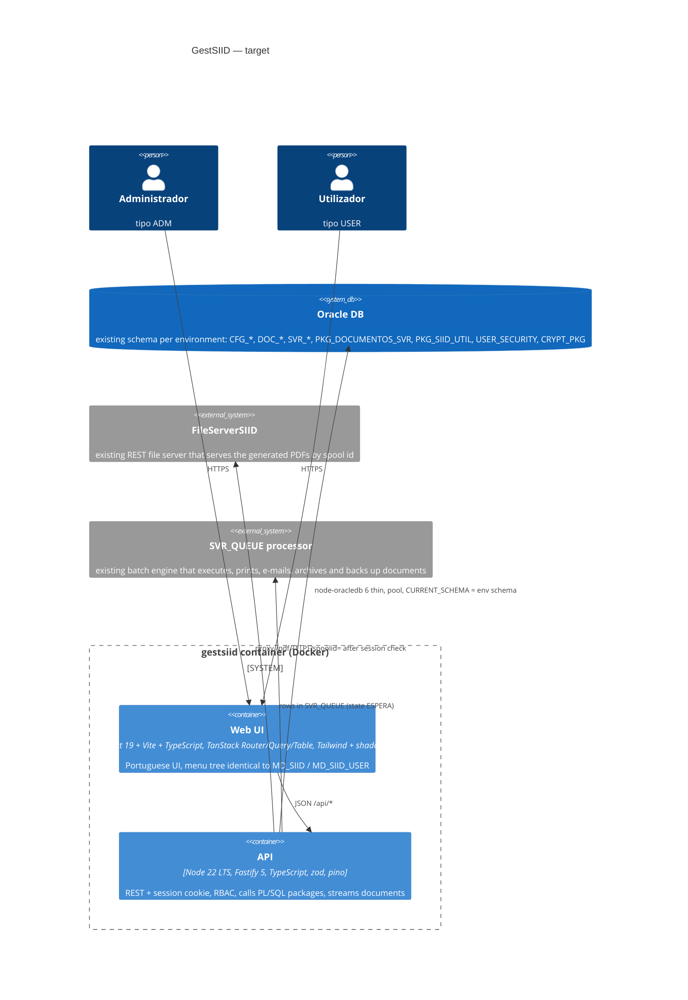
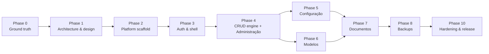

# GestSIID → Node.js: Master Plan

Built 2026-09-14 from the string dumps of the Oracle Forms 12c sources in `dev/T` (latest) and `dev/P` (production).
Inputs: `analysis/STRUCTURE.md`, `analysis/BUSINESS_RULES.md`, `analysis/SECURITY_FINDINGS.md`, `analysis/ASSESSMENT.md`,
`analysis/forms-summary/**` (per-form inventories and PL/SQL text), `analysis/forms-xml/**` (Forms2XML dump of every module: the
authoritative source for item properties, LOVs, alerts, menus, canvases), `dev/P/*.err` (trigger inventories), `CLAUDE.md`.

## ⛔ HARD RULE — NO CHANGES TO THE ORACLE DATABASE

Claude, tests and scripts are **NOT permitted to change the Oracle database** (owner's order, 2026-09-22).
- No INSERT, UPDATE, DELETE, MERGE, DDL, PL/SQL block, write-package call, `SELECT ... FOR UPDATE`, or COMMIT — not even on `ZZTEST_` rows, not in a rolled-back transaction, not "restored afterwards", not to repair an earlier mistake.
- Contract tests reach Oracle only through `app/apps/api/src/test/read-only-db.ts` (`readOnlyPool`). Write paths are tested with fakes only.
- Reading (plain SELECT) is allowed. If a task seems to need a DB change: stop and ask the owner. Give them the SQL; do not run it.
- Full rule: `analysis/TEST_STRATEGY.md` (top).

## 0. How to use this plan

- Run the steps in order. Each step is one Claude Code session started in `I:\GestSIID12c`. Use `/clear` between steps.
- Set the model and effort shown in the step header (`/model`), then paste the **Prompt** block as-is.
- Every prompt names the skills to invoke (`/skill`) and the agents to spawn. Skills are invoked with the `Skill` tool, agents with the `Agent` tool.
- A step is finished only when its **Done when** line is true. Commit after each step (Step 0.1 creates the git repo).
- Models: `sonnet` for well-bounded work, `opus` for design and complex logic, `fable` for the one very large logic step. If a `sonnet` step stalls, re-run it on `opus` with the same prompt.
- Effort values are Claude Code effort levels: `low`, `medium`, `high`, `xhigh`.
- Prompts are written in English; the application UI stays in Portuguese (same labels as the forms).

## 1. Objective

Replace the Oracle Forms 12c application GestSIID (21 forms, 2 menus, WebUtil, Java beans, browser applet) with a
Node.js web application that runs in a Docker container, keeps the Oracle database and its PL/SQL packages as the
system of record, and preserves every concept and function of the forms: document management and its operations,
backups, printers, templates (modelos), permissions, administration tables, two roles (admin / user).

Why now: Forms needs a Java applet/WebStart client, WebUtil 1.0.6 and hardcoded credentials inside the forms; none of
that can be containerized or secured.

## 2. Target architecture (summary; the full ADR is written in Step 1.1)



| Legacy component | Target component |
|---|---|
| Forms runtime + Java applet + WebUtil | Browser SPA served by the same container |
| `FD_LOGIN_SIID`, `:GLOBAL.*`, `P_USERNAME` | `POST /api/auth/login`, server session cookie carrying username, role, ambiente |
| `FD_GESTAO` / `FD_GESTAO_USER` + `MD_SIID*` menus | App shell + route tree filtered by role |
| Data blocks, KEY-ENTQRY / KEY-EXEQRY (query by example), ORDENAR_POR | Reusable `DataBlock` grid (filter row, server-side sort/paging, multi-select, master-detail, inline edit) over `GET /api/<resource>?filter&sort&page` |
| Triggers / program units inside forms | Fastify services (TypeScript) with unit tests |
| DB packages (`PKG_DOCUMENTOS_SVR`, `PCK_SG`, ...) | Unchanged; called through `connection.execute("BEGIN pkg.proc(:a); END;")` |
| `CREATE_SYNONYMS(P_AMBIENTE)` | `ALTER SESSION SET CURRENT_SCHEMA` in the pool session callback, schema from `.env` |
| `WEB.SHOW_DOCUMENT` → FileServerSIID URL | `GET /api/documentos/:id/pdf` proxies `FILESERVER_URL/pdf/{T|P}?spoolid=` after the session/permission check |
| Document actions = `INSERT INTO SVR_QUEUE` + `ERR_ERROS_SIID` audit row (regerar, reimprimir, 2ª via, cópia, reenviar, e-mail, rearquivar, TOXML, backup) | Same inserts done by API services in one transaction; the external queue processor keeps doing the work |
| `HOST`, `TEXT_IO`, `WIN_API`, `ShowDoc.jar` (all dead code) | Not ported |
| WebUtil `CLIENT_TO_DB` (section signature image) | Multipart upload to `DOC_SECCOES_DOCUMENTO.IMAGEM` BLOB |
| `FD_GESTORES_SIID` `GRANT/REVOKE` DDL to DB accounts | Decision D-11: keep as an audited admin action with validated identifiers, or drop |
| `SHOW_ALERT`, `MESSAGE` | Dialog / toast components with the same Portuguese texts |
| Oracle Reports `MEDIAS_DOCUMENTOS` (disabled in menu) | Optional dashboard page (Phase 9) |

Repository layout produced by the plan:

```
I:\GestSIID12c\
  app\                      # the new application (pnpm workspace)
    apps\api\               # Fastify API
    apps\web\               # React SPA
    packages\shared\        # zod schemas + TS types shared by both
    Dockerfile  docker-compose.yml  .env.example
  analysis\                 # everything this plan was built from (keep)
  dev\ prod\ testes\        # legacy Forms sources/binaries (frozen, reference only)
```

## 3. Phase sequence



| Phase | Scope | Size | Risk |
|---|---|---|---|
| 0 Ground truth | git, secrets, live DB discovery, decisions | S | Low |
| 1 Architecture & design | ADR, UI design system, DataBlock spec, test strategy | M | Medium |
| 2 Platform scaffold | monorepo, API, web, DataBlock component, Docker, CI | M | Medium |
| 3 Auth & shell | login, session, RBAC, password change, menu shell | M | High (auth compatibility) |
| 4 CRUD engine + Administração | Domínios, Unidades Medida, Tipos Mídia, Utilizadores, Variáveis SIID, Gestores, Impressoras | M | Low |
| 5 Configuração | Reports params, Permissões, Impressoras associadas (documento / utilizador), Perfis departamento | L | Medium |
| 6 Modelos | template master-detail, sections, conditions, parameters, attributes, uploads | L | High (WebUtil replacement) |
| 7 Documentos | main document management, queue, comments, attachments, all operations, admin vs user | XL | High |
| 8 Backups | Novo backup, Backups online | M | Medium |
| 9 Auditoria | removed (D-06) | — | — |
| 10 Hardening & release | security, QA, design review, docs, deployment, parallel run, cutover | M | Medium |

Phase 4 is the pilot: it takes one simple form (Impressoras) all the way through API, UI, tests and Docker. What the pilot
reveals is expected to change the later phases; regenerating this plan after the pilot is normal.

---

## Phase 0 — Ground truth

### Step 0.1 — Git repository and secrets hygiene

| Model | Effort | Skills | Agents |
|---|---|---|---|
| sonnet | low | `careful` | none |

**Inputs:** `.gitignore`, `.env.example`, `analysis/SECURITY_FINDINGS.md`.
**Done when:** `git status` shows no `.bat`, no `analysis/forms-extracted`, no `analysis/forms-summary`, no `.env`; first commit exists.

```text
Invoke the `careful` skill first (destructive-command guard).
Context: I:\GestSIID12c holds an Oracle Forms 12c app (read CLAUDE.md) that will be rewritten in Node.js. There is no VCS yet. A .gitignore and .env.example already exist at the repo root.
Do:
1. Run `git init` on I:\GestSIID12c (default branch main). Do NOT delete or move any existing file.
2. Verify with `git check-ignore -v` that these are ignored: dev/T/compile_testes.bat, dev/P/compile_producao.bat, analysis/forms-extracted/T/FD_LOGIN_SIID.fmb.txt, analysis/forms-summary/T/FD_LOGIN_SIID.fmb.plsql.txt, .env. If any is not ignored, fix .gitignore.
3. Grep the files that WILL be committed for the strings "userid=" and "v_password" and any IP address; none may appear in tracked files except masked ("***"). Report any hit and stop if found.
4. Check analysis/README.md is accurate (it lists every artifact and how to regenerate the local-only dumps); fix it if something moved.
5. Commit everything that is not ignored with message "chore: baseline of legacy Forms sources and analysis".
6. Print a reminder for the human: the Oracle accounts whose passwords appear in dev/*/compile_*.bat and inside FD_LOGIN_SIID must be rotated by the DBA before the new app goes live (see analysis/SECURITY_FINDINGS.md).
Do not echo any credential value in your output.
```

### Step 0.2 — Live database discovery

| Model | Effort | Skills | Agents |
|---|---|---|---|
| sonnet | medium | `context7-mcp` (node-oracledb) | none |

**Inputs:** `analysis/STRUCTURE.md` §4 (table + package inventory), `.env.example`.
**Done when:** `analysis/db/` contains the schema dump and `analysis/db/DB_FACTS.md` states DB version, character set, whether every package/table exists, and which node-oracledb mode is required.
**Note:** the Oracle listeners were not reachable from the analysis machine on 2026-09-14. Run this step on a host that can reach the test database (TNS alias `cosec`), with `.env` filled in.

```text
Use the `context7-mcp` skill to fetch current node-oracledb docs (thin mode, createPool, fetching CLOB/BLOB, querying ALL_SOURCE) before writing code.
Context: read CLAUDE.md, .env.example and analysis/STRUCTURE.md section "Database inventory". The Forms app's business logic lives in Oracle packages that are NOT in this repo; the new Node.js app must call them, so we need their exact signatures and the exact table shapes.
Build tools/db-discovery/ (plain Node 22 + node-oracledb 6, TypeScript optional, no other deps) with one script `npm run discover` that reads .env (DB_USER, DB_PASSWORD, DB_CONNECT_STRING, DB_SCHEMA) and writes, under analysis/db/:
1. DB_FACTS.md — banner version, NLS_CHARACTERSET, NLS_NCHAR_CHARACTERSET, DB time zone, the connect mode used (thin works for Oracle 12.1+; if the DB is older, say thick mode + Instant Client is required and stop the other steps from assuming thin).
2. tables/<TABLE>.md — for every table and view named in STRUCTURE.md §4 plus every object that DB_SCHEMA owns whose name starts with CFG_, DOC_, SVR_, ERR_, GD_: columns (name, type, length/precision, nullable, default, comment), primary/unique/foreign keys, indexes, row count, and for lookup-type tables (CFG_VALORES_DOMINIO, CFG_TIPOS_MIDIA, CFG_UNIDADES_MEDIDA, SVR_VARIAVEIS_SIID, SVR_AMBIENTES_IMPRESSAO) the first 200 rows as a markdown table. Views: include the view SQL text.
3. packages/<PACKAGE>.sql — full spec source from ALL_SOURCE for PKG_DOCUMENTOS_SVR, PCK_SG, PKG_SIID_UTIL, PKG_FICHIERS, PKG_TRANSFERTS, PCK_ERRGE, USER_SECURITY and any other package/procedure/function DB_SCHEMA owns; body source too if the account can read it. Also list which of these objects are missing.
4. sequences.md, synonyms.md (public + private synonyms visible to DB_USER, so we learn which schema really owns each object), grants.md (what DB_USER can do on each object).
5. Do not print or store the password anywhere except .env. Use bind variables only. Output must be deterministic (sorted) so it can be diffed later.
Run it, check the outputs, and summarize in DB_FACTS.md any surprise (object missing, column type different from what the forms assume, USER_SECURITY.ENCRYPT signature).
```

### Step 0.3 — Decisions the code cannot make

| Model | Effort | Skills | Agents |
|---|---|---|---|
| opus | medium | `superpowers:brainstorming` | none |

**Inputs:** `analysis/STRUCTURE.md` §2 and §7, `analysis/BUSINESS_RULES.md` "Open questions", `analysis/SECURITY_FINDINGS.md`, `analysis/db/DB_FACTS.md`.
**Done when:** `analysis/DECISIONS.md` exists with one dated, answered entry per open question below; every later prompt treats it as binding.

```text
Invoke `superpowers:brainstorming`. Read analysis/STRUCTURE.md (sections 2, 6, 7), analysis/BUSINESS_RULES.md (section "Open questions"), analysis/SECURITY_FINDINGS.md (section "Requirements for the Node.js rewrite") and analysis/db/DB_FACTS.md.
Ask me, one at a time with AskUserQuestion, and record the answers in analysis/DECISIONS.md (format: D-nn, question, options considered, decision, date, consequences):
D-01 Which source set is the truth for the rewrite: dev/T (newer, larger) or dev/P (deployed)? And are FD_GESTAO_SIID_v2 and FD_CONFIGURACAO_MODELOS_old drafts to be ignored?
D-02 Environment model: the login screen has an environment list, but the Forms2XML dump shows it is static with ONE real entry per build (T build: GADOR_TESTES; P build: COSEC), and the form then created synonyms to <AMBIENTE>.<object>. Recommend: one container per environment, DB_SCHEMA and AMBIENTE_ID fixed in .env, the login page shows the environment as a label (this mirrors what the forms actually did). Alternative: environment selector at login with one pool per environment.
D-03 Document viewer: PDFs come from the FileServerSIID REST service (STRUCTURE.md §3.3, SECURITY_FINDINGS SEC-010). Confirm its URL per environment, whether it needs a credential, whether it can be put behind TLS, and that the API may proxy it (recommended) instead of sending the browser there.
D-04 HOST / CLIENT_HOST / TEXT_IO / WIN_API usages are all inside comments (dead code) per STRUCTURE.md §7 and SEC-011. Confirm they are NOT to be ported. The physical work (print, e-mail, archive, backup copy) is done by the external SVR_QUEUE processor; confirm that processor keeps running unchanged.
D-05 E-mail (REENVIAR_EMAIL) is a queue row of type EMAIL with ATRIBUTO01 = address, executed by the queue processor — confirm; then the app needs no SMTP settings.
D-06 Reports: MEDIAS_DOCUMENTOS (Oracle Reports) is a no-op in the menu — rebuild as a page, or drop?
D-07 Auth: keep CFG_UTILIZADORES + USER_SECURITY.ENCRYPT as the credential store (zero-migration cutover; SEC-005 says the hash is weak, so schedule a re-hash later) or force a reset onto Argon2id at cutover? Enforce DATA_INICIO/DATA_FIM at login (SEC-006)? Session lifetime? Note: "Alterar password" in the menu changes the shared DOCUMENT-REGENERATION password (SVR_VARIAVEIS_SIID, CRYPT_PKG.ENCRYPTSTRINGRAW), not the user's own password — keep it as-is (ADM only, recommended) or replace it with a per-user "may regenerate" permission (SEC-008)?
D-08 USER role: STRUCTURE.md §1 lists exactly what FD_GESTAO_SIID_USER lacks (all action buttons, extended details, comment insert), and the Forms2XML dump shows MD_SIID_USER disables Gador, Configuração, Administração, Auditoria and Backups (so USER sees only Documentos, Impressoras Associadas and Alterar password). Confirm these are the intended restrictions; the new app enforces them server-side.
D-09 Deployment target: Docker host / Compose only, or Kubernetes later? Reverse proxy and TLS termination available? Domain name?
D-10 Parallel run: will Forms stay available during UAT so results can be compared side by side?
D-11 Gestores (FD_GESTORES_SIID) grants DB privileges to Oracle accounts (SEC-007). With the Node app using one service account, is this screen still needed? Options: keep as an audited ADM action with DBMS_ASSERT-validated identifiers, or drop it and let the DBA manage grants.
D-12 Hardcoded super-user 'AFREITAS' in CANCELAR (STRUCTURE.md §3.3): replace by a role/permission or drop?
D-13 Tablespace gauge (hourly timer, GD_ESPACO_BD): keep as a small widget on the Documentos page, or drop?
Then walk the 16 open questions OQ-1..OQ-16 in analysis/BUSINESS_RULES.md section 4: answer the ones the schema dump (analysis/db/) settles, ask me the ones that need a business answer (OQ-2, OQ-9, OQ-14, OQ-15, OQ-16), and record each as D-14 onwards.
Also record the recommended defaults for anything I answer "you decide". Finish by listing which later steps of analysis/MASTER_PLAN.md are affected by each decision.
```

### Step 0.4 — Refresh the analysis from the Forms2XML dump

| Model | Effort | Skills | Agents |
|---|---|---|---|
| sonnet | medium | none | `code-modernization:legacy-analyst` (optional, for the diff pass) |

**Inputs:** `analysis/forms-xml/T/*_fmb.xml`, `*_mmb.xml` (produced by `pwsh -NoProfile -File analysis\tools\forms2xml.ps1`; see CLAUDE.md "Oracle Forms tools"), `analysis/STRUCTURE.md`, `analysis/BUSINESS_RULES.md`.
**Done when:** `analysis/forms-xml/summary/<module>.md` exists for every module; STRUCTURE.md §3 sheets carry item data types, lengths, formats, required flags, LOV bindings, list values, prompts, canvas/tab order and hidden items taken from the XML; BUSINESS_RULES.md open questions OQ-2 (menu item roles/visibility) and OQ-13 (missing alert texts) are answered or marked "not in XML".

```text
If analysis/forms-xml/T/ is empty, run: pwsh -NoProfile -File analysis\tools\forms2xml.ps1 (Oracle home at I:\Middleware\Oracle_Home, see CLAUDE.md). The XML is the authoritative view of each Forms module; the string dumps in analysis/forms-summary were a fallback.
Write analysis/tools/xml-inventory.js (plain Node 22, no dependencies; a small regex/state-machine XML reader is fine, or use the built-in DOMParser via `node:` if available) that reads every *_fmb.xml and *_mmb.xml in analysis/forms-xml/T and writes analysis/forms-xml/summary/<module>.md with:
1. Blocks in order: name, base table / query data source, WHERE / ORDER BY, records displayed, insert/update/delete allowed; for each item: name, item type, data type, max length, format mask, required, enabled, visible, canvas + tab page, x/y (for field order), prompt/label, LOV name, list elements (label/value), radio values, default value, hint.
2. Alerts: name, title, message text, button labels, style.
3. LOVs and record groups: name, query text, column mapping to items.
4. Triggers: owner (form / block / item), name, and the first 2 lines of text (full text stays in the XML).
5. Program units: name and type. Parameters, globals used, attached libraries, visual attributes used for row colouring.
6. For menus: the tree with item label, command text (OPEN_FORM target), visible, enabled, and any menu item roles.
Never print credential values (mask anything matching v_password := '...' or LOGON('...', '...@').
Then, module by module, update analysis/STRUCTURE.md §3 (item tables, canvases, LOV bindings, alert texts) and analysis/BUSINESS_RULES.md (fill the message texts marked "not in dump", answer OQ-2 and OQ-13, correct any rule the XML contradicts) with a "source: forms-xml" marker on every changed line. Optionally spawn `code-modernization:legacy-analyst` to diff the XML-derived facts against the current STRUCTURE.md and list contradictions before you edit. Finish with a short "What the XML changed" section at the end of STRUCTURE.md.
```

---

## Phase 1 — Architecture & design

### Step 1.1 — Architecture decision record

| Model | Effort | Skills | Agents |
|---|---|---|---|
| opus | high | `superpowers:brainstorming`, `superpowers:writing-plans`, `diagram`, `context7-mcp` | `feature-dev:code-architect`, `code-modernization:architecture-critic` |

**Inputs:** `analysis/STRUCTURE.md`, `analysis/BUSINESS_RULES.md`, `analysis/SECURITY_FINDINGS.md`, `analysis/DECISIONS.md`, `analysis/db/`.
**Done when:** `analysis/ARCHITECTURE.md` is written, reviewed by the architecture-critic agent, and its "Open points" list is empty or accepted.

```text
Invoke `superpowers:brainstorming` then `superpowers:writing-plans`. Read analysis/STRUCTURE.md, analysis/BUSINESS_RULES.md, analysis/SECURITY_FINDINGS.md, analysis/DECISIONS.md, analysis/db/DB_FACTS.md and analysis/MASTER_PLAN.md section 2.
Goal: write analysis/ARCHITECTURE.md, the binding architecture for the Node.js rewrite of GestSIID. Use the `context7-mcp` skill to verify current APIs for Fastify 5, node-oracledb 6, TanStack Router/Query/Table, Vite and Vitest before fixing versions.
Spawn `feature-dev:code-architect` to draft, then `code-modernization:architecture-critic` to attack the draft for over-engineering and missed requirements; fold the critique in.
The document must fix:
1. Stack and versions: Node 22 LTS, TypeScript strict, pnpm workspace (apps/api, apps/web, packages/shared), Fastify 5 + @fastify/cookie + @fastify/session (or @fastify/secure-session) + @fastify/multipart + @fastify/static + @fastify/swagger, zod, pino, node-oracledb 6 (thin unless DB_FACTS.md says thick), React 19 + Vite + TanStack Router/Query/Table + Tailwind + shadcn/ui + react-hook-form, Vitest, Playwright. Justify each in one line; reject anything not needed.
2. Runtime topology: ONE container serving the API and the built SPA; env config via .env (list every variable, matching .env.example, add what is missing); health endpoint; graceful shutdown closes the pool.
3. Database access layer: pool with sessionCallback running ALTER SESSION SET CURRENT_SCHEMA = DB_SCHEMA and NLS settings; bind variables only; helper to call PL/SQL procedures with IN/OUT binds; LOB streaming; transaction helper; how ORA errors are mapped to HTTP errors and to the Portuguese messages in BUSINESS_RULES.md; how the app-level user (CFG_UTILIZADORES.USERNAME) is passed to packages that expect it.
4. Query-by-example contract: `GET /api/<block>?f[col]=value&sort=col:asc&page=1&size=50` with a server-side allow-list of filterable/sortable columns per resource, operators (=, like, between for dates), and total count; how master-detail is expressed (detail resource filtered by master key).
5. Auth & RBAC: login validated against CFG_UTILIZADORES with USER_SECURITY.ENCRYPT (per DECISIONS D-07); session cookie (httpOnly, SameSite=Lax, Secure behind TLS); roles ADM/USER; server-side route guards; audit log table or pino audit stream (per SECURITY_FINDINGS).
6. Files: streaming endpoint over DOCS_ROOT with path allow-listing and no traversal; uploads to BLOB via multipart; size limits.
7. Long-running or repeating work: what the Forms timer (WHEN-TIMER-EXPIRED) refreshed and how the SPA does it (polling interval or SSE); any HOST command replacement from DECISIONS D-04.
8. Project conventions: folder layout per feature (route, schema, service, repository, tests), error format, i18n (Portuguese strings in one module), logging fields, commit style.
9. Folder-by-folder skeleton listing and a C4 container + component Mermaid diagram (use the `diagram` skill to render analysis/architecture.mmd to SVG).
10. A "Legacy → target mapping" table listing each of the 21 forms and the API resources + SPA routes that replace it.
End with "Open points" (things still undecided) — aim for zero.
```

### Step 1.2 — UI design system and app shell specification

| Model | Effort | Skills | Agents |
|---|---|---|---|
| opus | medium | `ui-ux-pro-max:design-system`, `frontend-design:frontend-design`, `gsd-ui-phase` | `gsd-ui-researcher` |

**Inputs:** `analysis/STRUCTURE.md` §3 (per-form sheets: blocks, items, labels), menu tree in `analysis/STRUCTURE.md` §2, `analysis/ARCHITECTURE.md`.
**Done when:** `analysis/UI_SPEC.md` and `app/design-tokens.json` exist and the DataBlock component behaviour is fully specified.

```text
Invoke `ui-ux-pro-max:design-system` and `frontend-design:frontend-design`, then `gsd-ui-phase` (spawn `gsd-ui-researcher`) to produce analysis/UI_SPEC.md — the design contract for the GestSIID web UI. Read analysis/STRUCTURE.md sections 2 and 3 first: every screen, block, item, label and message of the Forms app is listed there and the new UI must keep the same Portuguese labels and the same menu tree (Gestão / Gador / Configuração / Administração / Auditoria).
Audience: back-office operators who work all day in dense data grids and keyboard navigation; the Forms app was an MDI desktop-style UI. Design a professional, calm, data-dense enterprise look (not a marketing site): light theme default, dark theme supported, 13–14px base font in grids, clear focus rings, high-contrast status colours for document states.
Specify:
1. Design tokens (colour, type scale, spacing, radius, elevation, density) as app/design-tokens.json plus the Tailwind/shadcn mapping.
2. App shell: top bar (environment label, user, role, logout), left navigation with the exact menu tree per role, breadcrumb, content area, global toast + modal dialog conventions replacing SHOW_ALERT/MESSAGE (list the alert texts from BUSINESS_RULES.md that must be reproduced).
3. The DataBlock pattern (replacement for a Forms multi-record block): filter row (query-by-example), column-header sort (ORDENAR_POR), server-side paging, row multi-select with "seleccionar todos", master/detail layouts (stacked and side-by-side), inline edit vs. side panel edit, dirty-state bar with Guardar/Cancelar (COMMIT_FORM / rollback), record counter, empty/loading/error states, keyboard map (Enter to query, Esc to cancel, arrows, Ctrl+S).
4. Per-screen wireframes in text/ASCII for: Login, Documentos (list + detail tabs: parâmetros, comentários, anexos, fila/queue, erros), Modelos (master with sections/conditions/parameters/attributes tabs), Permissões (the two-sided add/remove lists), Novo backup wizard, Backups online, one generic single-table CRUD screen (Impressoras) that all maintenance screens reuse, and one master-detail screen (Domínios).
5. Accessibility: WCAG AA contrast, full keyboard operation, aria for grids and dialogs.
6. Component inventory mapped to shadcn/ui primitives and what must be custom (DataBlock, LOV picker = searchable select dialog, date range filter).
Write it so a developer can build without asking questions.
```

### Step 1.3 — Test and parity strategy

| Model | Effort | Skills | Agents |
|---|---|---|---|
| sonnet | medium | `superpowers:test-driven-development` | `code-modernization:test-engineer` |

**Inputs:** `analysis/BUSINESS_RULES.md`, `analysis/ARCHITECTURE.md`, `analysis/DECISIONS.md` (D-10).
**Done when:** `analysis/TEST_STRATEGY.md` exists with a parity checklist per form and the fixture plan for the test schema.

```text
Invoke `superpowers:test-driven-development` and spawn `code-modernization:test-engineer`. Read analysis/BUSINESS_RULES.md, analysis/ARCHITECTURE.md and analysis/DECISIONS.md.
Write analysis/TEST_STRATEGY.md:
1. Layers: unit (Vitest, services with a mocked db helper), API contract tests (Vitest + fastify.inject against the TEST Oracle schema, read-only by default, write tests wrapped in a transaction that is rolled back), UI component tests (Vitest + Testing Library for DataBlock), end-to-end (Playwright against the Docker image and the test schema), manual parity UAT next to the Forms app (per D-10).
2. Characterization approach: the legacy Forms cannot be executed here, so equivalence is trace-based — for each form, a table of "query the form runs" (copy the SQL from analysis/forms-summary/T/<form>.plsql.txt) → "API endpoint that must return the same rows for the same filters", to be asserted against the test schema.
3. Parity checklist per form: one checkbox per business rule ID in BUSINESS_RULES.md, grouped by the phase of analysis/MASTER_PLAN.md that delivers it; mark the P0 rules (money/data-integrity/state transitions of documents, permissions, authentication) that block a phase from shipping.
4. Test data: which existing rows in the test schema are safe to use, which must be created by the tests, naming convention (prefix ZZTEST_) and cleanup.
5. CI gates: lint, typecheck, unit, contract (only when DB_CONNECT_STRING is set), build image, Playwright smoke.
Keep it practical; no test pyramid essays.
```

---

## Phase 2 — Platform scaffold

### Step 2.1 — Monorepo and API skeleton

| Model | Effort | Skills | Agents |
|---|---|---|---|
| sonnet | medium | `context7-mcp`, `superpowers:test-driven-development`, `ponytail:ponytail` | `code-modernization:scaffolder` |

**Inputs:** `analysis/ARCHITECTURE.md`, `.env.example`, `analysis/db/DB_FACTS.md`.
**Done when:** `pnpm -r test` and `pnpm -r typecheck` pass; `GET /api/health` returns DB round-trip status; the pool sets CURRENT_SCHEMA.

```text
Invoke `ponytail:ponytail` (keep it minimal) and `superpowers:test-driven-development`; use `context7-mcp` for Fastify 5 and node-oracledb 6 APIs. Read analysis/ARCHITECTURE.md and follow it exactly (versions, folders, conventions).
Spawn `code-modernization:scaffolder` for the skeleton, then finish it yourself.
Create app/ as a pnpm workspace with apps/api, apps/web (empty placeholder for Step 2.2), packages/shared. In apps/api build:
1. src/config.ts — zod-validated env loader (every variable in .env.example; fail fast with a readable message).
2. src/db/ — pool factory (node-oracledb thin unless DB_FACTS.md says thick), sessionCallback with ALTER SESSION SET CURRENT_SCHEMA and NLS_DATE_FORMAT, helpers: query<T>(sql, binds), execute(sql, binds), callProc(name, binds with OUT), withTransaction(fn), streamLob. Unit-test the helpers with a fake connection.
3. src/plugins/ — cookie+session, error handler (maps zod errors → 400, ORA-xxxx → 409/500 with a message key, everything logged with pino incl. request id), swagger at /api/docs, static serving of apps/web/dist at / with SPA fallback.
4. src/routes/health.ts — GET /api/health { ok, db: { ok, latencyMs, schema } }.
5. src/i18n/pt.ts — message catalogue module (empty for now, one example).
6. Scripts: dev (tsx watch), build, start, test, typecheck, lint (eslint + prettier). Root scripts run all packages.
7. packages/shared: zod schema for the QBE list query (filter/sort/page/size) and the paged response envelope { rows, total, page, size }.
Everything must run with `pnpm i && pnpm -r test` without a database; the DB integration test is skipped unless DB_CONNECT_STRING is set. Add app/README.md with the run instructions.
```

### Step 2.2 — Web skeleton and app shell

| Model | Effort | Skills | Agents |
|---|---|---|---|
| sonnet | medium | `frontend-design:frontend-design`, `context7-mcp` | none |

**Inputs:** `analysis/UI_SPEC.md`, `app/design-tokens.json`, `analysis/ARCHITECTURE.md`.
**Done when:** `pnpm --filter web build` succeeds, the shell renders the full menu tree per role from a static config, and the API client is typed from `packages/shared`.

```text
Invoke `frontend-design:frontend-design`; use `context7-mcp` for Vite, TanStack Router and TanStack Query current APIs. Read analysis/UI_SPEC.md, app/design-tokens.json and analysis/ARCHITECTURE.md.
In app/apps/web create the React 19 + Vite + TypeScript SPA:
1. Tailwind + shadcn/ui initialised from the design tokens (light/dark).
2. TanStack Router file-based routes: /login, / (shell), and a placeholder route per menu leaf using the exact Portuguese labels and tree from UI_SPEC (Gestão → Documentos, Backups → Novo / Backups Online; Gador → Gestores, Equipa de Gestão (OD68); Configuração → Reports, Modelos, Permissões, Impressoras, Impressoras Associadas → Documento / Utilizador, Alterar password; Administração → Domínios, Unidades Medida, Tipos Mídia, Utilizadores, Variáveis SIID; Auditoria → Médias Execução). Menu config is one typed array with a `roles` field.
3. App shell per UI_SPEC: top bar (environment, user, role, logout), collapsible left nav, breadcrumb, content outlet, toast provider, confirm dialog provider (Portuguese buttons: Sim / Não / OK / Cancelar).
4. src/api/client.ts — fetch wrapper with credentials, JSON errors mapped to toasts, typed with packages/shared; TanStack Query provider.
5. Vitest + Testing Library smoke test for the shell and menu filtering by role.
Do not build real screens yet. Keep components small and boring.
```

### Step 2.3 — Docker image, compose and CI

| Model | Effort | Skills | Agents |
|---|---|---|---|
| sonnet | medium | `context7-mcp` | none |

**Inputs:** `analysis/ARCHITECTURE.md`, `analysis/db/DB_FACTS.md`, `.env.example`.
**Done when:** `docker compose up` serves the shell at http://localhost:3000 and `/api/health` reports the DB (when reachable); CI workflow runs lint, typecheck, unit tests and image build.

```text
Use `context7-mcp` for node-oracledb container notes (thin mode needs no Instant Client; if analysis/db/DB_FACTS.md says thick mode, add Instant Client to the image) and for pnpm deploy in Docker.
Create in app/: 
1. Dockerfile — multi-stage: deps (pnpm fetch), build (web + api), runtime on node:22-alpine (or node:22-bookworm-slim when thick mode), non-root user, only production deps, HEALTHCHECK hitting /api/health, EXPOSE 3000, `node apps/api/dist/server.js`.
2. docker-compose.yml — service gestsiid with env_file: .env, port mapping, volume for DOCS_ROOT, restart policy, logging options; a commented example of a second service for another environment (different DB_SCHEMA / AMBIENTE_ID).
3. .dockerignore.
4. CI (.github/workflows/ci.yml, and mention the GitLab equivalent in a comment): install, lint, typecheck, unit tests, build image; contract tests only when the secret DB_CONNECT_STRING is present.
5. app/DEPLOY.md — how to build, configure .env, run, upgrade, roll back, read logs.
Do not bake any credential into the image; verify with `docker history`.
```

### Step 2.4 — DataBlock: the reusable Forms-block replacement

| Model | Effort | Skills | Agents |
|---|---|---|---|
| opus | high | `frontend-design:frontend-design`, `ui-ux-pro-max:ui-styling`, `superpowers:test-driven-development` | `feature-dev:code-architect` |

**Inputs:** `analysis/UI_SPEC.md` §3 (DataBlock), `analysis/ARCHITECTURE.md` §4 (QBE contract), `packages/shared` list-query schema.
**Done when:** a Storybook-free demo route `/dev/datablock` shows a DataBlock over a mock resource with filtering, sorting, paging, multi-select, inline edit and dirty-state save/cancel; component tests pass; the server-side `listQuery` helper builds safe SQL from the QBE contract with an allow-list and is unit-tested.

```text
Invoke `superpowers:test-driven-development`, `frontend-design:frontend-design` and `ui-ux-pro-max:ui-styling`. Spawn `feature-dev:code-architect` to design the component API first, then implement. Read analysis/UI_SPEC.md (DataBlock section) and analysis/ARCHITECTURE.md (QBE contract).
Build the two halves of the generic block engine that every screen of the app reuses:
A) apps/api/src/lib/listQuery.ts — given a resource definition { table/view, columns: { name, type, filterable, sortable, editable }, defaultSort }, and a parsed list query from packages/shared, produce parameterized SQL (Oracle 12c+ OFFSET/FETCH) with WHERE built only from allow-listed columns, LIKE for text (case-insensitive, escape %), = for numbers/codes, BETWEEN for dates, IN for multi; plus a count query. Unit tests must prove no injection is possible (column names never come from input; values are binds). Provide crudRoutes(resource) that registers GET list, GET one, POST, PUT, DELETE with zod schemas generated from the resource definition, optional hooks (beforeInsert/beforeUpdate for audit columns like CRIADO_POR/DATA_CRIACAO, ACTUALIZADO_POR/DATA_ACTUALIZACAO), and role guards.
B) apps/web/src/components/datablock/ — DataBlock<T> over TanStack Table + TanStack Query: filter row (QBE) with per-column input types (text, number, date range, select from a domain), header sort, server paging, row selection with select-all, master/detail helper (useDetailBlock(masterKey)), edit modes (inline row edit and side-panel form via react-hook-form + zod), dirty-state bar (Guardar / Cancelar, confirm on navigation away = the Forms "Deseja gravar as alterações?" behaviour), status line with record count, loading/empty/error states, keyboard map from UI_SPEC. Column definitions are typed and shared with the API resource definition through packages/shared.
Ship a /dev/datablock demo route wired to a mock resource served by the API (in-memory) so the whole loop can be tested without Oracle. Playwright smoke test for the demo.
```

---

## Phase 3 — Authentication and shell

### Step 3.1 — Login, session, roles, password change (API)

| Model | Effort | Skills | Agents |
|---|---|---|---|
| opus | high | `superpowers:test-driven-development`, `security-review`, `context7-mcp` | `code-modernization:security-auditor` |

**Inputs:** `analysis/BUSINESS_RULES.md` (Authentication, password change), `analysis/SECURITY_FINDINGS.md`, `analysis/DECISIONS.md` D-02/D-07, `analysis/db/packages/USER_SECURITY.sql`, `analysis/forms-summary/T/FD_LOGIN_SIID.fmb.plsql.txt`, `analysis/forms-summary/T/FD_ALTERAR_PASSWORD.fmb.plsql.txt`.
**Done when:** contract tests prove: valid user → session with role; wrong password → 401 with the exact Portuguese alert text; ADM/USER role derived from CFG_UTILIZADORES.TIPO_UTILIZADOR_RF; password change follows the FD_ALTERAR_PASSWORD rules; `/security-review` reports no high finding.

```text
Invoke `superpowers:test-driven-development`. Read analysis/BUSINESS_RULES.md (sections Authentication & environment, password change), analysis/SECURITY_FINDINGS.md, analysis/DECISIONS.md (D-02, D-07), analysis/db/packages/USER_SECURITY.sql and the two PL/SQL dumps analysis/forms-summary/T/FD_LOGIN_SIID.fmb.plsql.txt and FD_ALTERAR_PASSWORD.fmb.plsql.txt.
Implement in apps/api:
1. POST /api/auth/login { utilizador, password } → looks up CFG_UTILIZADORES by USERNAME and AMBIENTE_ID (from config), compares USER_SECURITY.ENCRYPT(:password) computed in the DB with the stored PASSWORD, exactly like the form; on success creates the session { username, role: TIPO_UTILIZADOR_RF === 'ADM' ? 'ADM' : 'USER', ambiente }, on failure returns 401 with the same message the form showed (alert LOGIN_INVALIDO text from BUSINESS_RULES). Missing fields → 400 with the SEM_UTILIZADOR / SEM_PASSWORD texts. Rate-limit by IP and username.
2. GET /api/auth/me, POST /api/auth/logout.
3. POST /api/auth/regeneracao-password — FD_ALTERAR_PASSWORD does NOT change the user's password: it sets the shared document-regeneration password, i.e. UPDATE SVR_VARIAVEIS_SIID SET VALOR = CRYPT_PKG.ENCRYPTSTRINGRAW(:password) WHERE TIPO_VARIAVEL_RF='PASSWORD' AND AMBIENTE_ID=:ambiente, after checking password = confirmation (alert PASSWORD_ERRADA). Implement it with bind variables, restricted per DECISIONS D-07 (ADM only recommended), audited. Also POST /api/auth/reauth-regeneracao { password } that compares CRYPT_PKG.ENCRYPTSTRINGRAW(:password) with that row and sets a short-lived flag in the session (used by Step 7.2 for the CONFIRMAR_PASSWORD flow).
4. Login must also enforce CFG_UTILIZADORES.DATA_INICIO / DATA_FIM when D-07 says so (SEC-006). requireRole('ADM'|'USER') preHandler + a `currentUser` decorator that services use to fill CRIADO_POR / ACTUALIZADO_POR columns.
5. Audit log: login success/failure, logout, password change → table or pino audit stream per ARCHITECTURE.md.
6. Contract tests (fastify.inject) against the test schema, READ-ONLY through readOnlyPool (HARD RULE: no Oracle changes — no ZZTEST_ rows); a successful login uses an owner-given account (GESTSIID_TEST_USER / GESTSIID_TEST_PASSWORD); unit tests with a fake db for the branches and every write path.
Then run the `security-review` skill on the diff and spawn `code-modernization:security-auditor` to review the auth code; fix findings before finishing.
```

### Step 3.2 — Login page, role-aware shell, password dialog (UI)

| Model | Effort | Skills | Agents |
|---|---|---|---|
| sonnet | medium | `frontend-design:frontend-design` | none |

**Inputs:** `analysis/UI_SPEC.md` (Login wireframe, shell), Step 3.1 endpoints in `app/apps/api/src/features/auth/routes.ts`, `analysis/forms-extracted/T/FD_LOGIN_SIID.fmb.txt` (labels).
**Done when:** Playwright: login as ADM shows the full menu, login as USER hides admin-only entries, wrong password shows the Portuguese alert, "Alterar password" works (three fields; wrong current value and mismatch show their messages), logout returns to /login, deep links redirect to /login when unauthenticated.

```text
Invoke `frontend-design:frontend-design`. Read analysis/UI_SPEC.md (Login and shell), the auth endpoints in app/apps/api/src/features/auth/routes.ts, and grep analysis/forms-extracted/T/FD_LOGIN_SIID.fmb.txt for the item prompts (Utilizador, Password, Ambiente) and alert texts.
HARD RULE: you are NOT permitted to change the Oracle database (see CLAUDE.md and analysis/TEST_STRATEGY.md). This step needs no Oracle at all.
Step 3.1 API (already built, do not change its contract):
- POST /api/auth/login { utilizador, password } → 200 { user: { username, nome, role, ambiente }, csrf }; 400 VALIDACAO with fields.utilizador / fields.password; 401 LOGIN_INVALIDO "Utilizador e/ou password inválidos." (also when throttled).
- GET /api/auth/me → { user, csrf }; 401 SESSAO_EXPIRADA. POST /api/auth/logout → 204 (needs x-csrf-token).
- POST /api/auth/regeneracao-password { actual, nova, confirmacao } (ADM only, needs x-csrf-token) → 204; 422 PASSWORDS_DIFERENTES with fields.confirmacao "As passwords não coincidem. Alteração não efectuada."; 403 PASSWORD_ERRADA "A password inserida está errada." (wrong current value, or locked after 5 wrong tries).
Build in apps/web:
1. /login page: utilizador, password, environment shown as a read-only badge (ambiente from GET /api/health), submit on Enter, inline error with the exact alert text, loading state.
2. Auth store (TanStack Query "me" + router beforeLoad guard); menu filtered by role using the menu config's `roles`; admin-only leaves hidden for USER (per DECISIONS D-08).
3. "Alterar password" (Configuração menu leaf, ADM only per DECISIONS A-09 and D-07; window title "Alteração da Password de Regeração") as a modal with THREE fields: "Password actual" (actual), "Password" (nova), "Confirmação" (confirmacao) — D-07 requires the current value. It calls POST /api/auth/regeneracao-password. Show 403 PASSWORD_ERRADA as a field error on "Password actual" (UI_SPEC catalogue #15) and 422 PASSWORDS_DIFERENTES as a field error on "Confirmação" (#6). It changes the shared document-regeneration password, not the user's login password.
4. Logout in the top bar; session-expired handling (401 anywhere → toast + redirect to /login).
5. Playwright tests for the scenarios in "Done when", against the Oracle-less dev server (app/apps/api/src/dev-server.ts):
   - Give dev-server.ts an in-memory AuthRepo (the AuthRepo interface in features/auth/repo.ts) with one fake ADM user and one fake USER user and a fake regeneration password, passed to buildApp as `authRepo`. Plain-text compare is fine: dev only, never in the Docker image.
   - Today the dev server logs every request in as a fake DEV admin (the onRequest hook in features/dev/routes.ts) and turns CSRF off (buildApp `devMocks`). Both would make the login tests pass for the wrong reason. When authRepo is present: remove that auto-login and keep CSRF on. Update e2e/datablock.spec.ts so it logs in first.
   - No Oracle, no ZZTEST_ users.
```

---

## Phase 4 — CRUD engine pilot and Administração screens

Every screen here is a Forms "maintenance block" over one table with query-by-example, sort buttons (ORDENAR_POR),
insert/update/delete and COMMIT_FORM. The pilot (Impressoras) proves the whole path; the others reuse it; Domínios adds the master-detail pattern.
Standard prompt inputs for each form `<FORM>`: `analysis/STRUCTURE.md` §3 (sheet for `<FORM>`), `analysis/BUSINESS_RULES.md`
(matching area), `analysis/forms-xml/T/<FORM>_fmb.xml` and its digest `analysis/forms-xml/summary/<FORM>_fmb.md` (authoritative item
properties, labels, LOVs, alerts, canvas order, full trigger text), `analysis/forms-summary/T/<FORM>.fmb.plsql.txt` (trigger code as plain
text), `analysis/db/tables/<TABLE>.md` (real columns). Where a prompt below names `analysis/forms-extracted/T/<FORM>.fmb.txt` for
labels, prefer the XML digest.

### Step 4.1 — Pilot: Impressoras (FD_IMPRESSORAS_SIID) end to end, plus the domain-values lookup

| Model | Effort | Skills | Agents |
|---|---|---|---|
| sonnet | medium | `feature-dev:feature-dev`, `superpowers:test-driven-development` | `feature-dev:code-explorer`, `feature-dev:code-reviewer` |

**Done when:** Configuração → Impressoras lists, filters, sorts, creates, edits and deletes rows of `SVR_IMPRESSORAS` (ID from `ID_IMPRESSORA_SEQ`, `GSDEVICE_RF` from domain `GSDEVICES`, `CRIADO_POR` = session user) with the form's messages; `GET /api/dominios/:dominioId/valores` serves lookup values for every later screen; `<ImpressoraPicker>` dialog exists (used by Reimprimir and Novo backup); contract + Playwright tests pass; the Docker image runs it.

```text
Invoke `feature-dev:feature-dev` (it will spawn code-explorer / code-reviewer) and `superpowers:test-driven-development`.
Legacy source of truth: analysis/STRUCTURE.md §3.15 "FD_IMPRESSORAS_SIID" (single block IMPRESSORAS over SVR_IMPRESSORAS: ID, DESCRICAO, ENDERECO "Servidor", VALIDO "Válida", GSDEVICE_RF list from domain GSDEVICES, CRIADO_POR, DATA_CRIACAO; alert "Falha no Carregamento !!"), analysis/BUSINESS_RULES.md area "Printers", analysis/forms-summary/T/FD_IMPRESSORAS_SIID.fmb.plsql.txt, labels in analysis/forms-extracted/T/FD_IMPRESSORAS_SIID.fmb.txt, real columns in analysis/db/tables/SVR_IMPRESSORAS.md and CFG_VALORES_DOMINIO.md.
Deliver, using the crudRoutes/listQuery helpers and the DataBlock component from Phase 2:
1. packages/shared/resources/impressoras.ts — resource definition (columns, types, filterable/sortable/editable, Portuguese labels, validation from the triggers, audit columns, ID from the sequence).
2. apps/api/src/features/dominios/valores.ts — GET /api/dominios/:dominioId/valores → { chave, designacao, prioridade } from CFG_VALORES_DOMINIO ordered by PRIORIDADE, CHAVE (the record-group query every form uses), cached 60 s. This is the lookup source for all select lists in the app.
3. apps/api/src/features/impressoras/ — routes via crudRoutes; writes ADM only; contract tests against the test schema in a rolled-back transaction.
4. apps/web/src/routes/configuracao/impressoras.tsx — DataBlock with the form's columns in the form's order, inline edit, domain-backed select for GSDEVICE_RF, the Portuguese alert texts; plus components/ImpressoraPicker.tsx (searchable dialog over the LOV_IMPRESSORAS query: valid printers ordered by numeric ID, columns ID, DESCRICAO, ENDERECO).
5. Playwright e2e: filter, sort, create, edit, delete, validation error, picker.
6. Write analysis/PILOT_NOTES.md: what the helpers were missing, what took longest, what the next screens should copy. This file feeds Step 4.7.
```

### Step 4.2 — Unidades de Medida and Tipos de Mídia

| Model | Effort | Skills | Agents |
|---|---|---|---|
| sonnet | low | `superpowers:test-driven-development` | none |

**Done when:** `/administracao/unidades-medida` (`CFG_UNIDADES_MEDIDA`) and `/administracao/tipos-midia` (`CFG_TIPOS_MIDIA`, unit chosen from Unidades de Medida) behave like `FD_UNIDADES_MEDIDA` and `FD_TIPOS_MiDIA`; tests pass.

```text
Invoke `superpowers:test-driven-development`. Copy the pattern of apps/api/src/features/impressoras and the Impressoras route exactly (read analysis/PILOT_NOTES.md first).
Legacy sources: analysis/STRUCTURE.md §3 sheets FD_UNIDADES_MEDIDA and FD_TIPOS_MiDIA; analysis/forms-summary/T/FD_UNIDADES_MEDIDA.fmb.plsql.txt and FD_TIPOS_MiDIA.fmb.plsql.txt; analysis/db/tables/CFG_UNIDADES_MEDIDA.md and CFG_TIPOS_MIDIA.md.
Build both resources, API routes, DataBlock screens (menu Administração → Unidades Medida / Tipos Mídia). Tipos de Mídia references a unit: render it as a select fed by the Unidades de Medida list; keep the same validations and Portuguese messages as the triggers (check the WHEN-VALIDATE-ITEM / PRE-INSERT / PRE-UPDATE code and the ORDENAR_POR sort options). Contract + Playwright tests as in the pilot. No new abstractions.
```

### Step 4.3 — Utilizadores (FD_UTILIZADORES_SIID)

| Model | Effort | Skills | Agents |
|---|---|---|---|
| sonnet | medium | `superpowers:test-driven-development`, `security-review` | none |

**Done when:** admins can list/create/edit users of the current environment (`CFG_UTILIZADORES` filtered by `AMBIENTE_ID`), set the user type (ADM/USER from the domain list), assign print environments (`SVR_AMBIENTES_IMPRESSAO`) and set/reset a password hashed with `USER_SECURITY.ENCRYPT`; passwords are never returned by the API.

```text
Invoke `superpowers:test-driven-development`; run the `security-review` skill at the end.
Legacy sources: analysis/STRUCTURE.md §3 "FD_UTILIZADORES_SIID", analysis/BUSINESS_RULES.md "Administration → users", analysis/forms-summary/T/FD_UTILIZADORES_SIID.fmb.plsql.txt, analysis/db/tables/CFG_UTILIZADORES.md, SVR_AMBIENTES_IMPRESSAO.md, CFG_VALORES_DOMINIO.md (domain for TIPO_UTILIZADOR_RF).
Build the resource, API and screen (Administração → Utilizadores) on the pilot pattern, plus:
- the PASSWORD column is write-only: POST/PUT accept `password` and store USER_SECURITY.ENCRYPT(:password) inside the same statement; GET never returns it;
- AMBIENTE_ID is always the configured environment (not editable);
- any detail block the form has for print environments (SVR_AMBIENTES_IMPRESSAO) becomes a detail DataBlock;
- reproduce the validations and alert texts from the triggers (unique username per environment, mandatory type, etc.).
Contract tests + Playwright. ADM only.
```

### Step 4.4 — Variáveis SIID (FD_VARIAVEIS_SIID)

| Model | Effort | Skills | Agents |
|---|---|---|---|
| sonnet | low | `superpowers:test-driven-development` | none |

**Done when:** `/administracao/variaveis` maintains `SVR_VARIAVEIS_SIID` for the current environment with the form's validations; other features read variables through one typed helper `getVariavel(nome)`.

```text
Invoke `superpowers:test-driven-development`. Legacy sources: analysis/STRUCTURE.md §3 "FD_VARIAVEIS_SIID", analysis/forms-summary/T/FD_VARIAVEIS_SIID.fmb.plsql.txt, analysis/db/tables/SVR_VARIAVEIS_SIID.md, and grep analysis/forms-summary/T/*.plsql.txt for "SVR_VARIAVEIS_SIID" to list which variable names other forms read (they become the typed keys of the helper).
Build resource + API + screen on the pilot pattern (filter by AMBIENTE_ID = configured environment), plus apps/api/src/lib/variaveis.ts exposing getVariavel(name) with a 60 s cache and a unit test. Same validations and messages as the form.
```

### Step 4.5 — Gestores (FD_GESTORES_SIID)

| Model | Effort | Skills | Agents |
|---|---|---|---|
| sonnet | medium | `superpowers:test-driven-development`, `security-review` | none |

**Done when:** per `analysis/DECISIONS.md` D-11 the Gador → Gestores screen either (a) lists DB accounts (`ALL_USERS` minus accounts already granted INSERT on `SVR_DOCUMENTO_COMENTARIOS` minus `M_USUARIOS.CDIDUSR`) and runs the 25 GRANT / REVOKE statements of the form as an audited ADM action with identifiers validated by `DBMS_ASSERT.SIMPLE_SQL_NAME` and checked against `ALL_USERS`, or (b) is dropped from the menu with a note; `security-review` reports no finding.

```text
Read analysis/DECISIONS.md D-11 first and stop if the decision is "drop" (remove the menu leaf, record it). Otherwise invoke `superpowers:test-driven-development` and read analysis/STRUCTURE.md §3.10 "FD_GESTORES_SIID", analysis/SECURITY_FINDINGS.md SEC-007, analysis/forms-summary/T/FD_GESTORES_SIID.fmb.plsql.txt (the record-group query and the grant/revoke lists).
Implement GET /api/gestores (candidates + current managers), POST /api/gestores/:username (grant set) and DELETE /api/gestores/:username (revoke set): the object list is a constant in code, the username must match ^[A-Z][A-Z0-9_$#]{0,29}$, exist in ALL_USERS and not be PUBLIC/SYS/SYSTEM; execute through a definer-rights PL/SQL procedure if the DBA provides one (preferred) else via EXECUTE IMMEDIATE with DBMS_ASSERT.ENQUOTE_NAME; every call audited. Screen: Gador → Gestores with a candidate select and the two actions. Run the `security-review` skill. Contract + Playwright tests.
```

### Step 4.6 — Domínios (FD_DOMINIOS_SIID): master-detail

| Model | Effort | Skills | Agents |
|---|---|---|---|
| sonnet | medium | `superpowers:test-driven-development` | none |

**Done when:** Administração → Domínios shows the master `CFG_DOMINIOS` (tabs "Dados" / "Lista") with the detail `CFG_VALORES_DOMINIO`, the conditional fields (interval min/max when `TIPO_DOMINIO_RF='I'`, string type/format when `TIPO_INFORMACAO_RF='STRING'`), the defaults (DATA_INICIO = today, PRIORIDADE = 0, VERSAO = 0.0, REGISTADO_POR = session user) and the NOT NULL validations of the form; the lookup endpoint from Step 4.1 reflects edits immediately (cache invalidation).

```text
Invoke `superpowers:test-driven-development`. Legacy sources: analysis/STRUCTURE.md §3.16 "FD_DOMINIOS_SIID", analysis/BUSINESS_RULES.md "Administration → domains", analysis/forms-summary/T/FD_DOMINIOS_SIID.fmb.plsql.txt (ENABLE_STRINGS / ENABLE_VALORES units, the generated WHEN-VALIDATE-ITEM NOT NULL triggers, master-detail units), tables CFG_DOMINIOS and CFG_VALORES_DOMINIO in analysis/db/tables/.
Build master + detail resources (detail filtered by DOMINIO_ID), the screen with a master DataBlock and a detail DataBlock (useDetailBlock), the conditional field visibility, the list items fed by the domains TIPO_INFORMACAO, TIPO_DOMINIO, TIPO_STRING, FORMATACAO_STRING through the lookup endpoint, and invalidate the lookup cache on any write. Tests as in the pilot; write a master-detail note into analysis/PILOT_NOTES.md (first master-detail screen).
```

### Step 4.7 — Pilot retrospective and plan refresh

| Model | Effort | Skills | Agents |
|---|---|---|---|
| opus | medium | `retro`, `superpowers:writing-plans`, `gsd-extract-learnings` | none |

**Done when:** `analysis/MASTER_PLAN.md` Phases 5–10 are revised with what Phase 4 taught (helper gaps, effort/model changes, prompt fixes) and `analysis/PILOT_NOTES.md` is folded into `app/CLAUDE.md`.

```text
Invoke `retro` (gstack) over the git history of Phase 4, then `gsd-extract-learnings`, then `superpowers:writing-plans`. Read analysis/PILOT_NOTES.md and the diffs of Steps 4.1–4.6.
1. Write app/CLAUDE.md: how to add a screen (resource definition → crudRoutes → DataBlock route → tests), conventions that emerged, commands, gotchas with node-oracledb and the test schema.
2. Revise analysis/MASTER_PLAN.md Phases 5–10 in place: fix prompts that referenced helpers that do not exist, adjust model/effort where Phase 4 showed a step is bigger or smaller, add missing steps. Keep the same step format. Record the changes in a "Revision log" section at the end of the plan.
```

---

## Phase 5 — Configuração

What Phase 4 taught (full list in `app/CLAUDE.md` and the Revision log): the engine carries a plain screen with no change, but
every screen still needed one small engine extension; `STRUCTURE.md` prose under-describes the forms, so field lists come from
`analysis/forms-xml/summary/<FORM>.md`; `ARCHITECTURE.md` §10.1 (routes and rules) and §12 (prompt corrections) are binding and
override older wording. Paths from here on: API `app/apps/api/src/features/<name>/`, SPA `app/apps/web/src/routes/_app/<menu>/<screen>.tsx`
(the placeholder files and the `menu.ts` entries already exist). Every prompt starts by reading `app/CLAUDE.md`.

### Step 5.0 — Engine gaps found by the Phase 4 retrospective

| Model | Effort | Skills | Agents |
|---|---|---|---|
| sonnet | medium | `superpowers:test-driven-development`, `ponytail:ponytail`, `security-review` | none |

**Done when:** (1) a `preset=` the resource does not define returns `400 VALIDACAO` and a defined one ANDs its fixed SQL (memoryStore matches it too); (2) Utilizadores only lists and writes rows of the configured `AMBIENTE_ID`, and changing `PASSWORD`, `TIPO_UTILIZADOR_RF`, `DATA_INICIO`, `DATA_FIM` or deleting a user ends that user's sessions (ARCHITECTURE §5); (3) the seven contract tests share one setup helper; (4) the dev domain stub reads the Domínios memory store; (5) `<LovPicker>` exists and `<ImpressoraPicker>` is a thin wrapper over it; `pnpm -r typecheck`, `pnpm -r test`, `pnpm -r lint`, `pnpm exec playwright test` green.

```text
Invoke `ponytail:ponytail` and `superpowers:test-driven-development`. Read app/CLAUDE.md, analysis/ARCHITECTURE.md §4.1 and §5, and analysis/PILOT_NOTES.md.
HARD RULE: you are NOT permitted to change the Oracle database. Write paths are tested with memoryStore only.
Close the gaps the Phase 4 retrospective found, each with a failing test first:
1. List presets. packages/shared parses `preset=` but apps/api/src/lib/listQuery.ts ignores it (ARCHITECTURE §4.1 says unknown parameters are 400, never ignored). Add `export interface ListPreset { sql: string; binds?: Record<string, unknown>; matches: (row: Record<string, unknown>) => boolean }` to lib/listQuery.ts; `buildListQuery(resource, q, { parent, presets })` ANDs `presets[q.preset].sql` (bind names prefixed so they cannot clash) and throws 400 VALIDACAO with field `preset` for an unknown name; `oracleStore(pool, resource, callTimeoutMs, { presets })` and `memoryStore(resource, seed, { autoId, presets })` pass them through (memoryStore filters with `matches`). The SQL is server code only; the client sends just the name.
2. Utilizadores scope and sessions. features/utilizadores/routes.ts lists every environment's users and never ends sessions. Add a store decorator like `scoped` in features/variaveis/routes.ts: list forced to `AMBIENTE_ID = ambiente`, get/update/remove of another environment's row → 404 NAO_ENCONTRADO. Add `destroyUserSessions(username)` to http/session-store.ts (it already has `findSessionIdsByUsername`) and call it from the utilizadores store after an update that sets PASSWORD, TIPO_UTILIZADOR_RF, DATA_INICIO or DATA_FIM, and after a delete. Pass the session store into registerUtilizadoresRoutes as a dependency (a no-op fake in unit tests).
3. Contract-test helper. The seven *.contract.test.ts files each repeat ~40 lines (initOracleClient, outFormat, pool, readOnlyPool, buildApp, login cookie). Create apps/api/src/test/contract-app.ts exporting `contractApp(): Promise<{ app, login(): Promise<string>, close(): Promise<void> }>` (read-only pool only; login uses GESTSIID_TEST_USER / GESTSIID_TEST_PASSWORD) and `hasTestDb` / `hasTestUser` booleans for describe.skipIf; move the seven files onto it. Behaviour of the tests must not change.
4. Dev fixture drift. In features/dev/routes.ts the static `DOMINIOS` map and the Domínios memory stores are separate fixtures (PILOT_NOTES Step 4.6). Make the dev `GET /api/dominios/:dominioId/valores` answer from the `dominiosValores` memory store (rows of that DOMINIO_ID, ordered PRIORIDADE, CHAVE, mapped to { CHAVE, DESIGNACAO, PRIORIDADE }) when it has rows for the id, else from the static map. Move the static entries the store now covers into the Domínios seed.
5. Generic LOV picker. Generalise apps/web/src/components/ImpressoraPicker.tsx into components/LovPicker.tsx: props `{ open, onOpenChange, onSelect(row), title, endpoint, columns: { col: string; label: string }[], filters?: Record<string, string>, sortRows?: (a, b) => number }`, text filter across the shown columns, list endpoint with `size=500`. ImpressoraPicker keeps its current props and becomes a wrapper, so configuracao/impressoras.tsx and e2e/impressoras.spec.ts stay unchanged. Steps 5.2, 5.5 and 7.3 use LovPicker.
Update app/CLAUDE.md (patterns table, gotchas) for each change. Run `security-review` on the diff (item 2 is a session change).
```

### Step 5.1 — Parâmetros de reports (FD_CONFIGURACAO_REPORTS)

| Model | Effort | Skills | Agents |
|---|---|---|---|
| opus | medium | `superpowers:test-driven-development` | none |

**Done when:** Configuração → Reports ("Gestão de Relatórios") shows the master `SVR_REPORT_SIID` and its detail `SVR_PARAMETROS_REPORT` and saves both through one `POST /api/reports/guardar` in one transaction with the rules of ARCHITECTURE §10.1 "reports" (new id from `ID_TEMPLATE_REPORT_SEQ`; rows 1–3 fixed to `_USER` / `P_USUARIO` / `P_DATAACTUAL` with read-only names, alerts ALERTA_1PARAM..3PARAM; new row `N_PARAMETRO = MAX+1`; the N_PARAMETROS rule with its 0/1-row skip, alert N_PARAM_ERRADO); unit, contract (GET only) and Playwright tests pass.
**Why opus:** the first multi-row atomic save. The DataBlock saves one request per row today, so both the SPA and the API need a small new piece.

```text
Invoke `superpowers:test-driven-development`. Read app/CLAUDE.md, analysis/ARCHITECTURE.md §4.3 (the Reports exception) and §10.1 "reports", analysis/forms-xml/summary/FD_CONFIGURACAO_REPORTS.md (fields, alerts), the KEY-COMMIT and WHEN-VALIDATE triggers in analysis/forms-xml/T/FD_CONFIGURACAO_REPORTS_fmb.xml, analysis/BUSINESS_RULES.md BR-ADM-05, analysis/db/tables/SVR_REPORT_SIID.md and SVR_PARAMETROS_REPORT.md.
HARD RULE: you are NOT permitted to change the Oracle database. The save endpoint is tested with an in-memory repository only; contract tests are GET-only through readOnlyPool.
Build:
1. packages/shared/src/resources/reports.ts: `reports` (SVR_REPORT_SIID, roles read ADM, write []) and `reportsParametros` (SVR_PARAMETROS_REPORT, parentKeys ['REPORT_ID'], roles read ADM, write []), columns and labels from the XML digest. Flags S/N use the BINARIO domain select (no checkbox editor exists).
2. features/reports/: `crudRoutes` for both lists (detail path `/api/reports/:REPORT_ID/parametros`; the param name must equal the column); rules as pure functions in features/reports/rules.ts (unit-tested one by one with the exact alert texts); `POST /api/reports/guardar { master: { rid?, orig?, values }, parametros: { insert: [], update: [{ rid, orig, values }], delete: [{ rid, orig }] } }` behind an interface `ReportsRepo { guardar(input, ctx): Promise<{ id: number }> }` with `oracleReportsRepo(pool, callTimeoutMs)` (one `withTransaction`: `lockRow` before each UPDATE/DELETE, bind-only SQL, `ID_TEMPLATE_REPORT_SEQ.NEXTVAL ... RETURNING ID INTO :id`, audit columns from the session) and `memoryReportsRepo(seed)` for unit tests and the dev server. Wire both in app.ts and features/dev/routes.ts.
3. DataBlock external save: add `save?: 'rows' | 'external'` to DataBlockProps (default 'rows' = today). With 'external' the block hides its own Guardar/Cancelar, and `DataBlockHandle` gains `changes(): SaveStep[]` (planSave of the overlay) and `markSaved(): void`. Unit-test both in dirty.test.ts / a DataBlock test. The Reports screen owns one DirtyBar that collects master + detail changes, posts guardar, then calls markSaved on both or shows the 422 message on the right field.
4. apps/web/src/routes/_app/configuracao/reports.tsx: master DataBlock + detail DataBlock via useDetailBlock(current, { REPORT_ID: 'ID' }); a new report pre-fills rows 1–3; their NOME is read-only.
5. Tests: routes.test.ts (every rule and alert, via memoryReportsRepo), routes.contract.test.ts (GET lists, via contractApp from Step 5.0), e2e/reports.spec.ts (create report, fixed rows, N_PARAM_ERRADO, edit, delete a parameter).
```

### Step 5.2 — Impressoras associadas: por Documento and por Utilizador

| Model | Effort | Skills | Agents |
|---|---|---|---|
| sonnet | high | `superpowers:test-driven-development` | none |

**Done when:** Configuração → Impressoras Associadas (ADM only, DECISIONS A-09) → Documento and → Utilizador reproduce `FD_GESTAO_IMPRESSORAS_DOC` and `FD_GESTAO_IMPRESSORAS_USR` with the routes of ARCHITECTURE §10.1 "impressoras-associadas" (lists + named actions `nova`, `alterar-validade`, `anular`, and for Utilizador `copiar-modelo`, `copiar-utilizador`), the overlap rule `DATAS_INCOMPAT`, the D-22 printer-order help text, and model / user / printer chosen through `<LovPicker>`; tests pass.
**Why high:** Phase 4 screens were plain CRUD plus one rule; these are two screens with five named actions and overlap checks each.

```text
Invoke `superpowers:test-driven-development`. Read app/CLAUDE.md, analysis/ARCHITECTURE.md §4.3 (named actions) and §10.1 "impressoras-associadas", analysis/DECISIONS.md A-09 and D-22, analysis/BUSINESS_RULES.md BR-PRN-02 / BR-PRN-03, analysis/forms-xml/summary/FD_GESTAO_IMPRESSORAS_DOC.md and FD_GESTAO_IMPRESSORAS_USR.md (fields, LOV record-group SQL, alerts), the triggers in the matching *_fmb.xml, and analysis/db/tables/ for DOC_IMPRESSORAS_DOC, DOC_IMPRESSOES_MODELO_USR, SVR_IMPRESSORAS, DOC_MODELOS_DOCUMENTO, M_USUARIOS.
HARD RULE: you are NOT permitted to change the Oracle database. Actions are tested with memoryStore / fakes only.
Build two features on the pilot pattern:
1. Resources `impressorasAssociadasDoc`, `impressorasAssociadasUsr` (roles ADM/ADM; list via crudRoutes with write: [] because every write is a named action), plus read-only LOV resources for the pickers: `lovModelos` (DOC_MODELOS_DOCUMENTO) and `lovUsuarios` (M_USUARIOS), roles read ADM, write [], registered with crudRoutes so they get QBE lists.
2. Named actions `POST /api/impressoras-associadas/{documento|utilizador}/acoes/<acao>`: zod body, rule functions in features/impressoras-associadas/rules.ts (overlap per model / model+user; annul = both dates 01/01/1980; AMBIENTE_ID = configured value), `withTransaction` + `lockRow` + bind-only SQL, exact Portuguese alerts. Put the data access behind a small repo interface with an Oracle and a memory implementation, like Step 5.1.
3. Screens configuracao/impressoras-associadas/documento.tsx and utilizador.tsx: DataBlock list (edit 'none'), toolbar buttons for the actions, dialogs with <LovPicker> for model / user and <ImpressoraPicker> for printer, D-22 help text.
4. Dev fixtures + unit, contract (GET only, contractApp) and Playwright tests per action.
```

### Step 5.3 — Permissões: rules and API (FD_PERMISSOES_SIID)

| Model | Effort | Skills | Agents |
|---|---|---|---|
| opus | high | `superpowers:test-driven-development` | `code-modernization:test-engineer`, `feature-dev:code-reviewer` |

**Done when:** the routes of ARCHITECTURE §10.1 "permissoes" exist: `GET /api/permissoes` over `CFG_PERMISSOES_SIID_VW` with presets `validas` (default in the SPA) and `todas` and the 10 sort columns of ORDENAR_PERMISSOES; `GET /api/permissoes/por-utilizador` and `/por-modelo` → `{ com, sem }`; `POST /api/permissoes/acoes/{nova,alterar,anular,adicionar,remover,copiar-modelo,copiar-utilizador}` with rows identified by the logical key and `lockRow` on it; every rule and message of the form is covered by a unit test on a fake; contract tests cover the GETs.

```text
Invoke `superpowers:test-driven-development`; spawn `code-modernization:test-engineer` first to turn the rules into failing unit tests on a fake repository, then implement, then spawn `feature-dev:code-reviewer`.
Read app/CLAUDE.md, analysis/ARCHITECTURE.md §4.1 (presets), §4.3 and §10.1 "permissoes", analysis/DECISIONS.md D-21, analysis/BUSINESS_RULES.md BR-PERM-01..11, analysis/forms-xml/summary/FD_PERMISSOES_SIID.md and the 17 triggers + record-group SQL in analysis/forms-xml/T/FD_PERMISSOES_SIID_fmb.xml, analysis/db/tables/ CFG_PERMISSOES_SIID.md, CFG_PERMISSOES_SIID_VW.md, CFG_UTILIZADORES_VW.md, DOC_MODELOS_DOCUMENTO.md, CFG_VALORES_DOMINIO.md (TIPO_PERMISSAO_RF, UNIDADE_NEGOCIO_RF).
HARD RULE: you are NOT permitted to change the Oracle database. Contract tests are GET-only through contractApp (Step 5.0); every write rule is proven on the fake.
Implement apps/api/src/features/permissoes/: resource `permissoes` over the view (write: []), presets via the Step 5.0 `presets` option (`validas` = SYSDATE BETWEEN DATA_INICIO AND NVL(DATA_FIM, SYSDATE+1), `todas` = no extra WHERE), pure rule functions in rules.ts (validity dates, duplicate/overlap detection with the Forms sentinels 01/01/1980, 31-12-2200, 9999-12-31, business-unit filter, what copy does with existing rows), a `PermissoesRepo` interface with Oracle and memory implementations, the named-action routes, and a read-only `lovUtilizadoresVw` resource over CFG_UTILIZADORES_VW (filterable by unidade de negócio, BR-PERM-03) plus a `lovModelosValidos` resource (models valid today) for the Step 5.4 pickers. Every write in one `withTransaction`; audit columns from the session user; ADM only; exact Portuguese messages. Register in app.ts and features/dev/routes.ts (seeded memory repo for Step 5.4's e2e).
```

### Step 5.4 — Permissões: screen

| Model | Effort | Skills | Agents |
|---|---|---|---|
| opus | medium | `frontend-design:frontend-design`, `ui-ux-pro-max:ui-styling` | none |

**Done when:** Configuração → Permissões offers the list tab (preset Válidas / Todas) and the two "transfer list" tabs (por Utilizador / por Modelo) with add/remove one/all, the Nova / Alterar / Anular / Copiar dialogs, and Playwright covers each flow against the dev server.

```text
Invoke `frontend-design:frontend-design` and `ui-ux-pro-max:ui-styling`. Read app/CLAUDE.md, analysis/UI_SPEC.md (Permissões wireframe), the Step 5.3 routes in app/apps/api/src/features/permissoes/, and analysis/forms-xml/summary/FD_PERMISSOES_SIID.md (labels, tab order).
Build apps/web/src/routes/_app/configuracao/permissoes.tsx (split into a folder only if the file passes ~400 lines): tab "Lista" (DataBlock, edit 'none', preset toggle Válidas/Todas, the 10 sort columns as header sort), tab "Por utilizador" (user via <LovPicker> over the utilizadores-vw lookup + two side-by-side lists with ➜ / ⇉ / ⬅ / ⇇ = adicionar / adicionar todos / remover / remover todos, type and business-unit selects from their domains), tab "Por modelo" (mirror), dialogs Nova, Alterar, Anular, Copiar (modelo → modelo), Copiar (utilizador → utilizador). The transfer list is a new component under components/ (keyboard accessible, list roles, aria-live count). Refetch after each action instead of optimistic updates (the server decides overlaps). Portuguese messages from the API. Playwright spec per flow against the dev server.
```

### Step 5.5 — Perfis de departamento (FD_PERFIS_DEPARTAMENTO)

| Model | Effort | Skills | Agents |
|---|---|---|---|
| sonnet | high | `superpowers:test-driven-development`, `context7-mcp`, `security-review` | none |

**Done when:** Gador → Equipa de Gestão (OD68) maintains `DOC_PERFIS_DEPARTAMENTO` as ONE block (ARCHITECTURE §10: no DELETE, `ID = MAX+1` in `beforeInsert`, `GET /api/perfis-departamento/sugestao?cdemplea=` per BR-ADM-04, `DOC_FUNCOES_DEPARTAMENTO` is only a lookup); the signature image is `PUT | GET | DELETE /api/perfis-departamento/:id/assinatura` on the `ASSINATURA` BLOB with the §6 rules (multipart limits, signature allow-list, 413/415, `nosniff`); a reusable `imageRoutes` helper exists for Step 6.2; `security-review` reports no high finding.
**Why high:** the first multipart upload and the first BLOB write in the app.

```text
Invoke `superpowers:test-driven-development`; use `context7-mcp` for @fastify/multipart (Fastify 5) and node-oracledb Buffer/BLOB binds. Read app/CLAUDE.md, analysis/ARCHITECTURE.md §6 "Images" and §10 row FD_PERFIS_DEPARTAMENTO, analysis/BUSINESS_RULES.md BR-ADM-04, analysis/forms-xml/summary/FD_PERFIS_DEPARTAMENTO.md, analysis/db/tables/ DOC_PERFIS_DEPARTAMENTO.md, DOC_FUNCOES_DEPARTAMENTO.md, CO_EMPLEADOS.md, TTAPVAAT.md.
HARD RULE: you are NOT permitted to change the Oracle database. The upload/delete path is tested with a fake connection; contract tests are GET-only.
Build:
1. Resource `perfisDepartamento` (one block, no delete: roles write ADM, the SPA sets canDelete false, and a store decorator's `remove` throws AppError(403, 'SEM_PERMISSAO', …) so the API refuses it too), `beforeInsert` ID via `SqlExpr('(SELECT NVL(MAX(ID),0)+1 FROM DOC_PERFIS_DEPARTAMENTO)')` (ORA-00001 on a race → 409, retry is the user's), the `sugestao` route, pseudo-domain feeds for funções (REGISTO_VALIDO='S') and TTAPVAAT codes, a read-only `lovEmpregados` resource (CO_EMPLEADOS WHERE SWACTIVO='S' via `exclude` or a store decorator) for <LovPicker>.
2. Register @fastify/multipart once in app.ts. apps/api/src/lib/imageRoutes.ts exporting `imageRoutes(app, { path, table, column, key: (params) => binds, keyWhere, roles })` that registers PUT (multipart field `ficheiro`, limits { fileSize: UPLOAD_MAX_MB MiB, files: 1, fields: 0 }, `toBuffer()`, first-bytes allow-list JPEG/PNG/GIF/BMP else 415, too large 413, `lockRow` + bound UPDATE, audit), GET (404 when null; content type from the first bytes, else octet-stream + attachment; `Cache-Control: private, no-store`) and DELETE (SET column = NULL). Unit-test every branch with a fake connection.
3. Screen gador/equipa-gestao.tsx: DataBlock (panel edit), employee via <LovPicker>, signature preview + upload + remove in the side panel.
4. Dev fixtures (memory image store), unit, contract (GET), Playwright (upload a small PNG, see the preview, remove it). Run `security-review` at the end.
```

---

## Phase 6 — Modelos (document templates, FD_CONFIGURACAO_MODELOS)

The form is a master (`DOC_MODELOS_DOCUMENTO`) with detail tabs `DOC_SECCOES_DOCUMENTO`, `DOC_CONDICOES_APR`, `SVR_PARAMETROS_REPORT`,
`DOC_PARAMETROS_OMISSAO`, `DOC_ATRIBUTOS_EDOC`, `DOC_ATRIBUTOS_ARQUIVO`, dialogs `EDITAR_MODELO`, `EDITAR_CODIGO_BARRAS`, sort/search blocks
`CONSULTA` / `CONSULTA_SECCOES`. WebUtil and the form-level packages `PKG_FICHIERS` / `PKG_TRANSFERTS` only moved the section image; they
are replaced by the BLOB image routes (ARCHITECTURE §6, §12). The routes are fixed in ARCHITECTURE §10.1 "modelos".

### Step 6.1 — Modelos API: master, details, actions

| Model | Effort | Skills | Agents |
|---|---|---|---|
| opus | high | `superpowers:test-driven-development` | `code-modernization:test-engineer`, `feature-dev:code-reviewer` |

**Done when:** every route of ARCHITECTURE §10.1 "modelos" except the image routes exists: `crudRoutes('modelos')` (grid, Alterar Modelo and Código Barras all `PUT /api/modelos/:rid` with their column subsets), `clonar` for models and sections, nested `crudRoutes` for secções / condições / parâmetros-omissão histórico / atributos eDoc / arquivo, `GET .../parametros-report` and `PUT .../omissao` (BR-MOD-09/10 versioning), the `tipos-conteudo` / `contextos-apr` lookups with `preSelected` (D-28), `modelos-genericos`; the delete-master guards; unit tests cover every rule in `BUSINESS_RULES.md` "Models" on fakes; contract tests cover the GETs.

```text
Invoke `superpowers:test-driven-development`; spawn `code-modernization:test-engineer` for failing unit tests first, `feature-dev:code-reviewer` at the end.
Read app/CLAUDE.md, analysis/ARCHITECTURE.md §4.3, §4.4, §10.1 "modelos" and §12 row 6.1 (per-row crudRoutes + named actions; NO "save model" batch endpoint), analysis/DECISIONS.md D-23, D-28 and the BR-MOD-04/07 entry, analysis/BUSINESS_RULES.md "Models / templates" (BR-MOD-01..13), analysis/forms-xml/summary/FD_CONFIGURACAO_MODELOS.md and the triggers/program units (ORDENAR_POR, ONS_ASK_COMMIT, QUERY_MASTER_DETAILS, CLEAR_ALL_MASTER_DETAILS, ON-CHECK-DELETE-MASTER) in analysis/forms-xml/T/FD_CONFIGURACAO_MODELOS_fmb.xml, analysis/db/tables/ for DOC_MODELOS_DOCUMENTO, DOC_SECCOES_DOCUMENTO, DOC_CONDICOES_APR, SVR_PARAMETROS_REPORT, DOC_PARAMETROS_OMISSAO, DOC_ATRIBUTOS_EDOC, DOC_ATRIBUTOS_ARQUIVO, DOC_TIPOS_CONTEUDO, DOC_CONTEXTOS_APR.
HARD RULE: you are NOT permitted to change the Oracle database. Contract tests are GET-only through contractApp; clone, versioning and every write are tested on memoryStore / fake repos.
Implement apps/api/src/features/modelos/ on the Domínios pattern: one resource per block in packages/shared/src/resources/modelos.ts; nested detail paths whose params equal the parentKeys column names (e.g. `/api/modelos/:MODELO_ID/seccoes`, `/api/modelos/:MODELO_ID/seccoes/:TIPOSEC_ID/:ALINEA/condicoes`); the CONSULTA sort/filter columns as sortable/filterable resource columns; store decorators for ON-CHECK-DELETE-MASTER (like withDeleteGuard) and for the PRE-INSERT/PRE-UPDATE derivations; named actions `POST /api/modelos/:id/acoes/clonar` and `.../seccoes/.../acoes/clonar` (one withTransaction each, behind a repo interface with Oracle + memory implementations); the `omissao` versioning in one transaction; lookups as pseudo-domain feeds (short lists) with `preSelected` returned alongside the rows. Section lists include `TIPO_IMAGEM` decoded in SQL from `DBMS_LOB.SUBSTR(IMAGEM, 4, 1)`; the IMAGEM BLOB itself is never a resource column. Exact Portuguese messages. Wire app.ts and dev fixtures (seed at least two models with sections and conditions for Step 6.3's e2e).
```

### Step 6.2 — Section images: replace WebUtil transfers

| Model | Effort | Skills | Agents |
|---|---|---|---|
| sonnet | medium | `superpowers:test-driven-development`, `security-review` | `code-modernization:security-auditor` |

**Done when:** `PUT | GET | DELETE /api/modelos/:modeloId/seccoes/:tiposecId/:alinea/imagem` serve `DOC_SECCOES_DOCUMENTO.IMAGEM` through the Step 5.5 `imageRoutes` helper with the §6 rules; nothing of `PKG_FICHIERS` / `PKG_TRANSFERTS` / WebUtil is ported (no file system, no `DOCS_ROOT`); `security-review` and the auditor report no high finding.
**Why smaller:** ARCHITECTURE §6/§12 reduced this step from "port two packages + file system" to one call of an existing helper.

```text
Invoke `superpowers:test-driven-development`. Read app/CLAUDE.md, analysis/ARCHITECTURE.md §6 "Images" and §12 row 6.2, app/apps/api/src/lib/imageRoutes.ts (built in Step 5.5), analysis/BUSINESS_RULES.md BR-MOD-06.
HARD RULE: you are NOT permitted to change the Oracle database. Upload/delete are tested with a fake connection only.
Register the section image routes in apps/api/src/features/modelos/ with `imageRoutes` (key = MODELO_ID, TIPOSEC_ID, ALINEA; roles ADM). Add unit tests for the section-specific key handling (a missing section → 404; a locked row → 409 REGISTO_BLOQUEADO). No path is built from input; there is no file system access. Then run `security-review` and spawn `code-modernization:security-auditor` on features/modelos + lib/imageRoutes.ts; fix findings.
```

### Step 6.3 — Modelos screen

| Model | Effort | Skills | Agents |
|---|---|---|---|
| opus | high | `frontend-design:frontend-design`, `ui-ux-pro-max:ui-styling` | none |

**Done when:** Configuração → Modelos shows the master DataBlock with the CONSULTA filter/sort columns and a detail area with tabs Secções, Condições, Parâmetros report, Parâmetros omissão, Atributos eDoc, Atributos arquivo; a section's image can be uploaded, previewed and removed; Alterar Modelo, Código Barras and both Clonar dialogs exist; leaving with unsaved rows asks "Deseja gravar as alterações efectuadas?" (the DataBlock `confirmLeave` guard); Playwright covers create model → add section with image → save → reopen.
**Why high:** Domínios (one detail) filled a session; this is six detail tabs, four dialogs and an upload. If the context runs out, split: (a) master + Secções + Condições + image, (b) the other tabs + dialogs.

```text
Invoke `frontend-design:frontend-design` and `ui-ux-pro-max:ui-styling`. Read app/CLAUDE.md, analysis/UI_SPEC.md (Modelos wireframe), the Step 6.1/6.2 routes in app/apps/api/src/features/modelos/, analysis/forms-xml/summary/FD_CONFIGURACAO_MODELOS.md (labels, tab order, field order), analysis/DECISIONS.md D-23 / D-28.
Replace apps/web/src/routes/_app/configuracao/modelos.tsx (split into a folder when it passes ~400 lines): master DataBlock (panel edit), detail tabs as detail DataBlocks via useDetailBlock bound to the selected master row (Condições is a detail of the selected section), `visibleWhen` for any conditional item, `defaults` for item initial values, the lookup-backed selects with their `preSelected` value as the new-row default, section image upload / preview / remove, dialogs Alterar Modelo and Código Barras (PUT with their column subsets) and Clonar modelo / Clonar secção, and the unsaved-changes guard where the form's ASK_COMMIT fired. Playwright test for the flow in "Done when" against the dev server.
```

---

## Phase 7 — Documentos (FD_GESTAO_SIID / FD_GESTAO_SIID_USER)

The main screen. Blocks: `SVR_DOCUMENTOS` (main list, over `SVR_DOCUMENTOS_VW`), toolbar block `ORDENACAO_DOCUMENTOS` (sort buttons DATA_PEDIDO, MODELO,
CRIADO_POR, REFERENCIA, DESTINATARIO, LOTE; filter buttons EM_BRANCO, TODOS, NAO_EXECUTADOS, EM_ERRO, A_EXECUTAR, EXECUCAO; actions SPOOL, REGERAR,
REIMPRIMIR, ESTADO, SUSPENDER, RETOMAR, CANCELAR, VIA, COPIA, ANULAR, REENVIAR, REENVIAR_EMAIL, REARQUIVAR, FATURAELECTRONICA; SELECCIONAR_TODOS),
details `SVR_DOCUMENTO_COMENTARIOS`, `SVR_PARAMETROS_DOCUMENTO`, `SVR_QUEUE`, `ERR_ERROS_SIID`, `SVR_ANEXOS_DOCUMENTO`, dialogs `REIMPRIMIR`, `PROCURAR`
/ `PROCURAR_PARAMETROS`, `CONVERTE_PARAM`, `CLONAR` / `CLONAR_DOCUMENTO`, `SUSPENDER`, `RETOMAR`, `CONFIRMAR_PASSWORD`; DB packages `PKG_DOCUMENTOS_SVR`
(ANULAR, SET_PARAMETRO_STRING, EXECUTA, GET_ID_EXECUCAO), `PKG_SIID_UTIL` (CAN_BE_UPLOADED_EDOC), `CRYPT_PKG` (ENCRYPTSTRINGRAW). Most actions are
`INSERT INTO SVR_QUEUE` plus an `ERR_ERROS_SIID` row, executed later by the external queue processor. Binding target: ARCHITECTURE §4.1 "Documentos
specifics", §4.2 (selection = `ids` or `consulta`, nothing stored in `SVR_GESTAO_SIID_TMP`), §5 (roles, regeneration password), §6 (PDF proxy),
§10.1 "documentos", §11. Dropped: tablespace gauge (D-13), Auditoria (D-06). Full legacy detail: `analysis/STRUCTURE.md` §3.3.

### Step 7.1 — Documents read model: list, presets, search, detail tabs, PDF

| Model | Effort | Skills | Agents |
|---|---|---|---|
| opus | high | `superpowers:test-driven-development`, `feature-dev:feature-dev` | `feature-dev:code-explorer`, `code-modernization:test-engineer` |

**Done when:** `GET /api/documentos` reproduces the block query over `SVR_DOCUMENTOS_VW`: the six filter presets with the form's WHERE text (via the Step 5.0 `presets`), the Forms "IS NULL" convention (`null` / `notnull` operators), the sort buttons incl. `LOTE` → `LOTE_ID, LOTE_ORDEM` and `FATURACAO_ELECTRONICA` (A-05), USER sorts by `ID` only (D-08), `param[NOME]=VALOR` + `paramModelo` intersection search, `grupo=<id>` (Mostrar grupo), the `totalCapped` count, row-colour columns (OFFLINE / ANULADO, `***` comment marker); `GET /api/documentos/:id` (reduced columns for USER, §5); tabs parâmetros, comentários (GET), anexos, fila, erros; CONVERTE_PARAM conversions; `GET /api/documentos/:id/pdf` proxies `FILESERVER_BASE_URL` per §6 and D-29; contract tests compare API rows with the form's SQL run read-only against the test schema.

```text
Invoke `feature-dev:feature-dev` and `superpowers:test-driven-development`; spawn `feature-dev:code-explorer` to trace the query logic, `code-modernization:test-engineer` to write the contract tests first.
Read app/CLAUDE.md, analysis/ARCHITECTURE.md §4.1 (Documentos specifics), §4.2, §5 (USER limits), §6 (PDF), §10.1 "documentos", §12 row 7.1, analysis/DECISIONS.md D-03, D-08, D-13 (dropped), D-16, D-19, D-29, A-05, A-07, A-08, analysis/STRUCTURE.md §3.3, analysis/BUSINESS_RULES.md "Document lifecycle", analysis/forms-xml/summary/FD_GESTAO_SIID.md and the KEY-EXEQRY / KEY-ENTQRY / POST-QUERY / filter-button / PROCURAR / MOSTRAR_GRUPO / CONVERTE_PARAM trigger text in analysis/forms-xml/T/FD_GESTAO_SIID_fmb.xml, analysis/db/tables/ for SVR_DOCUMENTOS_VW, SVR_PARAMETROS_DOC_NOME_VW, SVR_QUEUE, ERR_ERROS_SIID, SVR_ANEXOS_DOCUMENTO, SVR_DOCUMENTO_COMENTARIOS, SVR_IMPRESSORAS, MPERSONA, MRECIBO.
HARD RULE: you are NOT permitted to change the Oracle database. Everything in this step is read-only; contract tests go through contractApp (Step 5.0).
Implement apps/api/src/features/documentos/ read side:
1. Resource `documentos` (read ADM + USER, write []) with the block's columns; presets `todos`, `em-branco`, `nao-executados`, `em-erro` (a subquery, not temp-table rows), `a-executar`, `execucao` copied from the XML into parameterized SQL (model codes stay constants in the feature, as in Forms).
2. Engine additions this needs, each unit-tested in lib/listQuery.test.ts: sort aliases (one sort key → several columns, e.g. LOTE → LOTE_ID, LOTE_ORDEM); a per-role sort allow-list (USER: ID only → 400 VALIDACAO otherwise); extra list parameters `param[NOME]`, `paramModelo`, `grupo` handled by the documentos store (packages/shared/src/listQuery.ts today treats every non-reserved key as a filter column, so a later unknown-column check rejects them: add them to the parsed query explicitly; truly unknown keys stay 400).
3. Detail and tab routes of §10.1 (USER detail = reduced column list), conversions, the PDF proxy exactly as §6 (fetch with AbortSignal.timeout(FILESERVER_TIMEOUT_MS), 404/502 DOCUMENTO_NAO_DISPONIVEL with the D-29 reason, stream with `Cache-Control: private, no-store`; the upstream is faked with a local HTTP server in unit tests).
4. Dev fixtures (a few hundred generated documents covering every state and preset) for Step 7.3's e2e.
Contract tests: for each preset, sort and the parameter search, run the form's SQL (copied from the XML) read-only and the API against the same filters, and compare ids.
```

### Step 7.2 — Document operations API (all actions of the toolbar)

| Model | Effort | Skills | Agents |
|---|---|---|---|
| fable | high | `superpowers:test-driven-development`, `security-review` | `code-modernization:test-engineer`, `feature-dev:code-reviewer`, `code-modernization:security-auditor` |

**Done when:** each action of ARCHITECTURE §10.1 "documentos" `POST /api/documentos/acoes/<acao>` (`regerar`, `reimprimir`, `segunda-via`, `copia`, `anular`, `cancelar`, `suspender`, `retomar`, `reenviar-edoc`, `reenviar-email`, `rearquivar`), `POST /api/documentos/:id/clonar`, `POST /api/documentos/:docId/fila/:queueId/cancelar` and `GET /api/documentos/fila/contagem` exists with the form's preconditions, writes and messages; `{ ids | consulta }` selection (§4.2); the `428 PASSWORD_REGERACAO_NECESSARIA` flow (§5); skip rules A-06; Cancelar force per D-12; package calls per document, each committed (A-01); every rule has a unit test on a fake connection; the state matrix is in `analysis/DOCUMENT_STATES.md`.

```text
Invoke `superpowers:test-driven-development`; spawn `code-modernization:test-engineer` to write failing unit tests from the rules first; at the end run `security-review`, spawn `feature-dev:code-reviewer` and `code-modernization:security-auditor`.
Read app/CLAUDE.md, analysis/ARCHITECTURE.md §3 (package table, A-01 commits), §4.2, §4.3 (named actions, `{ ok, skipped }`), §5 (regeneration password, audit), §10.1 "documentos", §11, §12 row 7.2, analysis/DECISIONS.md D-04, D-05, D-07, D-12, D-17, D-18, D-20, D-28, A-01, A-04, A-06, analysis/STRUCTURE.md §3.3 "Triggers and program units", analysis/BUSINESS_RULES.md "Document lifecycle", the program units REIMPRIMIR, REGERAR, ANULA, REENVIAR, REENVIA_EMAIL, REARQUIVAR and every ORDENACAO_DOCUMENTOS WHEN-BUTTON-PRESSED trigger in analysis/forms-xml/T/FD_GESTAO_SIID_fmb.xml, analysis/db/packages/PKG_DOCUMENTOS_SVR.sql, PKG_SIID_UTIL.sql, CRYPT_PKG.sql, analysis/db/sequences.md.
HARD RULE: you are NOT permitted to change the Oracle database. No action is ever run against Oracle — not in tests, not "to check"; every write path and package call is tested with a fake DbConnection that records SQL and binds. Contract tests may only read (e.g. that a sequence or view the SQL uses exists).
Implement apps/api/src/features/documentos/operacoes/: selection resolution (ids, or consulta → `SELECT ID FROM SVR_DOCUMENTOS_VW WHERE <same listQuery WHERE>` via buildListQuery); one service function per action (session user, ids, dialog inputs) → pure precondition functions (unit-tested) → the same SVR_QUEUE / ERR_ERROS_SIID inserts as the form (ID_QUEUE_SEQ / ID_ERROS_SEQ, SYSDATE, 'ESPERA', session username, printer, ATRIBUTO01) in one withTransaction per batch, or one package call per document (never inside an app transaction; drop the connection with close({ drop: true }) after a clone error) → `{ ok: number[], skipped: [{ id, motivo }] }` with the Portuguese messages. CRIADO_POR is always the session user. Audit via `request.auditDetails` (§5). Write analysis/DOCUMENT_STATES.md: state × action matrix with the source trigger for each cell. No HOST / TEXT_IO code (D-04). If the context runs out, split into (a) regerar / reimprimir / segunda-via / copia / clonar and (b) the rest.
```

### Step 7.3 — Documentos screen: list, toolbar, dialogs

| Model | Effort | Skills | Agents |
|---|---|---|---|
| opus | high | `frontend-design:frontend-design`, `ui-ux-pro-max:ui-styling` | none |

**Done when:** Gestão → Documentos reproduces the form: DataBlock with the form's columns and row colours, checkbox selection + "Seleccionar todos" (sends `consulta`, §4.2), the six preset buttons, the sort buttons (bold on the active one), the PROCURAR parameter search dialog, the row context menu GENERICO, the action toolbar enabled by role, state and selection (DOCUMENT_STATES.md), dialogs (Reimprimir with <ImpressoraPicker>, Suspender, Retomar, Cancelar with "Cancelar em todos os estados" per D-12, Clonar with CONVERTE_PARAM, Confirmar password on 428), the per-document result summary, the PDF in a new tab, the detail tabs, a manual "Actualizar" button; no gauge (D-13); Playwright covers select → reimprimir, select → anular and the USER toolbar.

```text
Invoke `frontend-design:frontend-design` and `ui-ux-pro-max:ui-styling`. Read app/CLAUDE.md, analysis/UI_SPEC.md (Documentos wireframe), the Step 7.1/7.2 routes in app/apps/api/src/features/documentos/, analysis/DOCUMENT_STATES.md, analysis/ARCHITECTURE.md §4.2, §5, §7 (refresh), §12 row 7.3, analysis/STRUCTURE.md §3.3 (blocks, popup GENERICO, dialogs), analysis/forms-xml/summary/FD_GESTAO_SIID.md (labels).
Replace apps/web/src/routes/_app/gestao/documentos.tsx (split into a folder under gestao/documentos/ when it passes ~400 lines): list DataBlock (edit 'none', selection 'multi', row colouring from the list columns), preset buttons (`preset=`), toolbar with the exact button labels and enablement from DOCUMENT_STATES.md and the session role, context menu, dialogs, result summary listing skipped documents with their messages, detail tabs (parâmetros, comentários, anexos, fila with Cancelar on a queue row, erros, detalhes), PDF link. Keyboard: Enter = query, Space = toggle selection, Ctrl+A = select all. Playwright specs for the flows in "Done when" against the dev server (USER via a second storageState created in e2e/global-setup.ts with the dev USER account USER1 / user1 from features/auth/dev-repo.ts).
```

### Step 7.4 — Comments and attachments (write side)

| Model | Effort | Skills | Agents |
|---|---|---|---|
| sonnet | medium | `superpowers:test-driven-development` | none |

**Done when:** `POST /api/documentos/:id/comentarios` adds a comment (`COMENTARIO_ID` from `ID_COMENTARIO_DOCUMENTO_SEQ`, `DATA = SYSDATE`, `USER_ID` = session user; ADM only per D-08); attachments can be downloaded (and uploaded only if the form allowed it); the comentários and anexos tabs of the Documentos screen use them; tests pass.

```text
Invoke `superpowers:test-driven-development`. Read app/CLAUDE.md, analysis/ARCHITECTURE.md §10.1 "documentos" (tabs), analysis/DECISIONS.md D-08 / A-08 (USER adds no comments), the SVR_DOCUMENTO_COMENTARIOS triggers and the SVR_ANEXOS_DOCUMENTO usage in analysis/forms-xml/T/FD_GESTAO_SIID_fmb.xml, analysis/BUSINESS_RULES.md (comments, attachments), analysis/db/tables/ for those tables and analysis/db/sequences.md.
HARD RULE: you are NOT permitted to change the Oracle database. The comment insert is tested on a fake connection / memoryStore only.
Implement the comment write (a detail crudRoutes with write: ['ADM'] and a beforeInsert hook, or a named route if the form's rules need more), the attachment download (and upload only if the form had one, via lib/imageRoutes.ts or a sibling helper for non-image files), and wire both tabs in the Documentos screen. Unit, contract (GET) and Playwright tests.
```

### Step 7.5 — USER variant and parity pass

| Model | Effort | Skills | Agents |
|---|---|---|---|
| opus | medium | `superpowers:verification-before-completion`, `gsd-verify-work` | `code-modernization:architecture-critic` |

**Done when:** every USER limit of ARCHITECTURE §5 and DECISIONS D-08 / A-08 is enforced server-side (403 tests for each admin-only route) and reflected in the UI; the Phase 7 parity checklist in `TEST_STRATEGY.md` is ticked with evidence or each gap is logged in `analysis/PHASE7_GAPS.md`; the architecture critic signs off `features/documentos`.

```text
Invoke `superpowers:verification-before-completion` and `gsd-verify-work`; spawn `code-modernization:architecture-critic` to review app/apps/api/src/features/documentos.
Read app/CLAUDE.md, analysis/ARCHITECTURE.md §5 and §11, analysis/DECISIONS.md D-08 and A-08, analysis/TEST_STRATEGY.md (Phase 7 checklist), and diff analysis/forms-xml/summary/FD_GESTAO_SIID.md against FD_GESTAO_SIID_USER.md to confirm the list.
HARD RULE: you are NOT permitted to change the Oracle database. Parity evidence comes from read-only contract tests and fake-connection unit tests; write parity on the real schema is the business users' UAT in Step 10.6.
Add unit tests that a USER session gets 403 on every admin-only route and 400 on non-ID sorts; check the SPA hides the same things; walk the checklist and tick it in TEST_STRATEGY.md with the test name or manual check; write analysis/PHASE7_GAPS.md for anything not reproducible and why.
```

---

## Phase 8 — Backups (FD_NOVO_BACKUP, FD_BACKUPS_ONLINE)

Parity reference is the forms' SQL, not the package procedures (DECISIONS A-02): one transaction inserts `SVR_BACKUPS`, sets
`SVR_DOCUMENTOS.BACKUP_ID` and inserts `SVR_QUEUE ('BACKUP')`; Backups Online sets `MEDIA_ONLINE` and `DRIVE_ONLINE`. Routes: ARCHITECTURE §10.1 "backups".

### Step 8.1 — Backups rules and API

| Model | Effort | Skills | Agents |
|---|---|---|---|
| opus | medium | `superpowers:test-driven-development` | `code-modernization:test-engineer` |

**Done when:** `GET /api/backups/meses`, `GET /api/backups/candidatos?mes=` (with `totalBytes`), `POST /api/backups` (validations #49, #30, #50; `NOME` and `DESTINO` expressions copied from the XML; one transaction; update count check → 409), `GET /api/backups` (with `TAMANHO_BACKUP`) and `POST /api/backups/online` exist per §10.1; a backup with `DATA_CRIACAO` cannot be changed (D-25); `BACKUP` / `ONLINE` variables are read through `createGetVariavel`; every write rule has a unit test on a fake connection; contract tests cover the GETs.
**Why medium:** A-02 and §10.1 already pin every statement; the work is faithful copying and tests, not design.

```text
Invoke `superpowers:test-driven-development`; spawn `code-modernization:test-engineer` first.
Read app/CLAUDE.md, analysis/ARCHITECTURE.md §10.1 "backups" and §12 rows 8.1 / 8.2, analysis/DECISIONS.md D-24, D-25, A-02, analysis/BUSINESS_RULES.md "Backups" (BR-BKP-*), analysis/forms-xml/summary/FD_NOVO_BACKUP.md and FD_BACKUPS_ONLINE.md, the triggers in the matching *_fmb.xml (copy the NOME / DESTINO expressions verbatim: TO_CHAR(n,'00') pads a leading blank), analysis/db/tables/ SVR_BACKUPS, SVR_DOCUMENTOS, SVR_QUEUE, CFG_TIPOS_MIDIA, SVR_VARIAVEIS_SIID.
HARD RULE: you are NOT permitted to change the Oracle database. POST /api/backups and /online are tested with a fake DbConnection only; contract tests are GET-only via contractApp.
Implement apps/api/src/features/backups/: resources for the lists (write []), the candidate list on the list contract, `POST /api/backups` and `POST /api/backups/online` as named routes behind a repo interface (Oracle: one withTransaction, executeMany on the connection for the per-document UPDATE / INSERT; memory: for unit tests and the dev server). Wire `createGetVariavel` (apps/api/src/lib/variaveis.ts) in app.ts's deps.db block and pass it to the backups feature for the BACKUP destination and the ONLINE drive ('E:\' when missing). No printer picker, no selection table, no package calls. Portuguese messages preserved.
```

### Step 8.2 — Backups screens

| Model | Effort | Skills | Agents |
|---|---|---|---|
| sonnet | medium | `frontend-design:frontend-design` | none |

**Done when:** Gestão → Backups → Novo is a 3-step wizard (mês + candidatos → mídia/observações → confirmação) and Backups Online is two lists over one resource (online / offline) with the online action; Playwright covers creating a backup from a selection and bringing one online against the dev server.

```text
Invoke `frontend-design:frontend-design`. Read app/CLAUDE.md, analysis/UI_SPEC.md (backup wireframes), the Step 8.1 routes in app/apps/api/src/features/backups/, analysis/ARCHITECTURE.md §12 row 8.2 (no printer picker, no documents detail), analysis/forms-xml/summary/FD_NOVO_BACKUP.md and FD_BACKUPS_ONLINE.md (labels).
Replace apps/web/src/routes/_app/gestao/backups/novo.tsx (wizard: month select, candidate DataBlock with selection 'multi' and the running total of bytes, media type select from the Tipos Mídia pseudo-domain feed, confirmation) and online.tsx (two DataBlocks filtered by MEDIA_ONLINE, "Colocar online" / "Retirar" actions). Playwright tests for the flows in "Done when".
```

---

## Phase 9 — Auditoria (removed)

Dropped by DECISIONS D-06 (2026-09-15): no Auditoria menu, no Médias Execução page, no Oracle Reports dependency. Step 9.1 is removed.
A future request is a new feature with its own spec.

---

## Phase 10 — Hardening and release

### Step 10.1 — Security hardening

| Model | Effort | Skills | Agents |
|---|---|---|---|
| opus | high | `cso`, `security-review` | `code-modernization:security-auditor` |

**Done when:** `/cso` and `security-review` report no high/critical finding; `analysis/SECURITY_FINDINGS.md` "Requirements for the Node.js rewrite" are all ticked with evidence; headers, CSRF, rate limits, cookie flags, session rotation, `destroyUserSessions`, upload limits and audit logging are verified by tests; the accepted risks (D-03 plain-HTTP file server, D-30 owner-rights account, D-07 SEC-005 hash, §6 byte-exact images, in-memory sessions) are listed with their mitigations.

```text
Invoke `cso` (gstack) over app/, then `security-review`; spawn `code-modernization:security-auditor` for an independent pass. Read app/CLAUDE.md, analysis/SECURITY_FINDINGS.md, analysis/ARCHITECTURE.md §5 and §6, analysis/DECISIONS.md D-03, D-07, D-11, D-30.
HARD RULE: you are NOT permitted to change the Oracle database. Verify with unit tests and read-only contract tests only.
Tick each requirement in a new SECURITY_FINDINGS.md section "Verification" with the file/test that proves it. Fix every high/critical finding. Verify: security headers and CSP, CSRF on every non-GET route, login and regeneration-password throttles, session regeneration on login, destroyUserSessions after user changes, secure cookie flags when COOKIE_SECURE=true, multipart limits and signature allow-list, no stack traces in responses, no DDL / GRANT / EXECUTE IMMEDIATE anywhere in app/ (D-11), bind-only SQL (grep for template strings inside execute calls), `pnpm audit` clean or documented, Docker image runs as non-root and has no secrets (`docker history`). Write the accepted-risk list into SECURITY_FINDINGS.md.
```

### Step 10.2 — QA sweep in the browser

| Model | Effort | Skills | Agents |
|---|---|---|---|
| opus | medium | `qa`, `design-review`, `browse` | none |

**Done when:** `/qa` finds no P1 bug on any menu leaf for both roles; `/design-review` issues are fixed; a QA report is saved in `analysis/QA_REPORT.md`.

```text
Read app/CLAUDE.md. HARD RULE: you are NOT permitted to change the Oracle database, and must not create users or any other rows.
Run the QA in two passes. (1) Write flows: start the Oracle-less dev server (`pnpm --filter @gestsiid/api dev:mock` + `pnpm --filter @gestsiid/web dev`) and invoke `qa` (gstack) on every menu leaf as the dev ADM and the dev USER, including create / edit / delete / actions. (2) Read flows on real data: start the app against the test schema with the owner-given ADM and USER accounts (GESTSIID_TEST_USER / GESTSIID_TEST_PASSWORD and the USER pair the owner supplies) and run `qa` in read-only mode: list, filter, sort, open details, open PDFs — never press Guardar, Apagar or an action button. Then `design-review` for visual consistency, spacing and AI-slop patterns. Fix what is found. Save the final report to analysis/QA_REPORT.md.
```

### Step 10.3 — Code quality and simplification

| Model | Effort | Skills | Agents |
|---|---|---|---|
| sonnet | medium | `simplify`, `ponytail:ponytail-audit`, `code-review`, `coderabbit:code-review` | `code-simplifier:code-simplifier` |

**Done when:** the audits report no duplicated screen logic that the DataBlock / crudRoutes / store-decorator helpers should own; `features/dev/routes.ts` seeds are split per feature if the file passed ~600 lines; lint/typecheck/tests green; `ponytail:` debt comments listed in `analysis/DEBT.md`.

```text
Read app/CLAUDE.md. Invoke `ponytail:ponytail-audit` over app/, then `simplify`, then `code-review` (high) and `coderabbit:code-review`; spawn `code-simplifier:code-simplifier` for the hot spots. Look first at repeated store decorators (scoping by AMBIENTE_ID, delete guards, cache invalidation) and repeated repo interfaces (Reports, Impressoras associadas, Permissões, Modelos, Backups): extract a shared helper only where three or more copies are identical. If features/dev/routes.ts passed ~600 lines, move each feature's seed to features/dev/seeds/<name>.ts. Apply safe simplifications, keep behaviour identical (tests must stay green). Run `ponytail:ponytail-debt` and save the ledger to analysis/DEBT.md. Update app/CLAUDE.md if a pattern changed.
```

### Step 10.4 — Performance and resilience

| Model | Effort | Skills | Agents |
|---|---|---|---|
| sonnet | medium | `benchmark`, `context7-mcp` | none |

**Done when:** list endpoints of Documentos answer under 500 ms p95 on the test schema with 50-row pages (read-only GETs); pool exhaustion, statement timeout, connection loss and graceful shutdown are proven by unit tests on a fake pool; results saved in `analysis/PERF.md`.

```text
Read app/CLAUDE.md. HARD RULE: you are NOT permitted to change the Oracle database — benchmark GET endpoints only; never restart, stop or reconfigure the database.
Invoke `benchmark` (gstack) against the running container for the Documentos list (each preset), Permissões lists and Modelos master; use `context7-mcp` for node-oracledb pool tuning (poolMin/Max, queueTimeout, statement cache, fetchArraySize, prefetchRows) and Fastify keep-alive. Prove with unit tests on a fake pool: queueTimeout → fast 503 BD_INDISPONIVEL, callTimeout → 504 TEMPO_ESGOTADO, a dropped connection (ORA-03113 / DPI-1080) is released and the next request gets a new one, SIGTERM drains requests and closes the pool. Add indexes only as a recommendation in analysis/PERF.md (DBA decides).
```

### Step 10.5 — Documentation

| Model | Effort | Skills | Agents |
|---|---|---|---|
| sonnet | low | `document-generate`, `claude-md-management:revise-claude-md` | none |

**Done when:** `app/README.md`, `app/DEPLOY.md`, `app/CLAUDE.md`, an operator runbook and a user guide (Portuguese, per menu leaf, with screenshots from the browse skill) are current; root `CLAUDE.md` describes both the legacy folders and the new app; the D-11 DBA hand-over (23 grants) is in the runbook.

```text
Invoke `document-generate` (gstack) for app/ and `claude-md-management:revise-claude-md` for the root CLAUDE.md and app/CLAUDE.md. Produce: app/README.md (dev setup), app/DEPLOY.md (complete it: env vars table from .env.example, Instant Client 19 in the image, TLS/proxy per D-09, no volumes — the DB and FileServerSIID hold all state —, log rotation, upgrade/rollback), docs/RUNBOOK.md (health, common errors, DB unreachable, pool exhaustion, FileServerSIID down, the D-11 grant script for the DBA), docs/MANUAL_UTILIZADOR.md in Portuguese with one section per menu leaf and screenshots captured with the `browse` skill from the dev server.
```

### Step 10.6 — Parallel run, UAT and cutover

| Model | Effort | Skills | Agents |
|---|---|---|---|
| opus | medium | `gsd-verify-work`, `gsd-audit-milestone`, `canary` | none |

**Done when:** the full parity checklist in `TEST_STRATEGY.md` is ticked by business users during a parallel run against the same test schema (per D-10); the §11 verification items (NLS parity rows, users locked out by D-07b dates, nginx + TLS + `COOKIE_SECURE` + `TRUST_PROXY`) are closed; a cutover plan with rollback exists; credentials exposed by the Forms app are rotated (DBA); production compose file prepared.

```text
Read app/CLAUDE.md and analysis/ARCHITECTURE.md §11. HARD RULE: Claude does not run write flows against Oracle. The business users run the UAT writes themselves, with the owner's approval, in the app and in Forms; Claude prepares the scripts, reads results with SELECTs and records evidence.
Invoke `gsd-verify-work` to drive the UAT session with the business users through every parity item, then `gsd-audit-milestone` against the objective in analysis/MASTER_PLAN.md section 1. Write analysis/CUTOVER.md: pre-checks (service-account grants per D-30, Instant Client in the image, TLS via nginx per D-09, FILESERVER_BASE_URL per environment, AMBIENTE_ID boot check per D-27), the list of active users whose DATA_INICIO/DATA_FIM would lock them out (a SELECT the owner reviews), go-live steps, monitoring with the `canary` skill for the first hours, rollback (Forms stays deployed and untouched), and the DBA task list (rotate the accounts named in analysis/SECURITY_FINDINGS.md, drop the per-user synonyms the forms created if no longer needed, the D-11 grant script).
```

---

## Appendix A — Skills and agents used, and why

| Skill / agent | Used in | Purpose |
|---|---|---|
| `code-modernization:legacy-analyst`, `business-rules-extractor`, `security-auditor` | analysis (done) | structural map, rules, security findings |
| `code-modernization:test-engineer` | 1.3, 5.3, 6.1, 7.1, 7.2, 8.1 | failing contract tests from rules before code |
| `code-modernization:scaffolder`, `architecture-critic` | 1.1, 2.1, 7.5 | skeleton; adversarial architecture review |
| `superpowers:brainstorming`, `writing-plans`, `test-driven-development`, `verification-before-completion` | throughout | process discipline |
| `feature-dev:feature-dev` (+ `code-explorer`, `code-architect`, `code-reviewer`) | 1.1, 2.4, 4.1, 7.1 | guided feature development on the codebase |
| `frontend-design:frontend-design`, `ui-ux-pro-max:design-system` / `ui-styling`, `gsd-ui-phase` | 1.2, 2.2, 2.4, 3.2, 5.4, 6.3, 7.3, 8.2 | intentional, consistent enterprise UI |
| `context7-mcp` | 0.2, 1.1, 2.x, 3.1, 5.5, 10.4 | current docs for node-oracledb, Fastify, TanStack, Vite |
| `security-review`, `cso`, `code-modernization:security-auditor` | 3.1, 4.3, 5.0, 5.5, 6.2, 7.2, 10.1 | auth, sessions, uploads, dynamic SQL |
| `qa`, `design-review`, `browse`, `benchmark`, `canary`, `retro` (gstack) | 4.7, 10.x | browser QA, visual review, perf, post-deploy |
| `simplify`, `ponytail:*`, `code-review`, `coderabbit:code-review`, `code-simplifier` | 2.1, 5.0, 10.3 | keep the code small |
| `document-generate`, `claude-md-management:revise-claude-md` | 10.5 | docs |
| `gsd-verify-work`, `gsd-audit-milestone`, `gsd-extract-learnings` | 4.7, 7.5, 10.6 | UAT and milestone audit |

## Appendix B — Model policy

- `sonnet`: scaffolding, CRUD screens that copy the pilot, docs, quality passes. Phase 4 showed a "copy the pilot" screen still needs one small engine extension, so such steps run at `medium` effort at least, `high` when a screen adds named actions or the first use of a platform feature (upload, BLOB).
- `opus`: architecture, design system, the DataBlock engine, auth, permissions, modelos, documentos read model and screens, backups rules, security/QA sweeps, and any step that changes both the DataBlock and the API contract (5.1).
- `fable` (one step): 7.2 document operations — the densest business logic with the highest cost of error. If unavailable, run 7.2 on `opus xhigh` split in two sessions: (a) regerar / reimprimir / segunda-via / copia / clonar, (b) anular / cancelar / suspender / retomar / reenviar-edoc / reenviar-email / rearquivar / fila cancelar.

## Revision log

- 2026-09-14 — initial plan.
- 2026-09-14 — Oracle Forms 12.2.1.4 tools found at `I:\Middleware\Oracle_Home`; Forms2XML dumps added (`analysis/forms-xml`, script `analysis/tools/forms2xml.ps1`); new Step 0.4 refreshes the analysis from the XML; per-form inputs now point at the XML digests.
- 2026-09-14 — folded in `STRUCTURE.md` and `SECURITY_FINDINGS.md`: pilot changed to Impressoras (Domínios is master-detail), Reports is master-detail, "Alterar password" is the document-regeneration password, PDFs come from FileServerSIID (proxy), document actions are SVR_QUEUE inserts, HOST/TEXT_IO code is dead, Gestores grants DB privileges (D-11), decisions D-11..D-13 added, `.env.example` gained FILESERVER_* and lost DOCS_ROOT.
- 2026-09-28 — Step 4.7 pilot retrospective. Phases 5–10 rewritten from Phase 4 (commits `70ca2c7`, `9f3b420`, uncommitted Steps 4.2–4.4), `PILOT_NOTES.md`, and `ARCHITECTURE.md` §12, whose prompt corrections had never been applied to Phases 5–10. `app/CLAUDE.md` written (how to add a screen, patterns, gotchas).
  - **New Step 5.0** (engine gaps found in the retro): `preset=` is parsed by `packages/shared` but ignored by `lib/listQuery.ts`, breaking ARCHITECTURE §4.1 "never ignored" and needed by Permissões / Documentos; Utilizadores lists every environment's users and never ends sessions (ARCHITECTURE §5 `destroyUserSessions` has no caller); seven contract tests copy the same ~40-line setup (new `test/contract-app.ts`); the dev domain stub and the Domínios store drift apart; only one LOV picker exists (new `<LovPicker>`).
  - **Helpers the old prompts named that do not exist:** `resources-server/<name>.ts` with `presets` / `staticWhere` / `validate` (real pattern: hooks and store decorators in `features/<name>/routes.ts`, `exclude` on the resource); `GET /api/lov/:name` (real pattern: pseudo-domain feeds at `/api/dominios/<NAME>/valores` for selects, read-only resources + `<LovPicker>` for long lists; §10.1's lookup table stays the SQL source); the selection store in `SVR_GESTAO_SIID_TMP` (ARCHITECTURE §4.2: `ids` or `consulta`); a "save model" batch endpoint (per-row `crudRoutes` + named actions); `DOCS_ROOT` and ported `PKG_FICHIERS` / `PKG_TRANSFERTS` (BLOB image routes); `FILESERVER_URL` / `FILESERVER_ENV` (`FILESERVER_BASE_URL`); `<ImpressoraPicker>` in Novo backup; the tablespace gauge (D-13). Route paths now point at `apps/web/src/routes/_app/...` (placeholders exist) and field facts at `analysis/forms-xml/summary/<FORM>.md`.
  - **HARD RULE fixes:** removed "contract tests in rolled-back transactions" (6.1), "create ZZTEST_ users" (10.2) and "DB restart is survived" (10.4); every step that writes now says write paths are tested on fakes and contract tests are GET-only; 10.2 splits QA into dev-server writes + read-only real data; 10.6 leaves UAT writes to the business users.
  - **Model / effort:** 5.1 sonnet medium → opus medium (first atomic multi-row save; adds `save: 'external'` to DataBlock); 5.2 medium → high (five named actions, overlap rules); 5.5 medium → high (first multipart upload and BLOB write; builds `lib/imageRoutes.ts`); 6.2 opus high → sonnet medium (one call of `imageRoutes`); 6.3 medium → high (six detail tabs, with a split fallback); 8.1 opus high → opus medium (A-02 and §10.1 pin every statement). Appendix B updated.
  - **Scope:** Phase 9 removed (D-06); 5.5 is one block, not master-detail (§10); 8.1 wires `createGetVariavel`; 8.2 has no documents detail; 7.2 routes and skip rules follow §10.1 / A-06 / D-12; 7.4 limited to comments and attachments (queue and errors tabs are read-only, built in 7.1).

