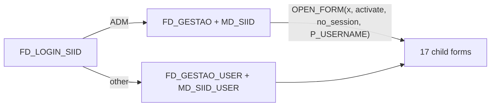

# GestSIID (Oracle Forms 12c) — Structural Map for the Node.js rewrite

Produced 2026-09-14 by the `code-modernization:legacy-analyst` agent. Derived only from `analysis/forms-summary/T|P/*.md|*.plsql.txt`, `analysis/forms-extracted/T/*.txt`,
`dev/P/*.err`, `dev/T/*.err` and file metadata. `.fmb` binaries were not opened. T (`dev/T`) is the reference;
P differences are listed in §6. Credentials found in source are masked and never reproduced.

Legend: (base) = base-table block; (ctrl) = control block; (popup) = popup-menu whose items carry PL/SQL;
"chunk" = a PL/SQL fragment in `<module>.plsql.txt`; "?" = not determinable from the text dumps.

---

## 1. Application overview

GestSIID manages the lifecycle of insurance documents produced by an external batch engine ("SIID"):
documents (`SVR_DOCUMENTOS`) are generated from templates (`DOC_MODELOS_DOCUMENTO`) with parameters, are
queued for execution/printing/re-sending/archiving via a work queue (`SVR_QUEUE`), can be commented,
regenerated, cloned, annulled, backed up to media, and shown as PDF from a REST file server. Configuration
forms maintain templates (sections, approval conditions, default parameters, barcode, EDoc/archive attributes),
report parameter catalogues, printers, printer associations (per template / per user), user permissions per
template, domains (reference lists), users, media types, units, environment variables and DB "managers".

### The two roles

| | Admin | Regular user |
|---|---|---|
| Decided by | `CFG_UTILIZADORES.TIPO_UTILIZADOR_RF = 'ADM'` (`FD_LOGIN_SIID` WHEN-BUTTON-PRESSED LOGIN, `forms-summary/T/FD_LOGIN_SIID.fmb.plsql.txt`) | any other value |
| Container form | `FD_GESTAO` | `FD_GESTAO_USER` |
| Menu | `MD_SIID` | `MD_SIID_USER` |
| Main document form | `FD_GESTAO_SIID` | `FD_GESTAO_SIID_USER` |

The two menus are PL/SQL-identical (17 `OPEN_FORM` items, same targets) except the "Documentos" item
(`FD_GESTAO_SIID` vs `FD_GESTAO_SIID_USER`) and the commented `RUN_REPORT_OBJECT` line
(`forms-summary/T/MD_SIID*.mmb.plsql.txt`). **Resolved with the Forms2XML dump (`analysis/forms-xml/T/MD_SIID*_mmb.xml`,
2026-09-14):** in `MD_SIID_USER` the menu items `GADOR`, `CONFIGURAÇÃO`, `ADMINISTRAÇÃO`, `AUDITORIA` and the `BACKUPS`
sub-menu are `Enabled="false"`, so a regular user only reaches Gestão → Documentos (Impressoras Associadas and Alterar password sit
under Configuração, see the table below). In `MD_SIID` only `AUDITORIA` is disabled. This is a menu property (client-side); the
child forms themselves still only check `P_USERNAME IS NOT NULL` (see SECURITY_FINDINGS SEC-004).

### Exactly what differs between FD_GESTAO_SIID and FD_GESTAO_SIID_USER (T)

Established by diffing normalized PL/SQL chunks and object-name sets of the two dumps
(`forms-summary/T/FD_GESTAO_SIID*.fmb.plsql.txt`, `forms-extracted/T/FD_GESTAO_SIID*.fmb.txt`).

Present only in the ADMIN form:
- Buttons on `ORDENACAO_DOCUMENTOS`: `REGERAR`, `REIMPRIMIR`, `VIA` (2ª via), `COPIA`, `ANULAR`, `CANCELAR`,
  `SUSPENDER`, `RETOMAR`, `REENVIAR` (EDoc), `REENVIAR_EMAIL`, `REARQUIVAR`, `FATURAELECTRONICA`, `LOTE`,
  and the sort buttons `DATA_PEDIDO`, `MODELO`, `CRIADO_POR`, `REFERENCIA`, `DESTINATARIO`, `ESTADO`.
  The USER dump's `ORDENACAO_DOCUMENTOS` only has `SPOOL, TODOS, EM_BRANCO, NAO_EXECUTADOS, EM_ERRO,
  A_EXECUTAR, EXECUCAO, SELECCIONAR_TODOS, DUMMY, TS_*`.
- Alerts `DESEJA_REGERAR/REENVIAR/RECRIAR/CANCELAR/ANULAR/IMPRIMIR`, `NAO_TEM_REGISTOS` — absent in USER.
- Program units `RECRIAR`, `REARQUIVAR` — absent in USER. (`REGERAR`, `REIMPRIMIR`, `REENVIAR`,
  `REENVIA_EMAIL`, `ANULA` still exist in USER but no code opens the `REIMPRIMIR`/`CONFIRMAR_PASSWORD`
  windows there → appear unreachable.)
- Dialog buttons `REIMPRIMIR.OK`, `SUSPENDER.OK`, `RETOMAR.OK`, `CONFIRMAR_PASSWORD.CONFIRMAR/CANCELAR`,
  `CONVERTE_PARAM.OK`, `CLONAR.CLONAR`, `PROCURAR.PROCURAR`, `SVR_DOCUMENTO_COMENTARIOS.SAVE`,
  `REFRESH_TS.REFRESH` are named only in the ADMIN dump.
- Popup menu `GENERICO` (`CLONAR, COMENTARIO, DETALHES_DOCUMENTO, MOSTRAR_DOCUMENTO, MOSTRAR_GRUPO,
  PARAMETROS, PROCURAR_PARAMETRO, VER_IMPRESSOES, VER_LOG`) is named only in ADMIN; the same action
  code (open comments/parameters/queues/logs/details/clone/search, `WEB.SHOW_DOCUMENT`) exists in USER,
  so the USER form reaches them through an unnamed/renamed popup (unverifiable).
- `SVR_DOCUMENTOS` detail items `ATRIBUTO5..8`, `ATRIBUTO10..25`, `ATRIB_ARQ_1..20`, `ARQ_ID`, `EDOC_ID`,
  `REGISTO_ARQUIVO`, `REGISTO_EDOC`, `DATA_ARQUIVO` — the USER "Detalhes" window is reduced.
- `SVR_DOCUMENTO_COMENTARIOS` `PRE-INSERT`/`POST-INSERT` (sequence `ID_COMENTARIO_DOCUMENTO_SEQ`) — absent
  in USER (comments effectively read-only there; USER still has the `COMMIT_FORM; HIDE_WINDOW` save chunk).
- `PKG_SIID_UTIL.CAN_BE_UPLOADED_EDOC` call (only used by the REENVIAR button).
- Hardcoded super-user check `:PARAMETER.P_USERNAME = 'AFREITAS'` in CANCELAR.

Present in both: filters, sorting by spool, select-all, parameter search, comment viewing, parameters
window, queue window (with popup `ESTADO_PEDIDO.CANCELAR` for a single request), logs window, details
window, clone document, show PDF (`WEB.SHOW_DOCUMENT`), tablespace gauge timer, suspend/resume code
(`SUSPENDER`/`RETOMAR` blocks exist in USER but their `OK` buttons do not appear in the USER dump).
Window positioning differs (USER positions dialogs relative to the MDI window).

---

## 2. Navigation & session model

### Login flow (`forms-summary/T/FD_LOGIN_SIID.fmb.plsql.txt`, `dev/T/FD_LOGIN_SIID.err`)
1. WHEN-NEW-FORM-INSTANCE: `:GLOBAL.USERNAME := Get_Application_Property(USERNAME)`; defaults
   `GLOBAL.AMBIENTE_ID` to `*` then to `:LOGIN.AMBIENTE`. Population of the environment list
   (`RG_TIPO_AMBIENTE` = `SELECT DESIGNACAO, CHAVE FROM CFG_VALORES_DOMINIO WHERE DOMINIO_ID='TIPO_AMBIENTE'`)
   and of `RG_UTILIZADOR` (`SELECT NOME, USERNAME FROM CFG_UTILIZADORES WHERE AMBIENTE_ID=:LOGIN.AMBIENTE`)
   is **commented out**; `LOGIN.AMBIENTE` is a static List Item with hardcoded elements (T:
   `TESTES`=`GADOR_TESTES`, two blank entries, one blank-labelled entry valued `LISTA14`) — confirmed
   from `analysis/forms-xml/T/FD_LOGIN_SIID_fmb.xml` `<ListItemElement>` (source: forms-xml).
2. Items: `LOGIN.AMBIENTE` (list), `LOGIN.UTILIZADOR`, `LOGIN.PASSWORD`, buttons `LOGIN`, `CANCELAR`.
   Alerts `SEM_UTILIZADOR`, `SEM_PASSWORD`, `LOGIN_INVALIDO`.
3. WHEN-BUTTON-PRESSED LOGIN: `:GLOBAL.DO_LOGON := 'YES'; execute_trigger('ON-LOGON')`, then
   `SELECT PASSWORD, TIPO_UTILIZADOR_RF FROM CFG_UTILIZADORES WHERE USERNAME=:LOGIN.UTILIZADOR AND
   AMBIENTE_ID=:LOGIN.AMBIENTE`; compares `USER_SECURITY.ENCRYPT(:LOGIN.PASSWORD)` with the stored hash;
   on success sets `:GLOBAL.USERNAME`, `:GLOBAL.PASS` (the hash), `:GLOBAL.AMBIENTE_ID`;
   `NEW_FORM('FD_GESTAO')` if `TIPO_UTILIZADOR_RF='ADM'` else `NEW_FORM('FD_GESTAO_USER')`.
   Any exception → `message('Erro'); raise`.
4. ON-LOGON: maps `:LOGIN.AMBIENTE` ∈ {`DEV`, `GADOR_TESTES`, `COSEC`} to a **hardcoded technical DB
   account + password + connect string** and calls `LOGON(user, pass||'@'||connect, FALSE)`
   (`forms-extracted/T/FD_LOGIN_SIID.fmb.txt` line ~523). In T all three branches point at the test
   account/alias `cosec`; in P `COSEC` → production account @ `COSEC01`, `GADOR_TESTES` → alias `gador`
   (`forms-summary/P/FD_LOGIN_SIID.fmb.plsql.txt`). Values masked; treat as live credentials.
   Consequence: **the DB session user is a shared technical account; the human user only exists as
   `GLOBAL.USERNAME`/`P_USERNAME`.**

### Container forms (`FD_GESTAO`, `FD_GESTAO_USER`; `forms-summary/T/FD_GESTAO*.fmb.plsql.txt`)
WHEN-NEW-FORM-INSTANCE: exits with alert `OUT` if `GLOBAL.USERNAME` unset; shows username in prompt
`UTILIZADOR`; determines `v_ambiente` = owner that granted INSERT on `SVR_DOCUMENTO_COMENTARIOS` to the
connected user (`USER_TAB_PRIVS`), else `USER`; if the connected user is not the owner, hides menu item
`CONFIGURAÇÃO_MENU.GESTORES` and, if no private synonyms exist, runs `CREATE_SYNONYMS(v_ambiente)`
(24 × `FORMS_DDL('create synonym … for owner.…')`); if the user *is* the owner and synonyms exist,
`DROP_SYNONYMS`. Window title and prompt `AMBIENTE` show `v_ambiente`. `FD_GESTAO` (T) also defaults
`GLOBAL.IS_BEAN1_REGISTER/IS_BEAN2_REGISTER := 'false'`. WHEN-WINDOW-ACTIVATED: same body (re-run).
Confirmed from `FormModule MenuModule=` in the XML (source: forms-xml): `FD_GESTAO→MD_SIID`,
`FD_GESTAO_USER→MD_SIID_USER`.

### Menu → form (`forms-summary/T/MD_SIID.mmb.plsql.txt`; labels from `forms-extracted/T/MD_SIID.mmb.txt`)
Every item: destroy/create parameter list `tmp`, `Add_Parameter('P_USERNAME', :GLOBAL.USERNAME)`,
`OPEN_FORM(<form>, ACTIVATE, NO_SESSION, pl)` (same DB session). Menu tree (item name → form):

| Menu | Item (label) | Form |
|---|---|---|
| GESTÃO_MENU (Gestão) | GESTÃO_DE_DOCUMENTOS (Documentos) | FD_GESTAO_SIID / FD_GESTAO_SIID_USER |
| ├ BACKUPS_MENU (Backups) | NOVO (Novo) | FD_NOVO_BACKUP |
| │ | COLOCAR_ONLINE (Backups Online) | FD_BACKUPS_ONLINE |
| GADOR_MENU (Gador) | GESTORES | FD_GESTORES_SIID |
| | EQUIPA_DE_GESTÃO (Equipa de Gestão (OD68)) | FD_PERFIS_DEPARTAMENTO |
| CONFIGURAÇÃO_MENU | REPORTS | FD_CONFIGURACAO_REPORTS |
| | MODELOS | FD_CONFIGURACAO_MODELOS |
| | GESTÃO_DE_PERMISSÕES (Permissões) | FD_PERMISSOES_SIID |
| | GESTAO_DE_IMPRESSORAS (Impressoras) | FD_IMPRESSORAS_SIID |
| ├ GESTÃO_DE_IMPRESSORAS_DE_DOCUM_MENU (Impressoras Associadas) | DOCUMENTO | FD_GESTAO_IMPRESSORAS_DOC |
| │ | UTILIZADOR | FD_GESTAO_IMPRESSORAS_USR |
| └ | ALTERAR_PASSWORD (Alterar password) | FD_ALTERAR_PASSWORD |
| ADMINISTRAÇÃO_MENU | DOMINIOS, UNIDADES_MEDIDA, TIPOS_MIDIA, UTILIZADORES, VARIAVEIS_SIID | FD_DOMINIOS_SIID, FD_UNIDADES_MEDIDA, FD_TIPOS_MIDIA, FD_UTILIZADORES_SIID, FD_VARIAVEIS_SIID |
| AUDITORIA_MENU | MÉDIAS_… (Médias Execução) | body fully commented (`RUN_REPORT_OBJECT('MEDIAS_DOCUMENTOS')`) → does nothing |

Every child form's WHEN-NEW-FORM-INSTANCE starts with: `if :PARAMETER.P_USERNAME IS NULL then
minimize MDI; SHOW_ALERT('OUT'); EXIT_FORM(NO_VALIDATE) else :GLOBAL.USERNAME := :PARAMETER.P_USERNAME`
(all `forms-summary/T/FD_*.plsql.txt`). `FD_BACKUPS_ONLINE` is the exception: no P_USERNAME check.

### Globals and parameters

| Name | Set by | Read by |
|---|---|---|
| `GLOBAL.USERNAME` | FD_LOGIN_SIID (login), every child (from P_USERNAME), FD_GESTAO_SIID/PERMISSOES/… also overwrite it with `Get_Application_Property(USERNAME)` (DB user!) | menus (into P_USERNAME), `CRIADO_POR/ACTUALIZADO_POR` inserts everywhere |
| `PARAMETER.P_USERNAME` | menus | every child form; FD_GESTAO_SIID uses it (not GLOBAL) for `CRIADO_POR` in queue inserts and for the `AFREITAS` check |
| `GLOBAL.PASS` | FD_LOGIN_SIID (hash) | nobody found |
| `GLOBAL.DO_LOGON` | FD_LOGIN_SIID | nobody — ON-LOGON's full text (source: forms-xml) never reads it; dead global |
| `GLOBAL.AMBIENTE_ID` | FD_LOGIN_SIID; each form defaults `*` then derives it (§ below) | SVR_VARIAVEIS_SIID lookups (PASSWORD/BACKUP/ONLINE/PDF), CFG_UTILIZADORES/VARIAVEIS inserts, `PKG_DOCUMENTOS_SVR.SET_PARAMETRO_STRING('_USER', ambiente)`, file-server URL choice |
| `GLOBAL.IS_BEAN1_REGISTER`, `IS_BEAN2_REGISTER` | FD_GESTAO (T) | FD_PERFIS_DEPARTAMENTO (T) FBean registration |
| `GLOBAL.SELEC_TABLE_ID`, `SEARCH_TABLE_ID` | FD_GESTAO_SIID*, FD_NOVO_BACKUP (`SEQ_SVR_GS_TMP.NEXTVAL`) | selection/search rows in `SVR_GESTAO_SIID_TMP` |
| `GLOBAL.KEEP_QUERY` | FD_GESTAO_SIID* (`'0'` at start) | filter buttons, KEY-EXEQRY. **Correction (source: forms-xml):** the `QUERY` ctrl block and its `GUARDAR`/`LIMPAR` buttons documented below do not exist in the current `FD_GESTAO_SIID_fmb.xml` (no `Block Name="QUERY"`) — they were removed (or renamed) since the string-dump snapshot; no live setter of `KEEP_QUERY` other than the `'0'` reset was found. |
| `GLOBAL.ORDENAR_POR`, `TIPO_SELECCAO` | FD_GESTAO_SIID*, FD_NOVO_BACKUP, FD_PERMISSOES_SIID, FD_GESTAO_IMPRESSORAS_*, FD_CONFIGURACAO_MODELOS | bold-highlight of active sort/filter button |
| `GLOBAL.LOTE_CLONE_ID` | CLONAR window opener: `Default_value(:svr_documentos.lote_id,'GLOBAL.LOTE_CLONE_ID')` (source: forms-xml) | CLONAR: `UPDATE SVR_DOCUMENTOS SET LOTE_ID=…` |
| `GLOBAL.CALLBACK_ITEM` | CONVERTE_PARAM opener | CONVERTE_PARAM.OK (`copy(v_valor, Name_In('GLOBAL.CALLBACK_ITEM'))`) |
| `GLOBAL.ORDENAR_SECCOES`, `ASK_COMMIT`, `CURSOR_ITEM`, `CURSOR_RECORD`, `USER_HOME` | FD_CONFIGURACAO_MODELOS | same form |
| `GLOBAL.DESTINO_BACKUP`, `NOME_BACKUP` | FD_NOVO_BACKUP | same form |

### How AMBIENTE_ID (environment) is chosen and used
- Chosen at login from `LOGIN.AMBIENTE` (values are `CFG_VALORES_DOMINIO` keys of domain `TIPO_AMBIENTE`,
  e.g. `DEV`, `GADOR_TESTES`, `COSEC`).
- Each form re-derives it when unset: `Default_Value('*','GLOBAL.AMBIENTE_ID'); if '*' then SELECT OWNER
  FROM ALL_OBJECTS WHERE OBJECT_NAME='MRECIBO' AND OBJECT_TYPE='TABLE'` (FD_GESTAO_SIID*, FD_NOVO_BACKUP,
  FD_BACKUPS_ONLINE, FD_VARIAVEIS_SIID, FD_ALTERAR_PASSWORD, FD_UTILIZADORES_SIID); FD_UTILIZADORES_SIID
  (T) instead uses `SELECT ID FROM SVR_AMBIENTES_IMPRESSAO WHERE USERNAME = <DB user>` in one trigger.
  So **AMBIENTE_ID == the schema that owns the core insurance table MRECIBO**, and `SVR_VARIAVEIS_SIID`,
  `CFG_UTILIZADORES`, `DOC_IMPRESSORAS_DOC.AMBIENTE_ID` are keyed by it.
- `FD_GESTAO_SIID`: `IF :GLOBAL.AMBIENTE_ID LIKE '%TESTE%'` → test file-server URL `/pdf/T`, else `/pdf/P`.
- A parallel "environment" is the synonym owner (`USER_SYNONYMS.TABLE_OWNER` for `SVR_DOCUMENTOS`) shown
  in window titles of most forms.

---

## 3. Per-module sheets

### 3.1 FD_LOGIN_SIID — see §2. Tables: `CFG_UTILIZADORES`, `CFG_VALORES_DOMINIO`. DB call:
`USER_SECURITY.ENCRYPT(varchar2) return varchar2`. Opens `FD_GESTAO`/`FD_GESTAO_USER` via `NEW_FORM`.

### 3.2 FD_GESTAO / FD_GESTAO_USER — see §2. Program units `CREATE_SYNONYMS(P_AMBIENTE)`,
`DROP_SYNONYMS` (FORMS_DDL). Tables: `USER_TAB_PRIVS`, `USER_SYNONYMS`. Synonyms handled:
svr_gestao_siid_tmp, svr_queue, seq_svr_gs_tmp, ID_DOCUMENTO_SEQ, ID_QUEUE_SEQ, id_comentario_documento_seq,
svr_documentos, svr_documentos_vw, err_erros_siid, svr_anexos_documento, svr_parametros_documento,
svr_impressoras, mrecibo, svr_gestao_siid_directorias, doc_permissoes_impressao, DOC_IMPRESSORAS_DOC,
DOC_IMPRESSOES_MODELO_USR, doc_modelos_documento, doc_seccoes_documento, doc_condicoes_apr,
svr_parametros_report, gd_espaco_bd, pkg_documentos_svr, mpersona.

### 3.3 FD_GESTAO_SIID (Gestão › Documentos) — admin main form
Sources: `forms-summary/T/FD_GESTAO_SIID.fmb.{md,plsql.txt}`, `dev/P/FD_GESTAO_SIID.err` (block/trigger
list), `forms-extracted/T/FD_GESTAO_SIID.fmb.txt` (names/labels).

**Purpose.** Browse/filter/sort generated documents, multi-select them and fire lifecycle actions through
`SVR_QUEUE`; view parameters, comments, queue history, error log, details; show PDF; clone a document;
search by parameter values; monitor tablespace usage.

**Windows / canvases** (`TELA_*`): DOCUMENTOS (main), COMENTARIOS, PARAMETROS, QUEUES, LOGS,
CONVERTE_PARAM, REIMPRIMIR, CLONAR, SUSPENDER, RETOMAR, DETALHES_DOCUMENTO, CONFIRMAR_PASSWORD,
PROCURAR_PARAMS. WHEN-WINDOW-CLOSED: closing any dialog returns to `SVR_DOCUMENTOS` (hides PARAMETROS,
CLONAR, SUSPENDER, RETOMAR); closing DOCUMENTOS → `ROLLBACK`, delete scratch rows for
`SELEC_TABLE_ID`/`SEARCH_TABLE_ID`, `COMMIT`.

**Blocks and key items**

| Block | Base | Key items (type hints, labels) |
|---|---|---|
| `SVR_DOCUMENTOS` (base, query source switched at runtime between `svr_documentos_vw` and `svr_documentos_vw,svr_gestao_siid_tmp`) | `SVR_DOCUMENTOS_VW` | `SELECCIONAR` (checkbox 1/0), `ID` ("Spool Id"), `DATA_PEDIDO` (date), `MODELO_ID`, `ESTADO`, `CRIADO_POR`, `N_REFERENCIA` ("Referência"), `DESTINATARIO`, `LOTE_ID`, `LOTE_ORDEM`, `COMENTARIO` (non-base, shows `***` when comments exist), `DISPONIBILIDADE` (`OFF`/`ANU`), `ATRIBUTO9` (`'A'` = annulled), `NOME_OUTPUT`, `TIPO_OUTPUT`, `TAMANHO_BYTES`, `DATA_EXECUCAO/IMPRESSAO/ARQUIVO`, `EXECUTADO_POR`, `IMPRESSO_POR`, `ULTIMA_VIA_POR`, `N_IMPRESSOES/N_VIAS/N_CAPAS/N_COPIAS/N_ANEXOS`, `IMPRESSORA_ID`, `REPORT_ID`, `AMBIENTE_ID`, `VERSAO`, `MORADA`, `CODIGO_POSTAL`, `PAIS`, `ARQ_ID`, `EDOC_ID`, `REGISTO_ARQUIVO`, `REGISTO_EDOC`, `ATRIBUTO1..25`, `ATRIB_ARQ_1..20` (last group shown on canvas TELA_DETALHES_DOCUMENTO) |
| `ORDENACAO_DOCUMENTOS` (ctrl) | — | sort buttons `SPOOL, DATA_PEDIDO, MODELO, CRIADO_POR, REFERENCIA, DESTINATARIO, LOTE, ESTADO`; filter buttons `TODOS, EM_BRANCO ("Em branco"), NAO_EXECUTADOS, EM_ERRO, A_EXECUTAR, EXECUCAO ("Em Execução")`; action buttons `REGERAR, REIMPRIMIR, VIA ("2ª Via"), COPIA ("Cópia"), ANULAR, CANCELAR, SUSPENDER, RETOMAR, REENVIAR, REENVIAR_EMAIL, REARQUIVAR ("Re-Arquivar"), FATURAELECTRONICA`; `SELECCIONAR_TODOS` (checkbox); gauge items `TS_DISCOSEC_DATA_OCUPADO/DISPONIVEL/_MB`, `TS_DISCOSEC_INDX_*`, `TS_DATA_ACTUALIZACAO` |
| `QUERY` (ctrl) — **not present in the current form** (source: forms-xml, see §4 correction under `GLOBAL.KEEP_QUERY`) | — | documented by the old string-dump summarizer as `GUARDAR`/`LIMPAR`; no such block or items exist in `analysis/forms-xml/T/FD_GESTAO_SIID_fmb.xml` |
| `SVR_DOCUMENTO_COMENTARIOS` (base) | `SVR_DOCUMENTO_COMENTARIOS` | `COMENTARIO_ID`, `USER_ID`, comment text, `SAVE` button |
| `SVR_PARAMETROS_DOCUMENTO` (base) | `SVR_PARAMETROS_DOCUMENTO` | parameter name/value of current document (query only) |
| `PROCURAR` (ctrl) / `PROCURAR_PARAMETROS` | ? (parameter names) | `MODELO_PROCURAR` ("Procurar apenas no modelo:", LOV), `NOME`, `VALOR`, button `PROCURAR` |
| `SVR_QUEUE` (base) | `SVR_QUEUE` | `ID` ("Pedido"), `TIPO_QUEUE_RF`, `DOCUMENTO_ID`, `ESTADO`, `IMPRESSORA_ID`, `IMPRESSORA` (non-base, description), `RESULTADO` (multi-line, editor), `DATA_*`; popup `ESTADO_PEDIDO` (`CANCELAR`, `RETOMAR`) |
| `ERR_ERROS_SIID` (base) | `ERR_ERROS_SIID` | log rows for the document ("Data Log", DESCRICAO) |
| `CONVERTE_PARAM` (ctrl) | — | `NOME`, `PARAM`, `OK` ("Conversão de Parametros") |
| `CLONAR_DOCUMENTO` (base?) / `CLONAR` (ctrl) | parameters of current doc | `NOME`, `VALOR`, `VALOR_TEMP`; button `CLONAR` |
| `REIMPRIMIR` (ctrl) | — | `OPCOES_REIMPRIMIR` (radio 1 = "Imprimir documentos para a impressora associada", 2 = "Outra impressora:"), `NOVA_IMPRESSORA_ID` (LOV `LOV_IMPRESSORAS`), `NOVA_IMPRESSORA`, `VALIDACAO` (hidden: `F`=reprint, `V`=2ª via, `C`=cópia), `OK` |
| `SUSPENDER` / `RETOMAR` (ctrl) | — | `OPC_SUSPENDER` radio (1 = selected docs, else all), `OK` |
| `CONFIRMAR_PASSWORD` (ctrl) | — | `PASSWORD` ("Insira a password para regerar…"), `CONFIRMAR`, `CANCELAR` |
| `GENERICO` (popup on SVR_DOCUMENTOS) | — | `MOSTRAR_DOCUMENTO`, `COMENTARIO` ("Mostrar comentários"), `DETALHES_DOCUMENTO` ("Detalhes"/"Mais Informação"), `MOSTRAR_GRUPO`, `PARAMETROS`, `PROCURAR_PARAMETRO` ("Procurar por parâmetros"), `VER_IMPRESSOES` (queues), `VER_LOG`, `CLONAR` |
| `WEBUTIL`/`WINDOW` | — | `WINDOW.OPEN` referenced (summary) |

**Triggers and program units (one line each)**
- Form WHEN-NEW-FORM-INSTANCE: P_USERNAME guard; title `DOCUMENTOS - <owner>`; maximize; `KEEP_QUERY=0`;
  sort by `ID DESC`; `TIPO_SELECCAO=TODOS`; two `SEQ_SVR_GS_TMP.NEXTVAL` → `SELEC_TABLE_ID`, `SEARCH_TABLE_ID`
  (previous selection rows deleted); derive `AMBIENTE_ID`; create timer `REFRESH_TS` (1 ms, repeat).
- WHEN-TIMER-EXPIRED `REFRESH_TS`: tablespace of `SVR_DOCUMENTOS` (ALL_TABLES) and of index `DOCUMENTO_PK`
  (ALL_INDEXES) → `GD_ESPACO_BD` (MB_OCUPADO/MB_LIVRES/MB_QUOTA) → gauge width (200 px scale, >180 =
  visual attribute `TS_ALARM`), text `"x MB / y MB"`, `TS_DATA_ACTUALIZACAO := SYSDATE`; re-arm 1 h.
- KEY-COMMIT: `COMMIT_FORM` if form changed else `FORMS_DDL('COMMIT')`. WHEN-WINDOW-CLOSED: see above.
- SVR_DOCUMENTOS POST-QUERY: colour row `OFFLINE` (DISPONIBILIDADE=OFF) / `ANULADO` (ANU or ATRIBUTO9='A');
  count comments → `COMENTARIO := '***'`. POST-RECORD/POST-CHANGE/POST-SELECT: current-record highlight.
  **Correction (source: forms-xml):** the "typing `IS NULL` in a field appends `<col> IS NULL` to
  DEFAULT_WHERE" logic is the **PRE-QUERY** trigger body (full text captured), not KEY-ENTQRY — it reads
  `:SYSTEM.CURSOR_ITEM`, checks `UPPER(...)='IS NULL'`, and appends to `Get/Set_Block_Property(...,
  DEFAULT_WHERE)`, clearing the item afterwards. KEY-ENTQRY itself was not found as a separate trigger on
  this block. KEY-EXEQRY: if `KEEP_QUERY=0` reset filter to TODOS / query source to view; sort by ID;
  execute; then persist the WHERE of `:SYSTEM.LAST_QUERY` into DEFAULT_WHERE (so the query sticks).
  `SELECCIONAR` WHEN-CHECKBOX-CHANGED: insert/delete `(SELEC_TABLE_ID, ID)` in `SVR_GESTAO_SIID_TMP`.
  `COMENTARIO` WHEN-MOUSE-CLICK: open COMENTARIOS window; ENTER/LEAVE/NEW-ITEM: cosmetic.
- Filters (WHEN-BUTTON-PRESSED + WHEN-MOUSE-CLICK twins that first exit ENTER-QUERY mode):
  `TODOS` no WHERE; `EM_BRANCO` `DATA_EXECUCAO IS NOT NULL AND DECODE(DESTINATARIO,NULL,0,1)+DECODE(
  N_REFERENCIA,NULL,0,DECODE(MODELO_ID,'R3.D25',0,'R3.D25R',0,'R3.D27',0,'R3.D27R',0,'R3.D28',0,'R3.D28R',0,1))=0
  AND MODELO_ID NOT LIKE 'M%' AND DECODE(MODELO_ID,'I1.D55','A',MODELO_ID) NOT LIKE 'I%' AND MODELO_ID
  NOT IN ('O1.OD58','O2.OD61','O2.OD69')`; `NAO_EXECUTADOS` `estado is null`; `EM_ERRO` fills
  `SEARCH_TABLE_ID` with documents whose latest queue entry is `ERRO` (correlated MAX(ID) query on
  SVR_QUEUE, `REENVIAR` treated as `EXECUCAO`) and joins view+tmp; `A_EXECUTAR` `estado='A EXECUTAR' AND
  id >= (SELECT MIN(documento_id) FROM SVR_QUEUE WHERE ESTADO='EXECUCAO' AND TIPO_QUEUE_RF='EXECUCAO')`;
  `EXECUCAO` `estado='EXECUCAO' AND id >= (… ESTADO IN ('ESPERA','ENQUEUED') …)`.
- Sort buttons → `ORDENAR_POR(P_COLUNA, P_TIPO, P_ITEM default cursor item)`: toggles `ORDER_BY` ASC/DESC,
  bolds the active button, re-queries (only the `ID DESC` call is visible; others inferred).
  `LOTE` toggles `LOTE_ID, LOTE_ORDEM` order.
- `SELECCIONAR_TODOS`: walks all records setting SELECCIONAR and inserting into the scratch table.
- `REGERAR`: needs selection (`NAO_TEM_REGISTOS`); confirm `DESEJA_REGERAR`; if any selected doc has a
  `TERMINADO` `IMPRESSAO` queue entry or its model `MODO_EXPEDICAO_RF='G'` → open CONFIRMAR_PASSWORD;
  else for each non-annulled doc `REGERAR(id)`; annulled ids listed in alert `OUT`; `COMMIT`.
  `CONFIRMAR_PASSWORD.CONFIRMAR`: `crypt_pkg.encryptStringRaw(:PASSWORD)` must equal
  `SVR_VARIAVEIS_SIID.VALOR (TIPO_VARIAVEL_RF='PASSWORD', AMBIENTE_ID)`; then same loop; else
  `PASSWORD_ERRADA`. `CANCELAR`: commit, back.
- `REGERAR(P_DOCUMENTO_ID)`: `FORMS_DDL` insert `SVR_QUEUE (ID_QUEUE_SEQ, 'EXECUCAO', doc, SYSDATE,
  'ESPERA', P_USERNAME)` + `ERR_ERROS_SIID (ID_ERROS_SEQ, 'ERRO_DOC', SYSDATE, 'DOCUMENTO REGERADO POR
  <user>', doc)`.
- `REIMPRIMIR`/`VIA`/`COPIA` buttons: confirm `DESEJA_IMPRIMIR`, open REIMPRIMIR window with
  `VALIDACAO` = `F`/`V`/`C`. `REIMPRIMIR.OK`: for each selected doc skip annulled (unless `F`), call
  `REIMPRIMIR(id, printer_or_null, validacao)`; list skipped. `REIMPRIMIR(P_DOCUMENTO_ID, P_IMPRESSORA_ID,
  P_VALIDACAO)`: `C`→`COPIA`; `V`→`2.VIA` only if `SVR_DOCUMENTOS.N_IMPRESSOES<>0` else message
  "Para imprimir 2ª Via…"; else `IMPRESSAO`; insert `SVR_QUEUE(…, IMPRESSORA_ID, CRIADO_POR)` state ESPERA.
- `ANULAR`: confirm `DESEJA_ANULAR`; `ANULA(id)` → `PKG_DOCUMENTOS_SVR.ANULAR(TO_CHAR(id), username)`;
  colour row; commit.
- `CANCELAR`: confirm `DESEJA_CANCELAR`; `UPDATE SVR_QUEUE SET ESTADO='CANCELLED' WHERE TIPO_QUEUE_RF=
  'EXECUCAO' AND DOCUMENTO_ID=… [AND ESTADO IN ('TERMINADO','ESPERA','ENQUEUED','EM EXECUCAO','ERRO')]`
  — the state restriction is skipped when `P_USERNAME='AFREITAS'`.
- `SUSPENDER`/`RETOMAR`: open dialog; `OK` sets queue rows `ESPERA`→`SUSPENSO` (or back) for selected docs
  or for all; commit; requery. **`RETOMAR.OK` body confirmed (source: forms-xml):** two cursors over
  `SVR_QUEUE WHERE ESTADO='SUSPENSO'`, one scoped to `SVR_GESTAO_SIID_TMP` rows for `GLOBAL.SELEC_TABLE_ID`
  and one unscoped; `UPDATE SVR_QUEUE SET ESTADO='ESPERA'` per row; which cursor runs is chosen by
  `:SUSPENDER.OPC_SUSPENDER` (reads the *other* dialog's radio item — cross-block coupling, likely a bug:
  Retomar's own choice is never consulted).
- `REENVIAR` (EDoc): confirm `DESEJA_REENVIAR`; for each selected doc compute
  `DECODE(MODELO.MODO_EXPEDICAO_RF,'W',DECODE(PKG_SIID_UTIL.CAN_BE_UPLOADED_EDOC(id),0,'I',…),…)`; if `W` →
  `REENVIAR(id)` (queue `REENVIAR` + log 'DOCUMENTO REGERADO POR'), else list as not EDoc.
- `REENVIAR_EMAIL`: for each doc take `MAX(ATRIBUTO01)` of its `EMAIL` queue rows; if found
  `REENVIA_EMAIL(id, email)` (queue `EMAIL`, `ATRIBUTO01`=email + log), else list.
- `REARQUIVAR`: confirm (`DESEJA_RECRIAR` alert reused); docs with `ARQ_ID` not null → `REARQUIVAR(id)`
  (queue `ARQUIVO` + log 'DOCUMENTO ARQUIVADO POR'); others listed.
- `FATURAELECTRONICA`: **resolved from the XML** — it is a sort button: `Ordenar_Por('FATURA_ELECTRONICA','ASC')`
  (sorts the list by a FATURA_ELECTRONICA column of the view). `RECRIAR(id)` (queue `TOXML` + log 'DOCUMENTO XML
  RECRIADO POR') has no caller → dead code in the current forms.
- Popup `GENERICO`: `MOSTRAR_DOCUMENTO` → `WEB.SHOW_DOCUMENT('http://ssiidt.cosec.pt:8090/FileServerSIID/
  restapi/FileServer/pdf/T?spoolid='||ID, '_black')` when `AMBIENTE_ID LIKE '%TESTE%'` else
  `http://ssiid-prod.cosec.pt:8090/…/pdf/P?spoolid=` (older `servimp*` URLs, `HOST('CMD /C java -jar
  ShowDoc.jar …')`, `CLIENT_HOST`, registry lookup of AcroRd32 and the `FILE_EXISTS`/`HOST` search across
  `<gerados>\YYYY\MM\DD\<nome_output>.pdf` and backup folders from `SVR_VARIAVEIS_SIID 'PDF'`/`SVR_BACKUPS.
  DRIVE_ONLINE` are all inside comments → dead). `COMENTARIO`, `PARAMETROS`, `VER_IMPRESSOES` (QUEUES),
  `VER_LOG` (LOGS), `DETALHES_DOCUMENTO`, `CLONAR`, `PROCURAR_PARAMETRO` position and open the
  respective window/block. `MOSTRAR_GRUPO` (attribution inferred): if `MODELO_ID` in
  (`R3.D25(R)`,`R3.D27(R)`,`D1.A7(R)`,`D1.A5(R)`) restrict block to same `LOTE_ID`, `DESTINATARIO`,
  `LOTE_ORDEM` range and paired model ids; otherwise to the document plus its `SVR_ANEXOS_DOCUMENTO`
  attachments (`id in (…)`).
- `SVR_QUEUE`: WHEN-NEW-BLOCK-INSTANCE query; POST-QUERY fills `IMPRESSORA` from `SVR_IMPRESSORAS`
  (explicit or document's printer) for IMPRESSAO/COPIA/2.VIA; POST-RECORD toggles popup `ESTADO_PEDIDO.
  CANCELAR` (visible for ESPERA/TERMINADO) and hides `RETOMAR` outside NORMAL mode; WHEN-MOUSE-CLICK
  refuses button 3; `RESULTADO` WHEN-NEW-ITEM-INSTANCE opens the editor. Popup `ESTADO_PEDIDO.CANCELAR`:
  confirm "Deseja cancelar este pedido?" → `UPDATE SVR_QUEUE SET ESTADO='CANCELLED' WHERE ID=… AND ESTADO
  IN ('ESPERA','TERMINADO')`. **Correction (source: forms-xml):** the `ESTADO_PEDIDO` popup menu in the
  current `FD_GESTAO_SIID_fmb.xml` has only the `CANCELAR` item — no `RETOMAR` item exists on this popup
  (the toggle logic that "hides RETOMAR outside NORMAL mode" therefore has nothing left to show/hide, or
  refers to the unrelated `SUSPENDER`/`RETOMAR` dialog's own `RETOMAR` opener button, not a popup item).
- `SVR_DOCUMENTO_COMENTARIOS`: WHEN-NEW-BLOCK-INSTANCE query and go to new record; PRE-INSERT
  `ID_COMENTARIO_DOCUMENTO_SEQ` (USER_ID default 'EQUIPDOC' commented); POST-INSERT; `SAVE`: `COMMIT_FORM;
  HIDE_WINDOW; GO_BLOCK('SVR_DOCUMENTOS')`.
- `PROCURAR.PROCURAR`: clears `SEARCH_TABLE_ID` rows; first criterion inserts `DISTINCT documento_id`
  from `SVR_PARAMETROS_DOC_NOME_VW WHERE nome=… AND valor LIKE …` (optionally `modelo_id LIKE
  MODELO_PROCURAR`); subsequent criteria delete non-matching rows (intersection); then query source =
  `svr_documentos_vw,svr_gestao_siid_tmp` with join on `table_id=SEARCH_TABLE_ID`; `NAO_OBTEVE_DADOS`
  if empty. `PROCURAR_PARAMETROS.VALOR` / `CLONAR_DOCUMENTO.VALOR(_TEMP)` double-click when NOME in
  (`P_NMRECIBO`,`P_CDPERSON`) → CONVERTE_PARAM; `OK` converts `MRECIBO.NMRECINUE→NMRECIBO` or
  `MPERSONA.CDIDEPER→CDPERSON` and copies into the calling item.
- `CLONAR_DOCUMENTO` WHEN-NEW-BLOCK-INSTANCE: query, copy `VALOR_TEMP` into `VALOR`. `CLONAR.CLONAR`:
  for each parameter `PKG_DOCUMENTOS_SVR.SET_PARAMETRO_STRING(nome, valor)`; then
  `SET_PARAMETRO_STRING('P_USUARIO', user)`, `('_USER', :GLOBAL.AMBIENTE_ID)`;
  `PKG_DOCUMENTOS_SVR.EXECUTA(:SVR_DOCUMENTOS.MODELO_ID)`; `v_id := pkg_documentos_svr.get_id_execucao`;
  `FORMS_DDL('UPDATE SVR_DOCUMENTOS SET LOTE_ID='||:GLOBAL.LOTE_CLONE_ID||' WHERE ID='||v_id)`; commit.
- Embedded packages `WIN_API` + `WIN_API_ENVIRONMENT` (spec+body, per `dev/P/FD_GESTAO_SIID.err`): Oracle
  D2KWUTIL port using `ORA_FFI` to load `d2kwutil.dll`/`KERNEL32.DLL` (`READ_INI_FILE`, `WRITE_INI_FILE`,
  `READ_REGISTRY`, `WRITE_REGISTRY`, `GET_WINDOWS_DIRECTORY/USERNAME`, `GET_TEMP_DIRECTORY`,
  `GET_ENVIRONMENT_STRING`, `GET_NET_CONNECTION`, `PRELOAD`, error stack). Only caller is commented out.
- `FILE_EXISTS(fpath)`: `TEXT_IO.FOPEN` probe (server side) — used only by commented code.

**Alerts/messages:** OUT (generic text), CONFIRMAR, DESEJA_REGERAR/REENVIAR/RECRIAR/CANCELAR/ANULAR/
IMPRIMIR/CONFIRMAR_PASSWORD, NAO_TEM_REGISTOS, NAO_OBTEVE_DADOS ("A consulta não obteve documentos."),
PASSWORD_ERRADA; messages "Ficheiro não foi encontrado.", "Para imprimir 2ª Via…", "Para reenviar…".

**LOV/RG:** `LOV_IMPRESSORAS`: `SELECT ALL SVR_IMPRESSORAS.ID, DESCRICAO, ENDERECO FROM SVR_IMPRESSORAS
WHERE valido='S' ORDER BY to_number(ID)`. Opens no other form.

### 3.4 FD_GESTAO_SIID_USER — same structure minus the items listed in §1; window titles/positions differ.

### 3.5 FD_NOVO_BACKUP (Gestão › Backups › Novo)
Blocks: `BACKUPS` (base `SVR_BACKUPS`: `ID`, `NOME`, `DESTINO`, `TIPO_MIDIA_ID` (LOV `LOV_TIPOS_MIDIA`
`SELECT ID, DESIGNACAO, TAMANHO_BYTES/1e9 GBYTES FROM CFG_TIPOS_MiDIA`), `MES_BACKUP` (LOV `LOV_MESES`:
`SELECT DISTINCT TO_CHAR(TRUNC(DATA_IMPRESSAO,'MONTH'),'YYYY-MM'), … FROM SVR_DOCUMENTOS WHERE BACKUP_ID
IS NULL AND DATA_IMPRESSAO IS NOT NULL`), `TAMANHO_GBYTES`, `CRIADO_POR`, `DATA_CRIACAO`),
`DOCS_PORBACKUP` (query block of candidate documents: `ID`, `SELECCIONAR` (checkbox S/N),
`TAMANHO_BYTES`), `CONTROL_BLOCK` (ctrl: `MIDIA_ID`, `SELECCIONAR_TODOS`, `TOTAL_BACKUP`, `ID`).
Flow: WHEN-NEW-FORM-INSTANCE guards P_USERNAME, seeds `SELEC_TABLE_ID`, reads `GLOBAL.DESTINO_BACKUP`
from `SVR_VARIAVEIS_SIID ('BACKUP', AMBIENTE_ID)`; PRE-INSERT `SEQ_BACKUP_ID.NEXTVAL, USER, SYSDATE`;
name generator `COSEC_<YYYYMM>_<nn>` (count of `SVR_BACKUPS.NOME LIKE …`+1) and `DESTINO := base||NOME`;
selection accumulates `TOTAL_BACKUP` and scratch rows; validation button: `TIPO_MIDIA` required, media
`TAMANHO_BYTES` ≥ total (`TAMANHO_MIDIA` alert), then `EXIT_FORM(DO_COMMIT)`; POST-INSERT/commit loop:
`UPDATE SVR_DOCUMENTOS SET BACKUP_ID=:BACKUPS.ID` and `INSERT SVR_QUEUE (ID_QUEUE_SEQ,'BACKUP',doc,
SYSDATE,'ESPERA',user)` per selected doc; scratch cleanup. Units `ORDENAR_POR`, `OnS_Rollback` (T).
The physical copy is done by the queue processor, not the form. **Resolved (source: forms-xml):** the
`FD_IMPRESSORAS_SIID` reference is noise from the old string-dump summarizer — `FD_NOVO_BACKUP_fmb.xml`
has no `OPEN_FORM`/`NEW_FORM` call to it at all (see §6 and §7).

### 3.6 FD_BACKUPS_ONLINE (Gestão › Backups › Backups Online)
Blocks `OFFLINE` and `ONLINE` (both base `SVR_BACKUPS`, split by `MEDIA_ONLINE`; items `ID`, `NOME`,
`MES_BACKUP`, `TIPO_MIDIA_ID`, `TAMANHO_BACKUP` (computed `SUM(TAMANHO_BYTES)/1024/1024` of documents
with `BACKUP_ID`), `DRIVE_ONLINE`, `ESCOLHIDO` (S/N toggled by mouse click with `REG_SELECCIONADO`
highlight)). Actions: put online → `UPDATE SVR_BACKUPS SET MEDIA_ONLINE='S', DRIVE_ONLINE=(SELECT
NVL(MAX(VALOR),'E:\') FROM SVR_VARIAVEIS_SIID WHERE AMBIENTE_ID=… AND TIPO_VARIAVEL_RF='ONLINE')`;
take offline → `MEDIA_ONLINE='N', DRIVE_ONLINE=NULL`; `FORMS_DDL('COMMIT')`. No P_USERNAME check.

### 3.7 FD_GESTAO_IMPRESSORAS_DOC (Impressoras Associadas › Documento)
Block `DOC_IMPRESSORAS_DOC` (base; `MODELO_ID` LOV `LOV_MODELOS` = `select id from
doc_modelos_documento`, `IMPRESSORA_ID`, `IMPRESSORA` (non-base "id - descricao - endereco"),
`DATA_INICIO`, `DATA_FIM`); dialogs `NOVA_IMPRESSORA` ("Definir Nova Impressora": `IMPRESSORA_ID` LOV
`LOV_IMPRESSORAS`, `DATA_INI`, `DATA_FIM`), `ALTERAR_IMPRESSORA` ("Alterar Validade": dates + `_ANTERIOR`
copies); popup "Anular Impressora" sets both dates to 01/01/1980 after `CONFIRMAR_ANULACAO`. Units
`VERIFICAR_DATAS_CRIAR(modelo, ini, fim)` / `VERIFICAR_DATAS_ACTUALIZAR(modelo, ini, fim, ini_ant,
fim_ant)` return 0 on overlap (alert `DATAS_INCOMPAT`). Insert sets `AMBIENTE_ID` = `user_synonyms.
table_owner` of `MRECIBO`. Sort via `ORDENAR_POR`; `ORDENAR_IMPRESSORAS_DOC.DUMMY` ctrl.

### 3.8 FD_GESTAO_IMPRESSORAS_USR (Impressoras Associadas › Utilizador)
Same pattern on `DOC_IMPRESSOES_MODELO_USR` (block `IMPRESSOES_MODELO_USR`: `MODELO_ID`, `CDEMPLEA`
(LOV `LOV_UTILIZADORES` = `select cdidusr from m_usuarios`), `IMPRESSORA_ID`, dates) plus dialogs
`COPIAR_MODELO` ("Copiar do modelo…": copies non-expired rows of `MODELO_ID_COPIAR` to `MODELO_ID`,
skipping existing (cdemplea, data_inicio)) and `COPIAR_UTILIZADOR` ("Copiar do utilizador…").
`verificar_datas_*` include `cdemplea`.

### 3.9 FD_ALTERAR_PASSWORD (Configuração › Alterar password) — "Alteração da Password de Regeração"
Block `ALTERAR_PASSWORD` (`PASSWORD`, `CONFIRMACAO`, `OK`, `CANCELAR`). `OK`: if equal, derive
`AMBIENTE_ID`, `passwordEncript := crypt_pkg.encryptStringRaw(:PASSWORD)`, `FORMS_DDL('UPDATE
SVR_VARIAVEIS_SIID SET VALOR=''<hash>'' WHERE TIPO_VARIAVEL_RF=''PASSWORD'' AND AMBIENTE_ID=…')`,
commit, exit; else alert `PASSWORD_ERRADA`. This is the *document-regeneration* password, not a user
password. Older `ALTER USER … IDENTIFIED BY` + `LOGON` code is commented; `pck_sg.F_INS_ENCRIPT` commented.

### 3.10 FD_GESTORES_SIID (Gador › Gestores)
Single item `UTILIZADOR` (list from RG: `ALL_USERS` minus users already granted INSERT on
`SVR_DOCUMENTO_COMENTARIOS` minus `M_USUARIOS.CDIDUSR`). Adding a manager runs 25 `FORMS_DDL('grant …
on <object> to '||:utilizador)` (select/insert/update/delete on tmp, queue, comments, doc_* config
tables, svr_parametros_report; select on sequences, svr_documentos(_vw), err_erros_siid, anexos,
parametros_documento, impressoras, mrecibo, directorias, gd_espaco_bd, mpersona; execute on
pkg_documentos_svr); removal runs the matching `revoke`s. Unit `OnS_Rollback` (T). I.e. "gestores" are
**DB accounts** onboarded to the SIID schema (this is what `FD_GESTAO.CREATE_SYNONYMS` relies on).

### 3.11 FD_PERFIS_DEPARTAMENTO (Gador › Equipa de Gestão (OD68))
Block `DOC_PERFIS_DEPARTAMENTO` (base: `ID` (MAX+1), `CDEMPLEA` (LOV `select cdemplea, cddeparta from
co_empleados where swactivo='S'`), `CDDEPARTA`, `CODIGO` (LOV from `TTAPVAAT` `nmtabla in (6,7)` not yet
used), `FUNCAODEP_ID` (LOV `doc_funcoes_departamento where registo_valido='S'`), `NOME`, `CRIADO_POR`,
`DATA_CRIACAO`; labels Email/Telefone/Telemovel/Perfil). WHEN-VALIDATE: auto-derives `CODIGO`,
`FUNCAODEP_ID` (`GCOM` for nmtabla 6, `GCON` for 7) from `TTAPVAAT.OTCLAVE1 LIKE '%'||substr(CDEMPLEA,3,…)`.
Delete allowed only for new records. `IMAGEPICKER` bean item (T): `FBean.Register_Bean(…,
'oracle.forms.fd.GetImageFileName')`, `Invoke_char(… 'GetFile' …)`, then `READ_IMAGE_FILE(file, ext,
'DOC_SECCOES_DOCUMENTO.IMAGEM')` — target item belongs to another form (copy/paste; broken). P uses
`GET_FILE_NAME`.

### 3.12 FD_CONFIGURACAO_REPORTS (Configuração › Reports) — "Gestão de Relatórios"
Master `SVR_REPORT_SIID` (`ID` from `id_template_report_seq`, `N_PARAMETROS` ("N.º Parâmetros:"),
labels Directoria Base/Destino, Nome de Ficheiro, Observações, Válido, `CRIADO_POR := USER`) → detail
`SVR_PARAMETROS_REPORT` (relation `SVR_REPORT_SIID_SVR_PARAMETROS`; `REPORT_ID`, `N_PARAMETRO` (auto
MAX+1), `NOME`, `TIPO_PARAMETRO_RF` (list `RG_TIPO_PARAMETRO` from domain `TIPO_PARAMETRO`),
`OBRIGATORIO`, `CHECK_UNIQUE` ("Único"), `VALIDO`). Rules: first three parameters are forced to
`_USER` (type 2), `P_USUARIO` (type 1), `P_DATAACTUAL` (type 1) and their names are non-updatable
(alerts `ALERTA_1PARAM..3PARAM`); commit checks `N_PARAMETROS` = detail count + 1 (`N_PARAM_ERRADO`).
Standard Forms master-detail units (`CHECK_PACKAGE_FAILURE`, `QUERY_MASTER_DETAILS`,
`CLEAR_ALL_MASTER_DETAILS`, `FIRST_CHANGED_BLOCK_BELOW`).

### 3.13 FD_CONFIGURACAO_MODELOS (Configuração › Modelos) — template configuration
Sources: `forms-summary/T/FD_CONFIGURACAO_MODELOS.fmb.*`, `dev/P/FD_CONFIGURACAO_MODELOS.err`.

**Blocks**

| Block | Base | Key items |
|---|---|---|
| `DOC_MODELOS_DOCUMENTO` (base, master) | `DOC_MODELOS_DOCUMENTO` | `ID`, `DESCRICAO`, `TIPO_DOCUMENTO_RF` ("Tipo Genérico"), `REPORT_ID`, `N_ANEXOS`, `MAX_IMPRESSOES`, `N_COPIAS` ("Nº Cópias"), `FORMA_CONTROLO_RF`, `DATA_INICIO`/`DATA_FIM` ("Validade"/"Fim Vigência"), `GENERICO_ID` (list `REC_GENERICOS`), `MODO_EXPEDICAO_RF`, `MODO_CERTIFICADO_RF`, `MODO_PROTECAO_RF`, `STAMP` (lists), `MODO_IMPRESSAO_RF`, `ACTUALIZADO_POR`, `DATA_ACTUALIZACAO` |
| `CONSULTA` (ctrl) | — | sort buttons `ID, DESCRICAO, COPIAS, REIMPRESSAO, DATA_INICIO, DATA_FIM, GENERICO_ID, MODO_EXPEDICAO_RF, MODO_CERTIFICADO_RF, MODO_PROTECAO_RF, STAMP, TODOS`, `DUMMY` |
| `EDITAR_MODELO` (ctrl, window "Alterar Modelo"/"Clonar Modelo") | — | `ID`, `DESCRICAO`, `N_COPIAS`, `FORMA_CONTROLO_RF`, `DATA_INICIO`, `DATA_FIM`, `CONFIRMAR`, `CANCELAR` |
| `EDITAR_CODIGO_BARRAS` (ctrl, "Código Barras") | — | `ID`, `BARCODE_FORMAT`, `BARCODE_WEIGHT` ("Largura (cm)"), `BARCODE_HEIGHT` ("Altura (cm)"), `BARCODE_TYPE` (list `RG_BARCODE_TYPE`, domain `CODIGOS BARRAS`), `BARCODE_X_POSITION`, `BARCODE_Y_POSITION`, `CONFIRMAR`, `CANCELAR` |
| `DOC_SECCOES_DOCUMENTO` (base, detail of model; window SECCOES "Secções") | `DOC_SECCOES_DOCUMENTO` | `MODELO_ID`, `TIPOSEC_ID` ("Id Secção"), `ALINEA`, `TIPOCNTD_ID`, `TITULO`, `TEXTO`, `IMAGEM` (BLOB, "Assinatura"), `FORMULA_ID`, `CRIADO_POR`, `DATA_CRIACAO`; non-base `FILE_NAME`, `NOME_FICHEIRO`, `TIPO_IMAGEM`; buttons `BT_SELECT` ("Abrir Ficheiro …"), `BT_CLIENT_DB` ("Guardar imagem na BD") |
| `CONSULTA_SECCOES` (ctrl) | — | sort `ALINEA`, `ID_SECCAO`, `DUMMY` |
| `DOC_CONDICOES_APR` (base, detail of section via relation `DOC_SECCOES_DOC_DOC_CONDICOES_`) | `DOC_CONDICOES_APR` | `MODELO_ID`, `TIPOSEC_ID`, `ALINEA`, `CONTEXTO_ID`, `DATA_INICIO`, `DATA_FIM`, `CDUNIECO`, `CDRAMO`, `ATRIBUTO1..8` |
| `SVR_PARAMETROS_REPORT` (base, window PARAMETROS_REPORT "Parâmetros por Omissão do Modelo") | `SVR_PARAMETROS_REPORT` (filtered by model's `REPORT_ID`) | `N_PARAMETRO`, `NOME`, non-base `VALOR` ("Valor por Omissão"), `DATA_INICIO`, `DATA_FIM`, `NOME_CONSULTA`, `CONSULTA_ONLINE` (S/N), `DETALHES` ("Histórico" marker `***`) |
| `DOC_PARAMETROS_OMISSAO` (base, window "Histórico") | `DOC_PARAMETROS_OMISSAO` | `DATA_INICIO`, `DATA_FIM`, `VALOR`, `NOME_CONSULTA`, `CONSULTA_ONLINE`, `ROWID`; popup `OMISSAO` (`INSERIR`, `ACTUALIZAR`) |
| `DOC_ATRIBUTOS_EDOC` (base, window ATRIBUTOS) | `DOC_ATRIBUTOS_EDOC` | `MODELO_ID`, `EDOC_ID`, `CDRAMO` ("Ramo"), labels Entidade/Registo |
| `DOC_ATRIBUTOS_ARQUIVO` (base, window ATRIB_ARQUIVO "Atributos Arquivo") | `DOC_ATRIBUTOS_ARQUIVO` | `MODELO_ID`, `ARQ_ID`, `CDRAMO`, "Localização do arquivo" |
| `TRANSFERTS`, `UPLOAD`, `WEBUTIL`, `CONTROL.QUERY_BUTTON` | — | WebUtil plumbing; `TRANSFERTS.BT_CLIENT_DB`, `TRANSFERTS.FIC_SOURCE/NOM_TABLE/NOM_COLONNE/CLAUSE_WHERE` (French demo remnants) |
| popups `SECCAO.CLONAR`, `ASSINATURA.ABRIR/LIMPAR`, `APAGAR.APAGAR`, `CONDICAO.APAGAR` | — | see triggers |

**Triggers / units**
- WHEN-NEW-FORM-INSTANCE: `CREATE_TIMER('webutil',150,NO_REPEAT)` (WebUtil init); P_USERNAME guard;
  title `CONFIGURAÇÃO DE MODELOS - <owner>`; populate lists `RG_MODO_EXPEDICAO/CERTIFICADO/PROTECAO`
  (domains `MODO_EXPEDICAO`, `MODO_CERTIFICADO`, `MODO_PROTECAO`), `RG_STAMP` (domain `BINARIO`),
  `RG_BARCODE_TYPE`; `ORDENAR_POR='CONSULTA.DUMMY'`, `ORDENAR_SECCOES='CONSULTA_SECCOES.DUMMY'`,
  `ASK_COMMIT='TRUE'`; query models.
- WHEN-TIMER-EXPIRED: `:global.user_home := webutil_clientinfo.get_system_property('user.home')`;
  timer `ASK_COMMIT` → alert (commit / rollback via `OnS_Rollback` / stay); `ROLLBACK` → `OnS_Rollback`;
  `PARAMETROS_REPORT` → back to models. ON-ROLLBACK creates `ROLLBACK` timer. ON-CLEAR-DETAILS →
  `Clear_All_Master_Details`. KEY-EXIT: ?.
- WHEN-WINDOW-CLOSED: SECCOES/EDITAR_MODELO/ATRIBUTOS/ATRIB_ARQUIVO → models; DOC_PARAMETROS_OMISSAO →
  parameters; PARAMETROS_REPORT → **default-parameter versioning**: for each `SVR_PARAMETROS_REPORT`
  record: if `DATA_INICIO` is null and any of VALOR/DATA_FIM/NOME_CONSULTA/CONSULTA_ONLINE<>'N' is set →
  insert `DOC_PARAMETROS_OMISSAO` (start = today); if an open row (`DATA_FIM IS NULL`) exists and new
  start is later → close it (`DATA_FIM = new start - 1`) and insert; if earlier → insert with `DATA_FIM =
  MIN(later DATA_INICIO) - 1`; if a row with the same `TRUNC(DATA_INICIO)` exists → `UPDATE` its
  VALOR/DATA_FIM/NOME_CONSULTA/CONSULTA_ONLINE/ACTUALIZADO_POR; `FORMS_DDL('COMMIT')` after each; then
  `OnS_Ask_Commit` and timer.
- `DOC_MODELOS_DOCUMENTO`: WHEN-MOUSE-DOUBLECLICK opens EDITAR_MODELO ("Alterar Modelo"); popup Clonar
  copies fields, allows ID edit, title "Clonar Modelo"; `EDITAR_MODELO.CONFIRMAR`: Alterar → `UPDATE
  DOC_MODELOS_DOCUMENTO SET DESCRICAO, N_COPIAS, FORMA_CONTROLO_RF, DATA_INICIO, DATA_FIM,
  ACTUALIZADO_POR, DATA_ACTUALIZACAO`; Clonar → ID must not exist (`MODELO_EXISTENTE` "Já existe um
  modelo com esta referência"), confirm `CLONAR`, `INSERT` model (copying TIPO_DOCUMENTO_RF, REPORT_ID,
  N_ANEXOS, MAX_IMPRESSOES) and `INSERT … SELECT` of all `DOC_SECCOES_DOCUMENTO` and `DOC_CONDICOES_APR`
  rows of the source model. PRE-UPDATE stamps `ACTUALIZADO_POR/DATA_ACTUALIZACAO`; KEY-EXEQRY persists
  the last WHERE; KEY-ENTQRY; POST-RECORD/WHEN-NEW-RECORD-INSTANCE highlight.
- `EDITAR_CODIGO_BARRAS`: WHEN-NEW-BLOCK-INSTANCE loads the six `BARCODE_*` columns; CONFIRMAR updates them.
- `CONSULTA.*` → `ORDENAR_POR(col, dir)` on the model block; `TODOS` clears DEFAULT_WHERE.
- `DOC_SECCOES_DOCUMENTO`: WHEN-NEW-RECORD-INSTANCE reads `IMAGEM` and sets `TIPO_IMAGEM` from the file
  signature (FFD8FFE0 JPEG, 89504E47 PNG, 47494638 GIF, 504E4745 TIFF, 49492A00/4D4D002A/424D BMP);
  PRE-INSERT `TIPOCNTD_ID := NVL(MAX,0)` for model/section, `CRIADO_POR`, `DATA_CRIACAO`; ON-POPULATE-
  DETAILS / ON-CHECK-DELETE-MASTER (default relation code, message "Impossível apagar registo mestre…");
  `BT_SELECT`: `client_get_file_name(directory_name => :global.user_home, file_filter => JPG/PNG/All)` →
  `FILE_NAME`; `BT_CLIENT_DB`: `PKG_TRANSFERTS.Client_To_DB(FILE_NAME, 'DOC_SECCOES_DOCUMENTO', 'IMAGEM',
  'MODELO_ID=… AND TIPOSEC_ID=… AND ALINEA=…')` → "File stored in the database" / alert `AL_ERROR`;
  popup `SECCAO.CLONAR`: confirm, `INSERT … SELECT` the alínea with `MAX(ALINEA)+1`; popup
  `ASSINATURA.LIMPAR`: `UPDATE … SET IMAGEM=NULL`; `ASSINATURA.ABRIR`: (older `PKG_FICHIERS.Selection`
  path commented); `APAGAR`: `Do_Key('DELETE_RECORD')`/`Delete_Record; Ons_Ask_Commit`.
- `CONSULTA_SECCOES.ALINEA/ID_SECCAO`: toggle section order.
- `DOC_CONDICOES_APR`: PRE-INSERT `CONTEXTO_ID := NVL(MAX(CONTEXTO_ID),0)` (no +1 — verify intent),
  PRE-UPDATE stamps, POST-BLOCK.
- `SVR_PARAMETROS_REPORT`: POST-QUERY loads the currently valid default (`SYSDATE BETWEEN DATA_INICIO
  AND NVL(DATA_FIM,SYSDATE) … ROWNUM=1`) and flags `DETALHES` when history rows exist; PRE-UPDATE and
  `DATA_INICIO/DATA_FIM` POST-CHANGE: "A data de inicio é superior à data de fim."; `DETALHES` click →
  history window.
- `DOC_PARAMETROS_OMISSAO`: POST-CHANGE on dates checks overlap against other rows (`ROWID !=`) →
  "A data de inicio/fim econtra-se num intervalo já definido."; PRE-INSERT/PRE-UPDATE stamps; KEY-DELREC.
- `DOC_ATRIBUTOS_EDOC.CDRAMO` / `DOC_ATRIBUTOS_ARQUIVO.CDRAMO` POST-CHANGE: immediate `UPDATE` of CDRAMO.
- Units: `ORDENAR_POR(P_COLUNA,P_TIPO)`, `REFRESH` (requery keeping position), `ONS_ASK_COMMIT` (timer
  based ask-to-commit), `ONS_ROLLBACK`, `CHECK_PACKAGE_FAILURE`, `QUERY_MASTER_DETAILS`,
  `CLEAR_ALL_MASTER_DETAILS`, `FIRST_CHANGED_BLOCK_BELOW`; form-level packages **`PKG_FICHIERS`**
  (`Selection(PC$Filtre default '|All files|*.*|') return varchar2` = `CLIENT_WIN_API_ENVIRONMENT.
  Get_Temp_Directory` + `WEBUTIL_FILE.FILE_OPEN_DIALOG`) and **`PKG_TRANSFERTS`** (`Client_To_DB[_With_
  Progress]`, `DB_To_Client[_With_Progress]`, `Client_To_AS[_With_Progress]`, `AS_To_Client[_With_
  Progress]` — thin wrappers over `WEBUTIL_FILE_TRANSFER`), both **spec + body inside the form**
  (`dev/P/FD_CONFIGURACAO_MODELOS.err`).
- RG queries: `REC_GENERICOS`: `SELECT DESCRICAO, ID FROM DOC_MODELOS_DOCUMENTO WHERE TIPO_DOCUMENTO_RF=
  'GNR' UNION SELECT 'DOC. NÃO GENERICO', NULL FROM DUAL ORDER BY 1`; `SELECT DESIGNACAO, CHAVE FROM
  CFG_VALORES_DOMINIO WHERE DOMINIO_ID='<MODO_CERTIFICADO|MODO_EXPEDICAO|MODO_PROTECAO|CODIGOS
  BARRAS|BINARIO>' ORDER BY PRIORIDADE, CHAVE`.

### 3.14 FD_PERMISSOES_SIID (Configuração › Permissões) — "Permissões SIID"
Sources: `forms-summary/T/FD_PERMISSOES_SIID.fmb.*`, `dev/T/FD_PERMISSOES_SIID.err`.
- `DOC_PERMISSOES_IMPRESSAO` (base; appears to be a view over `CFG_PERMISSOES_SIID` with
  `TIPO_PERMISSAO` designation; items `CDEMPLEA` (Utilizador), `CDDEPARTA` (Depart./Unidade Negócio),
  `MODELO_ID`, `TIPO_PERMISSAO`, `DATA_INICIO`, `DATA_FIM`; default WHERE `SYSDATE BETWEEN DATA_INICIO
  AND NVL(data_fim, SYSDATE+1)`), `ORDENAR_PERMISSOES` (ctrl sort buttons MODELO, DEPARTAMENTO,
  UTILIZADOR, DATA_INICIO, DATA_FIM, TIPO_PERMISSAO, DATA_CRIACAO, ACTUALIZADO_POR, DATA_ACTUALIZACAO,
  TODOS). Popup on it (labels): "Adicionar Permissão" → `NOVA_PERMISSAO`, "Retirar Permissão" (sets
  `DATA_FIM=01/01/1980` after `CONFIRMAR_ANULACAO`), "Alterar Validade" → `ALTERAR_PERMISSAO`,
  "Copiar do modelo…" → `COPIAR_PERMISSOES`, "Copiar do utilizador…" → `COPIAR_PERMISSOES_UTILIZADOR`.
- `NOVA_PERMISSAO` (`MODELO_ID` LOV, `CDEMPLEA`/`CDDEPARTA` LOV `LOV_UTILIZADORES`, `DATA_INI`,
  `DATA_FIM`, `TIPO_PERMISSAO` list `RG_TIPOS_PERMISSAO`): all fields but DATA_FIM mandatory
  (`OBRIGATORIO`); overlap check with sentinel `9999-12-31` ("FIX #4"); insert `CFG_PERMISSOES_SIID`.
- `ALTERAR_PERMISSAO`: resolves `TIPO_PERMISSAO_RF` from designation; overlap pre-check excluding the
  edited row by `DATA_INI_ANTERIOR` ("FIX #7"); `UPDATE … SET DATA_INICIO, DATA_FIM, ACTUALIZADO_POR`.
- `COPIAR_PERMISSOES` (model→model) and `COPIAR_PERMISSOES_UTILIZADOR` (user/unit→user/unit): `INSERT …
  SELECT` non-expired rows not already overlapping (NVL sentinels, "FIX #5/#6").
- Two "bulk" tabs: `CTR_USERS_SIID` (ctrl: `UNIDADE_NEGOCIO_RF` list `RG_UN_USERPERM`, `UTILIZADOR` LOV
  `LOV_UTILIZADOR_USERPERM` (`SELECT NOME, USERNAME, AMBIENTE_ID, :UN FROM CFG_UTILIZADORES_VW WHERE
  UNIDADE_NEGOCIO_RF=…`), `TIPO_PERMISSAO_RF` list `RG_PERMISSOES_USERPERM`, buttons `ADD_PERMISSAO`,
  `ADD_TODOS`, `REMOVE_PERMISSAO`, `REMOVE_TODOS`) driving `MODELOS_SEM_PERMISSAO` ("Sem Permissão") and
  `PERMISSOES_USER` ("Com Permissão") query blocks (`ESCOLHIDO` S/N toggled by click); and the mirror
  `CTR_MODELOS_SIID` (`MODELO`, …) driving `UTILIZADORES_SEM_PERMISSAO` / `PERMISSOES_MODELOS`.
  Add = insert `CFG_PERMISSOES_SIID (…, SYSDATE, TO_DATE('31-12-2200'), …)`; remove = `UPDATE … SET
  DATA_FIM = SYSDATE-1`. ON-ERROR/ON-MESSAGE swallow 40350/40505 on the query blocks.
- RG queries: `SELECT DESIGNACAO, CHAVE FROM CFG_VALORES_DOMINIO WHERE DOMINIO_ID='UNIDADE_NEGOCIO'
  ORDER BY PRIORIDADE, DESIGNACAO`; `… DOMINIO_ID='TIPO_PERMISSAO' ORDER BY PRIORIDADE, CHAVE`;
  `LOV_MODELOS`: `select id from doc_modelos_documento where SYSDATE BETWEEN data_inicio AND NVL(data_fim,
  SYSDATE+1) order by id`; `LOV_UTILIZADORES`: `SELECT UTIL.USERNAME CDEMPLEA, UN.DESIGNACAO CDDEPARTA,
  UTIL.UNIDADE_NEGOCIO_RF CODIGO FROM CFG_UTILIZADORES_VW UTIL, CFG_VALORES_DOMINIO UN WHERE
  UTIL.UNIDADE_NEGOCIO_RF=UN.CHAVE AND UN.DOMINIO_ID='UNIDADE_NEGOCIO' ORDER BY 1`.
- Comments in code reference external files `alter_permission.sql`, `copy_model.sql` (not in repo).

### 3.15 FD_IMPRESSORAS_SIID (Configuração › Impressoras) — "Impressoras SIID"
Block `IMPRESSORAS` (base `SVR_IMPRESSORAS`: `ID` from `ID_IMPRESSORA_SEQ`, `DESCRICAO`, `ENDERECO`
("Servidor"), `VALIDO` ("Válida"), `GSDEVICE_RF` (list `RG_GSDEVICES` = domain `GSDEVICES`),
`CRIADO_POR := :GLOBAL.USERNAME`, `DATA_CRIACAO`). Alert "Falha no Carregamento !!".

### 3.16 FD_DOMINIOS_SIID (Administração › Domínios)
Master `CFG_DOMINIOS` (`ID`, `TIPO_DOMINIO_RF` (`I` = interval → shows `VALOR_MINIMO/MAXIMO`),
`TIPO_INFORMACAO_RF` (`STRING` → shows `TIPO_STRING_RF`, `FORMATACAO_STRING_RF`), `ESTADO_REGISTO_RF`,
`DATA_ESTADO`, `REGISTADO_POR`, `DATA_REGISTO`, `VERSAO`, tab "Dados"/"Lista") → detail
`CFG_VALORES_DOMINIO` (`DOMINIO_ID`, `CHAVE`, `DESIGNACAO`, `DESCRICAO`, `PRIORIDADE`, `DATA_INICIO`,
`DATA_FIM`, `DATA_REGISTO`, `REGISTADO_POR`, `VERSAO`; NOT NULL enforced by generated WHEN-VALIDATE-ITEM
triggers `SYS_C00443332..40`; defaults `DATA_INICIO=SYSDATE, PRIORIDADE=0, VERSAO=0.0, REGISTADO_POR=USER`).
Lists from domains `TIPO_INFORMACAO`, `TIPO_DOMINIO`, `TIPO_STRING`, `FORMATACAO_STRING`.
Units `ENABLE_STRINGS`, `ENABLE_VALORES` + standard master-detail units.

### 3.17 FD_UNIDADES_MEDIDA — block `UNIDADES_MEDIDA` (base `CFG_UNIDADES_MEDIDA`: `ID`, `NOME`,
`GEN_MEDIDA_RF`, `FACTOR`, `UNIDADE_BASE_ID` list `RG_UNIDADES_BASE` = `SELECT NOME, ID FROM
CFG_UNIDADES_MEDIDA WHERE UNIDADE_BASE_ID IS NULL`). Debug leftover `MESSAGE('FUCK !'||L_ERRO)`.

### 3.18 FD_TIPOS_MiDIA — block `TIPOS_MIDIA` (base `CFG_TIPOS_MIDIA`: `ID`, `DESIGNACAO`,
`GEN_MEDIDA_RF` (default `DIGITAL`), `UNIDADE_MEDIDA_ID` (list `RG_UNIDADES_MEDIDA` filtered by
GEN_MEDIDA_RF ordered by FACTOR), `FACTOR` (copied from the unit), `TAMANHO_MIDIA`, `TAMANHO_BYTES`,
`CRIADO_POR := USER`). **Resolved (source: forms-xml):** the `FD_TIPOS_MEDIA` reference is the same
string-dump noise as above — the real form/module name is `FD_TIPOS_MiDIA`; no separate module exists.

### 3.19 FD_UTILIZADORES_SIID — "Gestão de Utilizadores"
Block `CFG_UTILIZADORES` (base: `USERNAME`, `NOME`, `PASSWORD` (cleared on new record; **confirmed
(source: forms-xml):** `PASSWORD := user_security.ENCRYPT(:PASSWORD)` runs in form code before the
insert — the guessed `USER_SECURITY.ENCRYPT` path, not a DB trigger), `AMBIENTE_ID` (list
`RG_TIPO_AMBIENTE` = `select DESCRICAO, id from svr_ambientes_impressao`, default `GLOBAL.AMBIENTE_ID`),
`TIPO_UTILIZADOR_RF` (domain `TIPO_UTILIZADOR`, e.g. `ADM`), `UNIDADE_NEGOCIO_RF` (domain
`UNIDADE_NEGOCIO`), `NIVEL_ACESSO_RF`, `DATA_INICIO/FIM` (validated), audit columns).

### 3.20 FD_VARIAVEIS_SIID — "Definição de Variáveis do SIID"
Block `VARIAVEIS_SIID` (base `SVR_VARIAVEIS_SIID`: `AMBIENTE_ID` (default global), `TIPO_VARIAVEL_RF`
(list domain `TIPO_VARIAVEL`; unique per environment: "Este tipo de variável já está associado."),
`VALOR`). Default WHERE hides `TIPO_VARIAVEL_RF='PASSWORD'` and filters the environment.

---

## 4. Database inventory

### Tables / views (columns inferred from item names and SQL; R = read, W = written)

| Object | Columns seen | Forms |
|---|---|---|
| `SVR_DOCUMENTOS` | ID, MODELO_ID, ESTADO, DATA_PEDIDO, DATA_EXECUCAO, DATA_IMPRESSAO, DATA_ARQUIVO, CRIADO_POR, EXECUTADO_POR, IMPRESSO_POR, ULTIMA_VIA_POR, N_REFERENCIA, DESTINATARIO, LOTE_ID, LOTE_ORDEM, NOME_OUTPUT, TIPO_OUTPUT, TAMANHO_BYTES, N_IMPRESSOES, N_VIAS, N_CAPAS, N_COPIAS, N_ANEXOS, DISPONIVEL_RF, BACKUP_ID, IMPRESSORA_ID, REPORT_ID, AMBIENTE_ID, ARQ_ID, EDOC_ID, REGISTO_ARQUIVO, REGISTO_EDOC, MORADA, CODIGO_POSTAL, PAIS, VERSAO, ATRIBUTO1..25, ATRIB_ARQ_1..20 | GESTAO_SIID* R/W(LOTE_ID), NOVO_BACKUP W(BACKUP_ID), BACKUPS_ONLINE R |
| `SVR_DOCUMENTOS_VW` | as above + `DISPONIBILIDADE`, computed `ESTADO` | GESTAO_SIID* (block query source) |
| `SVR_QUEUE` | ID, TIPO_QUEUE_RF, DOCUMENTO_ID, DATA_PEDIDO, DATA_EXECUCAO, DATA_FINALIZACAO, ESTADO, IMPRESSORA_ID, CRIADO_POR, RESULTADO, ATRIBUTO01 | GESTAO_SIID* R/W, NOVO_BACKUP W |
| `SVR_GESTAO_SIID_TMP` | TABLE_ID, TMP_ID | GESTAO_SIID*, NOVO_BACKUP |
| `SVR_DOCUMENTO_COMENTARIOS` | COMENTARIO_ID, DOCUMENTO_ID, USER_ID, (text, date) | GESTAO_SIID* |
| `SVR_PARAMETROS_DOCUMENTO` | (DOCUMENTO_ID, NOME, VALOR) | GESTAO_SIID* R |
| `SVR_PARAMETROS_DOC_NOME_VW` | DOCUMENTO_ID, MODELO_ID, NOME, VALOR | GESTAO_SIID* R |
| `SVR_ANEXOS_DOCUMENTO` | DOCUMENTO_ID, ANEXODOC_ID | GESTAO_SIID* R |
| `ERR_ERROS_SIID` | ID, TIPO_ERROSIID, DATA_ERRO, DESCRICAO, DOCUMENTO_ID | GESTAO_SIID* R/W (audit log) |
| `SVR_IMPRESSORAS` | ID, DESCRICAO, ENDERECO, VALIDO, GSDEVICE_RF, audit | IMPRESSORAS_SIID W; GESTAO_SIID*, GESTAO_IMPRESSORAS_* R |
| `SVR_VARIAVEIS_SIID` | AMBIENTE_ID, TIPO_VARIAVEL_RF (PASSWORD, BACKUP, ONLINE, PDF), VALOR | VARIAVEIS_SIID W; ALTERAR_PASSWORD W; GESTAO_SIID*, NOVO_BACKUP, BACKUPS_ONLINE R |
| `SVR_BACKUPS` | ID, NOME, DESTINO, TIPO_MIDIA_ID, MES_BACKUP, TAMANHO_GBYTES, MEDIA_ONLINE, DRIVE_ONLINE, OBSERVACOES, CRIADO_POR, DATA_CRIACAO | NOVO_BACKUP W, BACKUPS_ONLINE W, GESTAO_SIID* R (commented) |
| `SVR_AMBIENTES_IMPRESSAO` | ID, DESCRICAO, USERNAME | UTILIZADORES_SIID R |
| `SVR_REPORT_SIID` | ID, N_PARAMETROS, audit (+ base dir, dest dir, file name, obs, valid) | CONFIGURACAO_REPORTS W |
| `SVR_PARAMETROS_REPORT` | REPORT_ID, N_PARAMETRO, NOME, TIPO_PARAMETRO_RF, OBRIGATORIO, CHECK_UNIQUE, VALIDO, audit | CONFIGURACAO_REPORTS W; CONFIGURACAO_MODELOS R |
| `DOC_MODELOS_DOCUMENTO` | ID, DESCRICAO, TIPO_DOCUMENTO_RF, REPORT_ID, N_ANEXOS, MAX_IMPRESSOES, N_COPIAS, FORMA_CONTROLO_RF, DATA_INICIO, DATA_FIM, GENERICO_ID, MODO_EXPEDICAO_RF, MODO_CERTIFICADO_RF, MODO_PROTECAO_RF, MODO_IMPRESSAO_RF, STAMP, BARCODE_FORMAT/WEIGHT/HEIGHT/TYPE/X_POSITION/Y_POSITION, audit | CONFIGURACAO_MODELOS W; GESTAO_SIID, PERMISSOES, GESTAO_IMPRESSORAS_* R |
| `DOC_SECCOES_DOCUMENTO` | MODELO_ID, TIPOSEC_ID, ALINEA, TIPOCNTD_ID, IMAGEM (BLOB), TITULO, TEXTO, FORMULA_ID, audit | CONFIGURACAO_MODELOS W |
| `DOC_CONDICOES_APR` | MODELO_ID, TIPOSEC_ID, ALINEA, CONTEXTO_ID, DATA_INICIO, DATA_FIM, CDUNIECO, CDRAMO, ATRIBUTO1..8, audit | CONFIGURACAO_MODELOS W |
| `DOC_PARAMETROS_OMISSAO` | MODELO_ID, N_PARAMETRO, DATA_INICIO, DATA_FIM, VALOR, NOME_CONSULTA, CONSULTA_ONLINE, audit | CONFIGURACAO_MODELOS W |
| `DOC_ATRIBUTOS_EDOC` / `DOC_ATRIBUTOS_ARQUIVO` | MODELO_ID, EDOC_ID / ARQ_ID, CDRAMO, audit | CONFIGURACAO_MODELOS W |
| `DOC_PARAMETRO` | listed by the summariser; no SQL seen | CONFIGURACAO_MODELOS ? |
| `CFG_PERMISSOES_SIID` | MODELO_ID, USERNAME, UNIDADE_NEGOCIO_RF, DATA_INICIO, DATA_FIM, TIPO_PERMISSAO_RF, audit (IOT PK per comment) | PERMISSOES_SIID W |
| `DOC_PERMISSOES_IMPRESSAO` | CDEMPLEA, CDDEPARTA, MODELO_ID, TIPO_PERMISSAO, DATA_INICIO, DATA_FIM, audit (view/synonym) | PERMISSOES_SIID R |
| `DOC_IMPRESSORAS_DOC` | MODELO_ID, AMBIENTE_ID, IMPRESSORA_ID, DATA_INICIO, DATA_FIM, audit | GESTAO_IMPRESSORAS_DOC W |
| `DOC_IMPRESSOES_MODELO_USR` | MODELO_ID, CDEMPLEA, IMPRESSORA_ID, DATA_INICIO, DATA_FIM, audit | GESTAO_IMPRESSORAS_USR W |
| `DOC_PERFIS_DEPARTAMENTO` / `DOC_FUNCOES_DEPARTAMENTO` | ID, CDEMPLEA, CDDEPARTA, CODIGO, FUNCAODEP_ID, NOME, audit / ID, NOME, REGISTO_VALIDO | PERFIS_DEPARTAMENTO |
| `CFG_UTILIZADORES` (+`_VW`) | USERNAME, NOME, PASSWORD, AMBIENTE_ID, TIPO_UTILIZADOR_RF, UNIDADE_NEGOCIO_RF, NIVEL_ACESSO_RF, DATA_INICIO, DATA_FIM, audit | LOGIN R, UTILIZADORES W, PERMISSOES R |
| `CFG_DOMINIOS` / `CFG_VALORES_DOMINIO` | see §3.16; domains used: TIPO_AMBIENTE, UNIDADE_NEGOCIO, TIPO_UTILIZADOR, TIPO_PERMISSAO, TIPO_PARAMETRO, TIPO_VARIAVEL, TIPO_DOMINIO, TIPO_INFORMACAO, TIPO_STRING, FORMATACAO_STRING, GSDEVICES, MODO_EXPEDICAO, MODO_CERTIFICADO, MODO_PROTECAO, CODIGOS BARRAS, BINARIO | DOMINIOS W; most forms R |
| `CFG_TIPOS_MIDIA` / `CFG_UNIDADES_MEDIDA` | see §3.17/3.18 | TIPOS_MiDIA, UNIDADES_MEDIDA W; NOVO_BACKUP R |
| External core-system tables | `MRECIBO(NMRECIBO, NMRECINUE)`, `MPERSONA(CDPERSON, CDIDEPER)`, `M_USUARIOS(CDIDUSR)`, `CO_EMPLEADOS(CDEMPLEA, CDDEPARTA, SWACTIVO)`, `TTAPVAAT(NMTABLA, OTCLAVE1)`, `GD_ESPACO_BD(TABLESPACE_NAME, MB_OCUPADO, MB_LIVRES, MB_QUOTA)` | GESTAO_SIID*, PERFIS_DEPARTAMENTO, GESTAO_IMPRESSORAS_USR, GESTORES |
| Dictionary | USER_SYNONYMS, USER_TAB_PRIVS, ALL_OBJECTS, ALL_TABLES, ALL_INDEXES, ALL_USERS | environment discovery |

Summariser noise (not real tables): `A`, `PATHS`, `WIN.INI`.

### Sequences
`ID_QUEUE_SEQ`, `ID_ERROS_SEQ`, `ID_COMENTARIO_DOCUMENTO_SEQ`, `SEQ_SVR_GS_TMP`, `ID_DOCUMENTO_SEQ`
(synonym only), `SEQ_BACKUP_ID`, `ID_IMPRESSORA_SEQ`, `ID_TEMPLATE_REPORT_SEQ`.

### PL/SQL package inventory

| Package / unit | Lives in | Signature as called |
|---|---|---|
| `PKG_DOCUMENTOS_SVR.ANULAR` | **DB** (synonym created by FD_GESTAO) | `(p_documento_id VARCHAR2 /*TO_CHAR(id)*/, p_utilizador VARCHAR2)` |
| `PKG_DOCUMENTOS_SVR.SET_PARAMETRO_STRING` | DB | `(nome VARCHAR2, valor VARCHAR2)`; names seen: document parameters, `P_USUARIO`, `_USER` |
| `PKG_DOCUMENTOS_SVR.EXECUTA` | DB | `(modelo_id VARCHAR2)` |
| `PKG_DOCUMENTOS_SVR.GET_ID_EXECUCAO` | DB | `RETURN NUMBER` (id of the document just created) |
| `PKG_SIID_UTIL.CAN_BE_UPLOADED_EDOC` | DB | `(documento_id NUMBER) RETURN NUMBER` (0 = no) |
| `USER_SECURITY.ENCRYPT` | DB | `(plain VARCHAR2) RETURN VARCHAR2` — login hash |
| `CRYPT_PKG.ENCRYPTSTRINGRAW` | DB (compiled reference is schema-qualified to the test schema in T) | `(plain VARCHAR2) RETURN VARCHAR2` — regeneration password |
| `PCK_SG.F_INS_ENCRIPT(p, 'password')` | DB (commented out, legacy) | — |
| `PCK_ERRGE` | DB (only in `_old` draft) | — |
| `WIN_API`, `WIN_API_ENVIRONMENT` | **form-level spec+body** in FD_GESTAO_SIID / _USER / _v2 (`dev/P/FD_GESTAO_SIID.err`) | D2KWUTIL via ORA_FFI; dead in web mode |
| `PKG_FICHIERS`, `PKG_TRANSFERTS` | **form-level spec+body** in FD_CONFIGURACAO_MODELOS (`dev/P/FD_CONFIGURACAO_MODELOS.err`) | see §3.13 |
| WebUtil (`webutil.pll`, attached) | `WEBUTIL_FILE.FILE_OPEN_DIALOG`, `WEBUTIL_FILE_TRANSFER.*`, `WEBUTIL_CLIENTINFO.GET_SYSTEM_PROPERTY`, `CLIENT_WIN_API_ENVIRONMENT.GET_TEMP_DIRECTORY`, `CLIENT_GET_FILE_NAME`, `WEBUTIL_CORE.SHOWBEANS` | client-side file/OS bridge |
| Java bean `oracle.forms.fd.GetImageFileName` (`GetImageFileName.jar`) | FD_PERFIS_DEPARTAMENTO (T) | `FBean.Invoke_char(item,1,'GetFile','"title","C:\"')` |

---

## 5. Dependency diagram

```mermaid
graph TD
  subgraph Session
    LOGIN[FD_LOGIN_SIID] --> GESTAO[FD_GESTAO / _USER]
    GESTAO --> MENU[MD_SIID / MD_SIID_USER]
  end
  subgraph Documents
    MENU --> GS[FD_GESTAO_SIID / _USER]
    GS --> SVR_DOCUMENTOS_VW
    GS --> SVR_QUEUE
    GS --> SVR_GESTAO_SIID_TMP
    GS --> SVR_DOCUMENTO_COMENTARIOS
    GS --> ERR_ERROS_SIID
    GS --> PKG_DOCUMENTOS_SVR
    GS --> PKG_SIID_UTIL
    GS --> CRYPT_PKG
    GS --> FILESERVER[(FileServerSIID REST)]
    MENU --> NB[FD_NOVO_BACKUP] --> SVR_BACKUPS
    NB --> SVR_QUEUE
    MENU --> BO[FD_BACKUPS_ONLINE] --> SVR_BACKUPS
  end
  subgraph Configuration
    MENU --> CM[FD_CONFIGURACAO_MODELOS] --> DOC_MODELOS_DOCUMENTO
    CM --> DOC_SECCOES_DOCUMENTO --> DOC_CONDICOES_APR
    CM --> DOC_PARAMETROS_OMISSAO
    CM --> WEBUTIL[(WebUtil file transfer)]
    MENU --> CR[FD_CONFIGURACAO_REPORTS] --> SVR_PARAMETROS_REPORT
    CM --> SVR_PARAMETROS_REPORT
    MENU --> PM[FD_PERMISSOES_SIID] --> CFG_PERMISSOES_SIID
    MENU --> IMP[FD_IMPRESSORAS_SIID] --> SVR_IMPRESSORAS
    MENU --> ID[FD_GESTAO_IMPRESSORAS_DOC] --> DOC_IMPRESSORAS_DOC
    MENU --> IU[FD_GESTAO_IMPRESSORAS_USR] --> DOC_IMPRESSOES_MODELO_USR
  end
  subgraph Administration
    MENU --> DOM[FD_DOMINIOS_SIID] --> CFG_VALORES_DOMINIO
    MENU --> UT[FD_UTILIZADORES_SIID] --> CFG_UTILIZADORES
    MENU --> VAR[FD_VARIAVEIS_SIID] --> SVR_VARIAVEIS_SIID
    MENU --> AP[FD_ALTERAR_PASSWORD] --> SVR_VARIAVEIS_SIID
    MENU --> GE[FD_GESTORES_SIID] -->|GRANT/REVOKE DDL| DBUSERS[(Oracle accounts)]
    MENU --> PD[FD_PERFIS_DEPARTAMENTO] --> DOC_PERFIS_DEPARTAMENTO
    LOGIN --> CFG_UTILIZADORES
    LOGIN --> USER_SECURITY
  end
```

---

## 6. T vs P differences and draft variants

File dates: `dev/T` mostly 2023-08-12; `dev/P` mostly 2024-02-06 (copies). Newer: FD_GESTAO_SIID (T
2025-05-22, P 2025-05-30), FD_CONFIGURACAO_MODELOS (T 2025-04-08, P 2025-05-30), FD_PERMISSOES_SIID
(T and P 2026-07-06). Deployed `prod/*.fmx` are 2022-11-03 for most forms (older than P sources) except
GESTAO_SIID/CONFIGURACAO_MODELOS (2025-05-30), PERMISSOES (2026-07-06), GESTAO_SIID_USER (2022-12-14).

**Verified 2026-09-15 with a property-by-property diff of the Forms2XML dumps** (`analysis/tools/diff-xml.js` →
`analysis/T_vs_P_DIFF.md`; whitespace-only code differences ignored). Only 5 of 23 modules differ; the earlier
string-dump guesses about FD_CONFIGURACAO_MODELOS, FD_GESTORES_SIID, FD_NOVO_BACKUP and FD_UNIDADES_MEDIDA were noise.

| Module | T vs P (from the XML) |
|---|---|
| FD_LOGIN_SIID | Environment list item: T has `TESTES` = `GADOR_TESTES` (initial value GADOR_TESTES); P has `PRODUÇÃO` = `COSEC` (initial value COSEC). ON-LOGON: T maps GADOR_TESTES and COSEC to the test account @ alias `cosec`; P maps GADOR_TESTES to alias `gador` and COSEC to the production account @ `COSEC01`. Passwords hardcoded in both (masked). |
| FD_GESTAO | T adds `Default_Value('false','GLOBAL.IS_BEAN1_REGISTER')` and `IS_BEAN2_REGISTER` in WHEN-NEW-FORM-INSTANCE (support for the bean below). Otherwise identical. |
| FD_PERFIS_DEPARTAMENTO | T has the extra item `DOC_PERFIS_DEPARTAMENTO.IMAGEPICKER` (Java bean `oracle.forms.fd.GetImageFileName`) and the signature popup `ASSINATURA.ABRIR` uses `FBean.Invoke_char(...'GetFile'...)`; P uses the built-in `GET_FILE_NAME(...)`. Both then call `READ_IMAGE_FILE(..., 'DOC_SECCOES_DOCUMENTO.IMAGEM')` (wrong target item — see §7). |
| FD_ALTERAR_PASSWORD | Items PASSWORD and CONFIRMACAO: `MaximumLength=1000` in T, unset in P. Code identical. |
| FD_GESTAO_SIID_USER | Item CONFIRMAR_PASSWORD.PASSWORD: `MaximumLength=1000` in T, unset in P. Code identical. |
| FD_GESTAO_SIID, FD_CONFIGURACAO_MODELOS, FD_CONFIGURACAO_REPORTS, FD_PERMISSOES_SIID, FD_DOMINIOS_SIID, FD_GESTAO_IMPRESSORAS_DOC/USR, FD_GESTAO_USER, FD_GESTORES_SIID, FD_IMPRESSORAS_SIID, FD_NOVO_BACKUP, FD_BACKUPS_ONLINE, FD_TIPOS_MiDIA, FD_UNIDADES_MEDIDA, FD_UTILIZADORES_SIID, FD_VARIAVEIS_SIID, MD_SIID, MD_SIID_USER | Identical (the larger T `.fmb` files are just uncompacted saves). |

Drafts: `dev/T/FD_GESTAO_SIID_v2.fmb` (2025-04-08) — PL/SQL identical to `FD_GESTAO_SIID`; object names
differ only by a few truncated fragments → an alternate save of the same code, superseded by the
2025-05-22 file. `dev/T/FD_CONFIGURACAO_MODELOS_old.fmb` (2023-08-21) — predecessor without
`EDITAR_CODIGO_BARRAS`, `DOC_ATRIBUTOS_ARQUIVO`, STAMP/protection lists and `client_get_file_name`; has
`BIN_DOCS` block, `PCK_ERRGE`, `ETAT_BOUTONS`, `WEBUTIL_FILE.DELETE_FILE`, `HOST`, Spanish toolkit
remnants (`MULTI_REGISTROS_MANTENIMIENTO`, `TOOLBAR_GENERAL`). `dev/P/bck/FD_CONFIGURACAO_MODELOS_19122023.
fmb` (2023-05-16) — older backup. `dev/FD_LOGIN_SIID.err` is a stale `FRM-10043`.

---

## 7. Dangling / dead / unclear

- **Hardcoded DB credentials** in `FD_LOGIN_SIID` ON-LOGON (three environments, incl. a production
  account and TNS descriptors with host IPs) and in `dev/*/compile_*.bat`. Not reproduced here.
- Whole legacy "open PDF from file share" path (`SVR_VARIAVEIS_SIID 'PDF'`, `FILE_EXISTS` via TEXT_IO,
  `HOST` Acrobat, registry lookup, `ShowDoc.jar`, `SVR_BACKUPS.DRIVE_ONLINE` lookup) is inside comments;
  `WEB.SHOW_DOCUMENT` to the REST file server is live. Target `'_black'` is a typo for `_blank`.
- `WIN_API`/`WIN_API_ENVIRONMENT` (ORA_FFI/d2kwutil.dll) compiled into three forms with no live caller.
- `RUN_REPORT_OBJECT('MEDIAS_DOCUMENTOS')` commented → Auditoria › Médias Execução is a no-op.
- `FD_GESTAO` hides `CONFIGURAÇÃO_MENU.GESTORES` but the menu dump places `GESTORES` under `GADOR_MENU` —
  possibly stale item path.
- `FD_PERFIS_DEPARTAMENTO.IMAGEPICKER` reads the picked image into `DOC_SECCOES_DOCUMENTO.IMAGEM`, an
  item of another form — dead/broken.
- Summariser `formCalls` `FD_TIPOS_MEDIA` (from FD_TIPOS_MiDIA) and `FD_IMPRESSORAS_SIID` (from
  FD_NOVO_BACKUP) do not correspond to any `OPEN_FORM` text. **Resolved (source: forms-xml):** both are
  noise from the old string-dump `formCalls` heuristic (see §6) — neither `FD_TIPOS_MiDIA_fmb.xml` nor
  `FD_NOVO_BACKUP_fmb.xml` contains a matching `OPEN_FORM`/`NEW_FORM` call.
- `'AFREITAS'` hardcoded super-cancel in FD_GESTAO_SIID CANCELAR.
- `ERR_ERROS_SIID` used as an audit trail with `TIPO_ERROSIID='ERRO_DOC'`.
- `n_impressoes` preconditions for REENVIAR/RECRIAR/REARQUIVAR commented out.
- `DOC_CONDICOES_APR` PRE-INSERT `CONTEXTO_ID := NVL(MAX,0)` without `+1`.
- Filled in from `analysis/forms-xml/T/*_fmb.xml` (source: forms-xml, 2026-09-15): `QUERY.GUARDAR/LIMPAR`
  turned out not to exist in the current form (see §2 `GLOBAL.KEEP_QUERY` correction); the RETOMAR dialog's
  `OK` body (§3.3); `PRE-QUERY` of `SVR_DOCUMENTOS` (§3.3, was misattributed to KEY-ENTQRY); how
  `CFG_UTILIZADORES.PASSWORD` is hashed on insert (§3.19); how `LOGIN.AMBIENTE` is populated (§2, static
  list); `ESTADO_PEDIDO.RETOMAR` (turned out not to exist — see §3.3 correction). Still not captured:
  most sort buttons besides `ID`/`LOTE`, and the exact assignment site of `CONFIRMAR_PASSWORD`
  WHEN-NEW-BLOCK-INSTANCE.
- `SVR_GESTAO_SIID_DIRECTORIAS`, `ID_DOCUMENTO_SEQ` get synonyms/grants but are never used by forms.
- Three different crypto entry points across time: `USER_SECURITY.ENCRYPT` (login), `CRYPT_PKG.
  ENCRYPTSTRINGRAW` (regeneration password), `PCK_SG.F_INS_ENCRIPT` (commented).
- Debug leftover `MESSAGE('FUCK !'||L_ERRO)` in FD_UNIDADES_MEDIDA; `message(LC$Where)` in
  FD_CONFIGURACAO_MODELOS BT_CLIENT_DB.
- No instruction-shaped text aimed at automated analysis was found in the dumps.

## Confidence & Gaps
High confidence on control flow, SQL, block/item names and package calls (all quoted from the extracted
PL/SQL). Medium confidence on trigger-to-chunk attribution where names were not adjacent (marked
"inferred"), on `SVR_DOCUMENTOS_VW`/`DOC_PERMISSOES_IMPRESSAO` being views, and on popup-menu
structure. **Now available (source: forms-xml, see §8):** item datatypes/lengths/format masks, LOV-to-item
column bindings, canvas + tab-page assignment, list/radio element values, alert texts and buttons, and
menu item `Enabled`/`Visible` — all in `analysis/forms-xml/summary/<module>.md`, regenerated by
`node analysis/tools/xml-inventory.js`. Still not determinable from any dump: DB package bodies (need
`analysis/db/packages/*.sql`). Questions for the SME: who runs the SVR_QUEUE
processor and where it writes files; the full `SVR_DOCUMENTOS_VW.ESTADO` derivation; the domain values
of `TIPO_QUEUE_RF`/`ESTADO`; whether the T
login (all environments → test DB) is intentional.

---

## 8. What the XML changed (2026-09-15)

`analysis/tools/xml-inventory.js` reads every `analysis/forms-xml/T/*_fmb.xml` and `*_mmb.xml` (Forms2XML's
full property dump — every item, LOV, alert, trigger, program unit, visual attribute, menu tree) and writes
one `analysis/forms-xml/summary/<module>.md` per module: block/item property tables (datatype, length,
format mask, required/enabled/visible, canvas/tab, LOV, default, hint, list/radio values), alerts, LOVs and
record groups with full query text, a trigger table (owner, name, first lines — full text stays in the XML),
program units (parameters, globals used), visual attributes and their referrers, and — for the two menu
modules — the rendered menu tree with each item's `OPEN_FORM` target and `visible`/`enabled` flags. These
per-module files are the authoritative source for exact item-level detail; this document keeps the narrative
and cross-module facts, pointing at the summary files rather than duplicating their tables.

Corrections this pass made to the earlier string-dump-based analysis (all cross-referenced above): the
`QUERY` ctrl block (`GUARDAR`/`LIMPAR`) does not exist in the current `FD_GESTAO_SIID` form; the "append
`IS NULL`" filter logic is `SVR_DOCUMENTOS.PRE-QUERY`, not `KEY-ENTQRY`; `FD_TIPOS_MEDIA` and the
`FD_NOVO_BACKUP→FD_IMPRESSORAS_SIID` reference were both string-dump-summarizer noise, not real
`OPEN_FORM` calls. Newly confirmed rather than inferred: `LOGIN.AMBIENTE`'s static list values,
`FD_GESTAO`/`FD_GESTAO_USER`'s attached menu modules, `RETOMAR.OK`'s body (including its
cross-block read of `SUSPENDER.OPC_SUSPENDER`), `CFG_UTILIZADORES.PASSWORD` hashing on insert, and
`GLOBAL.DO_LOGON` being set but never read (dead global). OQ-2, OQ-6, OQ-7 (partially), OQ-13 in
`BUSINESS_RULES.md` were resolved the same way.
