# GestSIID — Manual do Utilizador

Este manual descreve, ecrã a ecrã, a aplicação web GestSIID (gestão de impressoras e de documentos). As imagens usam dados de demonstração.

## Índice

1. [Introdução](#introdução)
2. [Gestão › Documentos](#gestão--documentos)
3. [Gestão › Backups › Novo](#gestão--backups--novo)
4. [Gestão › Backups › Backups Online](#gestão--backups--backups-online)
5. [Gador › Equipa de Gestão (OD68)](#gador--equipa-de-gestão-od68)
6. [Configuração › Reports](#configuração--reports)
7. [Configuração › Modelos](#configuração--modelos)
8. [Configuração › Permissões](#configuração--permissões)
9. [Configuração › Impressoras](#configuração--impressoras)
10. [Configuração › Impressoras Associadas › Documento](#configuração--impressoras-associadas--documento)
11. [Configuração › Impressoras Associadas › Utilizador](#configuração--impressoras-associadas--utilizador)
12. [Configuração › Alterar password](#configuração--alterar-password)
13. [Administração › Domínios](#administração--domínios)
14. [Administração › Unidades Medida](#administração--unidades-medida)
15. [Administração › Tipos Mídia](#administração--tipos-mídia)
16. [Administração › Utilizadores](#administração--utilizadores)
17. [Administração › Variáveis SIID](#administração--variáveis-siid)

---

## Introdução

### Entrar na aplicação

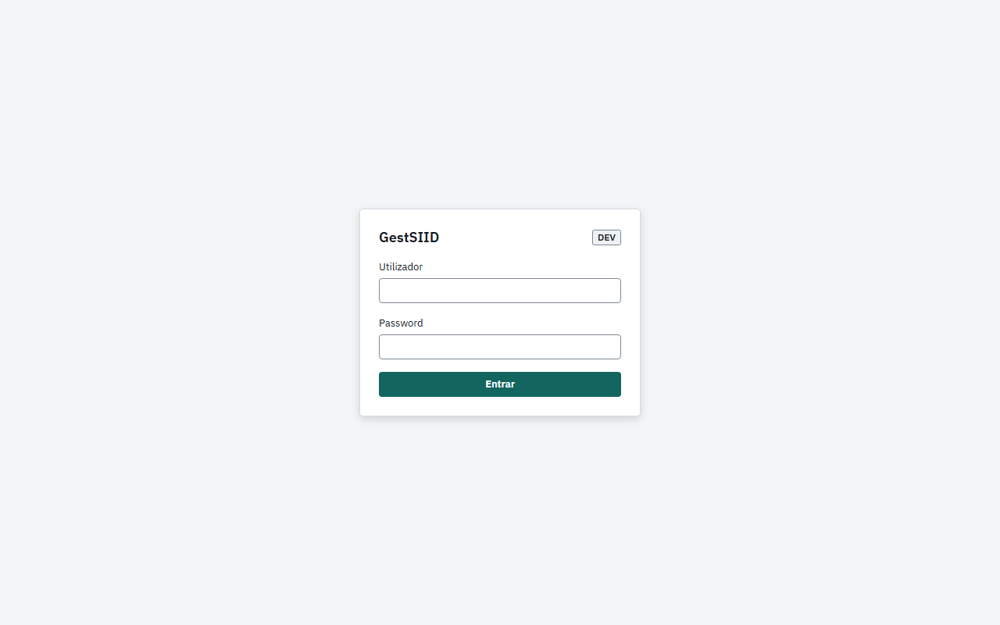

1. Escreva o **Utilizador** e a **Password**.
2. Clique em **Entrar**.

Mensagens possíveis:

- `O 'Utilizador' é de preenchimento obrigatório.`
- `A 'Password' é de preenchimento obrigatório.`
- `Utilizador e/ou password inválidos.`
- `A sessão expirou. Entre novamente.` (quando a sessão termina; volte a entrar)

Para sair, clique no seu nome (canto superior direito) e escolha **Sair**.

### Quem vê o quê

O perfil (Administrador ou Utilizador) define os menus visíveis. O servidor volta a verificar o perfil em cada operação.

| Perfil | Menus visíveis |
|---|---|
| **ADM** (Administrador) | Todos: Gestão, Gador, Configuração e Administração. |
| **USER** (Utilizador) | Apenas **Gestão › Documentos**, sem a barra de acções. |

Se um utilizador USER abrir à mão o endereço de um ecrã de administração, vê `Não tem permissão para esta operação.`

### Como funciona uma grelha

A maioria dos ecrãs é uma grelha de registos com os mesmos controlos.

- **Filtros (consulta por exemplo).** A linha por baixo dos títulos tem uma caixa por coluna. Escreva o valor e prima **Enter** para consultar. Enquanto não premir Enter aparece `Filtros alterados. Prima Enter para consultar.` O botão **Limpar filtros** apaga todos os filtros. O botão **?** mostra a ajuda:
  - Texto: valor exacto; use `%` (vários caracteres) e `_` (um carácter).
  - Número e código: valor exacto.
  - Data: `DD-MM-AAAA`, ou intervalo `DD-MM-AAAA..DD-MM-AAAA` (um dos lados pode ficar vazio).
  - `IS NULL` / `IS NOT NULL`: registos sem valor / com valor.
- **Ordenar.** Clique no título da coluna para ordenar (ascendente, descendente, sem ordenação).
- **Páginas.** No fundo: `Por página`, primeira/anterior/seguinte/última página e o total de registos. Acima de 10 000 registos aparece `Mais de 10 000 registos`.
- **Novo.** Acrescenta um registo. Em alguns ecrãs a linha é editada na própria grelha; noutros abre-se um formulário lateral (também se abre com **Enter** ou duplo clique na linha).
- **Editar.** Em ecrãs de edição na grelha, clique na célula e escreva (**Enter** ou **F2** para editar). **Esc** desfaz as alterações da linha.
- **Apagar.** Marca o registo (ou os seleccionados) para apagar; o registo só desaparece ao guardar. **Esc** ou outro clique em **Apagar** desfaz a marca.
- **Guardar.** Com alterações pendentes aparece uma barra no fundo (por exemplo `1 novo · 2 alterados`) com **Cancelar** e **Guardar** (atalho **Ctrl S**). Depois de guardar aparece `Guardado.` Se sair do ecrã com alterações por gravar, a aplicação pergunta `Deseja gravar as alterações efectuadas?`
- **Setas** deslocam-se pela grelha; **Alt + Página seguinte/anterior** muda de página.

Mensagens de validação comuns:

| Mensagem | Quando |
|---|---|
| `Campo obrigatório.` / `Campo obrigatório não preenchido.` | Falta um campo obrigatório. |
| `Máximo N caracteres.` / `Valor demasiado grande para o campo.` | O texto excede o tamanho do campo. |
| `Valor numérico inválido.` | Escreveu letras num campo numérico. |
| `Data inválida. Use DD-MM-AAAA.` | A data não existe ou está noutro formato. |
| `Já existe um registo com estes valores.` | Chave repetida. |
| `Impossível apagar registo mestre se existirem registos de detalhe correspondentes.` | Tentou apagar um registo que ainda tem detalhe. |
| `Valor não existe na tabela de referência.` | Valor que não existe na tabela associada. |
| `O registo está bloqueado por outro utilizador. Tente novamente.` | Outra pessoa está a alterar o mesmo registo. |
| `O registo foi alterado por outro utilizador. Volte a consultar.` | O registo mudou desde que o abriu. |
| `A operação excedeu o tempo limite.` / `Base de dados indisponível. Tente mais tarde.` | Problema temporário; tente de novo. |
| `Registo não encontrado.` | O registo já não existe. |

Quando há um erro numa linha, a barra de alterações mostra `Erro no registo N: ...` e o estado da linha passa a **Erro**.

---

## Gestão › Documentos

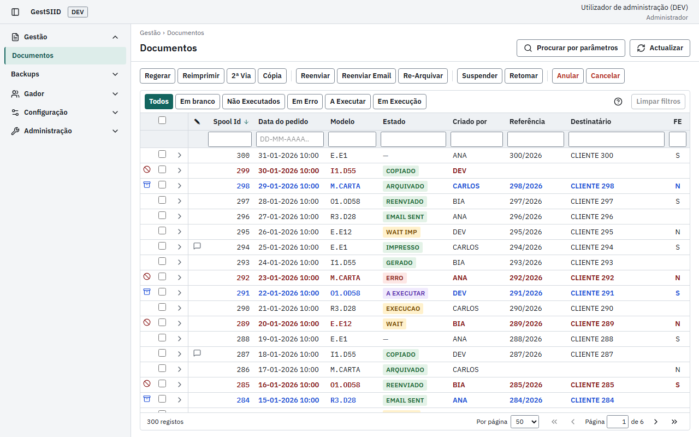

**Para que serve.** Consultar os pedidos de documentos (um por Spool Id), ver o estado, abrir o detalhe e, para administradores, actuar sobre eles.

**Quem pode abrir.** ADM e USER. A barra de acções só aparece ao ADM; o USER só consegue ordenar pelo Spool Id.

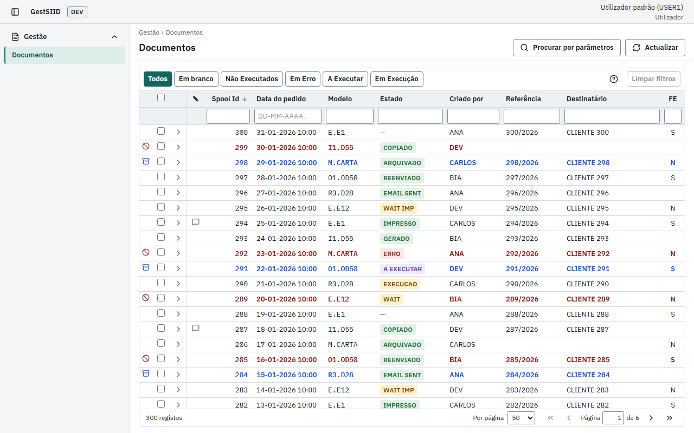

**Colunas.**

| Coluna | Significado |
|---|---|
| ✎ | Ícone de balão: o documento tem comentários. Clique para os abrir. |
| Spool Id | Número do pedido. |
| Data do pedido | Data e hora do pedido. |
| Modelo | Modelo do documento. |
| Estado | Estado actual (por exemplo GERADO, IMPRESSO, ERRO, A EXECUTAR). |
| Criado por | Quem fez o pedido. |
| Referência | Referência do documento. |
| Destinatário | Destinatário. |
| FE | Faturação electrónica. |
| Lote / Ordem | Lote do documento e posição no lote. |

Linhas a vermelho com o símbolo de proibido são documentos anulados; linhas a azul com o símbolo de arquivo estão offline.

**Tarefas habituais.**

1. *Filtrar.* Use os botões **Todos**, **Em branco**, **Não Executados**, **Em Erro**, **A Executar**, **Em Execução** e/ou a linha de filtros.
2. *Procurar por parâmetros.* Clique em **Procurar por parâmetros** (ou no menu de contexto) e preencha a pesquisa. O filtro activo aparece como uma etiqueta que pode remover.
3. *Ver o detalhe.* Clique na seta `>` da linha, prima **Enter** ou faça duplo clique. Abre o detalhe com os separadores **Mais Informação**, **Parâmetros**, **Comentários**, **Anexos**, **Detalhes** e **Log**. **Voltar** regressa à lista com os filtros mantidos.
4. *Menu de contexto* (botão direito na linha): Detalhes, Parâmetros, Comentários, Log, Mais Informação, Mostrar Grupo, Mostrar Documento, Clonar (só ADM), Procurar por parâmetros.
5. *Actuar sobre documentos (ADM).* Marque as linhas (ou use a caixa do cabeçalho para todas) e clique numa acção:
   - **Regerar:** pergunta `Deseja regerar os documentos selecionados?` e pede `Insira a password para regerar o(s) documento(s) seleccionado(s):`.
   - **Reimprimir**, **2ª Via**, **Cópia:** perguntam `Deseja imprimir os documentos selecionados?` e depois escolhe `Imprimir documentos para a impressora associada` ou `Outra impressora:`.
   - **Reenviar**, **Reenviar Email**, **Re-Arquivar:** pedem confirmação (`Deseja reenviar os documentos selecionados?` / `Deseja re-arquivar os documentos selecionados?`).
   - **Suspender**, **Retomar:** escolha entre os documentos seleccionados ou todos os que estão em espera / suspensos.
   - **Anular:** `Deseja anular os documentos selecionados?`
   - **Cancelar:** `Deseja cancelar os documentos selecionados?`, com a opção `Cancelar em todos os estados`.
6. *Clonar (ADM).* Menu de contexto ou botão no detalhe. Resultado: `Documento clonado. Novo Spool Id: N.`

**Mensagens que pode encontrar.**

- `Não existem documentos seleccionados.`
- `A consulta não obteve documentos.`
- `A password inserida está errada.`
- `Máximo de 1000 registos seleccionados. Use «Seleccionar todos» para a consulta completa.`
- `A selecção excede 10 000 documentos. Restrinja a consulta.`
- `Para imprimir 2ª Via é necessário que o documento já tenha sido impresso.`
- `Impressora inválida.` / `Documento não encontrado.`
- `O pedido já não está em espera nem terminado.`
- `A anulação não foi registada pelo servidor.`
- `O servidor não criou o documento. Consulte o log do documento de origem.`
- Quando algumas linhas são ignoradas, abre-se uma janela que as agrupa pelo motivo, por exemplo `Não foram impressos os documentos com os seguintes spool_id, por se encontrarem anulados:`, `Não foram Regerados os documentos com os seguintes spool_id, por se encontrarem anulados:`, `Não foram Reenviados os documentos com os seguintes spool_id, por não serem documentos para o EDoc:` (ou `... por não serem documentos de Email:`), `Não foram Re-Arquivados os documentos com os seguintes spool_id, por não serem documentos para ARQUIVO:`.

---

## Gestão › Backups › Novo

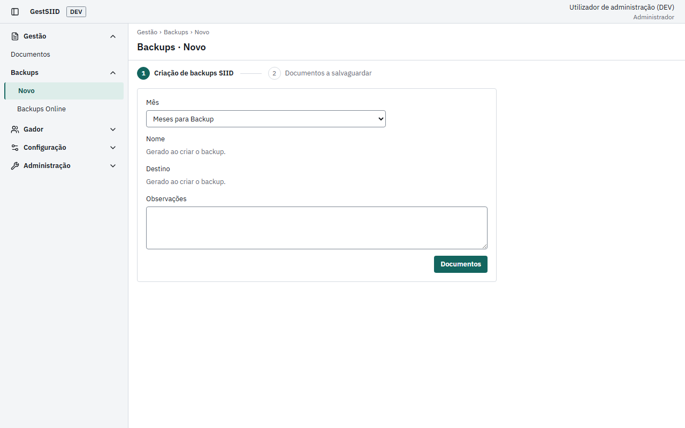

**Para que serve.** Criar um backup (salvaguarda) dos documentos de um mês.

**Quem pode abrir.** ADM.

**Campos.**

- **Mês** — mês a salvaguardar (lista "Meses para Backup"). Obrigatório.
- **Nome** e **Destino** — gerados pelo sistema ao criar o backup.
- **Observações** — texto livre (máximo 2000 caracteres).
- **Tipos Mídia** (passo 2) — tipo de mídia do backup. Obrigatório. Ao lado, **Gbytes** mostra a capacidade da mídia.
- **Total Bytes** — total dos documentos do mês. **Total Backup** — total do que marcou.

**Passo a passo.**

1. No passo 1 (*Criação de backups SIID*) escolha o **Mês**, escreva as observações (opcional) e clique em **Documentos**.
2. No passo 2 (*Documentos a salvaguardar*) escolha o **Tipo de Mídia**.
3. Marque os documentos (ou use a caixa do cabeçalho para todos os do mês).
4. Clique em **Backup** e confirme a pergunta `Criar o backup de AAAA-MM com N documentos (X bytes)?`
5. Resultado: `Backup <nome> criado.` O ecrã volta ao passo 1. **Voltar** regressa ao passo 1 sem criar nada.

**Mensagens.**

- `O campo 'Mês' é de preenchimento Obrigatorio.`
- `O campo 'Tipo Mídia' é de preenchimento Obrigatorio.`
- `Não existem documentos seleccionados.`
- `O tamanho do Mídia não suporta todos os documentos que seleccionou.`
- `Tipo de mídia inexistente.`
- `Mês inválido (AAAA-MM).`
- `O registo foi alterado por outro utilizador. Volte a consultar.`
- Sem meses disponíveis: `Não existem registos.` · Sem documentos: `A consulta não obteve documentos.`

---

## Gestão › Backups › Backups Online

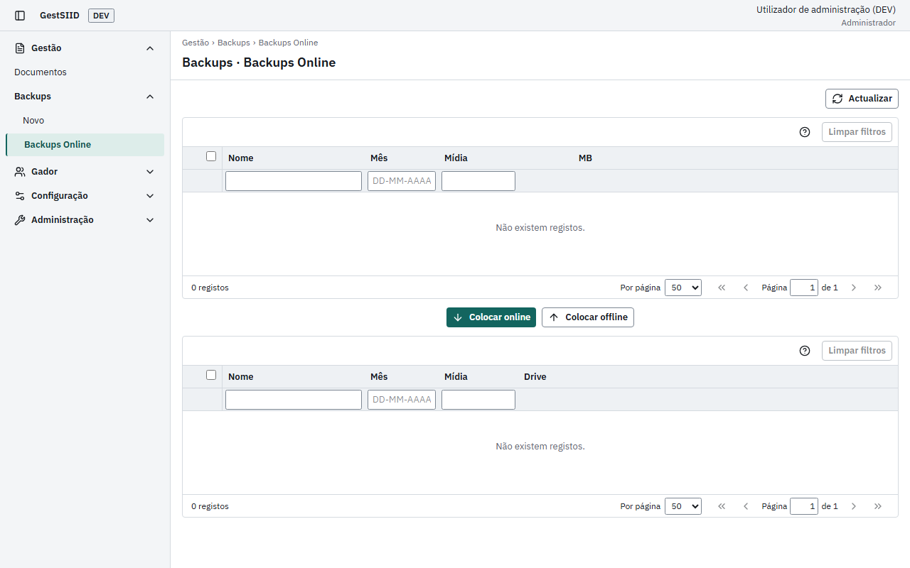

*(Nos dados de demonstração não há backups, por isso as listas aparecem vazias.)*

**Para que serve.** Mudar backups entre as listas **Offline** e **Online**.

**Quem pode abrir.** ADM.

**Colunas.** Lista Offline: Nome, Mês, Mídia, MB. Lista Online: Nome, Mês, Mídia, Drive.

**Passo a passo.**

1. Marque os backups na lista de origem.
2. Clique em **Colocar online** (move da lista Offline para a Online) ou **Colocar offline** (o inverso).
3. Resultado: `Backups actualizados.`
4. **Actualizar** volta a ler as duas listas.

**Mensagens.** `Não existem backups seleccionados.` · `Não existem registos.` · `O registo foi alterado por outro utilizador. Volte a consultar.`

---

## Gador › Equipa de Gestão (OD68)

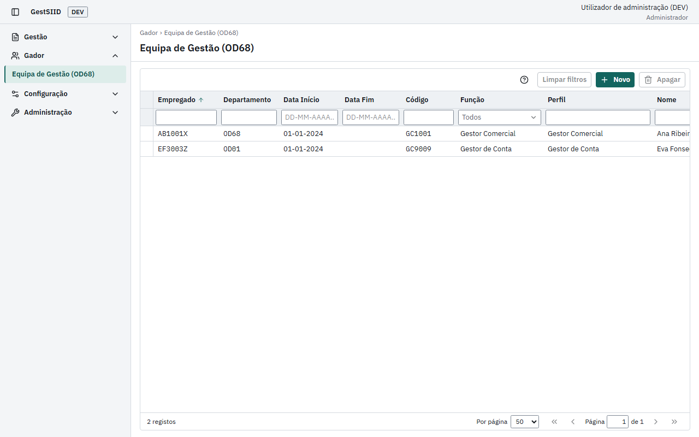

**Para que serve.** Manter os perfis de departamento (quem integra a equipa de gestão, contactos e assinatura).

**Quem pode abrir.** ADM.

**Campos.**

| Campo | Significado |
|---|---|
| Empregado | Código do empregado. Escolha com **Escolher empregado** (não se escreve à mão). Obrigatório. |
| Departamento | Vem com o empregado; só se define num registo novo. Obrigatório. |
| Data Início / Data Fim | Período de validade (Data Início obrigatória). |
| Código | Código do perfil (convertido para maiúsculas). |
| Função | Função no departamento. Obrigatória. |
| Perfil | Nome do perfil. |
| Nome | Nome da pessoa. Obrigatório. |
| Email, Telefone, Telemóvel, Fax | Contactos. |

**Passo a passo.**

1. **Novo** abre o formulário. Clique em **Escolher empregado** e seleccione-o. Se o Código estiver vazio, o sistema preenche Código, Função e Nome (sem substituir o que já escreveu).
2. Preencha os restantes campos e clique em **Guardar**.
3. Para alterar, clique duas vezes na linha (ou **Enter**).
4. *Assinatura:* depois de o registo estar gravado, o formulário mostra o painel **Assinatura**, onde pode carregar o ficheiro ou remover a assinatura. Antes de gravar aparece `Grave o registo para anexar a assinatura.`

Neste ecrã não é possível apagar registos.

**Mensagens.** `Tipo de ficheiro não suportado. Use JPEG, PNG, GIF ou BMP.` · `Imagem não encontrada.` · `Ficheiro em falta.` · `Sem assinatura` (não há imagem) · mensagens gerais de validação.

---

## Configuração › Reports

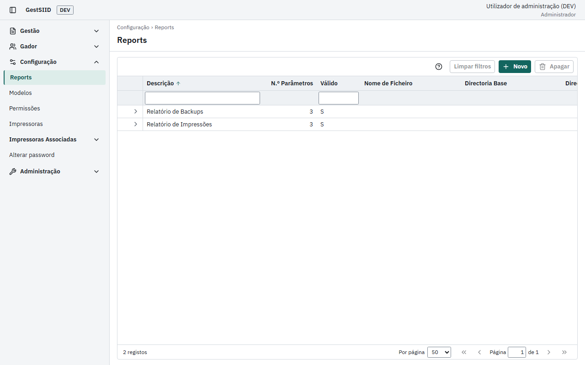

**Para que serve.** Configurar os relatórios (reports) e os seus parâmetros.

**Quem pode abrir.** ADM.

**Campos.**

| Campo | Significado |
|---|---|
| Descrição | Nome do relatório. |
| N.º Parâmetros | Número de parâmetros do relatório (por omissão 3). |
| Válido | S/N (por omissão S). Obrigatório. |
| Nome de Ficheiro | Ficheiro do relatório. |
| Directoria Base / Directoria Destino | Pastas de origem e de destino. |
| Observações | Texto livre. |

**Passo a passo.**

1. **Novo** abre o formulário; preencha e **Guardar**. Ao criar, o sistema acrescenta os 3 parâmetros fixos (`_USER`, `P_USUARIO`, `P_DATAACTUAL`).
2. Para ver os parâmetros, clique na seta `>` da linha (*Abrir parâmetros*). No detalhe edite na grelha: Nome do Parâmetro, Tipo de Parâmetro, Obrigatório, Único, Válido, Descrição. O nome dos 3 parâmetros fixos não se altera.
3. **Voltar** regressa à lista.

**Mensagens.**

- `O número de parâmetros inseridos tem que ser igual ao número de parâmetros na informação do relatório.`
- `O 1º parâmetro é obrigatório ser '_USER'.` / `O 2º parâmetro é obrigatório ser 'P_USUARIO'.` / `O 3º parâmetro é obrigatório ser 'P_DATAACTUAL'.`
- `Impossível apagar registo mestre se existirem registos de detalhe correspondentes.`
- `Não foi possível criar o relatório.`

---

## Configuração › Modelos

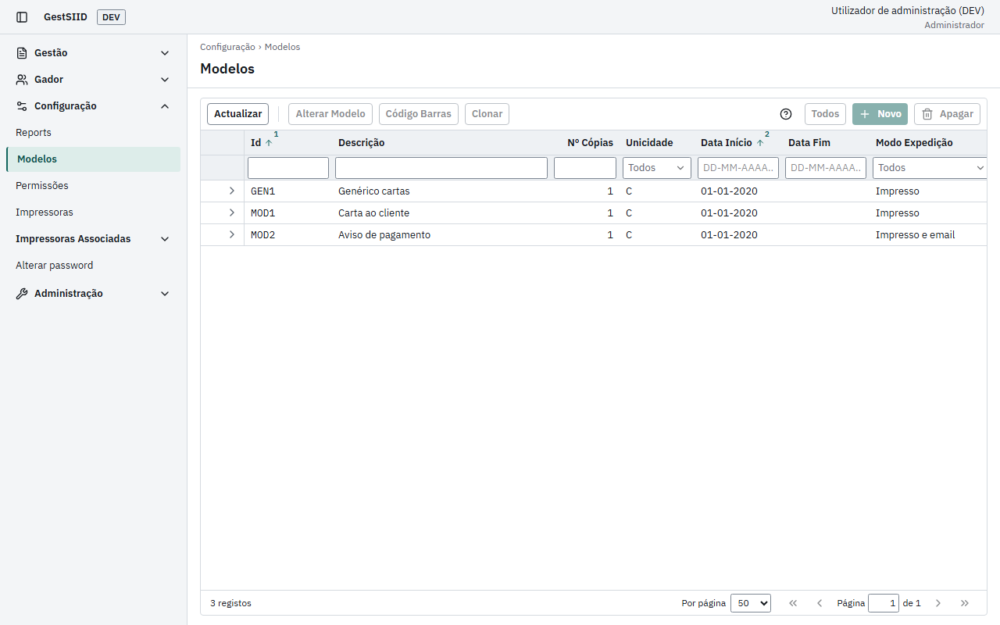

**Para que serve.** Consultar e alterar os modelos de documento; criar novos modelos por clonagem.

**Quem pode abrir.** ADM. Neste ecrã não se criam nem apagam modelos directamente (use **Clonar**).

**Colunas.** Id, Descrição, Nº Cópias, Unicidade, Data Início, Data Fim, Modo Expedição, Código Barras (S/N), Modo Certificado, Tipo Genérico, Modo Proteção. O botão **Todos** limpa os filtros.

**Botões.**

- **Actualizar** — volta a ler a lista.
- **Alterar Modelo** — janela com Descrição, Nº de Cópias, Unicidade, Validade (data de início) e Data Fim.
- **Código Barras** — janela com Tipo de código de barras, Altura (cm), Largura (cm), Posição X, Posição Y e Formato.
- **Clonar** — pede o novo código do **Modelo** (até 10 caracteres) e os restantes dados, e pergunta `Esta operação é irreversível. Quer criar um novo modelo à semelhança do existente?`

**Detalhe do modelo.** Clique na seta `>` da linha (*Abrir secções, parâmetros e atributos*). Separadores:

- **Secções** — secções do modelo (Id Secção, Alínea, Tipo de Conteúdo, Título, Texto), com botão **Clonar** (`Esta operação é irreversível. Quer criar uma nova alinea à semelhança da existente?`), a assinatura/imagem da secção e as **Condições** de apresentação.
- **Parâmetros** — *Parâmetros por Omissão do Modelo*: Valor por Omissão, Início e Fim de Vigência, Nome Consulta, Consulta; o botão **Histórico** mostra os valores anteriores.
- **Atributos** e **Atributos Arquivo** — atributos por UE e ramo.

**Mensagens.**

- `Já existe um modelo com esta referência`
- `A data de inicio é superior à data de fim.`
- `A data de inicio econtra-se num intervalo já definido.`
- `A data de fim econtra-se num intervalo já definido.`
- `Impossível apagar registo mestre se existirem registos de detalhe correspondentes.`
- `<Campo>: Campo obrigatório.` / `<Campo>: Valor numérico inválido.` / `<Campo>: Data inválida. Use DD-MM-AAAA.` (nas janelas)
- `Deseja gravar as alterações efectuadas?` (ao mudar de linha com alterações por gravar)

---

## Configuração › Permissões

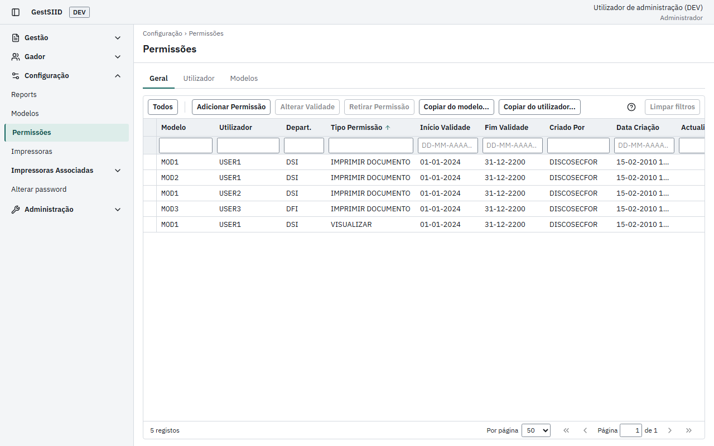

**Para que serve.** Definir que utilizadores podem usar que modelos de documento, e durante que período.

**Quem pode abrir.** ADM.

O ecrã tem três separadores.

### Geral

Grelha só de leitura com: Modelo, Utilizador, Depart., Tipo Permissão, Início e Fim de Validade e dados de criação/alteração. Por omissão mostra só as permissões válidas hoje; o botão **Todos** inclui as restantes.

Botões:

- **Adicionar Permissão** — escolha Modelo, Utilizador, Tipo Permissão e as datas (Início Validade, Fim Validade em `DD-MM-AAAA`).
- **Alterar Validade** — altera as datas da linha seleccionada.
- **Retirar Permissão** — pergunta `Deseja anular a permissão do utilizador X para o documento Y?`; a permissão passa a terminar em 01-01-1980.
- **Copiar do modelo...** / **Copiar do utilizador...** — copiam as permissões de um modelo (ou utilizador) para outro.

### Utilizador e Modelos

Escolha o **Departamento**, o **Utilizador** (ou **Modelo**) e a **Permissão**. Aparecem duas listas, **Sem Permissão** e **Com Permissão**. Marque linhas e use os botões **Adicionar seleccionados**, **Adicionar todos**, **Retirar seleccionados**, **Retirar todos**. Retirar várias pede `Retirar as N permissões?`. Os botões ficam desactivados até os três campos estarem preenchidos.

**Mensagens.**

- `Todos os campos são obrigatórios, excepto a data de fim.`
- `O Campo 'Data de Início' é de preenchimento obrigatório.`
- `ERRO: Permissão já existe válida para o intervalo definido!!`
- `ERRO: O intervalo de datas sobrepõe-se a uma permissão já existente!`
- `Início Validade: Data inválida.` / `Fim Validade: Data inválida.`
- `Falha no Carregamento !!` (as listas não carregaram)

---

## Configuração › Impressoras

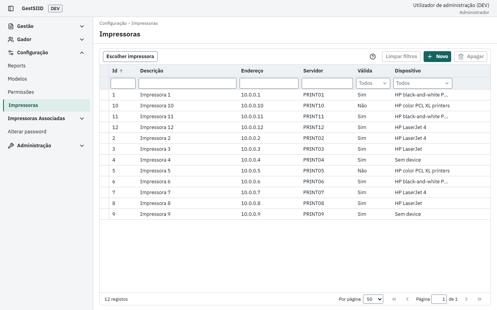

**Para que serve.** Manter o cadastro de impressoras.

**Quem pode abrir.** ADM.

**Campos.**

| Campo | Significado |
|---|---|
| Id | Gerado pelo sistema. |
| Descrição | Descrição (até 240 caracteres). |
| Endereço | Endereço da impressora. Obrigatório. |
| Servidor | Servidor de impressão. |
| Válida | Sim/Não (por omissão Sim). Obrigatório. |
| Dispositivo | Tipo de dispositivo (por omissão HP color PCL XL printers). Obrigatório. |

**Passo a passo.** **Novo** acrescenta uma linha; preencha-a e clique em **Guardar**. Para alterar, edite a célula e guarde. Para apagar, seleccione a linha, **Apagar** e **Guardar**. O botão **Escolher impressora** abre uma lista de pesquisa e mostra `Impressora escolhida: <id> — <descrição>` (serve apenas de consulta).

**Mensagens.** `Campo obrigatório.` · `Máximo N caracteres.`.

---

## Configuração › Impressoras Associadas › Documento

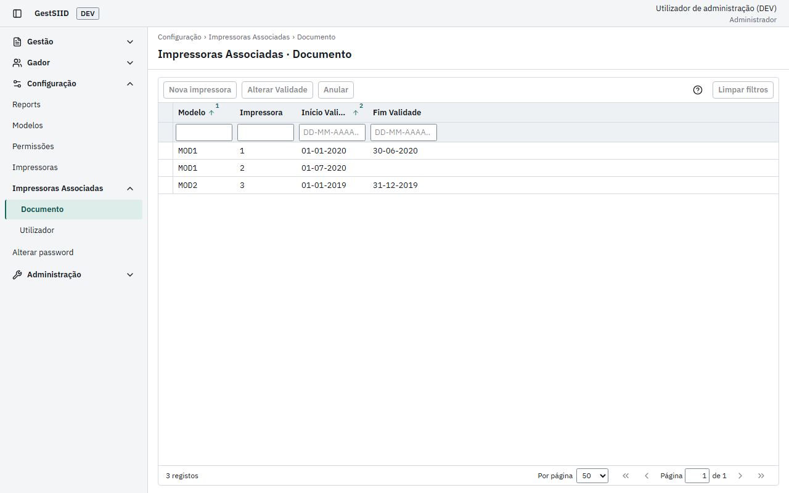

**Para que serve.** Definir que impressora usa cada modelo de documento, com período de validade.

**Quem pode abrir.** ADM. A grelha é só de leitura; as alterações fazem-se pelos botões.

**Colunas.** Modelo, Impressora, Início Validade, Fim Validade.

**Passo a passo.**

1. **Nova impressora** (seleccione primeiro uma linha: a nova impressora fica associada ao modelo dessa linha). Na janela *Definir Nova Impressora* escolha a **Impressora**, escreva o **Início Validade** e, se quiser, o **Fim Validade** (`DD-MM-AAAA`) e clique em **OK**. Resultado: `Impressora associada.`
2. **Alterar Validade** — altera as datas da linha. Resultado: `Validade alterada.`
3. **Anular** — pergunta `Deseja anular a impressora '<impressora>' para o documento <modelo>?` Resultado: `Impressora anulada.`

**Mensagens.**

- `As datas de início e de fim que introduziu são incompatíveis com outra configuração já introduzida.  Por favor, altere as configurações de modo a eliminar a incompatibilidade.`
- `Início Validade: Data inválida.` / `Fim Validade: Data inválida.`

---

## Configuração › Impressoras Associadas › Utilizador

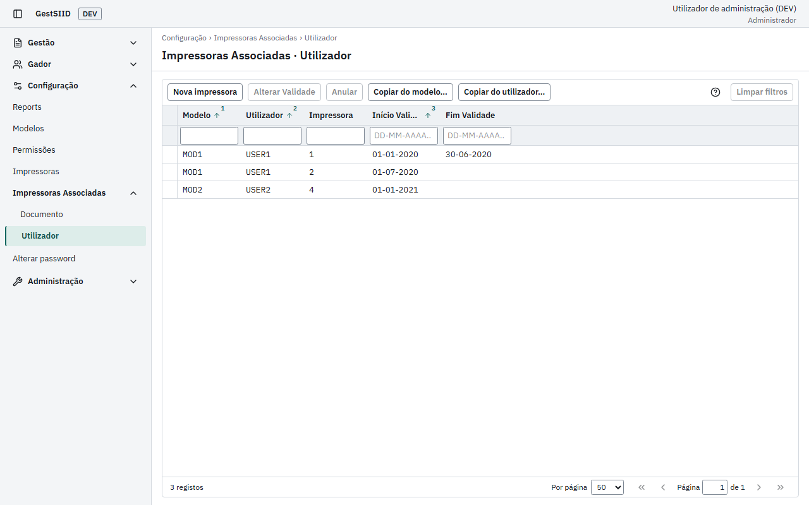

**Para que serve.** Definir que impressora usa cada utilizador para cada modelo, com período de validade.

**Quem pode abrir.** ADM.

**Colunas.** Modelo, Utilizador, Impressora, Início Validade, Fim Validade.

**Passo a passo.**

1. **Nova impressora** — escolha **Modelo**, **Utilizador** e **Impressora**, escreva as datas e clique em **OK** (só fica activo com os três escolhidos). Resultado: `Impressora associada.` Não precisa de seleccionar uma linha.
2. **Alterar Validade** — altera as datas da linha. Resultado: `Validade alterada.`
3. **Anular** — pergunta `Deseja anular a impressora '<impressora>' do utilizador <utilizador> para o documento <modelo>?` Resultado: `Impressora anulada.`
4. **Copiar do modelo…** — escolha o **Modelo (destino)** e o **Modelo a copiar (origem)**.
5. **Copiar do utilizador…** — escolha o **Utilizador (destino)** e o **Utilizador a copiar (origem)**. Resultado das cópias: `Configurações copiadas.`

**Mensagens.** As mesmas do ecrã Documento (`As datas de início e de fim que introduziu são incompatíveis...`, `Início Validade: Data inválida.`, `Fim Validade: Data inválida.`).

---

## Configuração › Alterar password

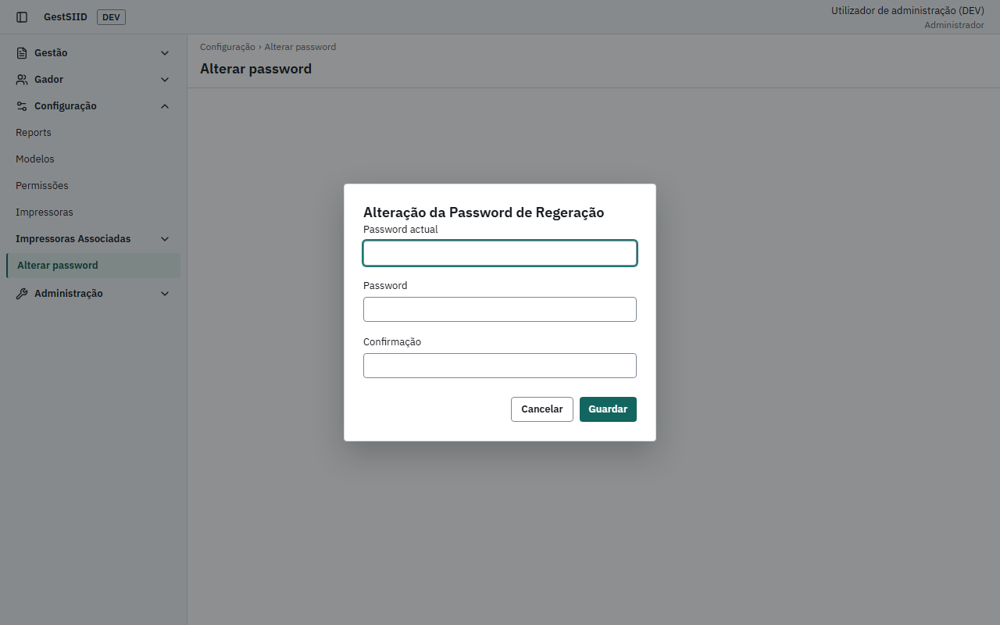

**Para que serve.** Alterar a **password de regeração**, a password partilhada que é pedida ao regerar documentos. **Não** altera a password com que entra na aplicação.

**Quem pode abrir.** ADM.

**Campos.** Password actual · Password (a nova) · Confirmação.

**Passo a passo.** Preencha os três campos e clique em **Guardar** (ou **Cancelar**). Resultado: `Guardado.`

**Mensagens.**

- `A password inserida está errada.` (aparece em *Password actual*)
- `As passwords não coincidem. Alteração não efectuada.` (aparece em *Confirmação*)

---

## Administração › Domínios

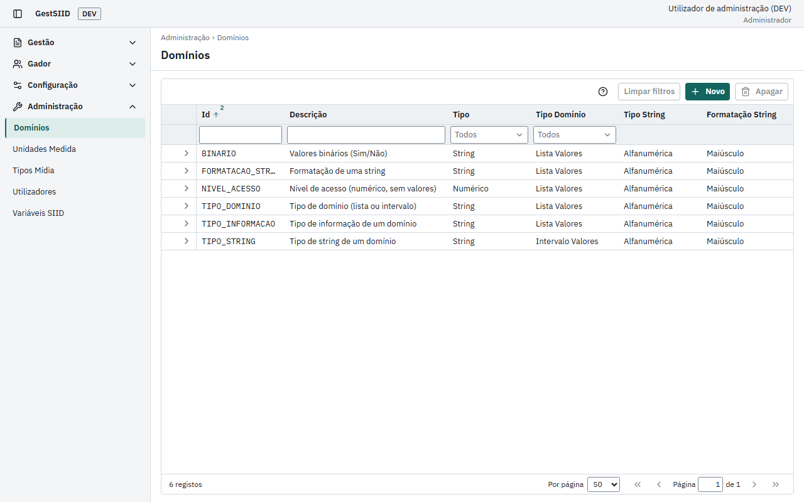

**Para que serve.** Manter as listas de valores (domínios) usadas nas listas de escolha da aplicação.

**Quem pode abrir.** ADM.

**Campos do domínio.**

| Campo | Significado |
|---|---|
| Id | Identificador (até 60 caracteres; não se altera depois de gravado). |
| Descrição | Descrição. Obrigatório. |
| Tipo | Tipo de informação (por omissão STRING). Obrigatório. |
| Tipo Domínio | Tipo de domínio (por omissão L); `I` indica um intervalo. Obrigatório. |
| Tipo String / Formatação String | Só aparecem quando o Tipo é STRING. |
| Mínimo / Máximo | Só aparecem para um domínio de intervalo (Tipo Domínio `I`). |
| Tamanho | Tamanho máximo. Obrigatório. |
| Precisão | Precisão numérica. |
| Default | Valor comum. |
| Sistema? | Sim/Não (por omissão Não). Obrigatório. |
| Observação | Texto livre. |

**Passo a passo.**

1. **Novo** (ou **Enter** / duplo clique numa linha para alterar) abre o formulário. Preencha e **Guardar**.
2. Para ver os valores do domínio, clique na seta `>` (*Abrir valores do domínio*).
3. No detalhe *Valores do domínio* use **Novo**, edite na grelha e **Guardar**. Campos: Chave, Designação, Descrição, Data Início (por omissão hoje), Data Fim, Ordem.

**Mensagens.** `Impossível apagar registo mestre se existirem registos de detalhe correspondentes.` (apague primeiro os valores) · `Guarde o registo principal antes de adicionar detalhes.` · `Já existe um registo com estes valores.` · mensagens gerais de validação.

---

## Administração › Unidades Medida

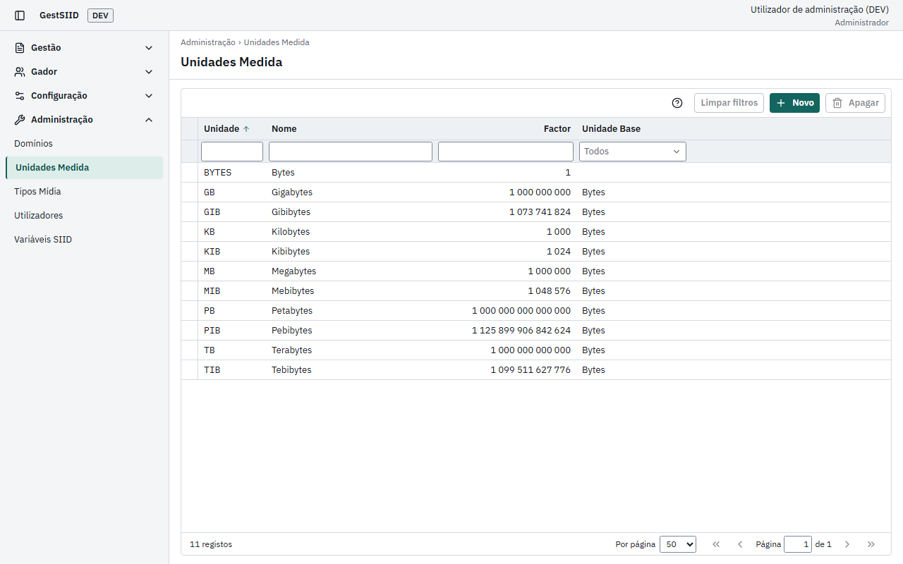

**Para que serve.** Manter as unidades de medida (por exemplo MB, GB) usadas nos tipos de mídia.

**Quem pode abrir.** ADM.

**Campos.** **Unidade** (código, até 10 caracteres, obrigatório; não se altera depois de gravado) · **Nome** · **Factor** (multiplicador para a unidade base) · **Unidade Base** (lista com as unidades que não têm unidade base).

**Passo a passo.** **Novo**, preencha a linha, **Guardar**. Para alterar, edite a célula e guarde. Para apagar, **Apagar** e **Guardar**.

**Mensagens.** `Já existe um registo com estes valores.` · `Campo obrigatório.` · `Valor numérico inválido.`

---

## Administração › Tipos Mídia

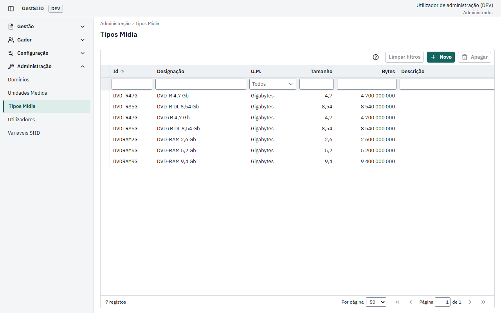

**Para que serve.** Manter os tipos de mídia (suportes de backup) e a sua capacidade.

**Quem pode abrir.** ADM.

**Campos.**

| Campo | Significado |
|---|---|
| Id | Código do tipo (até 10 caracteres; obrigatório; não se altera depois de gravado). |
| Designação | Nome (obrigatório). |
| U.M. | Unidade de medida (por omissão GB). |
| Tamanho | Capacidade na unidade escolhida. |
| Bytes | Calculado: Tamanho × factor da unidade. Só de leitura. |
| Descrição | Texto livre. |

**Passo a passo.** **Novo**, preencha a linha, **Guardar**. O campo **Bytes** é calculado ao guardar.

**Mensagens.** `Já existe um registo com estes valores.` · `Campo obrigatório.` · `Máximo N caracteres.` · `Valor numérico inválido.`

---

## Administração › Utilizadores

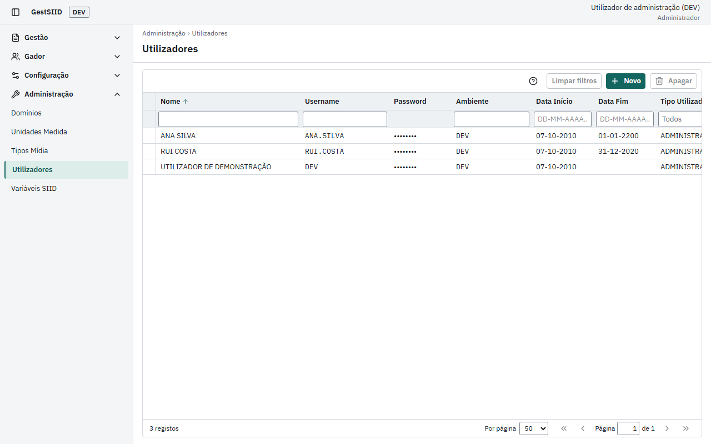

**Para que serve.** Manter os utilizadores que podem entrar na aplicação.

**Quem pode abrir.** ADM.

**Campos.**

| Campo | Significado |
|---|---|
| Nome | Nome completo (só se define ao criar). Obrigatório. |
| Username | Nome de utilizador (só se define ao criar, até 30 caracteres). Obrigatório. |
| Password | Password (nunca é mostrada; na grelha vê pontos). Obrigatória. |
| Ambiente | Definido pelo sistema. |
| Data Início / Data Fim | Período de validade (Data Início obrigatória). |
| Tipo Utilizador | Perfil (por omissão ADM; os perfis são ADM ou USER). Obrigatório. |
| Unidade Negócio | Departamento (por omissão DSI). Obrigatória. |

**Passo a passo.**

1. **Novo** abre o formulário. Preencha e **Guardar**.
2. Para alterar, clique duas vezes na linha (ou **Enter**). No campo Password, deixar em branco mantém a actual (`Em branco: manter a actual`).
3. Para apagar, **Apagar** e **Guardar**.

**Mensagens.** `A data de início é superior à data de fim.` · `Já existe um registo com estes valores.` · `Campo obrigatório.` · `Máximo N caracteres.` · `Data inválida. Use DD-MM-AAAA.`

---

## Administração › Variáveis SIID

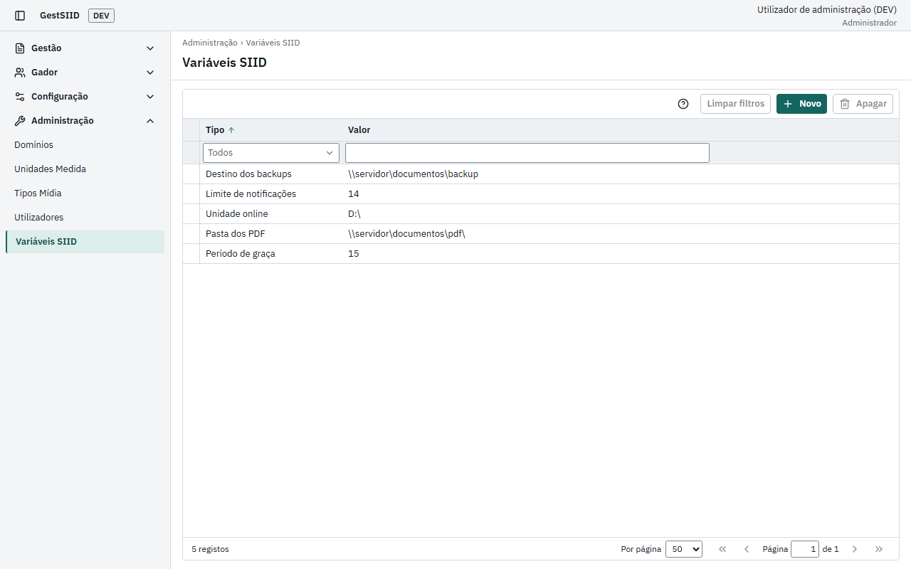

**Para que serve.** Manter as variáveis de configuração do sistema (por exemplo caminhos). As variáveis de password não aparecem neste ecrã.

**Quem pode abrir.** ADM.

**Campos.** **Tipo** (tipo de variável; obrigatório; cada tipo só pode existir uma vez) · **Valor** (até 2000 caracteres).

**Passo a passo.** **Novo**, escolha o Tipo, escreva o Valor, **Guardar**. Para alterar, edite a célula e guarde.

**Mensagens.** `Este tipo de variável já está associado.` · `Campo obrigatório.` · `Máximo N caracteres.`
